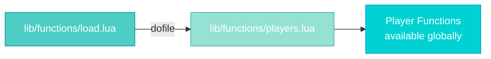
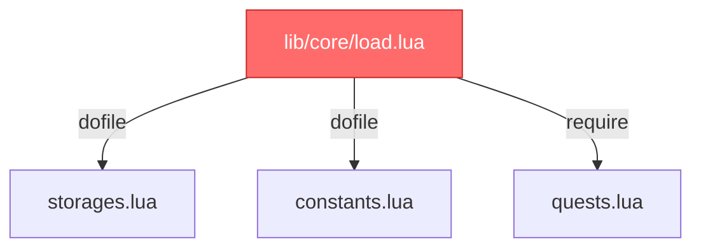
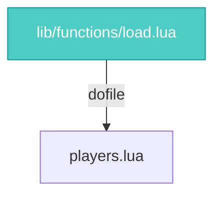
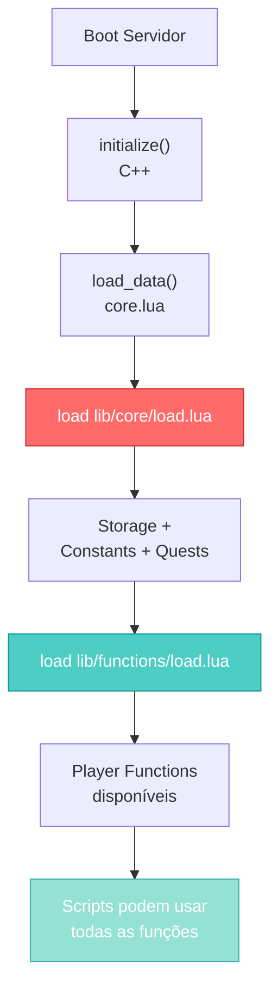
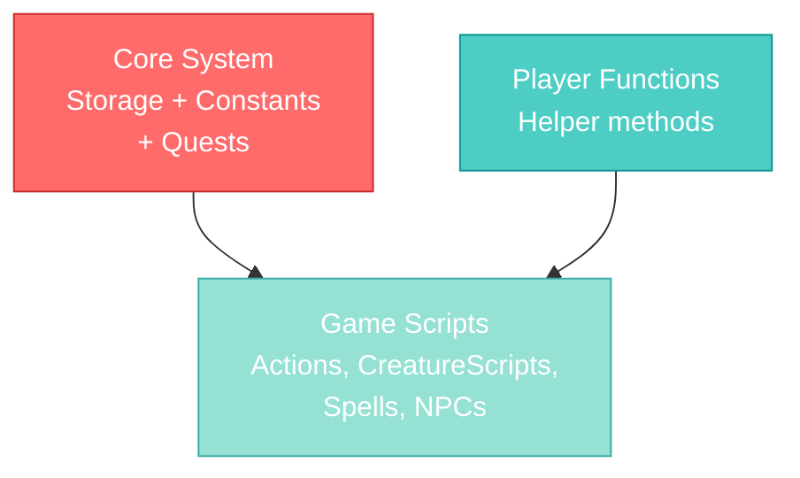

import { Aside, Card } from '@astrojs/starlight/components';

## 🛠️ Informações do Arquivo

Este arquivo é um **carregador minimalista** que importa funções utilitárias relacionadas a **players**, tornando-as disponíveis globalmente para scripts do servidor OpenTibiaBR/Canary.

<Card title="Caminho Original" icon="document">
  `data-otservbr-global/lib/functions/load.lua`
</Card>

<Aside type="tip">
  Este arquivo é carregado **parte do subsistema de funções** do servidor. Ele atua como orquestrador simples que importa `players.lua`, deixando funções de player disponíveis para todo o servidor.
</Aside>

## 📄 Visão Geral do Código

### Resumo Executivo

O arquivo `load.lua` em `lib/functions` realiza uma **única operação**:

```lua
dofile(DATA_DIRECTORY .. "/lib/functions/players.lua")
```

Ele carrega um arquivo que contém **funções utilitárias para players**, tornando-as globais e acessíveis em qualquer lugar do servidor.

### Propósito

- **Centralizar imports**: Um único ponto de entrada
- **Lazy loading**: Funções carregadas sob demanda
- **Modularização**: Funções separadas de initialization

## 2. Arquivo Carregado: players.lua



### Responsabilidade de players.lua

O arquivo `players.lua` provavelmente contém:

```lua
-- Exemplos de possíveis funções

-- Getters/Setters
function getPlayerExperience(player) end
function setPlayerLevel(player, level) end

-- Calculations
function calculatePlayerDamage(player, target) end
function getPlayerHealingBonus(player) end

-- Utilities
function playerIsInGuild(player) end
function givePlayerReward(player, rewardId) end

-- Quest related
function completePlayerQuest(player, questId) end
function initPlayerQuest(player, questId) end

-- Storage
function getPlayerStorageQuest(player, storageId) end
function setPlayerStorageQuest(player, storageId, value) end
```

## 3. Diferença entre load.lua (core) vs load.lua (functions)

### Core Loader



**Crítico**: Neces para inicialização
**Ordem**: Importa - dependências precisa estar em ordem

### Functions Loader



**Opcional**: Carrega utilitários
**Ordem**: Não crítica - funções podem ser carregadas após core

## 4. Fluxo de Carregamento Completo



## 5. Visibilidade Global

Como o arquivo usa `dofile()`:

```lua
dofile(DATA_DIRECTORY .. "/lib/functions/players.lua")
```

Todas as **funções definidas em players.lua** se tornam **globais**:

```lua
-- Em players.lua
function getPlayerLevel(player)
  return player:getLevel()
end

-- Em qualquer script, agora pode fazer:
local level = getPlayerLevel(myPlayer)  -- Funcionário! Função é global
```

## 6. DATA_DIRECTORY Context

Como em outros loaders, utiliza a variável global:

```lua
dofile(DATA_DIRECTORY .. "/lib/functions/players.lua")
```

**Exemplos**:

| DATA_DIRECTORY | Resultado |
|----------------|-----------|
| `"data"` | Carrega `data/lib/functions/players.lua` |
| `"data-otservbr-global"` | Carrega `data-otservbr-global/lib/functions/players.lua` |

## 7. Possível Estrutura de players.lua

```lua
-- Player Helper Functions

-- ===== Getters =====
function getPlayerLevel(player)
  return player:getLevel()
end

function getPlayerExperience(player)
  return player:getExperience()
end

function getPlayerHealth(player)
  return player:getHealth()
end

-- ===== Setters =====
function setPlayerLevel(player, level)
  player:setLevel(level)
end

-- ===== Calculations =====
function calculateDamage(player, target)
  local damage = player:getAttackPower()
  local defense = target:getDefense()
  return damage - defense
end

-- ===== Quest Helpers =====
function completeQuest(player, questId)
  player:setStorageValue(questId, 1)
end

-- ===== Inventory Helpers =====
function addRewardToPlayer(player, itemId, count)
  player:addItem(itemId, count)
end
```

## 8. Como Usar as Funções Carregadas

Após o load.lua ser executado:

```lua
-- Em um script de quest
function onCompleteQuest(player)
  completeQuest(player, Storage.Quest.U8_0.SomeQuest)
  addRewardToPlayer(player, ITEM_ID, 1)
end

-- Em um spell
function onCastSpell(cid)
  local player = Player(cid)
  local damage = calculateDamage(player, target)
  target:addHealth(-damage)
end

-- Em creaturescript
function onLogin(player)
  local level = getPlayerLevel(player)
  if level < 8 then
    sendWelcomeMessage(player)
  end
end
```

## 9. Relação com Core Functions



## 10. Ordem de Carregamento Esperada

```
└── Core Init (C++)
    ├── lib/core/load.lua
    │   ├── storages.lua (PRIMEIRO)
    │   ├── constants.lua (SEGUNDO)
    │   └── quests.lua (TERCEIRO)
    │
    ├── lib/functions/load.lua
    │   └── players.lua
    │
    ├── libs/libs.lua (outros helpers)
    │
    └── scripts/ (Actions, Spells, NPCs, etc)
```

## 11. Extensão: Adicionando Mais Loaders

Se você quiser adicionar mais funções, você poderia estender este arquivo:

```lua
-- Adicionar mais loaders de função
dofile(DATA_DIRECTORY .. "/lib/functions/players.lua")
dofile(DATA_DIRECTORY .. "/lib/functions/items.lua")      -- Adicione se existir
dofile(DATA_DIRECTORY .. "/lib/functions/creatures.lua")  -- Adicione se existir
```

Cada novo `dofile()` carregaria um módulo de funções adicional.

## 12. Diferença entre Funções e Core

| Aspecto | Core (storages.lua) | Functions (players.lua) |
|--------|---------------------|------------------------|
| **Propósito** | Mapear IDs de storage | Prover helpers de código |
| **Tipo** | Tabelas de constantes | Funções executáveis |
| **Mutabilidade** | Estático (nunca muda) | Estatico (definição de função) |
| **Criticidade** | 🔴 CRÍTICO | 🟡 IMPORTANTE |
| **Erro se quebrar** | Servidor não inicia | Funções não disponíveis |

---

## 🤖 Informações da Documentação

**Data de Criação**: 20 de Fevereiro de 2026  
**Versão do Canary**: OpenTibiaBR/Canary (Latest)  
**Tipo**: Loader / Orquestrador de Funções  
**Arquivo Carregado**: `players.lua`  
**Padrão**: Simple dofile() loader  
**Criticidade**: 🟡 IMPORTANTE - Quebra game se funções de player falharem  
**Responsável**: Sistema de Funções Utilitárias de Player
