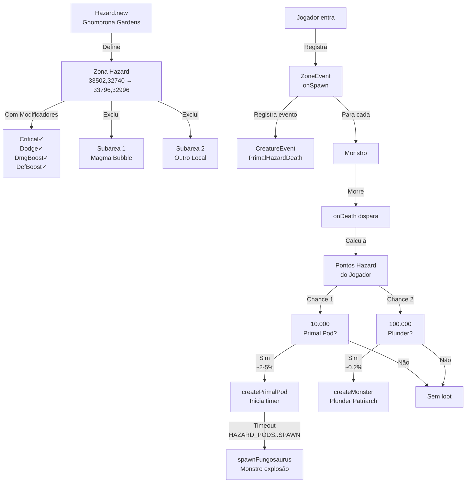

import { Tabs } from '@astrojs/starlight/components';

## Visão Geral

Este catálogo documenta os scripts de sistema implementados no projeto. Cada script é apresentado com detalhes técnicos, comportamento, e integração com o sistema geral.

| Script | Tipo | Zona | Status |
|--------|------|------|--------|
| `hazard_primal.lua` | Hazard System | Gnomprona Gardens | ✅ Ativo |

**Total**: 1 script de sistema documentado

---

## 1. hazard_primal.lua

### Informações Básicas

| Atributo | Valor |
|----------|-------|
| **Arquivo** | `data-otservbr-global/scripts/systems/hazard_primal.lua` |
| **Tipo** | Hazard System (Dungeon Modificado) |
| **Zona** | Gnomprona Gardens |
| **Nível Máximo** | 12 |
| **Dependências** | Hazard API, Zone API, MoveEvent, CreatureEvent, ZoneEvent |
| **Configurações** | 6 configs globais |

---

### Descrição Geral

O script `hazard_primal.lua` implementa um **sistema de hazard completo** para a zona de Gnomprona Gardens, uma dungeon com modificadores especiais que aumentam o risco e a recompensa. O sistema funciona através de:

1. **Zona Hazard**: Define a área com modificadores especiais
2. **Itens Especiais (Pods)**: Aparecem ao matar monstros, com temporizador
3. **Sistema de Loot**: Chance de droppar Primal Pods ou Plunder Patriarch
4. **Eventos Encadeados**: Spawn → Morte → Loot

---

### Estrutura Arquitetônica



---

### Componentes Detalhados

#### 1.1 Definição da Zona Hazard

```lua
local hazard = Hazard.new({
    name = "hazard.gnomprona-gardens",
    from = Position(33502, 32740, 13),           -- Canto NO
    to = Position(33796, 32996, 15),             -- Canto SE
    maxLevel = 12,                                -- Sem restrição
    
    crit = true,                                  -- Críticos habilitados
    dodge = true,                                 -- Esquiva habilitada
    damageBoost = true,                          -- Boost de dano
    defenseBoost = true,                         -- Boost de defesa
})

hazard:register()
```

**Zona de Cobertura**:
- **Largura**: 33796 - 33502 = **294 tiles**
- **Altura**: 32996 - 32740 = **256 tiles**
- **Profundidade**: Z 13 a 15 (**3 níveis**)
- **Total**: ~150k tiles (area_id)

**Modificadores**:
- Todos os 4 modificadores são habilitados
- Aplicados automaticamente ao entrar
- Removidos ao sair

---

#### 1.2 Exclusão de Subareas

```lua
local hazardZone = Zone.getByName("hazard.gnomprona-gardens")

-- Subárea 1: Magma Bubble (Boss Especial)
hazardZone:subtractArea(
    { x = 33633, y = 32915, z = 15 },           -- Canto NO
    { x = 33649, y = 32928, z = 15 }            -- Canto SE
)
-- Dimensões: 17×14 tiles (238 tiles)

-- Subárea 2: Outro Local (Boss Especial)
hazardZone:subtractArea(
    { x = 33630, y = 32887, z = 15 },           -- Canto NO
    { x = 33672, y = 32921, z = 15 }            -- Canto SE
)
-- Dimensões: 43×35 tiles (1.505 tiles)
```

**Propósito**: Essas subareas excluem localidades onde o sistema hazard não funciona, permitindo boss fights normais ou áreas de descanso.

**Efeito**: Modificadores dentro da subárea não se aplicam, drops de hazard não ocorrem.

---

#### 1.3 MoveEvent: Primal Pod (Pisada)

```lua
local primalPod = MoveEvent()

function primalPod.onStepIn(creature, item, position, fromPosition)
    -- Validação 1: Sistema ativo?
    if not configManager.getBoolean(configKeys.TOGGLE_HAZARDSYSTEM) then
        item:remove()
        return
    end

    -- Validação 2: É jogador?
    local player = creature:getPlayer()
    if not player then
        return
    end

    -- Etapa 1: Recuperar timer do pod
    local timer = item:getCustomAttribute("HazardSystem_PodTimer")
    if timer then
        -- Etapa 2: Calcular tempo decorrido
        local timeMs = os.time() * 1000                    -- Tempo atual em ms
        timer = timeMs - timer                             -- Delta em ms
        
        -- Etapa 3: Verificar se pod já deveria ter explodido
        if timer >= configManager.getNumber(configKeys.HAZARD_PODS_TIME_TO_DAMAGE)
           and timer < configManager.getNumber(configKeys.HAZARD_PODS_TIME_TO_SPAWN) then
            
            -- Jogador pisou TARDE no pod
            player:sendCancelMessage("You stepped too late on the primal pod and it explodes.")
            player:getPosition():sendMagicEffect(CONST_ME_ENERGYHIT)
            
            -- Etapa 4: Calcular dano
            local damage = math.ceil(
                (player:getMaxHealth() * configManager.getNumber(configKeys.HAZARD_PODS_DAMAGE)) / 100
            )
            
            -- Etapa 5: Aplicar modificador de pontos hazard
            local points = player:getHazardSystemPoints()
            if points ~= 0 then
                damage = math.ceil((damage * (100 + points)) / 100)
            end
            
            -- Etapa 6: Adicionar dano fixo
            damage = damage + 500
            
            -- Etapa 7: Aplicar o dano
            doTargetCombatHealth(0, player, COMBAT_LIFEDRAIN, -damage, -damage, CONST_ME_DRAWBLOOD)
        end
    end

    -- Limpeza
    item:remove()
    return true
end

primalPod:id(ITEM_PRIMAL_POD)
primalPod:register()
```

**Comportamento Temporal**:

```
    CRIAÇÃO      DAMAGE      SPAWN       REMOVER
      │            │          │           │
      ├─ 0ms ──────┤          │           │
      │   Safe     │ DAMAGE   │           │
      │   Passável │ WARNING  │           │
      │            ├─ Xms ────┤           │
      │            │  Explosão│ FUNGOSAUR │
      │            │  Tarde   │ Spawna    │
      │            │          ├─ Yms ─────┤
      │            │          │ Item vira │
      │            │          │ Monstro   │
      └────────────┴──────────┴───────────┘

      HAZARD_PODS_TIME_TO_DAMAGE (Xms) → Início de dano
      HAZARD_PODS_TIME_TO_SPAWN (Yms) → Explosão automática
```

**Exemplo com valores típicos**:

```
Criação: 13:00:00.000 (timer = 1707... × 1000)
+ 3 segundos: Pisar SEGURO (0-3000ms)
+ 5 segundos: Pisar TARDE (3000-8000ms)
  → Dano: 300 (da vida máxima)
  → + pontos hazard (0-100%)
  → + 500 fixo
  → Total: 800-1500 dano
+ 8 segundos: Pod explode automaticamente
  → spawnFungosaurus() é chamado
  → Monstro aparece no local
```

**Cálculo de Dano**:

```
base = max_health × (HAZARD_PODS_DAMAGE / 100)
com_pontos = base × (1 + hazard_points / 100)
final = com_pontos + 500
```

Exemplo: Player com 1000 HP, 500 pontos hazard, HAZARD_PODS_DAMAGE = 30%
```
base = 1000 × 0.30 = 300 HP
com_pontos = 300 × (1 + 500/100) = 300 × 6 = 1800 HP
final = 1800 + 500 = 2300 HP dano!
```

---

#### 1.4 Função: Spawn do Fungosaurus

```lua
local spawnFungosaurus = function(position)
    local tile = Tile(position)
    if tile then
        -- Etapa 1: Procurar o pod no tile
        local podItem = tile:getItemById(ITEM_PRIMAL_POD)
        if podItem then
            -- Etapa 2: Criar monstro no local
            local monster = Game.createMonster("Fungosaurus", position, false, true)
            if monster then
                -- Etapa 3: Mensagem de spawn
                monster:say("The primal pod explode and wild emerges from it.")
            end
            -- Etapa 4: Remover o pod
            podItem:remove()
        end
    end
end
```

**Chamado por**: `addEvent(spawnFungosaurus, HAZARD_PODS_TIME_TO_SPAWN, position)`

**Processamento**:
1. Validar tile existe
2. Procurar item pod naquele tile
3. Se existe, criar Fungosaurus
4. Monstro fala (flavor)
5. Remover pod item
6. Monstro herda pontos hazard (automático por HazardMonster.onSpawn)

---

#### 1.5 Função: Criar Primal Pod

```lua
function createPrimalPod(position)
    -- Etapa 1: Criar item pod
    local primalPod = Game.createItem(ITEM_PRIMAL_POD, 1, position)
    if primalPod then
        -- Etapa 2: Registrar timestamp
        primalPod:setCustomAttribute("HazardSystem_PodTimer", os.time() * 1000)
        
        -- Etapa 3: Obter posição (pode ter sido diferente se ocupada)
        local podPos = primalPod:getPosition()
        
        -- Etapa 4: Agendar explosão
        addEvent(
            spawnFungosaurus,
            configManager.getNumber(configKeys.HAZARD_PODS_TIME_TO_SPAWN),
            podPos
        )
    end
end
```

**Chamado por**: onDeath quando chance 1 passa

**Fluxo**:
```
Monstro morre
  ↓
Chance 1 passa (0.5% × pontos)
  ↓
createPrimalPod(closestFreePosition)
  ↓
Item criado, timer armazenado em atributo
  ↓
addEvent(spawnFungosaurus, 5000ms}
  ↓
5 segundos depois:
  Fungosaurus spawna
  Pod vira monstro
```

---

#### 1.6 ZoneEvent: Spawn de Monstro

```lua
local spawnEvent = ZoneEvent(hazardZone)

function spawnEvent.onSpawn(monster, position)
    -- Etapa 1: Registrar evento customizado
    monster:registerEvent("PrimalHazardDeath")
    
    -- Etapa 2: Integração com sistema auxiliar
    if HazardMonster and HazardMonster.onSpawn then
        HazardMonster.onSpawn(monster, position)
    end
end

spawnEvent:register()
```

**Comportamento**:
- Acionado quando qualquer monstro spawna na zona
- Registra o evento "PrimalHazardDeath" naquele monstro
- Chama handler do sistema HazardMonster (cria pontos, etc)

**Integração**: Permite que o sistema de loot saiba quem é o monstro responsável pelos pontos.

---

#### 1.7 CreatureEvent: Morte de Monstro (CORE LOGIC)

```lua
local deathEvent = CreatureEvent("PrimalHazardDeath")

function deathEvent.onDeath(creature)
    -- ════════════════════════════════════════════════════════════════
    -- VALIDAÇÃO 1: Sistema habilitado?
    -- ════════════════════════════════════════════════════════════════
    if not configManager.getBoolean(configKeys.TOGGLE_HAZARDSYSTEM) then
        return true
    end

    -- ════════════════════════════════════════════════════════════════
    -- VALIDAÇÃO 2: Monstro válido e na zona?
    -- ════════════════════════════════════════════════════════════════
    local monster = creature:getMonster()
    if not creature or not monster or not monster:hazard() or not hazard:isInZone(monster:getPosition()) then
        return true
    end

    -- ════════════════════════════════════════════════════════════════
    -- VALIDAÇÃO 3: Não é boss reward?
    -- ════════════════════════════════════════════════════════════════
    if monster:getType():isRewardBoss() then
        return true
    end

    -- ════════════════════════════════════════════════════════════════
    -- OBTENÇÃO DE DADOS: Pontos do jogador atacante
    -- ════════════════════════════════════════════════════════════════
    local player, points = hazard:getHazardPlayerAndPoints(monster:getDamageMap())
    if points < 1 then
        return true
    end

    -- ════════════════════════════════════════════════════════════════
    -- CHANCE 1: PRIMAL POD
    -- ════════════════════════════════════════════════════════════════
    local chanceTo = math.random(1, 10000)
    if chanceTo <= (points * configManager.getNumber(configKeys.HAZARD_PODS_DROP_MULTIPLIER)) then
        -- Sucesso! Criar pod
        local closestFreePosition = player:getClosestFreePosition(monster:getPosition(), 4, true)
        createPrimalPod(closestFreePosition)
        return true
    end

    -- ════════════════════════════════════════════════════════════════
    -- CHANCE 2: PLUNDER PATRIARCH
    -- ════════════════════════════════════════════════════════════════
    chanceTo = math.random(1, 100000)
    if chanceTo <= (points * configManager.getNumber(configKeys.HAZARD_SPAWN_PLUNDER_MULTIPLIER)) then
        -- Sucesso! Criar boss
        local closestFreePosition = player:getClosestFreePosition(monster:getPosition(), 4, true)
        local monster = Game.createMonster("Plunder Patriarch", closestFreePosition.x == 0 and monster:getPosition() or closestFreePosition, false, true)
        if monster then
            monster:say("The Plunder Patriarch rises from the ashes.")
        end
        return true
    end

    return true
end

deathEvent:register()
```

**Fluxo Detalhado**:

```
┌─────────────────────────────────────┐
│ Monstro morre em Gnomprona          │
└────────────┬────────────────────────┘
             │
             ▼
    ┌────────────────────┐
    │ TOGGLE_HAZARDSYSTEM│
    │ habilitado?        │
    └────────┬───────────┘
             │ FALSO → Retorna
             │ VERDADEIRO
             ▼
    ┌────────────────────┐
    │ Monstro IS-A       │
    │ Monster?           │
    │ Has hazard()?      │
    │ In zone?           │
    └────────┬───────────┘
             │ FALSO → Retorna
             │ VERDADEIRO
             ▼
    ┌────────────────────┐
    │ Is reward boss?    │
    └────────┬───────────┘
             │ VERDADEIRO → Retorna (sem loot)
             │ FALSO
             ▼
    ┌────────────────────────────────┐
    │ Obter pontos hazard do jogador │
    │ hazard:getHazardPlayerAndPoints│
    └────────┬───────────────────────┘
             │
             │ pontos < 1?
             ├─ FALSO ────────────────┐
             │ VERDADEIRO → Retorna   │
             │                        │
             ▼                        ▼
    ┌──────────────────────────────────────────┐
    │ CHANCE 1: Primal Pod (1-10000)           │
    │ chance = points × HAZARD_PODS_DROP_MULT  │
    └──────────┬───────────────────────────────┘
               │
        ┌──────┴──────────┐
        │ SIM            │ NÃO
        ▼                ▼
    ┌─────────┐     ┌──────────────────────────────┐
    │Pod!     │     │ CHANCE 2: Plunder Patriarch  │
    │         │     │ chance = points × PLUNDER_MUL│
    │Spawn&   │     └──────────┬───────────────────┘
    │Retorna  │                │
    └─────────┘       ┌────────┴─────────┐
                      │ SIM              │ NÃO
                      ▼                  ▼
                   ┌──────────┐      ┌────────┐
                   │Boss!     │      │Sem     │
                   │Spawn&    │      │loot    │
                   │Retorna   │      │Retorna │
                   └──────────┘      └────────┘
```

---

### Configurações Necessárias

| Chave | Tipo | Padrão | Propósito |
|-------|------|--------|----------|
| `TOGGLE_HAZARDSYSTEM` | Boolean | `true` | Ativa/desativa todo o sistema |
| `HAZARD_PODS_TIME_TO_DAMAGE` | Número (ms) | 3000 | Tempo até pod causar dano ao pisar |
| `HAZARD_PODS_TIME_TO_SPAWN` | Número (ms) | 8000 | Tempo até pod atacar automaticamente |
| `HAZARD_PODS_DAMAGE` | Número (%) | 30 | Dano base como % da vida máxima |
| `HAZARD_PODS_DROP_MULTIPLIER` | Float | 0.005 | Multiplicador: chance = pontos × 0.005 |
| `HAZARD_SPAWN_PLUNDER_MULTIPLIER` | Float | 0.0025 | Multiplicador: chance = pontos × 0.0025 |

**Exemplo de Configuração** (config.lua):

```lua
-- Sistema de Hazards
toggleHazardSystem = true
hazardPodsTimeToSpawn = 8000        -- 8 segundos
hazardPodsTimeToDamage = 3000       -- 3 segundos
hazardPodsDamage = 30               -- 30% de HP
hazardPodsDropMultiplier = 0.005    -- 0.5% por ponto
hazardSpawnPlunderMultiplier = 0.0025  -- 0.25% por ponto
```

---

### Matriz de Comportamento

#### Cenário 1: Monstro Morre (Normal)

| Condição | Resultado | Efeito |
|----------|-----------|--------|
| Sistema OFF | ✓ | Sem loot, sem pods |
| Reward Boss | ✓ | Sem loot especial |
| Sem pontos | ✓ | Sem loot |
| Chance 1 OK (pod) | ✓ | Pod spawna + timer |
| Chance 1 FALHA + Chance 2 OK (boss) | ✓ | Plunder Patriarch spawna |
| Ambas falham | ✓ | Loot normal do monstro |

#### Cenário 2: Jogador Interage com Pod

| Tempo | Ação | Dano | Efeito |
|------|------|------|--------|
| 0-2999ms | Pisar | Nenhum | Item removido |
| 3000-7999ms | Pisar | SIM | Energy hit + sangue |
| 8000+ms | Pisar/Esperar | Nenhum (Pod já explodiu) | Fungosaurus no local |

**Dano em Cenário 3000-7999ms**:

```
Player HP = 1000
Pontos = 100
Dano base = 1000 × 30% = 300
Dano com pontos = 300 × (1 + 100/100) = 600
Dano final = 600 + 500 = 1100
Morte iminente!
```

---

### APIs Utilizadas

#### Hazard API

```lua
Hazard.new({...})                       -- Criar zona hazard
hazard:register()                       -- Registrar na startup
hazard:getHazardPlayerAndPoints(dmgMap) -- Obter jogador + pontos
hazard:isInZone(position)               -- Verificar posição
Zone.getByName(name)                    -- Obter zona por nome
zone:subtractArea(pos1, pos2)           -- Excluir subárea
```

#### Game API

```lua
Game.createMonster(name, pos, script, ignoreArmor)  -- Spawn monstro
Game.createItem(id, count, pos)                     -- Criar item
Position(x, y, z)                                    -- Clase de posição
Tile(position)                                       -- Obter tile
```

#### Player API

```lua
player:sendCancelMessage(msg)           -- Mensagem de erro
player:getPosition()                    -- Posição atual
player:getMaxHealth()                   -- HP máximo
player:getHazardSystemPoints()          -- Pontos hazard
player:getClosestFreePosition(pos, range, excludeSelf)  -- Posição livre nearby
```

#### Monster API

```lua
monster:getType()                       -- Tipo/Spawn do monstro
monster:hazard()                        -- Verifica se é monstro hazard
monster:getDamageMap()                  -- Quem deu dano
monster:say(msg)                        -- Fala do monstro
monster:registerEvent(eventName)        -- Registrar evento
```

#### Item API

```lua
item:remove()                           -- Destruir item
item:getCustomAttribute(key)            -- Ler atributo customizado
item:setCustomAttribute(key, value)     -- Escrever atributo
item:getItemById(id)                    -- Encontrar item por ID
```

---

### Comparação com Outros Sistemas

| Aspecto | Hazard Primal | Mundo Change | Raid |
|---------|---|---|---|
| **Tipo** | Sistema | World State | Instância |
| **Duração** | Permanente | Permanente | Episódica |
| **Modificadores** | Sim (4 tipos) | Não | Sim (loot focus) |
| **Pontos** | Sim (crescente) | Não | Não |
| **Loot** | Dinâmico (chancado) | Deterministico | Deterministico |
| **Monstros** | Variados | Fixos | Variados (ondas) |
| **Recompensa** | Points + Items | Items | Items + Conhecimento |
| **Complexidade** | Alta (5 eventos) | Média (2-3 eventos) | Média (2-3 handlers) |

---

### Fluxo de Jogo Completo

```
┌─────────────────────────────────────────┐
│ Jogador entra em Gnomprona Gardens      │
└────────────┬────────────────────────────┘
             │
             ▼
    ┌────────────────────────────┐
    │ Modificadores aplicados:   │
    │ • Critical chance +X%      │
    │ • Dodge chance +X%         │
    │ • Damage boost +X%         │
    │ • Defense boost +X%        │
    └────────────┬───────────────┘
             │
             ▼
    ┌────────────────────────────┐
    │ Primeiro monstro spawna    │
    │ ZoneEvent.onSpawn trigger  │
    │ "PrimalHazardDeath"        │
    │ registrado no monstro      │
    └────────────┬───────────────┘
             │
             ▼
    ┌────────────────────────────┐
    │ Combate: Jogador vs        │
    │ Monstro hazard             │
    │ (Modificadores aplicados)  │
    └────────────┬───────────────┘
             │
             ▼
    ┌────────────────────────────┐
    │ Jogador mata monstro       │
    │ onDeath dispara            │
    └────────────┬───────────────┘
             │
             ▼
    ┌────────────────────────────┐
    │ Acumula pontos hazard      │
    │ (HazardMonster.onDeath)    │
    └────────────┬───────────────┘
             │
             ▼
┌─────────────────────────────────────────┐
│ Chance 1: Primal Pod                    │
│ chance = pontos × 0.005                 │
│ Exemplo: 200 pontos = 1% chance         │
└────────┬────────────────┬───────────────┘
         │                │
      SIM│                │ NÃO
         ▼                │
    ┌──────────────────┐  │
    │ Pod spawna       │  │
    │ Timer = now()    │  │
    │ Agendado: +8s    │  │
    └────────┬─────────┘  │
             │            │
             ▼            │
    ┌──────────────────┐  │
    │ Jogador pisa?    │  │
    └───┬──────┬───────┘  │
        │      │          │
    ATÉ 3s   3-8s   8s+   │
        │      │      │    │
    OK  │ DMG  │ Explodiu
        │      │      │
        │      ▼      └────┐
        │      │           │
        │      └─┬──────────┼─┐
    Cura│        │          │ │
        │  Dano  │     Sem efeito
        │  até   │
        │  HP/2  │
        │        │
        └────┬───┘
             │
             ▼
    ┌──────────────────────────────────────┐
    │ Chance 2: Plunder Patriarch           │
    │ chance = pontos × 0.0025              │
    │ Exemplo: 400 pontos = 0.1% chance    │
    └────────┬─────────────────┬────────────┘
             │                 │
          SIM│                 │ NÃO
             ▼                 │
        ┌──────────────────┐   │
        │ Plunder Patriarch│   │
        │ spawna perto     │   │
        │ do monstro morto │   │
        └──────────────────┘   │
                                │
                                ▼
                        ┌──────────────────┐
                        │ Sem loot especial│
                        │ Monstro droppa   │
                        │ loot normal      │
                        └──────────────────┘
```

---

### Notas de Balanceamento

**Pontos vs Loot**:
- Incremento de pontos é exponencial (mais monstros = progression mais rápida)
- Chances de loot são escaláveis via multiplicadores em config
- Plunder é 5x mais raro que pod (0.25% vs 0.5% por ponto)

**Dano do Pod**:
- Base sempre proporcional ao HP máximo
- Modificador hazard amplifica dano exponencialmente
- +500 fixo garante que seja sempre >= 500 dano

**Exclusão de Areas**:
- Magma Bubble excluída (boss único, sem hazard)
- Outra área excluída (sem dados públicos, possível farm area)

---

### Troubleshooting

**Problema**: Pod não explode  
**Solução**: Verificar `HAZARD_PODS_TIME_TO_SPAWN` em config (standard = 8000ms)

**Problema**: Loot nunca aparece  
**Solução**: Confirmar jogador tem pontos (mate pelo menos 5 monstros)

**Problema**: Dano muito alto no pod  
**Solução**: Reduzir `HAZARD_PODS_DAMAGE` ou multiplicador de pontos

**Problema**: Chance de Plunder muito baixa  
**Solução**: Aumentar `HAZARD_SPAWN_PLUNDER_MULTIPLIER` em config

---

## Resumo Técnico

| Métrica | Valor |
|---------|-------|
| **Eventos registrados** | 3 (MoveEvent, ZoneEvent, CreatureEvent) |
| **Configurações** | 6 |
| **Subareas excluídas** | 2 |
| **Monstros criáveis** | 2 (Fungosaurus, Plunder Patriarch) |
| **Linhas de código** | 120+ |
| **Complexidade** | Alta (múltiplas validações, efeitos, timing) |

