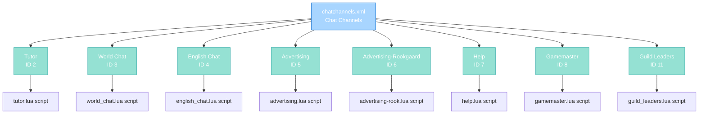

import { Aside, Card } from '@astrojs/starlight/components';

## 🛠️ Informações do Arquivo

Este é o arquivo de **configuração de canais de chat** do servidor **OpenTibiaBR/Canary**. Define todos os canais de chat disponíveis, seus IDs, nomes, scripts associados e flags de visibilidade pública.

<Card title="Caminho Original" icon="document">
  data/chatchannels/chatchannels.xml
</Card>

<Aside type="tip">
  Este arquivo mapeia cada canal de chat para seu script handler. Canais são identificados por ID numérico and cada um tem nome, flag public opcional, and script Lua que controla permissões and comportamentos específicos do canal.
</Aside>

## 📄 Visão Geral do Código

### Resumo Executivo

chatchannels.xml é um arquivo de **configuração de canais** que implementa:

1. **Channel Registry**: 8 canais definidos com IDs únicos
2. **Script Association**: Cada canal vinculado a script Lua específico
3. **Access Control**: Flag public controla visibilidade em chat list
4. **Permission Gating**: Scripts validam quem pode entrar and falar

### Estrutura de Funcionalidades



---

## 1. Estrutura XML

### 1.1 Raiz E Elemento

```xml
<?xml version="1.0" encoding="UTF-8"?>
<channels>
    <!-- channel definitions -->
</channels>
```

Elemento raiz contém todas definições de canais.

---

## 2. Canais Definidos

### 2.1 Channel Element Schema

```xml
<channel id="2" name="Tutor" script="tutor.lua" />
```

| Atributo | Tipo | Obrigatório | Descrição |
|----------|------|-----------|-----------|
| **id** | number | Sim | Identificador numérico único do canal |
| **name** | string | Sim | Nome exibido no client |
| **script** | string | Sim | Nome do arquivo Lua handler (sem path) |
| **public** | number | Não | 1 = público, omitido = privado |

---

### 2.2 Canais Específicos

#### 2.2.1 Tutor (ID 2)

```xml
<channel id="2" name="Tutor" script="tutor.lua" />
```

| Propriedade | Valor |
|---|---|
| **ID** | 2 |
| **Nome** | Tutor |
| **Script** | tutor.lua |
| **Público** | Não (privado) |
| **Propósito** | Communication entre tutors and novo players |

---

#### 2.2.2 World Chat (ID 3)

```xml
<channel id="3" name="World Chat" public="1" script="world_chat.lua" />
```

| Propriedade | Valor |
|---|---|
| **ID** | 3 |
| **Nome** | World Chat |
| **Script** | world_chat.lua |
| **Público** | Sim (1) |
| **Propósito** | Chat global visível por todos |

---

#### 2.2.3 English Chat (ID 4)

```xml
<channel id="4" name="English Chat" public="1" script="english_chat.lua" />
```

| Propriedade | Valor |
|---|---|
| **ID** | 4 |
| **Nome** | English Chat |
| **Script** | english_chat.lua |
| **Público** | Sim (1) |
| **Propósito** | Chat específico para language English |

---

#### 2.2.4 Advertising (ID 5)

```xml
<channel id="5" name="Advertising" public="1" script="advertising.lua" />
```

| Propriedade | Valor |
|---|---|
| **ID** | 5 |
| **Nome** | Advertising |
| **Script** | advertising.lua |
| **Público** | Sim (1) |
| **Requerimentos** | Level 20 ou Premium |
| **Cooldown** | 2 minutos entre offers |
| **Propósito** | Buy and sell offers system |

---

#### 2.2.5 Advertising-Rookgaard (ID 6)

```xml
<channel id="6" name="Advertising-Rookgaard" public="1" script="advertising-rook.lua" />
```

| Propriedade | Valor |
|---|---|
| **ID** | 6 |
| **Nome** | Advertising-Rookgaard |
| **Script** | advertising-rook.lua |
| **Público** | Sim (1) |
| **Acesso** | Vocação NONE ou GMs apenas |
| **Cooldown** | 2 minutos entre offers |
| **Propósito** | Advertising canal para Rookgaard players |

---

#### 2.2.6 Help (ID 7)

```xml
<channel id="7" name="Help" public="1" script="help.lua" />
```

| Propriedade | Valor |
|---|---|
| **ID** | 7 |
| **Nome** | Help |
| **Script** | help.lua |
| **Público** | Sim (1) |
| **Propósito** | Help and support channel |

---

#### 2.2.7 Gamemaster (ID 8)

```xml
<channel id="8" name="Gamemaster" script="gamemaster.lua" />
```

| Propriedade | Valor |
|---|---|
| **ID** | 8 |
| **Nome** | Gamemaster |
| **Script** | gamemaster.lua |
| **Público** | Não (privado) |
| **Acesso** | GMs apenas |
| **Propósito** | Internal gamemaster communication |

---

#### 2.2.8 Guild Leaders (ID 11)

```xml
<channel id="11" name="Guild Leaders" script="guild_leaders.lua" />
```

| Propriedade | Valor |
|---|---|
| **ID** | 11 |
| **Nome** | Guild Leaders |
| **Script** | guild_leaders.lua |
| **Público** | Não (privado) |
| **Propósito** | Communication entre guild leaders e management |

---

## 3. Fluxo de Operação

### 3.1 Inicialização do Servidor

```
Server Boot
    |
    +-- Parse chatchannels.xml
            |
            +-- Para cada <channel>
                    |__ Cria instância de canal
                    |__ Registra ID
                    |__ Carrega script Lua handler
                    |__ Seta flags (public ou privado)
    |
    +-- Canais prontos para uso
```

---

### 3.2 Join de Canal

```
Player tenta entrar canal
    |
    +-- Obtém script do canal via chatchannels.xml
            |
            +-- Executa canJoin(player) do script
                    |
                    +-- Se retorna false: acesso negado
                    |__ Se retorna true: channel joined
    |
    +-- Player vê mensagens do canal
```

---

### 3.3 Speak no Canal

```
Player escreve mensagem no canal
    |
    +-- Chama onSpeak(player, type, message) do script
            |
            +-- Script valida jogador
            +-- Script valida permissões
            +-- Script aplica cooldowns
            +-- Script retorna tipo de talk (ou false para bloquear)
    |
    +-- Mensagem broadcast aos players do canal
```

---

## 4. ID Reference

### 4.1 ID Allocation

| ID | Canal | Acesso | Status |
|----|-------|--------|--------|
| 2 | Tutor | Privado | Ativo |
| 3 | World Chat | Público | Ativo |
| 4 | English Chat | Público | Ativo |
| 5 | Advertising | Público | Ativo |
| 6 | Advertising-Rookgaard | Público | Ativo |
| 7 | Help | Público | Ativo |
| 8 | Gamemaster | Privado | Ativo |
| 9-10 | (reserved) | - | Não usado |
| 11 | Guild Leaders | Privado | Ativo |

---

## 5. Checkpoint de Aprendizagem

### Conceitos-Chave

| Conceito | Explicação |
|----------|-----------|
| **Channel ID** | Identificador numérico único |
| **Public Flag** | Controla visibilidade em chat list |
| **Script Handler** | Lua que valida permissões and comportamento |
| **canJoin Function** | Valida accesso ao canal |
| **onSpeak Handler** | Valida and modifica mensagens |

### Padrões Observados

1. **Separation of Concerns**: XML define structure, Lua implementa lógica
2. **Declarative Configuration**: XML em vez de hardcode em C++ or Lua
3. **Script Naming**: advertising.lua vs advertising-rook.lua (regional variants)
4. **ID Gaps**: IDs 9-10 reservados para futuro uso
5. **Public vs Private**: Flag binary controla channel visibility

### Responsabilidades

1. **Registrar todos canais**
2. **Associar scripts corretos**
3. **Definir public flag**
4. **Manter IDs únicos and consistentes**

---

## 6. Integração do Sistema

### 6.1 Script Handler Pattern

Cada script em data/chatchannels/scripts/ deve implementar:

```lua
function canJoin(player)
    -- Validação de acesso
    return true or false
end

function onSpeak(player, type, message)
    -- Validação de fala
    -- Pode modificar type de TALKTYPE
    return false (bloqueia) ou modified type
end
```

### 6.2 Client Display

Canais com public="1" aparecem na list do client.

Canais sem public flag são privados (invite-only ou role-specific).

---

## 🤖 Informações da Documentação

<Card title="Documentação do Arquivo chatchannels.xml" icon="document">
  **Tipo**: XML Configuration - Chat Channels  
  **Total de Canais**: 8 definidos  
  **Canais Públicos**: 5 (World, English, Advertising, Advertising-Rook, Help)  
  **Canais Privados**: 3 (Tutor, Gamemaster, Guild Leaders)  
  **Scripts Associados**: 8 handlers Lua  
  **ID Range**: 2-11 com gaps reservados  
  **Attributes**: id, name, script, public (opcional)  
  **Checkpoint**: 5 conceitos and 5 padrões and 1 responsabilidade primária
</Card>

<Aside type="note">
  **Última Atualização**: Session 18  
  **Status**: Completo - Configuration Reference  
  **Formato**: XML 1.0 UTF-8  
  **Path**: Root é elemento channels
</Aside>
