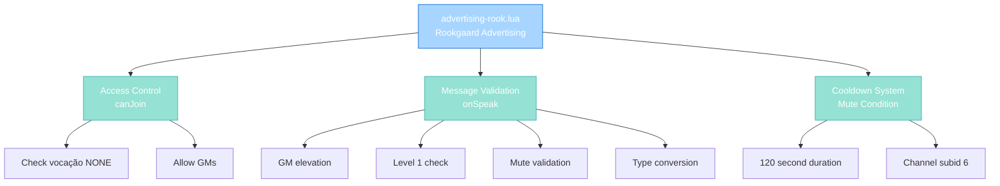

import { Aside, Card } from '@astrojs/starlight/components';

## 🛠️ Informações do Arquivo

Este é o arquivo que implementa o **handler do canal de advertising para Rookgaard** do servidor **OpenTibiaBR/Canary**. Fornece funcionalidades para validação de acesso, controle de cooldown and moderação de mensagens neste canal específico.

<Card title="Caminho Original" icon="document">
  data/chatchannels/scripts/advertising-rook.lua
</Card>

<Aside type="tip">
  O canal Advertising-Rookgaard é restrito apenas a players em vocação NONE (Rookgaard players) ou Staff (GMs+). Implementa cooldown de 2 minutos between offers and validações básicas de level and channel mute.
</Aside>

## 📄 Visão Geral do Código

### Resumo Executivo

advertising-rook.lua é um módulo de **handler de canal** que implementa:

1. **Access Control**: Apenas vocação NONE ou GMs podem entrar
2. **Cooldown System**: 2 minutos entre offers via CONDITION_CHANNELMUTEDTICKS
3. **Level Validation**: Level 1 players bloqueados
4. **Talk Type Conversion**: Força TALKTYPE_CHANNEL_Y unless GM
5. **Mute Enforcement**: Rejeita fala durante cooldown

### Estrutura de Funcionalidades



---

## 1. Variáveis Globais

### 1.1 CHANNEL_ADVERTISING_ROOK

```lua
local CHANNEL_ADVERTISING_ROOK = 6
```

| Propriedade | Valor |
|---|---|
| **Tipo** | number |
| **Valor** | 6 |
| **Propósito** | Channel ID para referência em mute conditions |

**Descrição**: Constante local com ID do canal, usado para criar condition específica do canal.

---

### 1.2 muted Condition

```lua
local muted = Condition(CONDITION_CHANNELMUTEDTICKS, CONDITIONID_DEFAULT)
muted:setParameter(CONDITION_PARAM_SUBID, CHANNEL_ADVERTISING_ROOK)
muted:setParameter(CONDITION_PARAM_TICKS, 120000)
```

| Propriedade | Valor | Descrição |
|---|---|---|
| **Type** | CONDITION_CHANNELMUTEDTICKS | Mute condition type |
| **Subid** | 6 | Channel ID específica |
| **Duration** | 120000 | 120 segundos (2 minutos) |

**Descrição**: Template de condition que é aplicada para enforçar cooldown.

---

## 2. Funções Globais

### 2.1 function canJoin(player)

Valida se player pode entrar no canal Advertising-Rookgaard.

#### Assinatura
```lua
function canJoin(player)
```

#### Parâmetro

| Parâmetro | Tipo | Descrição |
|---|---|---|
| **player** | player | Player tentando entrar |

#### Retorno

| Tipo | Valor |
|---|---|
| **boolean** | true se pode entrar |
| **boolean** | false caso contrário |

#### Lógica

```lua
return player:getVocation():getId() == VOCATION_NONE or 
       player:getGroup():getId() >= GROUP_TYPE_SENIORTUTOR
```

| Condição | Resultado | Descrição |
|-----------|-----------|-----------|
| **Vocação NONE** | true | Rookgaard players |
| **Grupo SENIORTUTOR ou superior** | true | Staff access |
| **Outro** | false | Player rejeitado |

#### Decisão de Acesso

```
Check vocação:
  + VOCATION_NONE (Rookgaard): ALLOW
  + Outras vocações: DENY

Check grupo:
  + GROUP_TYPE_SENIORTUTOR ou higher: ALLOW (override)
  + Lower: DENY
```

---

### 2.2 function onSpeak(player, type, message)

Valida and modifica mensagens postadas no canal.

#### Assinatura
```lua
function onSpeak(player, type, message)
```

#### Parâmetros

| Parâmetro | Tipo | Descrição |
|---|---|---|
| **player** | player | Player postando mensagem |
| **type** | number | TALKTYPE (original) |
| **message** | string | Conteúdo da mensagem |

#### Retorno

| Tipo | Valor |
|---|---|
| **boolean** | false se bloqueado |
| **number** | TALKTYPE modificado if permitido |

#### Comportamento - Fase 1: GM Elevation

```lua
if player:getGroup():getId() >= GROUP_TYPE_GAMEMASTER then
    if type == TALKTYPE_CHANNEL_Y then
        return TALKTYPE_CHANNEL_O
    end
    return true
end
```

| Seu Tipo | Retorno | Significado |
|-----------|---------|-----------|
| **TALKTYPE_CHANNEL_Y** (yellow) | TALKTYPE_CHANNEL_O (orange) | Eleva para orange |
| **Outro** | true | Allows como-is |

**Propósito**: GMs podem postar em orange, não yellow.

---

#### Comportamento - Fase 2: Level Validation

```lua
if player:getLevel() == 1 then
    player:sendCancelMessage("You may not speak into channels as long as you are on level 1.")
    return false
end
```

| Condição | Ação |
|----------|------|
| **Level 1** | Rejeita com mensagem |
| **Level 2+** | Prossegue |

---

#### Comportamento - Fase 3: Mute Validation

```lua
if player:getCondition(CONDITION_CHANNELMUTEDTICKS, CONDITIONID_DEFAULT, CHANNEL_ADVERTISING_ROOK) then
    player:sendCancelMessage("You may only place one offer in two minutes.")
    return false
end
player:addCondition(muted)
```

| Passo | Operação |
|------|----------|
| 1 | Checa se player tem mute condition |
| 2 | Se tem: envia mensagem de cooldown and retorna false |
| 3 | Se não tem: aplica mute condition (120s) |

**Cooldown**: 120 segundos (2 minutos) entre offers.

---

#### Comportamento - Fase 4: Type Conversion

```lua
if type == TALKTYPE_CHANNEL_O then
    if player:getGroup():getId() < GROUP_TYPE_GAMEMASTER then
        type = TALKTYPE_CHANNEL_Y
    end
elseif type == TALKTYPE_CHANNEL_R1 then
    if not player:hasFlag(PlayerFlag_CanTalkRedChannel) then
        type = TALKTYPE_CHANNEL_Y
    end
end
return type
```

| Tipo Original | Grupo | Tipo Final | Razão |
|--------|-------|-----------|-------|
| **CHANNEL_O** (orange) | Non-GM | CHANNEL_Y (yellow) | Força yellow |
| **CHANNEL_O** | GM | CHANNEL_O | Mantém |
| **CHANNEL_R1** (red) | Com flag | CHANNEL_R1 | Mantém |
| **CHANNEL_R1** | Sem flag | CHANNEL_Y | Força yellow |
| **Outro** | - | Original | Sem mudança |

---

## 3. Fluxo Completo

### 3.1 Entrada no Canal

```
Player clica "Advertising-Rookgaard"
    |
    +-- canJoin(player) executado
            |
            +-- Check: player:getVocation():getId() == VOCATION_NONE?
            |       + SIM: ALLOW
            |       + NÃO: Check grupo
            |
            +-- Check: player:getGroup():getId() >= GROUP_TYPE_SENIORTUTOR?
                    + SIM: ALLOW
                    + NÃO: DENY
    |
    +-- Se ALLOW: Player entra canal
    +-- Se DENY: Mensagem "You are not allowed to enter this channel"
```

---

### 3.2 Posting de Mensagem

```
Player digita mensagem e ENTER
    |
    +-- onSpeak(player, type, message) executado
            |
            +-- GM Elevation: Se GM, upgrade yellow->orange
            |
            +-- Level Check: Se level 1, REJECT
            |
            +-- Mute Check: Se cooldown ativo, REJECT
            |
            +-- Apply Mute: Adiciona condition 120s
            |
            +-- Type Conversion: Valida TALKTYPE
    |
    +-- Se ACCEPT: Mensagem broadcast ao canal
    +-- Se REJECT: Mensagem de erro, sem postagem
```

---

## 4. Restricted Access Pattern

### 4.1 Por Vocação

Apenas VOCATION_NONE (Rookgaard):

```
Vocações:
  + VOCATION_NONE (0) = Rookgaard ALLOW
  + VOCATION_SORCERER (1) = DENY
  + VOCATION_DRUID (2) = DENY
  + VOCATION_PALADIN (3) = DENY
  + VOCATION_KNIGHT (4) = DENY
```

### 4.2 Staff Override

AnyGroup >= SENIORTUTOR pode entrar regardless de vocação.

---

## 5. Cooldown System

### 5.1 Técnica: CONDITION_CHANNELMUTEDTICKS

```lua
condition = Condition(CONDITION_CHANNELMUTEDTICKS, CONDITIONID_DEFAULT)
condition:setParameter(CONDITION_PARAM_SUBID, CHANNEL_ADVERTISING_ROOK)
condition:setParameter(CONDITION_PARAM_TICKS, 120000)
```

| Parâmetro | Valor | Significado |
|-----------|-------|-----------|
| **Type** | CHANNELMUTEDTICKS | Especializado para channel mute |
| **Subid** | 6 | Canal-específica |
| **Ticks** | 120000 | 120 segundos |

### 5.2 Enforcement

```lua
if player:getCondition(CONDITION_CHANNELMUTEDTICKS, CONDITIONID_DEFAULT, CHANNEL_ADVERTISING_ROOK) then
    return false  -- Bloqueia se condition exists
end
```

Condition decai automaticamente após 120s.

---

## 6. Padrões Observados

### 6.1 Guard Clauses

```lua
if player:getGroup():getId() >= GROUP_TYPE_GAMEMASTER then
    return ...
end

if player:getLevel() == 1 then
    return false
end

if player:getCondition(...) then
    return false
end
```

Early returns para cada falha.

### 6.2 Type Conversion Chain

```lua
if type == A then
    if condition then
        type = C
    end
elseif type == B then
    if condition then
        type = C
    end
end
return type
```

Força normalization de TALKTYPE.

---

## 7. Checkpoint de Aprendizagem

### Conceitos-Chave

| Conceito | Explicação |
|----------|-----------|
| **Channel Handler** | Script que controla um canal específico |
| **Access Control** | canJoin() gate para channel membership |
| **onSpeak Handler** | Validação and modificação de mensagens |
| **Condition-Based Cooldown** | CONDITION_CHANNELMUTEDTICKS para enforce gaps |
| **Type Normalization** | Converte TALKTYPE para padrão do canal |

### Padrões Observados

1. **Guard Clause Pattern**: Early return em cada validação falhada
2. **Condition Reuse**: Template de mute aplicada a cada fala
3. **Staff Override**: Grupos específicos bypasssam algumas checks
4. **Type Elevation**: GMs podem usar tipos de chat mais altos
5. **Numeric ID Consistency**: Channel ID 6 em XML e Lua

### Responsabilidades

1. **Validar acesso ao canal**
2. **Rejeitar level 1 players**
3. **Enforçar cooldown 2 minutos**
4. **Normalizar TALKTYPE**
5. **Permitir GM elevation**

---

## 🤖 Informações da Documentação

<Card title="Documentação do Módulo advertising-rook.lua" icon="document">
  **Tipo**: Chat Channel Handler and Moderator  
  **Funções Globais**: 2 (canJoin, onSpeak)  
  **Variáveis Locais**: 2 (CHANNEL_ADVERTISING_ROOK, muted condition)  
  **Validações**: Vocação, Level, Mute, TALKTYPE  
  **Cooldown**: 120 segundos entre offers  
  **Access**: VOCATION_NONE ou GROUP_TYPE_SENIORTUTOR+  
  **Restrictions**: Level 1 rejeitado, Type normalizado  
  **Checkpoint**: 5 conceitos and 5 padrões and 5 responsabilidades
</Card>

<Aside type="note">
  **Última Atualização**: Session 18  
  **Status**: Completo - Padrão Custom Modules  
  **Linhas de Código**: ~45 total  
  **Channel ID**: 6 (Advertising-Rookgaard)  
  **Comparação**: Similar a advertising.lua mas restrição de vocação e sem premium check
</Aside>
