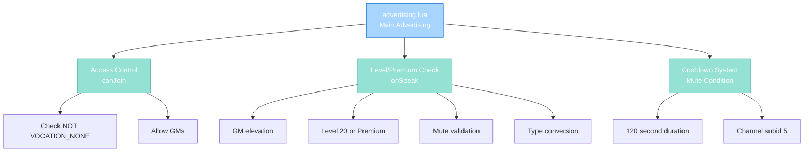

import { Aside, Card } from '@astrojs/starlight/components';

## 🛠️ Informações do Arquivo

Este é o arquivo que implementa o **handler do canal de advertising principal** do servidor **OpenTibiaBR/Canary**. Fornece funcionalidades para validação de acesso baseada em level e status premium, controle de cooldown and moderação de mensagens neste canal.

<Card title="Caminho Original" icon="document">
  data/chatchannels/scripts/advertising.lua
</Card>

<Aside type="tip">
  O canal Advertising é restrito a players com level 20+ ou status premium. Implementa cooldown de 2 minutos between offers, validações de level and premium, and normalization de TALKTYPE com elevation de staff.
</Aside>

## 📄 Visão Geral do Código

### Resumo Executivo

advertising.lua é um módulo de **handler de canal** que implementa:

1. **Access Control**: Level 20+ ou Premium (+ não VOCATION_NONE)
2. **Cooldown System**: 2 minutos entre offers via CONDITION_CHANNELMUTEDTICKS
3. **Level/Premium Check**: Bloqueia players low-level sem premium
4. **Talk Type Conversion**: Força TALKTYPE_CHANNEL_Y unless GM
5. **GM Elevation**: Permite GMs postar em orange
6. **Mute Enforcement**: Rejeita fala durante cooldown

### Estrutura de Funcionalidades



---

## 1. Variáveis Globais

### 1.1 CHANNEL_ADVERTISING

```lua
local CHANNEL_ADVERTISING = 5
```

| Propriedade | Valor |
|---|---|
| **Tipo** | number |
| **Valor** | 5 |
| **Propósito** | Channel ID para referência em mute conditions |

**Descrição**: Constante local com ID do canal, usado para criar condition específica do canal.

---

### 1.2 muted Condition

```lua
local muted = Condition(CONDITION_CHANNELMUTEDTICKS, CONDITIONID_DEFAULT)
muted:setParameter(CONDITION_PARAM_SUBID, CHANNEL_ADVERTISING)
muted:setParameter(CONDITION_PARAM_TICKS, 120000)
```

| Propriedade | Valor | Descrição |
|---|---|---|
| **Type** | CONDITION_CHANNELMUTEDTICKS | Mute condition type |
| **Subid** | 5 | Channel ID específica |
| **Duration** | 120000 | 120 segundos (2 minutos) |

**Descrição**: Template de condition que é aplicada para enforçar cooldown.

---

## 2. Funções Globais

### 2.1 function canJoin(player)

Valida se player pode entrar no canal Advertising.

#### Assinatura
```lua
function canJoin(player)
```

#### Parâmetro

| Parâmetro | Tipo | Descrição |
|---|---|---|
| **player** | player | Player tentando entrar |

#### Retorno

| Tipo | Valor |
|---|---|
| **boolean** | true se pode entrar |
| **boolean** | false caso contrário |

#### Lógica

```lua
return player:getVocation():getId() ~= VOCATION_NONE or 
       player:getGroup():getId() >= GROUP_TYPE_SENIORTUTOR
```

| Condição | Resultado | Descrição |
|-----------|-----------|-----------|
| **Vocação != NONE** | true | Qualquer vocação não-Rookgaard |
| **Grupo SENIORTUTOR ou superior** | true | Staff access |
| **Outro** | false | Player rejeitado |

#### Decisão de Acesso

```
Check vocação:
  + NOT VOCATION_NONE (qualquer classe): ALLOW
  + VOCATION_NONE (Rookgaard): DENY

Check grupo:
  + GROUP_TYPE_SENIORTUTOR ou higher: ALLOW (override)
  + Lower: DENY
```

---

### 2.2 function onSpeak(player, type, message)

Valida and modifica mensagens postadas no canal.

#### Assinatura
```lua
function onSpeak(player, type, message)
```

#### Parâmetros

| Parâmetro | Tipo | Descrição |
|---|---|---|
| **player** | player | Player postando mensagem |
| **type** | number | TALKTYPE (original) |
| **message** | string | Conteúdo da mensagem |

#### Retorno

| Tipo | Valor |
|---|---|
| **boolean** | false se bloqueado |
| **number** | TALKTYPE modificado if permitido |

---

#### Comportamento - Fase 1: GM Elevation

```lua
if player:getGroup():getId() >= GROUP_TYPE_GAMEMASTER then
    if type == TALKTYPE_CHANNEL_Y then
        return TALKTYPE_CHANNEL_O
    end
    return true
end
```

| Seu Tipo | Retorno | Significado |
|-----------|---------|-----------|
| **TALKTYPE_CHANNEL_Y** (yellow) | TALKTYPE_CHANNEL_O (orange) | Eleva para orange |
| **Outro** | true | Allows como-is |

**Propósito**: GMs podem postar em orange, não yellow.

---

#### Comportamento - Fase 2: Level and Premium Check

```lua
if player:getLevel() < 20 and not player:isPremium() then
    player:sendCancelMessage("You may not speak in this channel unless you have reached level 20 or your account has premium status.")
    return false
end
```

| Condição | Ação |
|----------|------|
| **Level < 20 AND NOT Premium** | Rejeita com mensagem descritiva |
| **Level >= 20** | Prossegue |
| **Level < 20 AND Premium** | Prossegue |

**Tipos de Acesso**:
- Level 20+ players: sempre podem falar
- Premium players < 20: podem falar
- Non-premium < 20: bloqueados

---

#### Comportamento - Fase 3: Mute Validation

```lua
if player:getCondition(CONDITION_CHANNELMUTEDTICKS, CONDITIONID_DEFAULT, CHANNEL_ADVERTISING) then
    player:sendCancelMessage("You may only place one offer in two minutes.")
    return false
end
player:addCondition(muted)
```

| Passo | Operação |
|------|----------|
| 1 | Checa se player tem mute condition |
| 2 | Se tem: envia mensagem de cooldown and retorna false |
| 3 | Se não tem: aplica mute condition (120s) |

**Cooldown**: 120 segundos (2 minutos) entre offers.

---

#### Comportamento - Fase 4: Type Conversion

```lua
if type == TALKTYPE_CHANNEL_O then
    if player:getGroup():getId() < GROUP_TYPE_GAMEMASTER then
        type = TALKTYPE_CHANNEL_Y
    end
elseif type == TALKTYPE_CHANNEL_R1 then
    if not player:hasFlag(PlayerFlag_CanTalkRedChannel) then
        type = TALKTYPE_CHANNEL_Y
    end
end
return type
```

| Tipo Original | Grupo | Tipo Final | Razão |
|--------|-------|-----------|-------|
| **CHANNEL_O** (orange) | Non-GM | CHANNEL_Y (yellow) | Força yellow |
| **CHANNEL_O** | GM | CHANNEL_O | Mantém |
| **CHANNEL_R1** (red) | Com flag | CHANNEL_R1 | Mantém |
| **CHANNEL_R1** | Sem flag | CHANNEL_Y | Força yellow |
| **Outro** | - | Original | Sem mudança |

---

## 3. Fluxo Completo

### 3.1 Entrada no Canal

```
Player clica "Advertising"
    |
    +-- canJoin(player) executado
            |
            +-- Check: player:getVocation():getId() ~= VOCATION_NONE?
            |       + SIM: ALLOW
            |       + NÃO: Check grupo
            |
            +-- Check: player:getGroup():getId() >= GROUP_TYPE_SENIORTUTOR?
                    + SIM: ALLOW
                    + NÃO: DENY
    |
    +-- Se ALLOW: Player entra canal
    +-- Se DENY: Mensagem "You are not allowed to enter this channel"
```

---

### 3.2 Posting de Mensagem

```
Player digita mensagem e ENTER
    |
    +-- onSpeak(player, type, message) executado
            |
            +-- GM Elevation: Se GM, upgrade yellow->orange
            |
            +-- Level/Premium: Se level < 20 and não premium, REJECT
            |
            +-- Mute Check: Se cooldown ativo, REJECT
            |
            +-- Apply Mute: Adiciona condition 120s
            |
            +-- Type Conversion: Valida TALKTYPE
    |
    +-- Se ACCEPT: Mensagem broadcast ao canal
    +-- Se REJECT: Mensagem de erro, sem postagem
```

---

## 4. Access Control Pattern

### 4.1 Por Vocação (Inverso de Rookgaard)

Todas as vocações EXCETO VOCATION_NONE (Rookgaard):

```
Vocações:
  + VOCATION_NONE (0) = DENY
  + VOCATION_SORCERER (1) = ALLOW
  + VOCATION_DRUID (2) = ALLOW
  + VOCATION_PALADIN (3) = ALLOW
  + VOCATION_KNIGHT (4) = ALLOW
```

### 4.2 Por Level/Premium

```
Acesso:
  + Level >= 20: ALLOW (regardless de vocação)
  + Level < 20 AND Premium: ALLOW
  + Level < 20 AND Non-Premium: DENY
```

### 4.3 Staff Override

AnyGroup >= SENIORTUTOR pode entrar regardless de vocação ou level.

---

## 5. Level and Premium System

### 5.1 Técnica: Dual Check

```lua
if player:getLevel() < 20 and not player:isPremium() then
    return false
end
```

**Lógica Boolean**:
- Level < 20: true (jovem)
- não Premium: true (não-premium)
- Both true: REJECT
- Level >= 20: ALLOW regardless de premium
- Premium: ALLOW regardless de level

---

### 5.2 Comparação com advertising-rook

| Aspecto | advertising.lua | advertising-rook.lua |
|---------|-----------------|----------------------|
| **Channel ID** | 5 | 6 |
| **Vocação Check** | ~= NONE (não Rookgaard) | == NONE (Rookgaard) |
| **Level Check** | Level < 20 blocked | N/A |
| **Premium Check** | Sim, bypass level | N/A |
| **GM Override** | Sim | Sim |
| **Primary Access** | High-level ou premium | Rookgaard players |
| **Use Case** | International trading | Rookgaard offers |

---

## 6. Cooldown System

### 6.1 Técnica: CONDITION_CHANNELMUTEDTICKS

```lua
condition = Condition(CONDITION_CHANNELMUTEDTICKS, CONDITIONID_DEFAULT)
condition:setParameter(CONDITION_PARAM_SUBID, CHANNEL_ADVERTISING)
condition:setParameter(CONDITION_PARAM_TICKS, 120000)
```

| Parâmetro | Valor | Significado |
|-----------|-------|-----------|
| **Type** | CHANNELMUTEDTICKS | Especializado para channel mute |
| **Subid** | 5 | Canal-específica |
| **Ticks** | 120000 | 120 segundos |

### 6.2 Enforcement

```lua
if player:getCondition(CONDITION_CHANNELMUTEDTICKS, CONDITIONID_DEFAULT, CHANNEL_ADVERTISING) then
    return false  -- Bloqueia se condition exists
end
```

Condition decai automaticamente após 120s.

---

## 7. Padrões Observados

### 7.1 Guard Clauses

```lua
if player:getGroup():getId() >= GROUP_TYPE_GAMEMASTER then
    return ...
end

if player:getLevel() < 20 and not player:isPremium() then
    return false
end

if player:getCondition(...) then
    return false
end
```

Early returns para cada falha.

### 7.2 Type Conversion Chain

```lua
if type == A then
    if condition then
        type = C
    end
elseif type == B then
    if condition then
        type = C
    end
end
return type
```

Força normalization de TALKTYPE.

### 7.3 Boolean Logic

```lua
player:getLevel() < 20 and not player:isPremium()
```

Rejeita ONLY se ambas verdadeiras (low-level AND non-premium).

---

## 8. Checkpoint de Aprendizagem

### Conceitos-Chave

| Conceito | Explicação |
|----------|-----------|
| **Channel Handler** | Script que controla um canal específico |
| **Access Control** | canJoin() gate para channel membership |
| **onSpeak Handler** | Validação and modificação de mensagens |
| **Dual Criteria** | Level OU Premium (qualquer um permite) |
| **Condition-Based Cooldown** | CONDITION_CHANNELMUTEDTICKS para enforce gaps |
| **Type Normalization** | Converte TALKTYPE para padrão do canal |

### Padrões Observados

1. **Guard Clause Pattern**: Early return em cada validação falhada
2. **Dual Criteria Entry**: Level OR Premium gates
3. **Condition Reuse**: Template de mute aplicada a cada fala
4. **Staff Override**: Grupos específicos bypasssam algumas checks
5. **Type Elevation**: GMs podem usar tipos de chat mais altos
6. **Numeric ID Consistency**: Channel ID 5 em XML and Lua

### Responsabilidades

1. **Validar acesso ao canal (vocação não-Rookgaard OR staff)**
2. **Enforçar level 20 or premium requirement**
3. **Rejeitar low-level non-premium players**
4. **Enforçar cooldown 2 minutos**
5. **Normalizar TALKTYPE**
6. **Permitir GM elevation**

---

## 🤖 Informações da Documentação

<Card title="Documentação do Módulo advertising.lua" icon="document">
  **Tipo**: Chat Channel Handler and Moderator  
  **Funções Globais**: 2 (canJoin, onSpeak)  
  **Variáveis Locais**: 2 (CHANNEL_ADVERTISING, muted condition)  
  **Validações**: Vocação, Level, Premium, Mute, TALKTYPE  
  **Cooldown**: 120 segundos entre offers  
  **Access**: !VOCATION_NONE (level 20 or premium) ou GROUP_TYPE_SENIORTUTOR+  
  **Restrictions**: Low-level non-premium bloqueado, Type normalizado  
  **Checkpoint**: 6 conceitos and 6 padrões and 6 responsabilidades
</Card>

<Aside type="note">
  **Última Atualização**: Session 18  
  **Status**: Completo - Padrão Custom Modules  
  **Linhas de Código**: ~45 total  
  **Channel ID**: 5 (Advertising)  
  **Comparação**: Oposto de advertising-rook.lua (vocação invertida, level/premium check adicional)  
  **Trading Hub**: Principal espaço de commerce para high-level players
</Aside>
