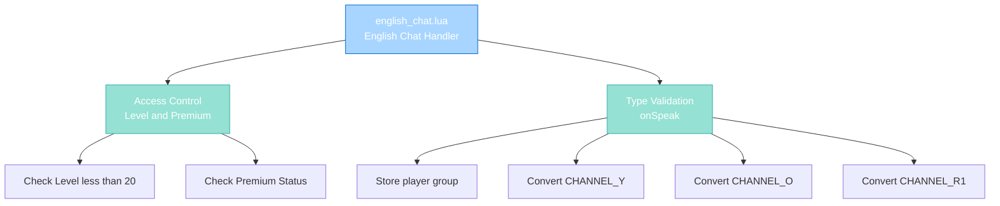

import { Aside, Card } from '@astrojs/starlight/components';

## 🛠️ Informações do Arquivo

Este é o arquivo que implementa o **handler do canal English Chat** do servidor **OpenTibiaBR/Canary**. Fornece funcionalidades para validação de acesso baseada em level and premium status, and type normalization de mensagens neste canal.

<Card title="Caminho Original" icon="document">
  data/chatchannels/scripts/english_chat.lua
</Card>

<Aside type="tip">
  O canal English Chat é restrito a players com level 20+ ou status premium, similar ao advertising.lua. Implementa normalização de TALKTYPE com elevation de staff para orange when applicable.
</Aside>

## 📄 Visão Geral do Código

### Resumo Executivo

english_chat.lua é um módulo de **handler de canal** que implementa:

1. **Access Control**: Apenas level 20+ ou Premium players podem falar
2. **Type Conversion**: Normaliza TALKTYPE baseado em grupo do player
3. **GM Elevation**: Gamemasters podem usar orange (TALKTYPE_CHANNEL_O)
4. **Flag Validation**: Respeita PlayerFlag_CanTalkRedChannel para red channel
5. **No Cooldown**: Diferente do advertising, sem cooldown system

### Estrutura de Funcionalidades



---

## 1. Funções Globais

### 1.1 function onSpeak(player, type, message)

Handler principal para mensagens postadas no canal English Chat.

#### Assinatura
```lua
function onSpeak(player, type, message)
```

#### Parâmetros

| Parâmetro | Tipo | Descrição |
|---|---|---|
| **player** | player | Player postando mensagem |
| **type** | number | TALKTYPE (original do cliente) |
| **message** | string | Conteúdo da mensagem |

#### Retorno

| Tipo | Valor |
|---|---|
| **boolean** | false se bloqueado |
| **number** | TALKTYPE modificado if permitido |

---

## 2. Lógica de Validação

### 2.1 Fase 1: Level and Premium Check

```lua
if player:getLevel() < 20 and not player:isPremium() then
    player:sendCancelMessage("You may not speak in this channel unless you have reached level 20 or your account has premium status.")
    return false
end
```

| Condição | Ação |
|----------|------|
| **Level < 20 AND NOT Premium** | REJECT com mensagem |
| **Level >= 20** | ALLOW |
| **Level < 20 AND Premium** | ALLOW |

**Objetivo**: Restriciona acesso apenas a players estabelecidos ou premium.

---

### 2.2 Fase 2: Type Conversion Logic

#### Local Variable: playerGroupType

```lua
local playerGroupType = player:getGroup():getId()
```

| Propriedade | Descrição |
|---|---|
| **Escopo** | Local to onSpeak |
| **Tipo** | number |
| **Uso** | Cache de group ID para evitar múltiplas chamadas |

---

#### Sub-Fase A: TALKTYPE_CHANNEL_Y (Yellow)

```lua
if type == TALKTYPE_CHANNEL_Y then
    if playerGroupType >= GROUP_TYPE_GAMEMASTER then
        type = TALKTYPE_CHANNEL_O
    end
end
```

| Condição | Resultado | Descrição |
|----------|-----------|-----------|
| **Yellow e GM+** | Orange | Eleva staff para orange |
| **Yellow e non-GM** | Yellow | Mantém yellow |

---

#### Sub-Fase B: TALKTYPE_CHANNEL_O (Orange)

```lua
elseif type == TALKTYPE_CHANNEL_O then
    if playerGroupType < GROUP_TYPE_GAMEMASTER then
        type = TALKTYPE_CHANNEL_Y
    end
end
```

| Condição | Resultado | Descrição |
|----------|-----------|-----------|
| **Orange e GM+** | Orange | Mantém orange |
| **Orange e non-GM** | Yellow | Força yellow |

**Propósito**: Evita que non-staff use orange channel.

---

#### Sub-Fase C: TALKTYPE_CHANNEL_R1 (Red)

```lua
elseif type == TALKTYPE_CHANNEL_R1 then
    if playerGroupType < GROUP_TYPE_GAMEMASTER and not player:hasFlag(PlayerFlag_CanTalkRedChannel) then
        type = TALKTYPE_CHANNEL_Y
    end
end
```

| Condição | Resultado | Descrição |
|----------|-----------|-----------|
| **Red e GM+** | Red | GameMasters podem red |
| **Red e non-GM com flag** | Red | Players com flag podem red |
| **Red e non-GM sem flag** | Yellow | Força yellow |

---

### 2.3 Fase 3: Return Type

```lua
return type
```

Retorna o tipo após conversão, permitindo a mensagem ser postada.

---

## 3. Fluxo Completo

```
Player digita mensagem e ENTER
    |
    +-- onSpeak(player, type, message) executado
            |
            +-- Level/Premium Check: Se level < 20 and não premium, REJECT
            |
            +-- Local group cache: playerGroupType = player:getGroup():getId()
            |
            +-- Type Conversion Chain:
            |    |
            |    +-- Se CHANNEL_Y:
            |    |     + GM+: upgrade para orange
            |    |     + Non-GM: mantém yellow
            |    |
            |    +-- Se CHANNEL_O:
            |    |     + GM+: mantém orange
            |    |     + Non-GM: força yellow
            |    |
            |    +-- Se CHANNEL_R1:
            |         + GM+: mantém red
            |         + Non-GM com flag: mantém red
            |         + Non-GM sem flag: força yellow
            |
            +-- Return: Tipo final
    |
    +-- Se ACCEPT: Mensagem broadcast ao canal
    +-- Se REJECT: Mensagem de erro, sem postagem
```

---

## 4. Padrões Observados

### 4.1 Guard Clause para Access Control

```lua
if player:getLevel() < 20 and not player:isPremium() then
    return false
end
```

Early return para rejeição rápida.

---

### 4.2 Local Variable Caching

```lua
local playerGroupType = player:getGroup():getId()
```

Armazena grupo em local variable para evitar 3 chamadas de função.

---

### 4.3 Chained If-Elseif para Type Conversion

```lua
if type == A then
    -- conversion A
elseif type == B then
    -- conversion B
elseif type == C then
    -- conversion C
end
```

Processa cada tipo separadamente sem if aninhado desnecessário.

---

### 4.4 Staff Override Pattern

```lua
if playerGroupType >= GROUP_TYPE_GAMEMASTER then
    -- allow higher privilege
end
```

Permite staff usar tipos mais altos sem restrição.

---

## 5. Comparação com Canais Similares

| Aspecto | english_chat.lua | advertising.lua | advertising-rook.lua |
|---------|-----------------|-----------------|----------------------|
| **Channel ID** | 4 | 5 | 6 |
| **Vocação Check** | N/A | !NONE | NONE |
| **Level Check** | < 20 | < 20 | N/A |
| **Premium Check** | Sim | Sim | N/A |
| **Cooldown** | Não | Sim (2 min) | Sim (2 min) |
| **Type Conversion** | Sim | Sim | Sim |
| **canJoin Function** | Não | Sim | Sim |
| **Primary Use** | English language | High-level trades | Rookgaard trades |

---

## 6. Checkpoint de Aprendizagem

### Conceitos-Chave

| Conceito | Explicação |
|----------|-----------|
| **Channel Handler** | Script que controla fala em canal específica |
| **Type Normalization** | Converte TALKTYPE para padrão do canal |
| **GM Elevation** | GMs podem usar tipos de chat mais altos |
| **Access Control** | level/premium gate sem canJoin() |
| **Flag Validation** | Respeita PlayerFlag para red channel access |

### Responsabilidades

1. **Validar level 20 ou premium**
2. **Rejeitar low-level non-premium players**
3. **Normalizar TALKTYPE por grupo**
4. **Permitir GM elevation**
5. **Respeitar red channel flags**

---

## 🤖 Informações da Documentação

<Card title="Documentação do Módulo english_chat.lua" icon="document">
  **Tipo**: Chat Channel Handler  
  **Funções Globais**: 1 (onSpeak)  
  **Variáveis Locais**: 1 (playerGroupType)  
  **Validações**: Level, Premium, TALKTYPE  
  **Cooldown**: Nenhum  
  **Access**: Level 20+ ou Premium  
  **Restrições**: Type normalizado por grupo  
  **Checkpoint**: 5 conceitos and 5 responsabilidades
</Card>

<Aside type="note">
  **Última Atualização**: Session 18  
  **Status**: Completo - Padrão Custom Modules  
  **Linhas de Código**: ~25 total  
  **Channel ID**: 4 (English Chat)  
  **Diferença Principal**: No cooldown como advertising.lua, sem canJoin function  
  **Caso de Uso**: Canal internacional para level 20+ players conversar em inglês
</Aside>
