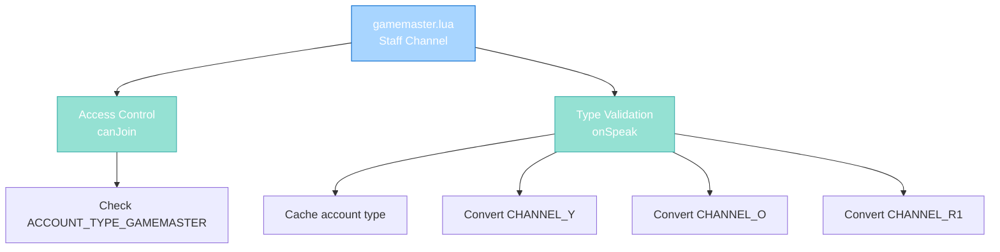

import { Aside, Card } from '@astrojs/starlight/components';

## 🛠️ Informações do Arquivo

Este é o arquivo que implementa o **handler do canal privado Gamemaster** do servidor **OpenTibiaBR/Canary**. Fornece funcionalidades para validação de acesso baseada em account type e type normalization com elevation de Gods.

<Card title="Caminho Original" icon="document">
  data/chatchannels/scripts/gamemaster.lua
</Card>

<Aside type="tip">
  O canal Gamemaster é restrito apenas a players com account type GAMEMASTER ou superior. Implementa type normalization com elevation de Gods para orange channel, diferente da baseação em group ID dos outros canais.
</Aside>

## 📄 Visão Geral do Código

### Resumo Executivo

gamemaster.lua é um módulo de **handler de canal privado de staff** que implementa:

1. **Account Type Gate**: Apenas ACCOUNT_TYPE_GAMEMASTER+ podem usar
2. **Account-Based Type Conversion**: Usa ACCOUNT_TYPE instead de group ID
3. **God Elevation**: Gods (ACCOUNT_TYPE_GOD) podem usar orange
4. **Multi-Level Staff**: Gamemasters, Senior Gamemasters, Admins, Gods
5. **Red Channel Protection**: Respeita red channel flags

### Estrutura de Funcionalidades



---

## 1. Funções Globais

### 1.1 function canJoin(player)

Valida se player pode entrar no canal Gamemaster.

#### Assinatura
```lua
function canJoin(player)
```

#### Parâmetro

| Parâmetro | Tipo | Descrição |
|---|---|---|
| **player** | player | Player tentando entrar |

#### Retorno

| Tipo | Valor |
|---|---|
| **boolean** | true se pode entrar |
| **boolean** | false caso contrário |

#### Lógica

```lua
return player:getAccountType() >= ACCOUNT_TYPE_GAMEMASTER
```

| Condição | Resultado | Descrição |
|----------|-----------|-----------|
| **Account type GAMEMASTER+** | true | Staff access granted |
| **Account type < GAMEMASTER** | false | Player rejeitado |

---

### 1.2 function onSpeak(player, type, message)

Handler para mensagens postadas no canal Gamemaster.

#### Assinatura
```lua
function onSpeak(player, type, message)
```

#### Parâmetros

| Parâmetro | Tipo | Descrição |
|---|---|---|
| **player** | player | Player postando mensagem |
| **type** | number | TALKTYPE (original) |
| **message** | string | Conteúdo da mensagem |

#### Retorno

| Tipo | Valor |
|---|---|
| **number** | TALKTYPE modificado if permitido |

---

## 2. Lógica de Validação

### 2.1 Local Variable: playerAccountType

```lua
local playerAccountType = player:getAccountType()
```

| Propriedade | Descrição |
|---|---|
| **Escopo** | Local to onSpeak |
| **Tipo** | number |
| **Valor Range** | ACCOUNT_TYPE_GAMEMASTER to ACCOUNT_TYPE_GOD |
| **Uso** | Cache para evitar múltiplas chamadas de função |

---

### 2.2 Fase 1: TALKTYPE_CHANNEL_Y (Yellow)

```lua
if type == TALKTYPE_CHANNEL_Y then
    if playerAccountType == ACCOUNT_TYPE_GOD then
        type = TALKTYPE_CHANNEL_O
    end
end
```

| Condição | Resultado | Descrição |
|----------|-----------|-----------|
| **Yellow e God** | Orange | Eleva Gods para orange |
| **Yellow e non-God** | Yellow | Mantém yellow |

---

### 2.3 Fase 2: TALKTYPE_CHANNEL_O (Orange)

```lua
elseif type == TALKTYPE_CHANNEL_O then
    if playerAccountType ~= ACCOUNT_TYPE_GOD then
        type = TALKTYPE_CHANNEL_Y
    end
end
```

| Condição | Resultado | Descrição |
|----------|-----------|-----------|
| **Orange e God** | Orange | Mantém orange |
| **Orange e non-God staff** | Yellow | Força yellow |

**Propósito**: Apenas Gods podem usar orange.

---

### 2.4 Fase 3: TALKTYPE_CHANNEL_R1 (Red)

```lua
elseif type == TALKTYPE_CHANNEL_R1 then
    if playerAccountType ~= ACCOUNT_TYPE_GOD and not player:hasFlag(PlayerFlag_CanTalkRedChannel) then
        type = TALKTYPE_CHANNEL_Y
    end
end
```

| Condição | Resultado |
|----------|-----------|
| **Red e God** | Red |
| **Red e non-God com flag** | Red |
| **Red e non-God sem flag** | Yellow |

---

### 2.5 Fase 4: Return Type

```lua
return type
```

Retorna o tipo após conversão.

---

## 3. Account Type Hierarchy

```
ACCOUNT_TYPE_NORMAL (0)
    ↓ (não pode entrar)

ACCOUNT_TYPE_TUTOR (1)
ACCOUNT_TYPE_SENIORTUTOR (2)
ACCOUNT_TYPE_GAMEMASTER (3) ← Mínimo para entrar
    ↓

ACCOUNT_TYPE_GOD (99) ← Pode usar orange
```

| Type | Can Join | Can Use Orange |
|------|----------|----------------|
| 0 (Normal) | ❌ | ❌ |
| 1-2 (Tutor/Sr) | ❌ | ❌ |
| 3 (GM) | ✅ | ❌ |
| 99 (God) | ✅ | ✅ |

---

## 4. Fluxo Completo

### 4.1 Entrada ao Canal

```
Player clica "Gamemaster"
    |
    +-- canJoin(player) executado
            |
            +-- Check: player:getAccountType() >= ACCOUNT_TYPE_GAMEMASTER?
            |       + SIM: ALLOW
            |       + NÃO: DENY
    |
    +-- Se ALLOW: Player entra canal privado
    +-- Se DENY: Mensagem "You are not allowed to enter this channel"
```

---

### 4.2 Posting de Mensagem

```
Staff digita mensagem e ENTER
    |
    +-- onSpeak(player, type, message) executado
            |
            +-- Local cache: playerAccountType = player:getAccountType()
            |
            +-- Type Conversion Chain:
            |    |
            |    +-- Se CHANNEL_Y:
            |    |     + God: upgrade para orange
            |    |     + Non-God: mantém yellow
            |    |
            |    +-- Se CHANNEL_O:
            |    |     + God: mantém orange
            |    |     + Non-God: força yellow
            |    |
            |    +-- Se CHANNEL_R1:
            |         + God: mantém red
            |         + Non-God com flag: mantém red
            |         + Non-God sem flag: força yellow
            |
            +-- Return: Tipo final
    |
    +-- Mensagem broadcast ao canal
```

---

## 5. Diferenças Arquiteturais

### 5.1 Account Type vs Group ID

| Aspecto | gamemaster.lua | Outros canais |
|---------|----------------|---------------|
| **Variável** | ACCOUNT_TYPE | GROUP_TYPE |
| **Getter** | getAccountType() | getGroup():getId() |
| **Range** | 0-99 | 0-5+ |
| **Comparação** | Equality (==) | Range (>=) |
| **God Check** | == ACCOUNT_TYPE_GOD | >= GROUP_TYPE_GOD |

---

### 5.2 Exclusive to Gods vs Range

**gamemaster.lua**:
```lua
if playerAccountType == ACCOUNT_TYPE_GOD then
    -- Only Gods
end
```

Outros canais:
```lua
if playerGroupType >= GROUP_TYPE_GAMEMASTER then
    -- GMs and above
end
```

---

## 6. Padrões Observados

### 6.1 Account Type Local Cache

```lua
local playerAccountType = player:getAccountType()
```

Evita 3 chamadas de função (comparações).

---

### 6.2 Equality Check for God

```lua
if playerAccountType == ACCOUNT_TYPE_GOD then
```

Diferente de >= usado em outros canais.

---

### 6.3 Inverted Check for Non-God

```lua
if playerAccountType ~= ACCOUNT_TYPE_GOD then
    type = TALKTYPE_CHANNEL_Y
end
```

Força conversão para non-Gods, except Gods.

---

## 7. Checkpoint de Aprendizagem

### Conceitos-Chave

| Conceito | Explicação |
|----------|-----------|
| **Account Type** | Permissão baseada em account, não character group |
| **Exclusive Access** | Apenas ACCOUNT_TYPE_GAMEMASTER+ |
| **God Elevation** | Apenas Gods podem usar orange |
| **Flag Validation** | Respeita PlayerFlag para red channel |
| **Private Channel** | Restrito a staff somente |

### Responsabilidades

1. **Validar account type >= GAMEMASTER**
2. **Permitir only ACCOUNT_TYPE_GAMEMASTER+ entrar**
3. **Elevar apenas Gods para orange**
4. **Forçar non-Gods para yellow**
5. **Respeitar red channel flags**

---

## 🤖 Informações da Documentação

<Card title="Documentação do Módulo gamemaster.lua" icon="document">
  **Tipo**: Private Staff Channel Handler  
  **Funções Globais**: 2 (canJoin, onSpeak)  
  **Variáveis Locais**: 1 (playerAccountType)  
  **Validações**: Account Type, TALKTYPE  
  **Access**: ACCOUNT_TYPE_GAMEMASTER+  
  **Cooldown**: Nenhum  
  **Restrições**: Apenas Gods em orange, non-God forced yellow  
  **Checkpoint**: 5 conceitos and 5 responsabilidades
</Card>

<Aside type="note">
  **Última Atualização**: Session 18  
  **Status**: Completo - Padrão Custom Modules  
  **Linhas de Código**: ~25 total  
  **Channel ID**: 8 (Gamemaster)  
  **Diferença Principal**: Account type instead de group ID, exclusive to Gods for orange  
  **Caso de Uso**: Canal privado para staff coordenação and communication
</Aside>
