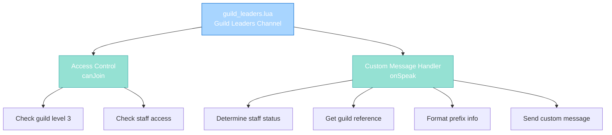

import { Aside, Card } from '@astrojs/starlight/components';

## 🛠️ Informações do Arquivo

Este é o arquivo que implementa o **handler do canal privado Guild Leaders** do servidor **OpenTibiaBR/Canary**. Fornece funcionalidades para validação de acesso baseada em guild level e staff status, com message formatting customizada que mostra context de staff/guild.

<Card title="Caminho Original" icon="document">
  data/chatchannels/scripts/guild_leaders.lua
</Card>

<Aside type="tip">
  O canal Guild Leaders é restrito a players que são líderes de guild (level 3) ou staff com acesso. Implementa custom message formatting que mostra se o player é Staff e qual guild pertence, em vez de usar TALKTYPE normalization padrão.
</Aside>

## 📄 Visão Geral do Código

### Resumo Executivo

guild_leaders.lua é um módulo de **handler de canal privado com custom logic** que implementa:

1. **Dual Access Gate**: Guild level 3 OR staff access
2. **Custom Message Format**: [Staff][Guild Name] ou [Guild Name]
3. **Direct sendChannelMessage**: Bypassa sistema de TALKTYPE padrão
4. **Staff Context Display**: Mostra se poster é staff or regular guild leader
5. **Guild Name Embedding**: Inclui guild name na mensagem formatada

### Estrutura de Funcionalidades



---

## 1. Funções Globais

### 1.1 function canJoin(player)

Valida se player pode entrar no canal Guild Leaders.

#### Assinatura
```lua
function canJoin(player)
```

#### Parâmetro

| Parâmetro | Tipo | Descrição |
|---|---|---|
| **player** | player | Player tentando entrar |

#### Retorno

| Tipo | Valor |
|---|---|
| **boolean** | true se pode entrar |
| **boolean** | false caso contrário |

#### Lógica

```lua
return player:getGuildLevel() == 3 or player:getGroup():getAccess()
```

| Condição | Resultado | Descrição |
|----------|-----------|-----------|
| **Guild level 3** | true | Guild leader (guild master/vice) |
| **Group has access** | true | Staff has access override |
| **Outro** | false | Player rejeitado |

**Propósito**: Permite guild leaders e staff conversar in guild leader channel.

---

### 1.2 function onSpeak(player, type, message)

Handler customizado para mensagens no canal Guild Leaders.

#### Assinatura
```lua
function onSpeak(player, type, message)
```

#### Parâmetros

| Parâmetro | Tipo | Descrição |
|---|---|---|
| **player** | player | Player postando mensagem |
| **type** | number | TALKTYPE (ignorado) |
| **message** | string | Conteúdo da mensagem |

#### Retorno

| Tipo | Valor |
|---|---|
| **boolean** | false (always - handled internally) |

---

## 2. Lógica Customizada

### 2.1 Local Variables

#### 2.1.1 staff Variable

```lua
local staff = player:getGroup():getAccess()
```

| Propriedade | Descrição |
|---|---|
| **Tipo** | boolean |
| **Valor** | true if player tem staff access |
| **Uso** | Determina prefix info |

---

#### 2.1.2 guild Variable

```lua
local guild = player:getGuild()
```

| Propriedade | Descrição |
|---|---|
| **Tipo** | guild object or nil |
| **Valor** | Player guild or nil |
| **Uso** | Get guild name e context |

---

#### 2.1.3 info Variable

```lua
local info = "Staff"
```

| Propriedade | Descrição |
|---|---|
| **Tipo** | string |
| **Valor Inicial** | "Staff" |
| **Mutável** | Sim |
| **Uso** | Prefix string para message formatting |

---

### 2.2 Fase 1: Type Normalization

```lua
type = TALKTYPE_CHANNEL_Y
```

Força yellow como padrão.

---

### 2.3 Fase 2: Staff Status e Guild Logic

```lua
if staff then
    if guild then
        info = info .. "][" .. guild:getName()
    end
    type = TALKTYPE_CHANNEL_O
else
    info = guild:getName()
end
```

| Condição | info Resultado | type Resultado |
|----------|---|---|
| **Staff AND Guild** | "Staff][GuildName" | CHANNEL_O (orange) |
| **Staff NO Guild** | "Staff" | CHANNEL_O (orange) |
| **NO Staff WITH Guild** | "GuildName" | CHANNEL_Y (yellow) |

---

### 2.4 Fase 3: Send Custom Message

```lua
sendChannelMessage(11, type, player:getName() .. " [" .. info .. "]: " .. message)
return false
```

| Parâmetro | Valor | Descrição |
|-----------|-------|-----------|
| **Channel ID** | 11 | Guild Leaders channel |
| **Type** | type (yellow/orange) | Color formatting |
| **Message** | PlayerName [info]: message | Custom format |

#### Exemplo Message Output

```
Staff Player [Staff][Dragon Guild]: Let's discuss guild wars
Guild Leader [Dragon Guild]: Agree, next week?
```

---

## 3. Message Format Examples

### 3.1 Staff from Guild

**Info String**: `Staff][Dragon Guild`  
**Formatted Output**: `StaffName [Staff][Dragon Guild]: message`  
**Type**: Orange (TALKTYPE_CHANNEL_O)

---

### 3.2 Staff without Guild

**Info String**: `Staff`  
**Formatted Output**: `StaffName [Staff]: message`  
**Type**: Orange (TALKTYPE_CHANNEL_O)

---

### 3.3 Guild Leader (non-Staff)

**Info String**: `Dragon Guild`  
**Formatted Output**: `LeaderName [Dragon Guild]: message`  
**Type**: Yellow (TALKTYPE_CHANNEL_Y)

---

## 4. Fluxo Completo

### 4.1 Entrada ao Canal

```
Player clica "Guild Leaders"
    |
    +-- canJoin(player) executado
            |
            +-- Check: player:getGuildLevel() == 3?
            |       + SIM: ALLOW
            |       + NÃO: Check staff access
            |
            +-- Check: player:getGroup():getAccess()?
                    + SIM: ALLOW
                    + NÃO: DENY
    |
    +-- Se ALLOW: Player entra canal
    +-- Se DENY: Mensagem "You are not allowed to enter this channel"
```

---

### 4.2 Posting de Mensagem

```
Guild Leader digita mensagem e ENTER
    |
    +-- onSpeak(player, type, message) executado
            |
            +-- Initialize: info = "Staff", type = CHANNEL_Y
            |
            +-- Check staff status
            |    |
            |    +-- Se staff:
            |    |     + Se tem guild: info = "Staff][" + guild name
            |    |     + Type = orange
            |    |
            |    +-- Se não staff:
            |         + info = guild name
            |         + Type = yellow
            |
            +-- Format message: PlayerName [info]: message
            |
            +-- sendChannelMessage(11, type, formatted)
            |
            +-- Return false (handled internally)
    |
    +-- Mensagem aparece no channel com prefix customizado
```

---

## 5. Padrões Observados

### 5.1 Dual Access Gate

```lua
return condition1 or condition2
```

Permite guild leaders OU staff.

---

### 5.2 Guild Context Embedding

```lua
guild:getName()
```

Inclui contexto de guild na display.

---

### 5.3 Conditional Info Concatenation

```lua
if staff then
    info = info .. "][" .. guild:getName()
else
    info = guild:getName()
end
```

Builds prefix string dinamicamente.

---

### 5.4 Custom sendChannelMessage call

```lua
sendChannelMessage(11, type, customMessage)
return false
```

Bypassa sistema de TALKTYPE padrão e manipula message diretamente.

---

## 6. Diferenças vs Outros Canais

| Aspecto | guild_leaders.lua | Outros canais |
|---------|-------------------|---------------|
| **Access Control** | Guild level + staff | Level/vocação checks |
| **Message Handling** | Custom format | TALKTYPE returns |
| **Info Display** | [Staff][Guild] | None |
| **sendChannelMessage** | Sim, direct call | Não, usa return type |
| **Return Value** | false (always) | type (modified) |
| **Type Usage** | For color only | For normalization |

---

## 7. Checkpoint de Aprendizagem

### Conceitos-Chave

| Conceito | Explicação |
|----------|-----------|
| **Dual Gate** | Multiple conditions allow entry |
| **Context Display** | Mostra staff/guild status na message |
| **Custom Formatting** | Bypassa standard TALKTYPE system |
| **Guild Context** | Embeds guild name no prefix |
| **Direct sendChannelMessage** | Alternative ao return type |

### Responsabilidades

1. **Validar guild level 3 OR staff access**
2. **Determinar se poster é staff**
3. **Get guild context e name**
4. **Format message com prefix info**
5. **Send direct ao channel com custom format**

---

## 🤖 Informações da Documentação

<Card title="Documentação do Módulo guild_leaders.lua" icon="document">
  **Tipo**: Private Guild Channel Handler  
  **Funções Globais**: 2 (canJoin, onSpeak)  
  **Variáveis Locais**: 3 (staff, guild, info)  
  **Validações**: Guild level, Staff access  
  **Custom Logic**: Message formatting com context  
  **Access**: Guild level 3 ou staff access  
  **Message Format**: PlayerName [Staff/GuildName]: message  
  **Checkpoint**: 5 conceitos and 5 responsabilidades
</Card>

<Aside type="note">
  **Última Atualização**: Session 18  
  **Status**: Completo - Padrão Custom Modules  
  **Linhas de Código**: ~20 total  
  **Channel ID**: 11 (Guild Leaders)  
  **Diferença Principal**: Custom message formatting instead de TALKTYPE returns  
  **Caso de Uso**: Private channel para guild leaders coordenação com staff visibility
</Aside>
