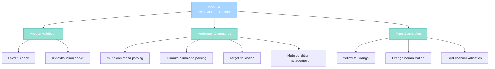

import { Aside, Card } from '@astrojs/starlight/components';

## 🛠️ Informações do Arquivo

Este é o arquivo que implementa o **handler do canal Help** do servidor **OpenTibiaBR/Canary**. Fornece funcionalidades para moderação via !mute/!unmute commands, tracking de exhaustion em KV store, validação de level, e type normalization com suporte a custom flags.

<Card title="Caminho Original" icon="document">
  data/chatchannels/scripts/help.lua
</Card>

<Aside type="tip">
  O canal Help é moderado por Tutors+ com sistema de mute de 1 hora. Implementa !mute e !unmute commands, tracking de exhaustion via KV store,  level 1 blocking, e type normalization com suporte a PlayerFlag_TalkOrangeHelpChannel.
</Aside>

## 📄 Visão Geral do Código

### Resumo Executivo

help.lua é um módulo de **handler de canal moderado** que implementa:

1. **Level and Exhaustion Checks**: Level 1 bloqueado (normal users), KV store tracking
2. **Moderator Commands**: !mute e !unmute para Tutors+
3. **Mute System**: 1 hora (3600000 ms) via condition, 3 minutos de exhaustion extra
4. **Type Conversion**: Tutors podem usar orange, respeitam custom flags
5. **Red Channel Validation**: GMs apenas, com flag fallback
6. **KV Store Usage**: Tracking de exhaustion e mute state

### Estrutura de Funcionalidades



---

## 1. Variáveis Globais

### 1.1 CHANNEL_HELP

```lua
local CHANNEL_HELP = 7
```

| Propriedade | Valor |
|---|---|
| **Tipo** | number |
| **Valor** | 7 |
| **Propósito** | Channel ID para condition e broadcast |

---

### 1.2 muted Condition Template

```lua
local muted = Condition(CONDITION_CHANNELMUTEDTICKS, CONDITIONID_DEFAULT)
muted:setParameter(CONDITION_PARAM_SUBID, CHANNEL_HELP)
muted:setParameter(CONDITION_PARAM_TICKS, 3600000)
```

| Propriedade | Valor | Descrição |
|---|---|---|
| **Type** | CHANNELMUTEDTICKS | Mute condition |
| **Subid** | 7 | Channel-specific |
| **Duration** | 3600000 | 3600 segundos (1 hora) |

---

## 2. Funções Globais

### 2.1 function onSpeak(player, type, message)

Handler principal para mensagens no canal Help.

#### Assinatura
```lua
function onSpeak(player, type, message)
```

#### Parâmetros

| Parâmetro | Tipo | Descrição |
|---|---|---|
| **player** | player | Player postando mensagem |
| **type** | number | TALKTYPE (original) |
| **message** | string | Conteúdo da mensagem |

#### Retorno

| Tipo | Valor |
|---|---|
| **boolean** | false se bloqueado ou comando tutor |
| **number** | TALKTYPE modificado if permitido |

---

## 3. Lógica de Validação

### 3.1 Local Variables

#### 3.1.1 playerGroupType

```lua
local playerGroupType = player:getGroup():getId()
```

| Propriedade | Descrição |
|---|---|
| **Tipo** | number |
| **Uso** | Cache para múltiplas verificações |

---

#### 3.1.2 hasExhaustion

```lua
local hasExhaustion = player:kv():get("channel-help-exhaustion") or 0
```

| Propriedade | Descrição |
|---|---|
| **Tipo** | number or 0 |
| **Fonte** | KV store |
| **Formato** | Unix timestamp (segundos) |

---

### 3.2 Fase 1: Level Check (Non-Tutors)

```lua
if player:getLevel() == 1 and playerGroupType == GROUP_TYPE_NORMAL then
    player:sendCancelMessage("You may not speak into channels as long as you are on level 1.")
    return false
end
```

| Condição | Resultado |
|----------|-----------|
| **Level 1 AND Normal user** | REJECT |
| **Level 1 AND Tutor+** | ALLOW |
| **Level 2+** | ALLOW |

**Propósito**: Bloqueia level 1 rookies, permite tutors falar em qualquer level.

---

### 3.3 Fase 2: Exhaustion Check (KV Store)

```lua
if hasExhaustion > os.time() then
    player:sendCancelMessage("You are muted from the Help channel for using it inappropriately.")
    return false
end
```

| Condição | Resultado |
|----------|-----------|
| **Exhaustion timestamp > current time** | MUTED |
| **Otherwise** | ALLOW |

**Propósito**: Verifica se player está sob cooldown (mute).

---

### 3.4 Fase 3: Moderator Commands (Tutor+)

```lua
if playerGroupType >= GROUP_TYPE_TUTOR then
    if string.sub(message, 1, 6) == "!mute " then
        -- !mute handling
    elseif string.sub(message, 1, 8) == "!unmute " then
        -- !unmute handling
    end
end
```

**Acesso**: GROUP_TYPE_TUTOR ou superior.

---

#### 3.4.1 !mute Command

```lua
if string.sub(message, 1, 6) == "!mute " then
    local targetName = string.sub(message, 7)
    local target = Player(targetName)
    if target then
        if playerGroupType > target:getAccountType() then
            if not target:getCondition(...) then
                target:addCondition(muted)
                target:kv():set("channel-help-exhaustion", os.time() + 180)
                sendChannelMessage(...)
            else
                player:sendCancelMessage("That player is already muted.")
            end
        else
            player:sendCancelMessage("You are not authorized to mute that player.")
        end
    else
        player:sendCancelMessage(RETURNVALUE_PLAYERWITHTHISNAMEISNOTONLINE)
    end
    return false
end
```

| Etapa | Verificação | Ação se Falha |
|------|-----------|-----------|
| 1 | Player exists | Send "player is not online" |
| 2 | Moderator higher rank | Send "not authorized" |
| 3 | Already muted | Send "already muted" |
| 4 | Success | Apply condition + KV (180s extra) |

**KV Exhaustion**: `os.time() + 180` (3 minutos extra além da 1 hora condition).

---

#### 3.4.2 !unmute Command

```lua
elseif string.sub(message, 1, 8) == "!unmute " then
    local targetName = string.sub(message, 9)
    local target = Player(targetName)
    if target then
        if playerGroupType > target:getAccountType() then
            local hasExhaustionTarget = target:kv():get("channel-help-exhaustion") or 0
            if hasExhaustionTarget > os.time() then
                target:removeCondition(...)
                sendChannelMessage(...)
                target:kv():remove("channel-help-exhaustion")
            else
                player:sendCancelMessage("That player is not muted.")
            end
        else
            player:sendCancelMessage("You are not authorized to unmute that player.")
        end
    else
        player:sendCancelMessage(RETURNVALUE_PLAYERWITHTHISNAMEISNOTONLINE)
    end
    return false
end
```

| Etapa | Verificação |
|------|-----------|
| 1 | Target exists |
| 2 | Moderator rank sufficient |
| 3 | Target actually muted (KV exhaustion active) |
| 4 | Remove condition + KV |

---

### 3.5 Fase 4: Type Conversion

```lua
if type == TALKTYPE_CHANNEL_Y then
    if playerGroupType >= GROUP_TYPE_TUTOR or player:hasFlag(PlayerFlag_TalkOrangeHelpChannel) then
        type = TALKTYPE_CHANNEL_O
    end
elseif type == TALKTYPE_CHANNEL_O then
    if playerGroupType < GROUP_TYPE_TUTOR and not player:hasFlag(PlayerFlag_TalkOrangeHelpChannel) then
        type = TALKTYPE_CHANNEL_Y
    end
elseif type == TALKTYPE_CHANNEL_R1 then
    if playerGroupType < GROUP_TYPE_GAMEMASTER and not player:hasFlag(PlayerFlag_CanTalkRedChannel) then
        if playerGroupType >= GROUP_TYPE_TUTOR or player:hasFlag(PlayerFlag_TalkOrangeHelpChannel) then
            type = TALKTYPE_CHANNEL_O
        else
            type = TALKTYPE_CHANNEL_Y
        end
    end
end
```

#### Sub-Fase A: Yellow to Orange

| Condição | Resultado |
|----------|-----------|
| **Tutor+ OR has flag** | Orange |
| **Otherwise** | Yellow |

#### Sub-Fase B: Orange Normalization

| Condição | Resultado |
|----------|-----------|
| **Tutor+ OR has flag** | Orange |
| **Otherwise** | Yellow |

#### Sub-Fase C: Red Channel

| Condição | Resultado |
|----------|-----------|
| **GM+ or has red flag** | Red |
| **Tutor+ or orange flag** | Orange |
| **Otherwise** | Yellow |

---

## 4. Fluxo Completo

```
Player digita mensagem
    |
    +-- onSpeak(player, type, message)
            |
            +-- Cache: playerGroupType, hasExhaustion
            |
            +-- Level 1 check: Se level 1 e normal, REJECT
            |
            +-- Exhaustion check: Se sob cooldown, REJECT
            |
            +-- Moderator command check (Tutor+):
            |    |
            |    +-- Se comeca com "!mute ":
            |    |     Parse target name
            |    |     Validate rank
            |    |     Apply 1h condition + 180s KV exhaustion
            |    |     Broadcast mute message
            |    |     Return false
            |    |
            |    +-- Se comeca com "!unmute ":
            |         Parse target name
            |         Check KV exhaustion
            |         Remove condition + KV
            |         Broadcast unmute message
            |         Return false
            |
            +-- Type Conversion:
            |    Normalize based on group + flags
            |
            +-- Return: type (or false if command)
    |
    +-- Se type: Broadcast message
    +-- Se false: Command or rejected
```

---

## 5. KV Store Usage

### 5.1 Key: "channel-help-exhaustion"

| Operação | Código |
|----------|--------|
| **Get** | `player:kv():get("channel-help-exhaustion") or 0` |
| **Set** | `player:kv():set("channel-help-exhaustion", os.time() + 180)` |
| **Remove** | `player:kv():remove("channel-help-exhaustion")` |

**Valor**: Unix timestamp (segundos) quando exhaustion expira.

**Propósito**: Persistência de mute entre reboots.

---

## 6. Padrões Observados

### 6.1 Dual Validation: Level + Exhaustion

```lua
-- Level check for non-tutors
if player:getLevel() == 1 and playerGroupType == GROUP_TYPE_NORMAL then
    return false
end

-- Exhaustion check for all
if hasExhaustion > os.time() then
    return false
end
```

Duas gates independentes.

---

### 6.2 Command Parsing via String Sub

```lua
if string.sub(message, 1, 6) == "!mute " then
    local targetName = string.sub(message, 7)
```

Simple prefix matching + extraction.

---

### 6.3 Rank Comparison

```lua
if playerGroupType > target:getAccountType() then
    -- Allow action
end
```

Ensures hierarchy enforcement.

---

### 6.4 Flag Fallback Pattern

```lua
if playerGroupType >= GROUP_TYPE_TUTOR or player:hasFlag(PlayerFlag_TalkOrangeHelpChannel) then
    type = TALKTYPE_CHANNEL_O
end
```

Group OR flag allows privilege.

---

## 7. Checkpoint de Aprendizagem

### Conceitos-Chave

| Conceito | Explicação |
|----------|-----------|
| **KV Store** | Persistent player-level key-value storage |
| **Exhaustion Tracking** | Timestamp-based cooldown checking |
| **Moderator Commands** | !mute/!unmute string parsing |
| **Dual Condition** | Both condition + KV for redundancy |
| **Flag Fallback** | Group OR flag allows privilege |
| **Rank Hierarchy** | playerGroupType > targetType enforcement |

### Responsabilidades

1. **Bloquear level 1 non-tutors**
2. **Verificar exhaustion via KV store**
3. **Processar !mute !unmute commands**
4. **Validar rank hierarchy**
5. **Normalizar TALKTYPE com flags**

---

## 🤖 Informações da Documentação

<Card title="Documentação do Módulo help.lua" icon="document">
  **Tipo**: Moderated Chat Channel Handler  
  **Funções Globais**: 1 (onSpeak)  
  **Variáveis Locais**: 3 (playerGroupType, hasExhaustion, 2x command targets)  
  **Moderator Commands**: 2 (!mute, !unmute)  
  **Mute Duration**: 1 hora (3600000 ms) + 3 min KV exhaustion  
  **Access**: All levels (except level 1 normal), Tutors+ can moderate  
  **Flags**: PlayerFlag_TalkOrangeHelpChannel, PlayerFlag_CanTalkRedChannel  
  **Checkpoint**: 6 conceitos and 5 responsabilidades
</Card>

<Aside type="note">
  **Última Atualização**: Session 18  
  **Status**: Completo - Padrão Custom Modules  
  **Linhas de Código**: ~82 total  
  **Channel ID**: 7 (Help)  
  **Dinâmica**: Tutor-moderated help channel com KV store persistence  
  **Caso de Uso**: Players podem pedir ajuda, tutors moderam inappropriate use
</Aside>
