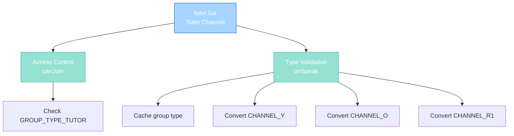

import { Aside, Card } from '@astrojs/starlight/components';

## 🛠️ Informações do Arquivo

Este é o arquivo que implementa o **handler do canal privado Tutor** do servidor **OpenTibiaBR/Canary**. Fornece funcionalidades para validação de acesso baseada em group type (tutors+) e type normalization com elevation de Senior Tutors.

<Card title="Caminho Original" icon="document">
  data/chatchannels/scripts/tutor.lua
</Card>

<Aside type="tip">
  O canal Tutor é restrito a players com group type TUTOR ou superior. Implementa type normalization com elevation de Senior Tutors para orange channel e validação de red channel flags.
</Aside>

## 📄 Visão Geral do Código

### Resumo Executivo

tutor.lua é um módulo de **handler de canal privado de suporte** que implementa:

1. **Tutor-Only Access**: Apenas GROUP_TYPE_TUTOR+ podem usar
2. **Type Elevation**: Senior Tutors podem usar orange
3. **Hierarchy-Based Conversion**: Tutors get yellow, Senior Tutors get orange
4. **Red Channel Protection**: Apenas GMs podem usar red channel
5. **Flag Validation**: Respeita PlayerFlag_CanTalkRedChannel

### Estrutura de Funcionalidades



---

## 1. Funções Globais

### 1.1 function canJoin(player)

Valida se player pode entrar no canal Tutor.

#### Assinatura
```lua
function canJoin(player)
```

#### Parâmetro

| Parâmetro | Tipo | Descrição |
|---|---|---|
| **player** | player | Player tentando entrar |

#### Retorno

| Tipo | Valor |
|---|---|
| **boolean** | true se pode entrar |
| **boolean** | false caso contrário |

#### Lógica

```lua
return player:getGroup():getId() >= GROUP_TYPE_TUTOR
```

| Condição | Resultado | Descrição |
|----------|-----------|-----------|
| **Group >= TUTOR** | true | Tutor or higher staff |
| **Group < TUTOR** | false | Player rejeitado |

**Propósito**: Restringe canal apenas a staff de suporte (tutors+).

---

### 1.2 function onSpeak(player, type, message)

Handler para mensagens postadas no canal Tutor.

#### Assinatura
```lua
function onSpeak(player, type, message)
```

#### Parâmetros

| Parâmetro | Tipo | Descrição |
|---|---|---|
| **player** | player | Player postando mensagem |
| **type** | number | TALKTYPE (original) |
| **message** | string | Conteúdo da mensagem |

#### Retorno

| Tipo | Valor |
|---|---|
| **number** | TALKTYPE modificado if permitido |

---

## 2. Lógica de Validação

### 2.1 Local Variable: playerGroupType

```lua
local playerGroupType = player:getGroup():getId()
```

| Propriedade | Descrição |
|---|---|
| **Tipo** | number |
| **Uso** | Cache para evitar múltiplas chamadas de função |

---

### 2.2 Fase 1: TALKTYPE_CHANNEL_Y (Yellow)

```lua
if type == TALKTYPE_CHANNEL_Y then
    if playerGroupType >= GROUP_TYPE_SENIORTUTOR then
        type = TALKTYPE_CHANNEL_O
    end
end
```

| Condição | Resultado | Descrição |
|----------|-----------|-----------|
| **Yellow e Senior Tutor+** | Orange | Eleva senior tutors |
| **Yellow e Tutor** | Yellow | Mantém yellow |

---

### 2.3 Fase 2: TALKTYPE_CHANNEL_O (Orange)

```lua
elseif type == TALKTYPE_CHANNEL_O then
    if playerGroupType < GROUP_TYPE_SENIORTUTOR then
        type = TALKTYPE_CHANNEL_Y
    end
end
```

| Condição | Resultado | Descrição |
|----------|-----------|-----------|
| **Orange e Senior Tutor+** | Orange | Mantém orange |
| **Orange e Tutor** | Yellow | Força yellow |

**Propósito**: Apenas senior tutors podem usar orange.

---

### 2.4 Fase 3: TALKTYPE_CHANNEL_R1 (Red)

```lua
elseif type == TALKTYPE_CHANNEL_R1 then
    if playerGroupType < GROUP_TYPE_GAMEMASTER and not player:hasFlag(PlayerFlag_CanTalkRedChannel) then
        type = TALKTYPE_CHANNEL_Y
    end
end
```

| Condição | Resultado |
|----------|-----------|
| **Red e GM+** | Red |
| **Red e non-GM com flag** | Red |
| **Red e non-GM sem flag** | Yellow |

---

### 2.5 Return Type

```lua
return type
```

Retorna o tipo após conversão.

---

## 3. Group Hierarchy

```
GROUP_TYPE_NORMAL (0) - cannot enter
    ↓
GROUP_TYPE_TUTOR (1) - can enter, yellow only
    ↓
GROUP_TYPE_SENIORTUTOR (2) - can use orange
    ↓
GROUP_TYPE_GAMEMASTER (3) - can use red
    ↓
GROUP_TYPE_GAMEMASTER+ (4+)
```

| Group | Access | Yellow | Orange | Red |
|-------|--------|--------|--------|-----|
| Normal | ❌ | - | - | - |
| Tutor | ✅ | ✅ | ❌ | ❌ |
| Sr Tutor | ✅ | ✅ | ✅ | ❌ |
| Gamemaster | ✅ | ✅ | ✅ | ✅ |

---

## 4. Fluxo Completo

### 4.1 Entrada ao Canal

```
Tutor clica "Tutor"
    |
    +-- canJoin(player) executado
            |
            +-- Check: player:getGroup():getId() >= GROUP_TYPE_TUTOR?
            |       + SIM: ALLOW
            |       + NÃO: DENY
    |
    +-- Se ALLOW: Entra canal privado
    +-- Se DENY: "You are not allowed to enter this channel"
```

---

### 4.2 Posting de Mensagem

```
Tutor digita mensagem e ENTER
    |
    +-- onSpeak(player, type, message)
            |
            +-- Cache: playerGroupType = player:getGroup():getId()
            |
            +-- Type Conversion Chain:
            |    |
            |    +-- Se CHANNEL_Y:
            |    |     + Sr Tutor+: upgrade para orange
            |    |     + Tutor: mantém yellow
            |    |
            |    +-- Se CHANNEL_O:
            |    |     + Sr Tutor+: mantém orange
            |    |     + Tutor: força yellow
            |    |
            |    +-- Se CHANNEL_R1:
            |         + GM+ ou com flag: mantém red
            |         + Non-GM sem flag: força yellow
            |
            +-- Return: type final
    |
    +-- Mensagem broadcast ao canal
```

---

## 5. Padrões Observados

### 5.1 Group Hierarchy Check

```lua
if playerGroupType >= GROUP_TYPE_SENIORTUTOR then
    -- Senior tutor and above
end
```

Range comparison para hierarchy.

---

### 5.2 Inverted Check for Lower Group

```lua
if playerGroupType < GROUP_TYPE_SENIORTUTOR then
    type = TALKTYPE_CHANNEL_Y
end
```

Forces conversion para lower groups.

---

### 5.3 Flag Fallback for Red

```lua
if playerGroupType < GROUP_TYPE_GAMEMASTER and not player:hasFlag(...) then
    type = TALKTYPE_CHANNEL_Y
end
```

Exception allowing flags override.

---

## 6. Comparação com Outros Canais

| Aspecto | tutor.lua | help.lua | gamemaster.lua |
|---------|-----------|----------|----------------|
| **Min Access** | TUTOR | N/A | GAMEMASTER |
| **Orange Requirement** | SENIORTUTOR | TUTOR+flag | GOD only |
| **Red Access** | GM+ | GM+ | GOD |
| **Commands** | Nenhum | !mute/!unmute | Nenhum |
| **Primary Use** | Staff support | Help moderating | Admin coordination |

---

## 7. Checkpoint de Aprendizagem

### Conceitos-Chave

| Conceito | Explicação |
|----------|-----------|
| **Group Hierarchy** | >= check para access levels |
| **Tutor-Only Channel** | Private staff communication |
| **Sr Tutor Elevation** | Only senior tutors use orange |
| **Red Game Masters Only** | GM+ exclusively |
| **Flag Fallback** | Additional red access via flag |

### Responsabilidades

1. **Validar GROUP_TYPE_TUTOR+ na entrada**
2. **Elevar Senior Tutors para orange**
3. **Forçar regular tutors para yellow**
4. **Limitar red channel para GMs**
5. **Respeitar red channel flags**

---

## 🤖 Informações da Documentação

<Card title="Documentação do Módulo tutor.lua" icon="document">
  **Tipo**: Private Staff Channel Handler  
  **Funções Globais**: 2 (canJoin, onSpeak)  
  **Variáveis Locais**: 1 (playerGroupType)  
  **Validações**: Group hierarchy, TALKTYPE  
  **Access**: GROUP_TYPE_TUTOR+  
  **Cooldown**: Nenhum  
  **Restrições**: Sr Tutor+ para orange, GM+ para red  
  **Checkpoint**: 5 conceitos and 5 responsabilidades
</Card>

<Aside type="note">
  **Última Atualização**: Session 18  
  **Status**: Completo - Padrão Custom Modules  
  **Linhas de Código**: ~24 total  
  **Channel ID**: 2 (Tutor)  
  **Diferença Principal**: Sr Tutor elevation instead de God-only orange  
  **Caso de Uso**: Staff conversation channel para tutors coordenar suporte
</Aside>
