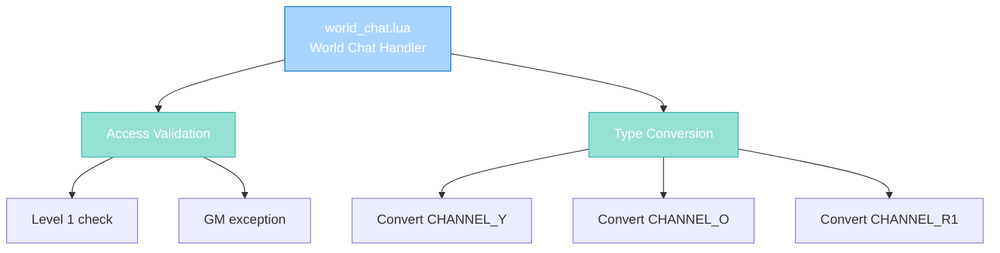

import { Aside, Card } from '@astrojs/starlight/components';

## 🛠️ Informações do Arquivo

Este é o arquivo que implementa o **handler do canal World Chat** do servidor **OpenTibiaBR/Canary**. Fornece funcionalidades para validação de level 1, type normalization com elevation de GMs, e flag validation para red channel.

<Card title="Caminho Original" icon="document">
  data/chatchannels/scripts/world_chat.lua
</Card>

<Aside type="tip">
  O canal World Chat é público para all players exceto level 1 (sem canJoin gate). Implementa level 1 blocking (com exceção para GMs), type normalization com GM elevation para orange, e validação de red channel flags.
</Aside>

## 📄 Visão Geral do Código

### Resumo Executivo

world_chat.lua é um módulo de **handler de canal público** que implementa:

1. **Level 1 Blocking**: Level 1 prohibited (except GMs)
2. **Public Access**: No canJoin function, open to all players
3. **GM Elevation**: Gamemasters podem usar orange
4. **Type Conversion**: Normaliza TALKTYPE por group
5. **Red Channel Validation**: GMs only, com flag fallback

### Estrutura de Funcionalidades



---

## 1. Funções Globais

### 1.1 function onSpeak(player, type, message)

Handler para mensagens postadas no canal World Chat.

#### Assinatura
```lua
function onSpeak(player, type, message)
```

#### Parâmetros

| Parâmetro | Tipo | Descrição |
|---|---|---|
| **player** | player | Player postando mensagem |
| **type** | number | TALKTYPE (original) |
| **message** | string | Conteúdo da mensagem |

#### Retorno

| Tipo | Valor |
|---|---|
| **boolean** | false se bloqueado |
| **number** | TALKTYPE modificado if permitido |

---

## 2. Lógica de Validação

### 2.1 Local Variable: playerGroupType

```lua
local playerGroupType = player:getGroup():getId()
```

| Propriedade | Descrição |
|---|---|
| **Tipo** | number |
| **Uso** | Cache para múltiplas verificações |

---

### 2.2 Fase 1: Level 1 Check com GM Exception

```lua
if player:getLevel() == 1 and playerGroupType < GROUP_TYPE_GAMEMASTER then
    player:sendCancelMessage("You may not speak into channels as long as you are on level 1.")
    return false
end
```

| Condição | Resultado | Descrição |
|----------|-----------|-----------|
| **Level 1 AND non-GM** | REJECT | Bloqueia rookies |
| **Level 1 AND GM** | ALLOW | GMs podem em qualquer level |
| **Level 2+** | ALLOW | Todos podem |

**Propósito**: Bloqueia level 1 rookies, mas permite GMs usar em level 1.

---

### 2.3 Fase 2: TALKTYPE_CHANNEL_Y (Yellow)

```lua
if type == TALKTYPE_CHANNEL_Y then
    if playerGroupType >= GROUP_TYPE_GAMEMASTER then
        type = TALKTYPE_CHANNEL_O
    end
end
```

| Condição | Resultado | Descrição |
|----------|-----------|-----------|
| **Yellow e GM+** | Orange | Eleva staff |
| **Yellow e non-GM** | Yellow | Mantém yellow |

---

### 2.4 Fase 3: TALKTYPE_CHANNEL_O (Orange)

```lua
elseif type == TALKTYPE_CHANNEL_O then
    if playerGroupType < GROUP_TYPE_GAMEMASTER then
        type = TALKTYPE_CHANNEL_Y
    end
end
```

| Condição | Resultado | Descrição |
|----------|-----------|-----------|
| **Orange e GM+** | Orange | Mantém orange |
| **Orange e non-GM** | Yellow | Força yellow |

**Propósito**: Apenas GMs podem usar orange.

---

### 2.5 Fase 4: TALKTYPE_CHANNEL_R1 (Red)

```lua
elseif type == TALKTYPE_CHANNEL_R1 then
    if playerGroupType < GROUP_TYPE_GAMEMASTER and not player:hasFlag(PlayerFlag_CanTalkRedChannel) then
        type = TALKTYPE_CHANNEL_Y
    end
end
```

| Condição | Resultado |
|----------|-----------|
| **Red e GM+** | Red |
| **Red e non-GM com flag** | Red |
| **Red e non-GM sem flag** | Yellow |

---

### 2.6 Return Type

```lua
return type
```

Retorna tipo após conversão.

---

## 3. Fluxo Completo

```
Player digita mensagem no World Chat
    |
    +-- onSpeak(player, type, message) executado
            |
            +-- Cache: playerGroupType = player:getGroup():getId()
            |
            +-- Level 1 check: Se level 1 e non-GM, REJECT
            |
            +-- Type Conversion Chain:
            |    |
            |    +-- Se CHANNEL_Y:
            |    |     + GM+: upgrade para orange
            |    |     + Non-GM: mantém yellow
            |    |
            |    +-- Se CHANNEL_O:
            |    |     + GM+: mantém orange
            |    |     + Non-GM: força yellow
            |    |
            |    +-- Se CHANNEL_R1:
            |         + GM+ ou com flag: mantém red
            |         + Non-GM sem flag: força yellow
            |
            +-- Return: type final
    |
    +-- Se type: Broadcast message to world
    +-- Se false: Rejected, no message
```

---

## 4. Access Control Comparison

### 4.1 Sem canJoin Function

Diferente de tutor.lua, english_chat.lua, que têm canJoin explicit.

world_chat.lua tem **open access** na entrada, mas **level 1 gate** na fala.

---

### 4.2 Two-Stage Gate

**Stage 1**: Entrada - Open (no canJoin)  
**Stage 2**: Fala - Level 1 bloqueado (except GMs)

---

## 5. Padrões Observados

### 5.1 GM Exception in Level Check

```lua
if player:getLevel() == 1 and playerGroupType < GROUP_TYPE_GAMEMASTER then
    return false
end
```

GM bypass condition inline.

---

### 5.2 Simple Group-Based Elevation

```lua
if playerGroupType >= GROUP_TYPE_GAMEMASTER then
    type = TALKTYPE_CHANNEL_O
end
```

Clean >= check.

---

### 5.3 Flag Fallback for Red

```lua
if playerGroupType < GROUP_TYPE_GAMEMASTER and not player:hasFlag(...) then
    type = TALKTYPE_CHANNEL_Y
end
```

Exception handling via flags.

---

## 6. Comparação com Canais Similares

| Aspecto | world_chat.lua | english_chat.lua | help.lua |
|---------|----------------|------------------|----------|
| **Channel ID** | 3 | 4 | 7 |
| **Access Type** | Public (open) | Semi-restricted | Moderated |
| **canJoin** | Não tem | Não tem | Não tem |
| **Level Check** | 1 (except GM) | 20 premium | 1 normal users |
| **Orange Requirement** | GM+ | SR.TUTOR+ | TUTOR+ |
| **Commands** | Nenhum | Nenhum | !mute/!unmute |
| **Moderator Exclusive** | Não | Não | Sim (!mute) |

---

## 7. Checkpoint de Aprendizagem

### Conceitos-Chave

| Conceito | Explicação |
|----------|-----------|
| **Public Channel** | Open entrada, gated fala |
| **Level 1 Blocking** | Prevents rookies except GM |
| **GM Elevation** | Only GMs use orange |
| **Red Channel Exclusive** | GM+ or flag |
| **Two-Stage Access** | Free join, validated speak |

### Responsabilidades

1. **Bloquear level 1 non-GMs na fala**
2. **Permitir GM exception**
3. **Elevar GMs para orange**
4. **Forçar non-GM para yellow**
5. **Validar red channel flags**

---

## 🤖 Informações da Documentação

<Card title="Documentação do Módulo world_chat.lua" icon="document">
  **Tipo**: Public Chat Channel Handler  
  **Funções Globais**: 1 (onSpeak)  
  **Variáveis Locais**: 1 (playerGroupType)  
  **Validações**: Level, Group, TALKTYPE  
  **Access**: Open entry, level 1 speak gate  
  **Cooldown**: Nenhum  
  **Restrições**: Level 1 blocked (except GM), Type normalized  
  **Checkpoint**: 5 conceitos and 5 responsabilidades
</Card>

<Aside type="note">
  **Última Atualização**: Session 18  
  **Status**: Completo - Padrão Custom Modules  
  **Linhas de Código**: ~24 total  
  **Channel ID**: 3 (World Chat)  
  **Diferença Principal**: Public channel com level 1 gate na fala instead de entrance  
  **Caso de Uso**: Main public server chat para all players comunicar globalmente
</Aside>
