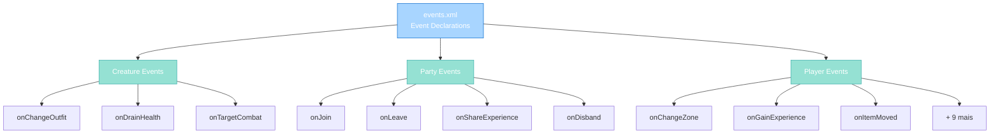

import { Aside, Card } from '@astrojs/starlight/components';

## 🛠️ Informações do Arquivo

Este é o arquivo que define os **callbacks de eventos XML** do servidor **OpenTibiaBR/Canary**. Contém declarações de métodos de eventos para Creature, Party e Player que são associados a handlers Lua.

<Card title="Caminho Original" icon="document">
  data/events/events.xml
</Card>

<Aside type="tip">
  Este arquivo está em deprecação e sendo gradualmente migrado para o sistema EventCallback em Lua. É recomendado evitar usar este arquivo quando possível e preferir implementações diretas em Lua.
</Aside>

## 📄 Visão Geral do Código

### Resumo Executivo

events.xml é um arquivo de **configuração de eventos XML** que implementa:

1. **Creature Events**: 3 métodos (onChangeOutfit, onDrainHealth, onTargetCombat)
2. **Party Events**: 4 métodos (onJoin, onLeave, onShareExperience, onDisband)
3. **Player Events**: 12+ métodos (onChangeZone, onGainExperience, onItemMoved, etc)
4. **Enable/Disable**: Cada evento tem flag enabled (0 ou 1)
5. **Callback Binding**: Associa XML declarations a handlers Lua

### Estrutura de Funcionalidades



---

## 1. Estrutura XML

### 1.1 Declaração Básica de Evento

```xml
<event class="ClassName" method="methodName" enabled="1" />
```

| Atributo | Tipo | Descrição |
|----------|------|-----------|
| **class** | string | Classe alvo (Creature, Party, Player) |
| **method** | string | Nome do método callback |
| **enabled** | boolean | 0 = desabilitado, 1 = habilitado |

---

## 2. Creature Events

### 2.1 onChangeOutfit

```xml
<event class="Creature" method="onChangeOutfit" enabled="1" />
```

**Trigger**: Quando uma criatura muda de outfit  
**Handler**: data/events/scripts/creature.lua

| Aspecto | Descrição |
|---------|-----------|
| **Tipo** | Callback |
| **Scope** | Creature |
| **Parâmetro** | outfit (table) |
| **Status** | Habilitado |

---

### 2.2 onDrainHealth

```xml
<event class="Creature" method="onDrainHealth" enabled="1" />
```

**Trigger**: Quando dano é aplicado a criatura  
**Handler**: data/events/scripts/creature.lua

| Aspecto | Descrição |
|---------|-----------|
| **Tipo** | Callback |
| **Scope** | Creature (vítima) |
| **Parâmetros** | attacker, typePrimary, damagePrimary, typeSecondary, damageSecondary, colorPrimary, colorSecondary |
| **Retorno** | Damage values (modificáveis) |
| **Status** | Habilitado |

---

### 2.3 onTargetCombat

```xml
<event class="Creature" method="onTargetCombat" enabled="1" />
```

**Trigger**: Antes de ataque ser executado  
**Handler**: data/events/scripts/creature.lua

| Aspecto | Descrição |
|---------|-----------|
| **Tipo** | Callback (pré-validação) |
| **Scope** | Creature (atacante) |
| **Parâmetro** | target (creature) |
| **Retorno** | true/false ou RETURNVALUE |
| **Status** | Habilitado |

---

## 3. Party Events

### 3.1 onJoin

```xml
<event class="Party" method="onJoin" enabled="1" />
```

**Trigger**: Quando player entra em party  
**Handler**: data/events/scripts/party.lua

| Aspecto | Descrição |
|---------|-----------|
| **Tipo** | Callback |
| **Scope** | Party |
| **Parâmetro** | player (novo membro) |
| **Ação** | Refresh hazard zones |
| **Status** | Habilitado |

---

### 3.2 onLeave

```xml
<event class="Party" method="onLeave" enabled="1" />
```

**Trigger**: Quando player sai da party  
**Handler**: data/events/scripts/party.lua

| Aspecto | Descrição |
|---------|-----------|
| **Tipo** | Callback |
| **Scope** | Party |
| **Parâmetro** | player (membro saindo) |
| **Ação** | Update hazard para deixador e refresh para party |
| **Status** | Habilitado |

---

### 3.3 onShareExperience

```xml
<event class="Party" method="onShareExperience" enabled="1" />
```

**Trigger**: Quando experiência é distribuída na party  
**Handler**: data/events/scripts/party.lua

| Aspecto | Descrição |
|---------|-----------|
| **Tipo** | Callback (cálculo) |
| **Scope** | Party |
| **Parâmetro** | exp (base experience) |
| **Retorno** | Modified experience value |
| **Multiplicador** | Math formula based on unique vocations |
| **Status** | Habilitado |

---

### 3.4 onDisband

```xml
<event class="Party" method="onDisband" enabled="1" />
```

**Trigger**: Quando party é dissolvida  
**Handler**: data/events/scripts/party.lua

| Aspecto | Descrição |
|---------|-----------|
| **Tipo** | Callback |
| **Scope** | Party |
| **Ação** | Update hazard para todos membros |
| **Status** | Habilitado |

---

## 4. Player Events

### 4.1 Zone e Hazard Events

```xml
<event class="Player" method="onChangeZone" enabled="1" />
<event class="Player" method="onChangeHazard" enabled="1" />
```

Disparados quando player entra/sai de zonas.

---

### 4.2 Experience Events

```xml
<event class="Player" method="onGainExperience" enabled="1" />
<event class="Player" method="onGainSkillTries" enabled="1" />
<event class="Player" method="onLoseExperience" enabled="0" />
```

| Evento | Status | Descrição |
|--------|--------|-----------|
| **onGainExperience** | ✅ Habilitado | Ganho de XP |
| **onGainSkillTries** | ✅ Habilitado | Ganho de skill tries |
| **onLoseExperience** | ❌ Desabilitado | Morte penalidades |

---

### 4.3 Inventory Events

```xml
<event class="Player" method="onItemMoved" enabled="1" />
<event class="Player" method="onInventoryUpdate" enabled="1" />
```

Disparados em operações de items.

---

### 4.4 Battle List

```xml
<event class="Player" method="onLookInBattleList" enabled="1" />
```

Disparado ao inspecionar creature na battle list.

---

### 4.5 Movement Events

```xml
<event class="Player" method="onMoveCreature" enabled="1" />
<event class="Player" method="onMoveItem" enabled="1" />
<event class="Player" method="onTurn" enabled="1" />
```

Disparados em movimento de creatures/items/rotação.

---

### 4.6 Trading e Reports

```xml
<event class="Player" method="onTradeRequest" enabled="1" />
<event class="Player" method="onReportBug" enabled="1" />
<event class="Player" method="onReportRuleViolation" enabled="1" />
```

Disparados em interações sociais.

---

### 4.7 Combat

```xml
<event class="Player" method="onCombat" enabled="1" />
```

Disparado durante combate ativo.

---

## 5. Enable/Disable Status

| Evento | Status | Motivo |
|--------|--------|--------|
| **onLoseExperience** | ❌ 0 | Desabilitado propositalmente |
| **Todos os outros** | ✅ 1 | Habilitados por padrão |

---

## 6. Mapping para Handlers

| Classe | Método | Handler File | Script Count |
|--------|--------|--------------|--------------|
| **Creature** | 3 métodos | creature.lua | data/events/scripts/ |
| **Party** | 4 métodos | party.lua | data/events/scripts/ |
| **Player** | 12 métodos | player.lua | data/events/scripts/ |

---

## 7. Checkpoint de Aprendizagem

### Conceitos-Chave

| Conceito | Explicação |
|----------|-----------|
| **Event Declaration** | XML define callbacks associados a Lua handlers |
| **Enable Flag** | 0/1 controla se callback executa |
| **Callback Binding** | XML class + method associados a função Lua |
| **Deprecation Notice** | Sistema sendo migrado para EventCallback Lua |
| **Three Classes** | Creature, Party, Player cada um com próprios callbacks |

### Próxima Geração

```
EventCallback system (Lua-native):
- Melhor performance
- Menos boilerplate XML
- Direto em Lua sem XML redundancy
```

---

## 🤖 Informações da Documentação

<Card title="Documentação do Arquivo events.xml" icon="document">
  **Tipo**: XML Event Declarations  
  **Total Eventos**: 19 declarações  
  **Classes**: 3 (Creature, Party, Player)  
  **Creature Events**: 3  
  **Party Events**: 4  
  **Player Events**: 12  
  **Habilitados**: 18 de 19  
  **Status**: Deprecado (migração em progresso)
</Card>

<Aside type="note">
  **Última Atualização**: Session 18  
  **Status**: Legacy - em deprecação  
  **Recomendação**: Usar EventCallback Lua quando possível  
  **Handlers**: Implementados em data/events/scripts/creature.lua, party.lua, player.lua  
  **Nota Importante**: Este arquivo está gradualmente sendo phased out em favor do sistema EventCallback
</Aside>
