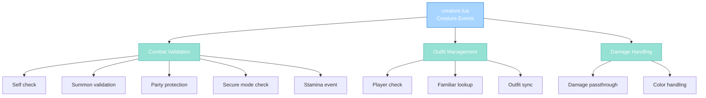

import { Aside, Card } from '@astrojs/starlight/components';

## 🛠️ Informações do Arquivo

Este é o arquivo que implementa os **handlers de eventos para Creature** do servidor **OpenTibiaBR/Canary**. Fornece funcionalidades para validação de combate, gerenciamento de outfits de familiares, e cálculo de dano.

<Card title="Caminho Original" icon="document">
  data/events/scripts/creature.lua
</Card>

<Aside type="tip">
  Implementa 3 métodos essenciais: onTargetCombat (validação pré-ataque), onChangeOutfit (familiar sync), e onDrainHealth (cálculo de dano). Enforça regras de combate como party protection, secure mode, e familiar attacks.
</Aside>

## 📄 Visão Geral do Código

### Resumo Executivo

creature.lua é um módulo de **event handlers para combate e outfit** que implementa:

1. **Combat Validation**: onTargetCombat com múltiplas checks
2. **Party Protection**: Bloqueia ataque entre membros da mesma party
3. **Secure Mode**: Previne ataque a players em secure mode
4. **Familiar Management**: Sync de outfit entre player e familiar
5. **Damage Calculation**: onDrainHealth passthrough (hook point)

### Estrutura de Funcionalidades



---

## 1. Funções Globais (Creature Methods)

### 1.1 function Creature:onTargetCombat(target)

Valida se o ataque pode proceder antes de ser executado.

#### Assinatura
```lua
function Creature:onTargetCombat(target)
```

#### Parâmetros

| Parâmetro | Tipo | Descrição |
|---|---|---|
| **self** | creature | Atacante |
| **target** | creature | Alvo do ataque |

#### Retorno

| Tipo | Valor |
|---|---|
| **boolean** | true se permitido |
| **number** | RETURNVALUE_* se bloqueado |

---

## 2. Combat Validation Logic

### 2.1 Fase 1: Self Check

```lua
if not self then
    return true
end
```

Validação básica de integridade.

---

### 2.2 Fase 2: Summon Protection

```lua
if (target:isMonster() and self:isPlayer() and target:getMaster() == self) or 
   (self:isMonster() and target:isPlayer() and self:getMaster() == target) then
    return RETURNVALUE_YOUMAYNOTATTACKTHISCREATURE
end
```

| Condição | Resultado | Descrição |
|----------|-----------|-----------|
| **Target = meu summon** | BLOCK | Player não pode atacar seu próprio summon |
| **Eu = summon, target = meu master** | BLOCK | Summon não pode atacar master |
| **Outro** | ALLOW | Continua validação |

---

### 2.3 Fase 3: Party Protection

```lua
if not IsRetroPVP() or PARTY_PROTECTION ~= 0 then
    if self:isPlayer() and target:isPlayer() then
        local party = self:getParty()
        if party then
            local targetParty = target:getParty()
            if targetParty and targetParty == party then
                return RETURNVALUE_YOUMAYNOTATTACKTHISPLAYER
            end
        end
    end
end
```

| Condição | Resultado | Descrição |
|----------|-----------|-----------|
| **Non-Retro PVP** | Check party | Ativa proteção |
| **PARTY_PROTECTION != 0** | Check party | Ativa proteção |
| **Mesma party** | BLOCK | Não permite ataque entre membros |
| **Outro** | ALLOW | Continua |

**Config Flags**:
- IsRetroPVP(): boolean
- PARTY_PROTECTION: 0 (bloqueia) or != 0 (limita)

---

### 2.4 Fase 4: Secure Mode Check

```lua
if not IsRetroPVP() or ADVANCED_SECURE_MODE ~= 0 then
    if self:isPlayer() and target:isPlayer() then
        if self:hasSecureMode() then
            return RETURNVALUE_YOUMAYNOTATTACKTHISPLAYER
        end
    end
end
```

| Condição | Resultado | Descrição |
|----------|-----------|-----------|
| **Non-Retro PVP** | Check secure | Ativa secure mode |
| **ADVANCED_SECURE_MODE != 0** | Check secure | Ativa secure mode |
| **Player em secure mode** | BLOCK | Não pode atacar |
| **Outro** | ALLOW | Continua |

---

### 2.5 Fase 5: Stamina Event e Retorno

```lua
self:addEventStamina(target)
return true
```

Execute stamina event para registrar combat.
Retorna true (ataque permitido).

---

## 3. Outfit Management

### 3.1 function Creature:onChangeOutfit(outfit)

Sincroniza outfit do familiar quando player muda de aparência.

#### Assinatura
```lua
function Creature:onChangeOutfit(outfit)
```

#### Parâmetro

| Parâmetro | Tipo | Descrição |
|---|---|---|
| **self** | creature | Creature mudando outfit |
| **outfit** | table | Nova outfit (lookType, head, body, legs, feet, addons) |

#### Retorno

| Tipo | Valor |
|---|---|
| **boolean** | true sempre |

---

## 4. Familiar Outfit Sync Logic

### 4.1 Player Only Check

```lua
if self:isPlayer() then
    -- Familiar sync logic
end
return true
```

Apenas executa para players.

---

### 4.2 Familiar Lookup Type

```lua
local familiarLookType = self:getFamiliarLooktype()
if familiarLookType ~= 0 then
```

| Variável | Tipo | Descrição |
|----------|------|-----------|
| **familiarLookType** | number | Familiar's appearance (or 0 if none) |
| **Comparação** | != 0 | Verifica se existe familiar |

---

### 4.3 Summon Iteration and Outfit Update

```lua
for _, summon in pairs(self:getSummons()) do
    if summon:getType():familiar() then
        if summon:getOutfit().lookType ~= familiarLookType then
            summon:setOutfit({ lookType = familiarLookType })
        end
        break
    end
end
```

| Etapa | Operação |
|------|----------|
| 1 | Itera summons do player |
| 2 | Filtra familiar (summon:getType():familiar()) |
| 3 | Compara outfit.lookType com familiar |
| 4 | Se diferente: atualiza com setOutfit |
| 5 | Break após encontrar primeira familiar |

**Propósito**: Familiar acompanha visual do player.

---

## 5. Damage Handling

### 5.1 function Creature:onDrainHealth(attacker, typePrimary, damagePrimary, typeSecondary, damageSecondary, colorPrimary, colorSecondary)

Hook point para cálculo de dano (passthrough atual).

#### Assinatura
```lua
function Creature:onDrainHealth(attacker, typePrimary, damagePrimary, typeSecondary, damageSecondary, colorPrimary, colorSecondary)
```

#### Parâmetros

| Parâmetro | Tipo | Descrição |
|---|---|---|
| **self** | creature | Vítima |
| **attacker** | creature | Atacante |
| **typePrimary** | number | Tipo de dano primário |
| **damagePrimary** | number | Valor dano primário |
| **typeSecondary** | number | Tipo dano secundário |
| **damageSecondary** | number | Valor dano secundário |
| **colorPrimary** | number | Cor do hit primário |
| **colorSecondary** | number | Cor do hit secundário |

#### Retorno

| Tipo | Valor |
|---|---|
| **Multiple** | typePrimary, damagePrimary, typeSecondary, damageSecondary, colorPrimary, colorSecondary |

---

### 5.2 Damage Validation

```lua
if not self then
    return typePrimary, damagePrimary, typeSecondary, damageSecondary, colorPrimary, colorSecondary
end

if not attacker then
    return typePrimary, damagePrimary, typeSecondary, damageSecondary, colorPrimary, colorSecondary
end

return typePrimary, damagePrimary, typeSecondary, damageSecondary, colorPrimary, colorSecondary
```

Valida self e attacker, retorna valores sem modificação.

**Current State**: Passthrough (hook not modified).
**Future Use**: Pode adicionar damage scaling, immunities, etc.

---

## 6. Fluxo Completo

### 6.1 Attack Flow

```
Player clica NO monster
    |
    +-- onTargetCombat(player, target) executado
            |
            +-- Check self valid
            +-- Check summon protection
            +-- Check party protection
            +-- Check secure mode
            +-- Add stamina event
            |
    +-- Se true: Attack allowed
    +-- Se RETURNVALUE: Attack blocked
```

### 6.2 Outfit Sync

```
Player muda de outfit
    |
    +-- onChangeOutfit(outfit) executado
            |
            +-- Check if player
            +-- Get familiar looktype
            +-- Find familiar summon
            +-- Compare lookType
            +-- Sync if different
            |
    +-- Familiar aparência atualiza
```

---

## 7. Padrões Observados

### 7.1 Guard Clauses para Nulidade

```lua
if not self then return true end
if not attacker then return ... end
```

Early return patterns.

---

### 7.2 Conditional Blocking

```lua
if condition then
    return RETURNVALUE_CODE
end
```

Block com código específico.

---

### 7.3 Config-Based Gate

```lua
if not IsRetroPVP() or PARTY_PROTECTION ~= 0 then
```

Usa flags globais para comportamento.

---

### 7.4 Familiar Management Pattern

```lua
for _, summon in pairs(self:getSummons()) do
    if summon:getType():familiar() then
        -- operate on familiar
        break
    end
end
```

Busca primeiro familiar.

---

## 8. Checkpoint de Aprendizagem

### Conceitos-Chave

| Conceito | Explicação |
|----------|-----------|
| **Combat Validation** | Múltiplas gates antes de permitir ataque |
| **Summon Protection** | Evita player atacar seu próprio summon |
| **Party Protection** | Membros mesma party não podem atacar |
| **Secure Mode** | Players em proteção não podem ser atacados |
| **Stamina Event** | Registra combate para balancing |
| **Familiar Sync** | Mantém visual de familiar sincronizado |

### Responsabilidades

1. **Validar integridade de self e target**
2. **Bloquear ataque a summons do atacante**
3. **Enforçar party protection rules**
4. **Validar secure mode status**
5. **Registrar combat com stamina event**
6. **Sincronizar outfit familiar**

---

## 🤖 Informações da Documentação

<Card title="Documentação do Módulo creature.lua" icon="document">
  **Tipo**: Creature Event Handlers  
  **Funções Globais**: 3 (onTargetCombat, onChangeOutfit, onDrainHealth)  
  **Variáveis Locais**: party, targetParty, familiarLookType, summons  
  **Validações**: Self, target, summon, party, secure mode  
  **Combat Rules**: Party protection, secure mode, summon blocking  
  **Outfit Management**: Familiar synchronization  
  **Checkpoint**: 6 conceitos and 5 responsabilidades
</Card>

<Aside type="note">
  **Última Atualização**: Session 18  
  **Status**: Completo - Padrão Custom Modules  
  **Linhas de Código**: ~62 total  
  **Integração**: XML events.xml declares methods  
  **Config Flags**: IsRetroPVP(), PARTY_PROTECTION, ADVANCED_SECURE_MODE  
  **Próxima Etapa**: Expandir onDrainHealth para custom damage mutations
</Aside>
