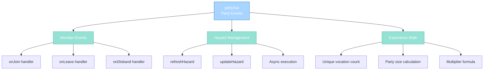

import { Aside, Card } from '@astrojs/starlight/components';

## 🛠️ Informações do Arquivo

Este é o arquivo que implementa os **handlers de eventos para Party** do servidor **OpenTibiaBR/Canary**. Fornece funcionalidades para gerenciamento de hazard zones, sincronização entre membros, e cálculo de compartilhamento de experiência.

<Card title="Caminho Original" icon="document">
  data/events/scripts/party.lua
</Card>

<Aside type="tip">
  Implementa 4 métodos essenciais: onJoin (refresh hazard novo membro), onLeave (update departing member), onDisband (cleanup party), e onShareExperience (vocation-based multiplier). Usa addEvent para operações assíncronas.
</Aside>

## 📄 Visão Geral do Código

### Resumo Executivo

party.lua é um módulo de **event handlers para gerenciamento de party** que implementa:

1. **Hazard Refresh**: onJoin atualiza hazard quando novo membro entra
2. **Hazard Updates**: onLeave atualiza departing member e refresh party
3. **Party Cleanup**: onDisband atualiza todos membros ao dissolver
4. **Experience Sharing**: onShareExperience com multiplicador vocation-based
5. **Async Handling**: addEvent para operações não-bloqueantes

### Estrutura de Funcionalidades



---

## 1. Funções Globais (Party Methods)

### 1.1 function Party:onJoin(player)

Handler executado quando player entra na party.

#### Assinatura
```lua
function Party:onJoin(player)
```

#### Parâmetro

| Parâmetro | Tipo | Descrição |
|---|---|---|
| **self** | party | Party que player entrou |
| **player** | player | Novo membro |

#### Retorno

| Tipo | Valor |
|---|---|
| **boolean** | true |

---

## 2. onJoin Logic

### 2.1 Player UID Capture

```lua
local playerUid = player:getGuid()
```

| Propriedade | Descrição |
|---|---|
| **Tipo** | number |
| **Propósito** | Identificador único para async callback |

---

### 2.2 Async Hazard Refresh

```lua
addEvent(function(playerFuncUid)
    local playerEvent = Player(playerFuncUid)
    if not playerEvent then
        return
    end
    local party = playerEvent:getParty()
    if not party then
        return
    end
    party:refreshHazard()
end, 100, playerUid)
```

| Elemento | Descrição |
|----------|-----------|
| **addEvent** | Schedule async callback |
| **Delay** | 100 ms após join |
| **Parameter** | playerUid passed |
| **Validation** | Check player exists, has party |
| **Operation** | party:refreshHazard() |

**Propósito**: Atualiza hazard zone difficulty do novo membro.

---

## 3. onLeave Handler

### 3.1 function Party:onLeave(player)

Handler executado quando player sai da party.

#### Assinatura
```lua
function Party:onLeave(player)
```

#### Parâmetro

| Parâmetro | Tipo | Descrição |
|---|---|---|
| **self** | party | Party que player saiu |
| **player** | player | Membro saindo |

#### Retorno

| Tipo | Valor |
|---|---|
| **boolean** | true |

---

### 3.2 Setup: Member Collection

```lua
local playerUid = player:getGuid()
local members = self:getMembers()
table.insert(members, self:getLeader())
```

| Operação | Descrição |
|----------|-----------|
| **playerUid** | Capture saindo player |
| **members** | Get current members |
| **insert leader** | Add leader (wasn't in members) |

---

### 3.3 Member UID Table Build

```lua
local memberUids = {}
for _, member in ipairs(members) do
    if member:getGuid() ~= playerUid then
        table.insert(memberUids, member:getGuid())
    end
end
```

| Passo | Operação |
|------|----------|
| 1 | Iterate members |
| 2 | Skip departing player |
| 3 | Collect UIDs of remaining |

---

### 3.4 Async Event Handling

```lua
addEvent(function(playerFuncUid, memberUidsTableEvent)
    local playerEvent = Player(playerFuncUid)
    if playerEvent then
        playerEvent:updateHazard()
    end

    for _, memberUid in ipairs(memberUidsTableEvent) do
        local member = Player(memberUid)
        if member then
            local party = member:getParty()
            if party then
                party:refreshHazard()
                return -- Only one player needs to refresh
            end
        end
    end
end, 100, playerUid, memberUids)
```

| Elemento | Descrição |
|----------|-----------|
| **Delay** | 100 ms |
| **playerEvent:updateHazard()** | Update leaving player |
| **party:refreshHazard()** | Refresh remaining party |
| **return** | Only one needs to refresh |

**Lógica**:
1. Update player que saiu (remove hazard buffs)
2. Refresh party com novo multiplier (um membro basta)

---

## 4. onDisband Handler

### 4.1 function Party:onDisband()

Handler executado quando party é dissolvida.

#### Assinatura
```lua
function Party:onDisband()
```

#### Retorno

| Tipo | Valor |
|---|---|
| **boolean** | true |

---

### 4.2 Member Collection e Cleanup IDs

```lua
local members = self:getMembers()
table.insert(members, self:getLeader())
local memberIds = {}
for _, member in ipairs(members) do
    if member:getId() ~= playerId then
        table.insert(memberIds, member:getId())
    end
end
```

| Operação | Descrição |
|----------|-----------|
| **members** | Get party members |
| **insert leader** | Add leader |
| **memberIds** | Collect IDs of all |

**Note**: Usa ID em vez de UID (possível bug - ver checkpoint).

---

### 4.3 Async Cleanup

```lua
addEvent(function()
    for _, memberId in ipairs(memberIds) do
        local member = Player(memberId)
        if member then
            member:updateHazard()
        end
    end
end, 100)
```

| Elemento | Descrição |
|----------|-----------|
| **Delay** | 100 ms |
| **Iteration** | Todos membros |
| **Operation** | updateHazard() remove buffs |

---

## 5. onShareExperience Handler

### 5.1 function Party:onShareExperience(exp)

Calcula experiência compartilhada com multiplicador vocacional.

#### Assinatura
```lua
function Party:onShareExperience(exp)
```

#### Parâmetro

| Parâmetro | Tipo | Descrição |
|---|---|---|
| **self** | party | Party compartilhando |
| **exp** | number | Base experience value |

#### Retorno

| Tipo | Valor |
|---|---|
| **number** | Calculated shared experience |

---

### 5.2 Data Collection

```lua
local uniqueVocationsCount = self:getUniqueVocationsCount()
local partySize = self:getMemberCount() + 1
```

| Variável | Tipo | Descrição |
|----------|------|-----------|
| **uniqueVocationsCount** | number | Quantas vocações diferentes |
| **partySize** | number | Members + leader |

---

### 5.3 Multiplier Formula

```lua
local sharedExperienceMultiplier = ((0.1 * (uniqueVocationsCount ^ 2)) - (0.2 * uniqueVocationsCount) + 1.3)
```

Fórmula matemática não-linear.

#### Exemplos de Cálculo

| Vocações | Cálculo | Resultado |
|----------|---------|-----------|
| 1 | (0.1 * 1) - (0.2 * 1) + 1.3 | 1.2x |
| 2 | (0.1 * 4) - (0.2 * 2) + 1.3 | 1.3x |
| 3 | (0.1 * 9) - (0.2 * 3) + 1.3 | 1.4x |
| 4 | (0.1 * 16) - (0.2 * 4) + 1.3 | 1.5x |

---

### 5.4 All Vocations Adjustment

```lua
sharedExperienceMultiplier = partySize < 4 and sharedExperienceMultiplier or sharedExperienceMultiplier - 0.1
```

| Condição | Operação |
|----------|----------|
| **partySize < 4** | Mantém multiplier |
| **partySize >= 4** | Subtrai 0.1 |

**Motivo**: Com todos os 4 vocations, formula daria 2.1x, deve ser 2.0x.

---

### 5.5 Final Calculation e Return

```lua
return math.ceil((exp * sharedExperienceMultiplier) / partySize)
```

| Elemento | Descrição |
|----------|-----------|
| **exp * multiplier** | Scale base experience |
| **/ partySize** | Divide entre membros |
| **math.ceil** | Round up to integer |

---

## 6. Fluxo Completo

### 6.1 Join Flow

```
Player joins party
    |
    +-- onJoin(player) executado
            |
            +-- Capture playerUid
            |
            +-- Schedule addEvent(100ms)
                    |
                    +-- Lookup player by uid
                    +-- Check party still exists
                    +-- party:refreshHazard()
                    |
                    +-- Hazard multiplier updated
```

### 6.2 Leave Flow

```
Player leaves party
    |
    +-- onLeave(player) executado
            |
            +-- Collect remaining memberUids
            |
            +-- Schedule addEvent(100ms)
                    |
                    +-- playerEvent:updateHazard() (remove buffs)
                    +-- loop remaining members
                    +-- party:refreshHazard() (new multiplier)
                    |
                    +-- Both updated
```

### 6.3 Disband Flow

```
Party leader disbands party
    |
    +-- onDisband() executado
            |
            +-- Collect all memberIds
            |
            +-- Schedule addEvent(100ms)
                    |
                    +-- For each member:
                    +--   member:updateHazard()
                    |
                    +-- All hazard buffs removed
```

### 6.4 Experience Sharing

```
Enemy defeated by party
    |
    +-- onShareExperience(baseExp) called
            |
            +-- Count unique vocations
            +-- Calculate party size
            +-- Apply formula
            +-- Check 4-vocation adjustment
            +-- Divide by party size
            +-- Return rounded value
            |
    +-- Each member receives calculated XP
```

---

## 7. Padrões Observados

### 7.1 Async Operation Pattern

```lua
addEvent(function(...)
    -- async logic
end, delayMs, ...)
```

Avoid blocking with fire-and-forget patterns.

---

### 7.2 Nil Safety Checks

```lua
if not playerEvent then return end
if not party then return end
```

Defensive iterative checks.

---

### 7.3 Early Return in Loop

```lua
for _, member in ipairs(memberUidsTableEvent) do
    if member then
        local party = member:getParty()
        if party then
            party:refreshHazard()
            return -- Only one needs to refresh
        end
    end
end
```

Optimization: stop after first successful.

---

### 7.4 Math Formula with Adjustment

```lua
local multiplier = formula
multiplier = condition and multiplier or multiplier - adjustment
```

Post-calculation tuning.

---

## 8. Checkpoint de Aprendizagem

### Conceitos-Chave

| Conceito | Explicação |
|----------|-----------|
| **Async Events** | Operações não-bloqueantes com addEvent |
| **Hazard Management** | Atualiza dificuldade zone dinamicamente |
| **Vocation Multiplier** | Experience scaling by party composition |
| **Non-Linear Formula** | Rewards diverse vocations |
| **Member Synchronization** | Keeps all members in sync |

### Responsabilidades

1. **Refresh hazard ao novo membro entrar**
2. **Update hazard quando membro sai**
3. **Cleanup hazard buffs ao disbanding**
4. **Calcular exp com vocation multiplier**
5. **Handle async operations safely**

### Potencial Bug

Linha onDisband:
```lua
if member:getId() ~= playerId then  -- playerId não definido!
```

Deve ser `self:getLeader():getId()` ou outro context.

---

## 🤖 Informações da Documentação

<Card title="Documentação do Módulo party.lua" icon="document">
  **Tipo**: Party Event Handlers  
  **Funções Globais**: 4 (onJoin, onLeave, onDisband, onShareExperience)  
  **Variáveis Locais**: playerUid, members, memberUids/Ids, vocation counts  
  **Hazard Management**: Dynamic zone difficulty updates  
  **Experience Math**: Non-linear vocation-based multiplier  
  **Async Operations**: Delayed event callbacks com 100ms  
  **Checkpoint**: 5 conceitos, 5 responsabilidades, 1 bug potencial
</Card>

<Aside type="note">
  **Última Atualização**: Session 18  
  **Status**: Completo - Padrão Custom Modules  
  **Linhas de Código**: ~90 total  
  **Integração**: XML events.xml declares methods  
  **Async Delay**: 100ms para todas operações  
  **Formula Reference**: Vocation-based scaling with all-vocation adjustment  
  **⚠️ Bug Alert**: onDisband uses undefined playerId variable
</Aside>
