import { Aside, Card } from '@astrojs/starlight/components';

## 🛠️ Informações do Arquivo

Este é o arquivo que implementa os **handlers de eventos para Player** do servidor **OpenTibiaBR/Canary**. Fornece funcionalidades extensa para ganho de experiência, movimento de itens, anti-push, relatórios de rule violation, combate, e gerenciamento de stamina.

<Card title="Caminho Original" icon="document">
  data/events/scripts/player.lua
</Card>

<Aside type="tip">
  Implementa 12+ métodos de player events com foco em: experência com múltiplos multiplicadores (stamina, boost XP, vocation, prey, VIP), movimento de itens com validações, sistemas de relatórios (bugs e rule violation), anti-push para prevenir item spamming.
</Aside>

## 📄 Visão Geral do Código

### Resumo Executivo

player.lua é um módulo de **event handlers para player** que implementa:

1. **Experience System**: onGainExperience com 8+ multiplicadores (stamina, boost, creature, prey, VIP, taint, low-level, base rate)
2. **Stamina Management**: useStamina, useStaminaXpBoost, useConcoctionTime (helpers)
3. **Item Movement**: onMoveItem com validações (teleport trash, reward chest, bathtub, podium)
4. **Anti-Push System**: Tracking de movimento rápido com configurable exhaustion
5. **Combat Reporting**: onReportRuleViolation, onReportBug (file system)
6. **Skill System**: onGainSkillTries com stage-based rates e VIP bonus
7. **Combat Handler**: onCombat com ammo type validation

### Estrutura de Funcionalidades

```mermaid
graph TD
    A["player.lua<br/>Player Events"] --> B["Experience System"]
    A --> C["Item Management"]
    A --> D["Stamina System"]
    A --> E["Reporting System"]
    A --> F["Skill System"]
    A --> G["Combat"]
    
    B --> B1["Soul regeneration"]
    B --> B2["XP Boost"]
    B --> B3["Stamina bonus"]
    B --> B4["Creature boost"]
    B --> B5["Prey system"]
    B --> B6["VIP bonus"]
    B --> B7["Taint boost"]
    B --> B8["Low-level bonus"]
    
    C --> C1["Tile count check"]
    C --> C2["Teleport blocking"]
    C --> C3["SSA exhaust"]
    C --> C4["Two-handed validation"]
    C --> C5["Anti-push"]
    
    D --> D1["Stamina deduction"]
    D --> D2["XP boost tracking"]
    D --> D3["Concoction time"]
    
    E --> E1["Rule violation"]
    E --> E2["Bug reports"]
    E --> E3["Pending check"]
    
    F --> F1["Stage-based rates"]
    F --> F2["VIP progression"]
    F --> F3["Dawnport limit"]
    
    G --> G1["Ammo handling"]
    G --> G2["Damage passthrough"]
    
    style A fill:#a8d5ff,stroke:#0066cc,color:#fff
    style B fill:#95e1d3,stroke:#38ada9,color:#fff
    style C fill:#95e1d3,stroke:#38ada9,color:#fff
    style D fill:#95e1d3,stroke:#38ada9,color:#fff
    style E fill:#95e1d3,stroke:#38ada9,color:#fff
    style F fill:#95e1d3,stroke:#38ada9,color:#fff
    style G fill:#95e1d3,stroke:#38ada9,color:#fff
```



---

## 1. Variáveis Globais e Configurações

### 1.1 storeItemID Array

```lua
local storeItemID = {
    28552, 28553, 28554, ... -- 500 charges exercise weapons
    28540, 28541, 28542, ... -- 50 charges exercise weapons
    28525, 28526, 23722, ... -- magic gold converters
    29408, 29409, 29410, ... -- foods
}
```

| Propriedade | Descri ção |
|---|---|
| **Tipo** | array of numbers |
| **Propósito** | Item IDs não-traváveis entre players |
| **Uso** | onTradeRequest validation |

---

### 1.2 blockTeleportTrashing

```lua
local blockTeleportTrashing = true
```

| Propriedade | Descrição |
|---|---|
| **Tipo** | boolean |
| **Valor** | true |
| **Propósito** | Bloqueia jogar items em teleportes |

---

### 1.3 configPush

```lua
local configPush = {
    maxItemsPerSeconds = 1,
    exhaustTime = 2000,
}
```

| Propriedade | Valor | Descrição |
|---|---|---|
| **maxItemsPerSeconds** | 1 | Máximo items por segundo |
| **exhaustTime** | 2000 | Exhaust em ms |

---

### 1.4 soulCondition

```lua
local soulCondition = Condition(CONDITION_SOUL, CONDITIONID_DEFAULT)
soulCondition:setTicks(4 * 60 * 1000)
soulCondition:setParameter(CONDITION_PARAM_SOULGAIN, 1)
```

| Propriedade | Valor |
|---|---|
| **Type** | CONDITION_SOUL |
| **Duration** | 4 minutos |
| **Gain** | 1 soul point |

---

## 2. Funções Locais (Helpers)

### 2.1 function antiPush(player, item, count, fromPosition, toPosition, fromCylinder, toCylinder)

Previne players de spammar movimento de itens rapidamente.

#### Lógica

```lua
local playerId = player:getId()
if not pushDelay[playerId] then
    pushDelay[playerId] = { items = 0, time = 0 }
end

pushDelay[playerId].items = pushDelay[playerId].items + 1

local currentTime = systemTime()
-- Time reset logic based on timing
-- Count check against configPush.maxItemsPerSeconds
```

**Retorno**: true/false (permitido ou bloqueado)

---

### 2.2 function useStamina(player, isStaminaEnabled)

Deduz stamina a cada 60 segundos (ou 120s se > 2 minutos).

#### Lógica

```lua
local timePassed = currentTime - _G.NextUseStaminaTime[playerId]
if timePassed > 60 then
    staminaMinutes = staminaMinutes - 2
else
    staminaMinutes = staminaMinutes - 1
end
```

**Uso**: Integrado em onGainExperience

---

### 2.3 function useStaminaXpBoost(player)

Deduz XP boost time e rastreia via KV store.

#### Storage Key

```lua
local xpBoostLeftMinutesByDailyReward = player:kv():get("daily-reward-xp-boost") or 0
```

---

### 2.4 function useConcoctionTime(player)

Deduz concoction duration e chama Concoction.experienceTick.

#### Integração

```lua
Concoction.experienceTick(player, deduction)  -- deduction = 60 or 120
```

---

### 2.5 function hasPendingReport(playerGuid, targetName, reportType)

Checa se player já tem report pendente para este alvo.

#### File Check

```lua
local file = io.open(string.format("%s/reports/players/%s-%s-%d.txt", CORE_DIRECTORY, name, targetName, reportType), "r")
```

---

## 3. Funções de Player Events

### 3.1 function Player:onLookInBattleList(creature, distance)

Customiza descrição ao inspecionar creature na battle list.

#### Adições para Staff

Se player tem access, adiciona:
- Health/Mana
- Position (x, y, z)
- IP address (se player)

#### Familiar Info

```lua
if table.contains(FAMILIARSNAME, creature:getName():lower()) then
    description = description .. " (Master: " .. master:getName() .. "). \z
        It will disappear in " .. Game.getTimeInWords(familiarSummonTime - os.time())
end
```

---

### 3.2 function Player:onMoveItem(item, count, fromPosition, toPosition, fromCylinder, toCylinder)

Validação extensa de movimento de itens com múltiplas guards.

#### Guards

| Guard | Bloqueio |
|-------|----------|
| **IMMOVABLE_ACTION_ID** | Item imóvel |
| **Tile count > 20** | Tile lotado |
| **Teleport throwing** | If blockTeleportTrashing |
| **Reward chest/container** | Reward system |
| **Boss corpse** | NPC corpses |
| **Bathtub/Podium** | Furniture blocking |
| **antiPush check** | Rate limiting |

#### SSA (Stone Skin Amulet) Exhaust

```lua
if toPosition.y == CONST_SLOT_NECKLACE and item:getId() == ITEM_STONE_SKIN_AMULET then
    exhaust[playerId] = true
    addEvent(function(id)
        exhaust[id] = nil
    end, 2000, playerId)
end
```

---

### 3.3 function Player:onItemMoved(item, count, fromPosition, toPosition, fromCylinder, toCylinder)

Post-move event para quest items e special mechanics.

#### Exemplo: The Secret Library

```lua
if toPosition == Position(32460, 32928, 7) and item.itemid == 3578 then
    toPosition:sendMagicEffect(CONST_ME_HEARTS)
    Game.setStorageValue(Storage.Quest.U11_80.TheSecretLibrary.SmallIslands.Turtle, os.time() + 10 * 60)
    item:remove(1)
end
```

---

### 3.4 function Player:onMoveCreature(creature, fromPosition, toPosition)

Bloqueia pushing de players em exercício training.

#### Check

```lua
if _G.OnExerciseTraining[player:getId()] and not self:getGroup():hasFlag(PlayerFlag_CanPushAllCreatures) then
    return false
end
```

---

### 3.5 function Player:onReportRuleViolation(targetName, reportType, reportReason, comment, translation)

Escreve rule violation report para arquivo.

#### Report Structure

```
Reported by: player name
Target: target name
Type: reportType
Reason: reportReason
Comment: comment
Translation: translation (if not bot)
```

#### Pending Check

```lua
if hasPendingReport(self:getGuid(), targetName, reportType) then
    return "Your report is being processed."
end
```

---

### 3.6 function Player:onReportBug(message, position, category)

Escreve bug report para arquivo com posição do jogador e da tela.

#### File Location

```
CORE_DIRECTORY/reports/bugs/PLAYERNAME/report.txt
```

---

### 3.7 function Player:onTurn(direction)

Staff only: Teleporta para frente ao fazer turn se direction é igual à direção atual.

#### Staff Feature

```lua
if self:getGroup():getAccess() and self:getDirection() == direction then
    local nextPosition = self:getPosition()
    nextPosition:getNextPosition(direction)
    self:teleportTo(nextPosition, true)
end
```

---

### 3.8 function Player:onTradeRequest(target, item)

Bloqueia trade de items imóveis e store items.

#### Checks

```lua
if item:getActionId() == IMMOVABLE_ACTION_ID then
    return false
end

if table.contains(storeItemID, item.itemid) then
    return false
end
```

---

## 4. Experience System

### 4.1 function Player:onGainExperience(target, exp, rawExp)

Multiplicador completo de experiência com 8+ bônus stacking.

#### Sequência Multiplicativa

```
Base XP
  ↓
Soul Regeneration trigger (if exp >= level)
  ↓
XP Boost deduction
  ↓
Stamina Bonus (if enabled)
  ↓
Concoction System
  ↓
Boosted Creature (2x)
  ↓
Prey System (percentage)
  ↓
VIP Bonus (if enabled)
  ↓
Soul War Taint Boost
  ↓
Low-Level Bonus
  ↓
Base Rate
  ↓
Final XP
```

#### Fórmula Final

```lua
return (exp * (1 + xpBoostPercent / 100 + lowLevelBonusExp / 100)) * 
       staminaBonusXp * baseRateExp
```

---

### 4.2 Soul Regeneration

```lua
if self:getSoul() < vocation:getMaxSoul() and exp >= self:getLevel() then
    soulCondition:setParameter(CONDITION_PARAM_SOULTICKS, vocation:getSoulGainTicks())
    self:addCondition(soulCondition)
end
```

---

### 4.3 Boosted Creature Bonus

```lua
if target:getName():lower() == Game.getBoostedCreature():lower() then
    exp = exp * 2
end
```

---

### 4.4 Prey System

```lua
local monsterType = target:getType()
if monsterType and monsterType:raceId() > 0 then
    exp = math.ceil((exp * self:getPreyExperiencePercentage(monsterType:raceId())) / 100)
end
```

---

### 4.5 VIP Bonus

```lua
if configManager.getBoolean(configKeys.VIP_SYSTEM_ENABLED) then
    local vipBonusExp = configManager.getNumber(configKeys.VIP_BONUS_EXP)
    if vipBonusExp > 0 and self:isVip() then
        exp = exp * (1 + math.min(vipBonusExp, 100) / 100)
    end
end
```

---

### 4.6 Soul War Taint Boost

```lua
if SoulWarQuest then
    if table.contains(SoulWarQuest.bagYouDesireMonsters, monsterType:getName()) then
        local taintLevel = self:getTaintLevel() or 0
        if taintLevel > 0 then
            local taintBoost = SoulWarQuest.taintExperienceBoostMap[taintLevel].boost or 0
            exp = exp * (1 + taintBoost / 100)
        end
    end
end
```

---

## 5. Skill System

### 5.1 function Player:onGainSkillTries(skill, tries)

Calcula skill tries com stage-based rates e VIP boost.

#### Stage-Based Rate

```lua
local rateSkillStages = configManager.getBoolean(configKeys.RATE_USE_STAGES) and skillsStages or nil
local skillRate = getRateFromTable(rateSkillStages, currentSkillLevel, baseRate)
```

---

### 5.2 Schedule Rate Application

```lua
skillRate = (SCHEDULE_SKILL_RATE ~= 100) and (skillRate * SCHEDULE_SKILL_RATE / 100) or skillRate
```

---

### 5.3 VIP Boost

```lua
if configManager.getBoolean(configKeys.VIP_SYSTEM_ENABLED) and self:isVip() then
    local vipBonusSkill = math.min(configManager.getNumber(configKeys.VIP_BONUS_SKILL), 100)
    skillRate = skillRate + (skillRate * (vipBonusSkill / 100))
end
```

---

## 6. Zone Management

### 6.2 function Player:onChangeZone(zone)

Gerencia stamina recharge em protection zones.

#### PZ Stamina Recharge

```lua
if configManager.getBoolean(configKeys.STAMINA_PZ) then
    if zone == ZONE_PROTECTION then
        if stamina < 2520 then
            staminaBonus.eventsPz[self:getId()] = addEvent(addStamina, delay * 60 * 1000, ...)
        end
    end
end
```

---

## 7. Combat Handling

### 7.1 function Player:onCombat(target, item, primaryDamage, primaryType, secondaryDamage, secondaryType)

Valida ammo type (special handling para diamond arrow).

#### Ammo Check

```lua
if ItemType(item:getId()):getWeaponType() == WEAPON_AMMO then
    if not table.contains({ ITEM_OLD_DIAMOND_ARROW, ITEM_DIAMOND_ARROW }, item:getId()) then
        item = self:getSlotItem(CONST_SLOT_LEFT)
    end
end
```

---

### 7.2 function Player:onLoseExperience(exp)

Passthrough (sem modificação, pode desabilitado em eventos.xml).

---

### 7.3 function Player:onInventoryUpdate(item, slot, equip)

Empty stub para futuras expansões.

---

## 8. Patternsobservados

### 8.1 Multi-Layer Multiplicative System

Cada bônus é multiplicado sequencialmente, permitindo stacking:
- Stamina × Boost × Creature × Prey × VIP × Taint × LowLevel × BaseRate

---

### 8.2 Global Tracking Tables

```lua
_G.NextUseStaminaTime[playerId]
_G.NextUseXpStamina[playerId]
_G.NextUseConcoctionTime[playerId]
_G.OnExerciseTraining[playerId]
```

Correlação entre player ID e timers.

---

### 8.3 KV Store Integration

```lua
player:kv():get("daily-reward-xp-boost")
player:kv():set("channel-help-exhaustion", timestamp)
player:kv():remove("key")
```

Persistência de dados entre reboots.

---

### 8.4 File System Reports

Relatórios salvos como arquivos de texto:
```
CORE_DIRECTORY/reports/players/
CORE_DIRECTORY/reports/bugs/
```

---

## 9. Checkpoint de Aprendizagem

### Conceitos-Chave

| Conceito | Explicação |
|----------|-----------|
| **Multi-Multiplicador XP** | Stacking de 8+ bônus diferentes |
| **Stamina System** | Recharge deduction com timing |
| **Anti-Push** | Rate limiting de movimento de items |
| **Item Validation** | 5+ guards antes de permitir move |
| **Report System** | File-based persistence para bugreports |
| **Stage-Based Skill** | Skill rate varia por level |
| **PZ Stamina** | Auto-recharge em protection zones |

### Responsabilidades

1. **Calcular XP com múltiplos multiplicadores**
2. **Gerenciar stamina/XP boost timing**
3. **Validar movimento de items**
4. **Prevenir item push spam**
5. **Processar relatórios de bug/rule violation**
6. **Calcular skill tries com stages**
7. **Gerenciar zone transitions**

---

## 🤖 Informações da Documentação

<Card title="Documentação do Módulo player.lua" icon="document">
  **Tipo**: Player Event Handlers (Extensivo)  
  **Funções Globais**: 12+ (onGainExperience, onMoveItem, onReportRuleViolation, etc)  
  **Funções Locais**: 5+ (antiPush, useStamina, useStaminaXpBoost, etc)  
  **Variáveis Globais**: 5 (storeItemID, blockTeleportTrashing, configPush, pushDelay, soulCondition)  
  **Linhas de Código**: ~692 total  
  **Multiplicadores XP**: 8+ (stamina, boost, creature, prey, VIP, taint, low-level, base rate)  
  **Item Guards**: 6+ (immovable, teleport, reward, corpse, bathtub, podium)  
  **Checkpoint**: 7 conceitos and 7 responsabilidades
</Card>

<Aside type="note">
  **Última Atualização**: Session 18  
  **Status**: Completo - Padrão Custom Modules  
  **Integração**: XML events.xml declares 12+ methods  
  **Global Integration**: _G.NextUseStaminaTime, _G.OnExerciseTraining counters  
  **File Reports**: CORE_DIRECTORY/reports/ structure  
  **KV Store**: Persistent tracking "daily-reward-xp-boost", "channel-help-exhaustion"  
  **Config Keys**: STAMINA_SYSTEM, PREY_ENABLED, VIP_SYSTEM_ENABLED, etc
</Aside>
