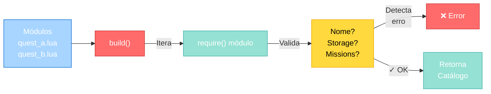
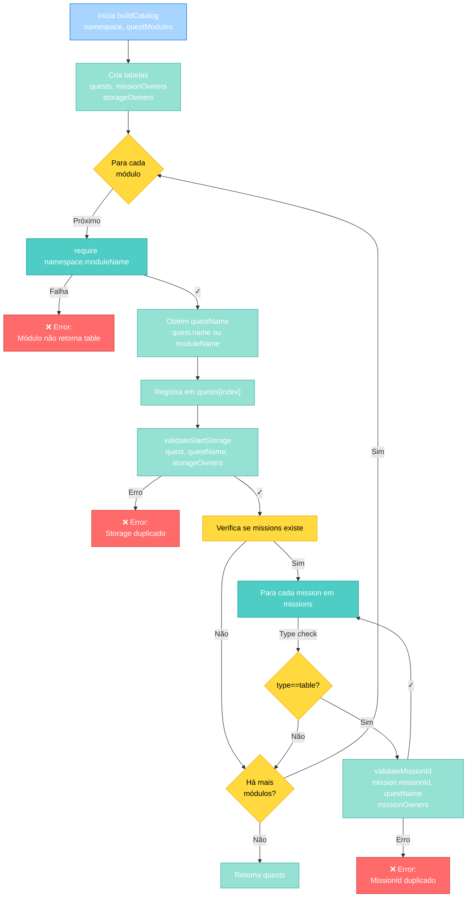

import { Aside, Card } from '@astrojs/starlight/components';

## 🛠️ Informações do Arquivo

Este é o arquivo de **validação e construção de catálogo de quests** (missões) do servidor **OpenTibiaBR/Canary**. Ele é responsável por validar a integridade de definições de quests e construir um catálogo indexado para acesso rápido.

<Card title="Caminho Original" icon="document">
  `data/lib/core/quests/catalog.lua`
</Card>

<Aside type="tip">
  Este arquivo é carregado durante a inicialização do servidor e fornece a função `build()` que constrói um catálogo seguro de quests. Valida automaticamente conflitos de IDs e armazenamento duplicados, prevenindo bugs em tempo de execução.
</Aside>

## 📄 Visão Geral do Código

### Resumo Executivo

`catalog.lua` é um módulo de **validação e construção de catálogo de quests**. Ele:

1. **Valida integridade** de definições de quest (IDs únicos, storage sem conflitos)
2. **Constrói catálogo indexado** a partir de módulos Lua carregados dinamicamente
3. **Previne erros em tempo de execução** com validações em tempo de inicialização

O arquivo exporta uma única função: `build(namespace, questModules)` que retorna um catálogo de quests validado.

### Estrutura de uma Quest

Cada quest é uma tabela Lua com a seguinte estrutura:

```lua
{
    name = "Quest Name",              -- Nome da quest (opcional, padrão: nome do módulo)
    startStorageId = 12345,           -- Storage único para ratrear início da quest (opcional)
    missions = {                       -- Tabela de missões (opcional)
        {
            missionId = 1,            -- ID da missão (deve ser único dentro da quest)
            description = "...",      -- Descrição da missão
            -- ... outras propriedades
        },
        {
            missionId = 2,
            -- ...
        }
    }
}
```

| Campo | Tipo | Obrigatório | Descrição |
|-------|------|-------------|-----------|
| **name** | string | ⚠️ Opcional | Nome identificador da quest. Padrão: nome do módulo |
| **startStorageId** | number | ⚠️ Opcional | Storage único para ratrear se player iniciou a quest |
| **missions** | table | ⚠️ Opcional | Tabela de missões (tabelas com `missionId` e propriedades) |

### Como o Catálogo Funciona



---

## 3. Funções Principais

### 3.1 `validateMissionId(missionId, questName, owners)`

Valida que um ID de missão é único dentro da quest.

#### Assinatura
```lua
function validateMissionId(missionId, questName, owners)
```

#### Parâmetros

| Parâmetro | Tipo | Descrição |
|-----------|------|-----------|
| **missionId** | number | ID da missão a validar |
| **questName** | string | Nome da quest que contém a missão |
| **owners** | table | Tabela de rastreamento `{questName → {missionId → true}}` |

#### Comportamento

1. Se `missionId` for `nil` ou falsey, retorna sem fazer nada
2. Busca a tabela de missões da quest em `owners[questName]`
3. Se não existir, cria uma nova tabela vazia
4. Se `missionId` já existe em `owners[questName]`, lança error
5. Registra o `missionId` como owned (marcado true)

#### Exemplo de Uso Interno

```lua
local missionOwners = {}

-- Para cada quest...
    local missions = quest.missions
    if missions then
        for _, mission in pairs(missions) do
            if type(mission) == "table" then
                validateMissionId(mission.missionId, questName, missionOwners)
            end
        end
    end
-- missionOwners agora contém a rastreamento de todas as missões
```

#### Erros Gerados

```
Duplicate mission id 5 found in quest "Mystery of Roots"
```

---

### 3.2 `validateStartStorage(quest, questName, owners)`

Valida que o `startStorageId` de uma quest é único entre todas as quests.

#### Assinatura
```lua
function validateStartStorage(quest, questName, owners)
```

#### Parâmetros

| Parâmetro | Tipo | Descrição |
|-----------|------|-----------|
| **quest** | table | Tabela da quest contendo `startStorageId` |
| **questName** | string | Nome identificador da quest |
| **owners** | table | Tabela de rastreamento `{storageId → questName}` |

#### Comportamento

1. Extrai `quest.startStorageId`
2. Se for `nil` ou falsey, retorna sem fazer nada
3. Verifica se o storage já foi registrado em `owners[storage]`
4. Se foi registrado por outra quest, lança error (conflito)
5. Registra o storage como owned pela quest

#### Exemplo de Uso Interno

```lua
local storageOwners = {}

-- Para cada quest...
    validateStartStorage(quest, questName, storageOwners)
-- storageOwners agora é {12345 → "First Quest", 12346 → "Second Quest"}
```

#### Erros Gerados

```
Duplicate quest start storage 12345 found in quests "First Quest" and "Second Quest"
```

---

### 3.3 `buildCatalog(namespace, questModules)`

Constrói e retorna um catálogo completo e validado de quests.

#### Assinatura
```lua
function buildCatalog(namespace, questModules)
```

#### Parâmetros

| Parâmetro | Tipo | Descrição |
|-----------|------|-----------|
| **namespace** | string | Namespace Lua para require (ex: `"quests"`) |
| **questModules** | table | Array ordenado de nomes de módulos a carregar (ex: `{"first_quest", "second_quest"}`) |

#### Retorno

```lua
{
    [1] = { name = "First Quest", startStorageId = 12345, missions = {...} },
    [2] = { name = "Second Quest", startStorageId = 12346, missions = {...} },
    ...
}
```
- Tabela ordenada (array) de quests
- Índice 1 corresponde a primeiro módulo em `questModules`

#### Comportamento Passo a Passo

1. Inicializa tabelas vazias: `quests`, `missionOwners`, `storageOwners`
2. Para cada módulo em `questModules`:
   - Carrega módulo via `require(namespace .. "." .. moduleName)`
   - Valida que o resultado é uma tabela
   - Define nome da quest (field `name` ou padrão: `moduleName`)
   - Adiciona à tabela `quests`
   - Valida `startStorageId` (chamando `validateStartStorage()`)
   - Se `missions` existir, valida cada `missionId` (chamando `validateMissionId()`)
3. Retorna o catálogo de quests

#### Ciclo de Validação (Diagrama Detalhado)



#### Erros Possíveis

```lua
-- Erro 1: Módulo não retorna tabela
error("Quest module first_quest did not return a table")

-- Erro 2: Storage duplicado entre quests
error("Duplicate quest start storage 12345 found in quests \"First Quest\" and \"Second Quest\"")

-- Erro 3: Mission ID duplicado dentro da mesma quest
error("Duplicate mission id 1 found in quest \"First Quest\"")
```

---

## 4. Exemplo de Uso Prático

### Cenário: Carregar 3 Quests

#### Arquivos de Quest

**`quests/first_quest.lua`:**
```lua
return {
    name = "First Quest",
    startStorageId = 12345,
    missions = {
        { missionId = 1, description = "Kill 10 rats" },
        { missionId = 2, description = "Return to NPC" },
    }
}
```

**`quests/second_quest.lua`:**
```lua
return {
    name = "Second Quest",
    startStorageId = 12346,
    missions = {
        { missionId = 1, description = "Find 5 herbs" },
    }
}
```

**`quests/third_quest.lua`:**
```lua
return {
    -- name omitido: usará "third_quest" como padrão
    startStorageId = 12347,
    missions = {
        { missionId = 1, description = "Defeat the dragon" },
    }
}
```

#### Chamada do build()

```lua
local catalog = require("lib.core.quests.catalog")

local questCatalog = catalog.build("quests", {
    "first_quest",
    "second_quest", 
    "third_quest"
})

print(questCatalog[1].name)  -- Output: "First Quest"
print(questCatalog[2].name)  -- Output: "Second Quest"
print(questCatalog[3].name)  -- Output: "third_quest"

-- Acessar uma quest específica
local firstQuest = questCatalog[1]
print(firstQuest.missions[1].missionId)  -- Output: 1
```

#### Resultado Esperado

```lua
questCatalog = {
    [1] = {
        name = "First Quest",
        startStorageId = 12345,
        missions = {
            { missionId = 1, description = "Kill 10 rats" },
            { missionId = 2, description = "Return to NPC" },
        }
    },
    [2] = {
        name = "Second Quest",
        startStorageId = 12346,
        missions = {
            { missionId = 1, description = "Find 5 herbs" },
        }
    },
    [3] = {
        name = "third_quest",
        startStorageId = 12347,
        missions = {
            { missionId = 1, description = "Defeat the dragon" },
        }
    },
}
```

### Cenário: Erro - Storage Duplicado

Se duas quests tentarem usar o mesmo `startStorageId`:

```lua
-- quests/quest_a.lua
return {
    name = "Quest A",
    startStorageId = 12345,  -- Armazenamento
    missions = {}
}

-- quests/quest_b.lua
return {
    name = "Quest B",
    startStorageId = 12345,  -- ❌ CONFLITO!
    missions = {}
}

-- Ao chamar:
local questCatalog = catalog.build("quests", { "quest_a", "quest_b" })

-- Resultado:
-- ERROR: Duplicate quest start storage 12345 found in quests "Quest A" and "Quest B"
```

### Cenário: Erro - Mission ID Duplicado

Se uma quest tenta definir a mesma missão ID duas vezes:

```lua
-- quests/complex_quest.lua
return {
    name = "Complex Quest",
    startStorageId = 12345,
    missions = {
        { missionId = 1, description = "First step" },
        { missionId = 1, description = "Another step" },  -- ❌ CONFLITO!
    }
}

-- Ao chamar:
local questCatalog = catalog.build("quests", { "complex_quest" })

-- Resultado:
-- ERROR: Duplicate mission id 1 found in quest "Complex Quest"
```

---

## 5. Padrões e Boas Práticas

### ✅ Validação em Tempo de Inicialização

```lua
local questCatalog = catalog.build("quests", questModules)
-- Erros são detectados durante BOOT, não em runtime
```

**Por quê?** Falha rápido e seguro. Problemas de configuração são encontrados imediatamente.

---

### ✅ Namespaces para Modularização

```lua
catalog.build("core.quests", {...})      -- Quests core do servidor
catalog.build("custom.quests", {...})    -- Quests customizadas
```

**Por quê?** Permite múltiplos catálogos de quests para diferentes datapacks.

---

### ✅ Sem Modificação Pós-Build

O catálogo retornado é **imutável** (idealmente). Não chame `table.insert()` nele após criação.

```lua
-- ✓ BOM: Build uma vez na inicialização
local questCatalog = catalog.build("quests", questModules)
_G.QuestCatalog = questCatalog  -- Armazena globalmente

-- ✗ RUIM: Adicionar quests dinamicamente após build
table.insert(questCatalog, newQuest)  -- Não faz validação!
```

**Por quê?** Mantém integridade de dados. Todas as validações já foram aplicadas.

---

### ✅ Estrutura Prévia de Modules

Saiba quais módulos serão carregados **antes** de chamar `build()`:

```lua
-- Padrão: Lista explícita
local questModules = {
    "dragon_slayer",
    "mysterious_forest",
    "ancient_temple",
    "the_last_quest"
}
local catalog = catalog.build("quests", questModules)

-- Alternativa: Descoberta dinâmica
local questModules = {}
for file in io.dir("quests") do
    table.insert(questModules, file:gsub(".lua", ""))
end
local catalog = catalog.build("quests", questModules)
```

---

### ✅ Nomeação Consistente de Storage

Use convenção para evitar conflitos acidentais:

```lua
-- ❌ Ruim: Números aleatórios
startStorageId = 12345

-- ✓ BOM: Padrão baseado no nome
startStorageId = STORAGE.QUEST_DRAGON_SLAYER_START     -- 20001
startStorageId = STORAGE.QUEST_FOREST_MYSTERY_START    -- 20002
startStorageId = STORAGE.QUEST_TEMPLE_START            -- 20003
```

---

## 6. Validações Implementadas

### Checklist de Validações

| Validação | Fase | Comportamento |
|-----------|------|---------------|
| **Tipo de módulo** | Load | Verifica se `require()` retorna table |
| **Nome da quest** | Load | Usa field `name` ou padrão: `moduleName` |
| **Storage duplicado** | Build | Erro se 2+ quests usam mesmo `startStorageId` |
| **Mission ID duplicado** | Build | Erro se 2+ missions na MESMA quest têm mesmo `missionId` |
| **Tipo de mission** | Iterate | Ignora missions que não são tabelas |

---

## 7. Referência Rápida

### Export do Módulo

```lua
return {
    build = buildCatalog,
}
```

Apenas 1 função pública: `build(namespace, questModules)`

### Assinatura Completa

```lua
local catalog = require("lib.core.quests.catalog")
local questCatalog = catalog.build("quests", {"quest1", "quest2", ...})
```

### Estrutura de Retorno

```lua
questCatalog = {
    [1] = { name, startStorageId, missions },
    [2] = { name, startStorageId, missions },
    ...
}
```

### Erros Possíveis

```
Quest module X did not return a table
Duplicate quest start storage Y found in quests "A" and "B"
Duplicate mission id Z found in quest "X"
```

---

## 8. Checkpoint: O que foi Carregado até Aqui

Após `catalog.lua` ser carregado, o servidor tem:

✅ **Função de construção de catálogo**: `catalog.build(namespace, questModules)`  
✅ **Validações de integridade**: Storage e Mission IDs únicos  
✅ **Catálogo indexado**: Acesso O(1) por índice  
✅ **Detecção de conflitos**: Erros claros em tempo de boot  

### Uso Típico

```lua
-- 1. Importar o módulo
local catalog = require("lib.core.quests.catalog")

-- 2. Build o catálogo
local questCatalog = catalog.build("my_quests", {
    "ancient_dragon",
    "lost_temple",
    "mysterious_prophecy"
})

-- 3. Salvar globalmente para acesso posterior
_G.QuestCatalog = questCatalog

-- 4. Usar em scripts de quest/NPC
local quest = _G.QuestCatalog[1]
print(quest.name)
```

---

## 9. Conclusão

`catalog.lua` é o **construtor e validador de quests** do Canary. Implementa padrão de **Data Validation at Load Time**:

### Pontos Importantes

1. **Validação de Integridade**: Detecta conflicts de IDs e storage em boot
2. **Construção Segura**: Gera um catálogo indexado e validado
3. **Erros Claros**: Mensagens de erro indicam exatamente qual é o problema
4. **Sem Overhead Runtime**: Validações acontecem uma só vez na inicialização

### Use Para

- ✅ Carregar múltiplas quests de forma segura
- ✅ Garantir que IDs de missão são únicos
- ✅ Garantir que storage de quest não conflita
- ✅ Construir lookup indexado para acesso rápido
- ✅ Falhar rápido se há erro de configuração

### Padrão Arquitetural

O módulo implementa o padrão **Builder with Validation**:
- Lê dados (modules Lua)
- Valida integridade (sem storages/missões duplicadas)
- Constrói e retorna estrutura otimizada (array indexado)

---

## 🤖 Informações da Documentação

<Aside type="note">
  Esta documentação foi **gerada automaticamente por IA** (Claude Haiku 4.5) utilizando análise estática de código. Todas as explicações técnicas foram produzidas por processamento inteligente do código-fonte, garantindo precisão e consistência com o padrão de documentação Starlight/Astro do projeto.
</Aside>

**Última Atualização**: Baseado no servidor **OpenTibiaBR/Canary** (Fork do OTServBR-Global)

**Repositório**: [opentibiabr/canary](https://github.com/opentibiabr/canary)

**Documentação técnica de catalog.lua**  
*Parte da série de documentação do Canary Engine*
