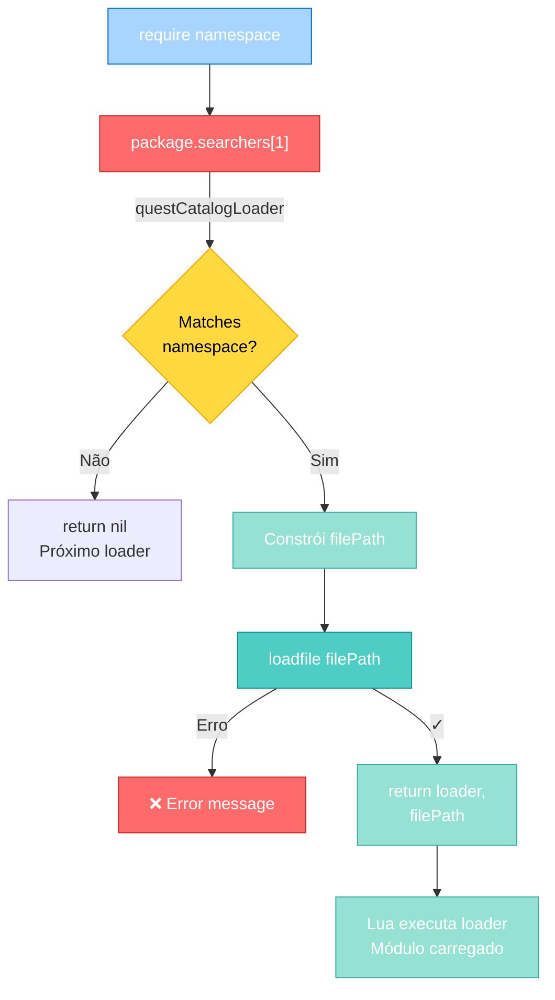
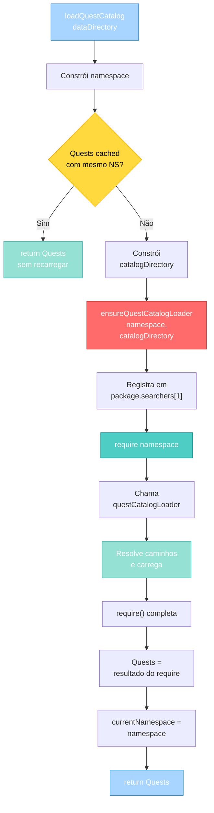
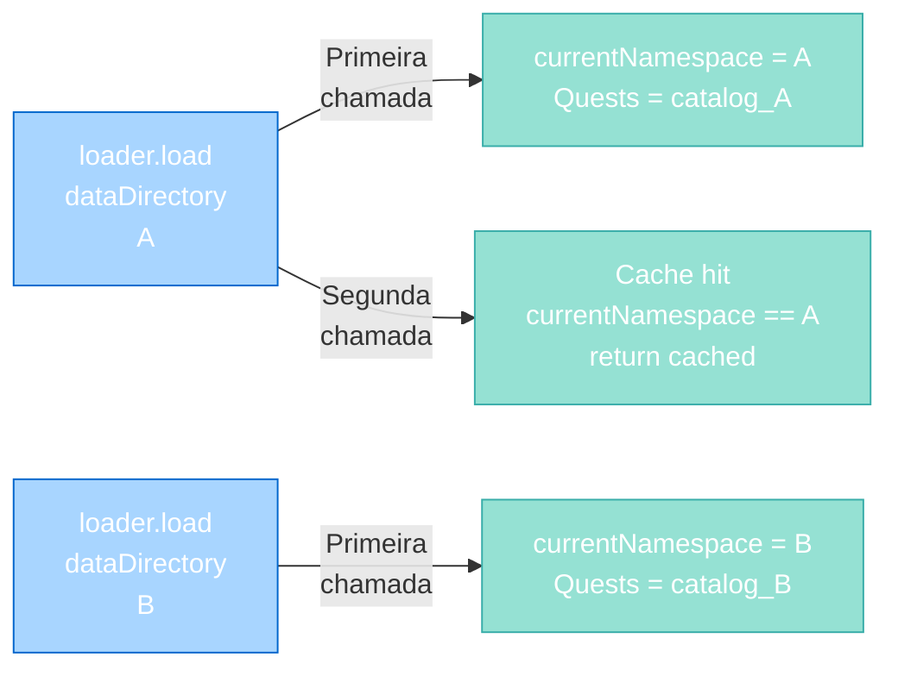

import { Aside, Card } from '@astrojs/starlight/components';

## 🛠️ Informações do Arquivo

Este é o arquivo de **carregamento dinâmico de catálogo de quests** do servidor **OpenTibiaBR/Canary**. Ele é responsável por registrar um loader customizado de módulos Lua e carregar de forma inteligente quests a partir de um diretório configurável.

<Card title="Caminho Original" icon="document">
  `data/lib/core/quests/loader.lua`
</Card>

<Aside type="tip">
  Este arquivo é carregado durante a inicialização do servidor e fornece a função `load()` que configura o sistema de carregamento de quests. Usa `package.searchers` para interceptar `require()` calls e resolver caminhos de forma customizada.
</Aside>

## 📄 Visão Geral do Código

### Resumo Executivo

`loader.lua` é um módulo de **carregamento dinâmico de quests**. Ele:

1. **Registra um loader customizado**: Injeta uma função em `package.searchers` para interceptar `require()` calls
2. **Resolve caminhos dinamicamente**: Converte nomes de módulos (ex: `"my_quests.ancient_dragon"`) em caminhos de arquivo
3. **Cacheia catálogos carregados**: Evita recarregar o mesmo catálogo múltiplas vezes
4. **Fornece abstração de diretórios**: Permite mudar onde as quests são carregadas sem alterar imports

O arquivo exporta uma única função pública: `load(dataDirectory)` que retorna o catálogo de quests carregado.

### Como o Sistema de Loader Funciona



---

## 3. Variáveis Globais e Locais

### 3.1 Variáveis Locais

#### `currentNamespace`

```lua
local currentNamespace
```

| Propriedade | Valor |
|-------------|-------|
| **Tipo** | string ou nil |
| **Escopo** | Local ao módulo |
| **Inicialização** | nil (indefinido até primeiro carregamento) |
| **Propósito** | Cache do namespace carregado atualmente |

**Descrição**: Rastreia qual namespace foi carregado pela última vez. Usado para evitar recarregar o mesmo catálogo múltiplas vezes em `loadQuestCatalog()`.

**Exemplo Interno**:
```lua
currentNamespace = "data.lib.core.quests.catalog"

-- Próxima chamada com mesmo dataDirectory
if Quests and currentNamespace == namespace then
    return Quests  -- Retorna cached, não recarrega
end
```

---

## 4. Funções Locais

### 4.1 `ensureQuestCatalogLoader(namespace, catalogDirectory)`

Registra um loader customizado na tabela `package.searchers` para interceptar `require()` calls.

#### Assinatura
```lua
function ensureQuestCatalogLoader(namespace, catalogDirectory)
```

#### Parâmetros

| Parâmetro | Tipo | Descrição |
|-----------|------|-----------|
| **namespace** | string | Namespace Lua (ex: `"my_quests"`) |
| **catalogDirectory** | string | Caminho do sistema de arquivos para pasta de quests |

#### Comportamento Passo a Passo

1. Obtém tabela de searchers (`package.searchers` ou `package.loaders` em Lua 5.1)
2. Cria nome de registro: `loaderRegistryName = namespace .. ".loader"`
3. Verifica se loader já foi registrado em `package.loaded[loaderRegistryName]`
   - Se sim, retorna imediatamente (evita duplicatas)
4. Obtém separador de diretório do SO: `package.config:sub(1,1)` ("/" em Unix, "\\" em Windows)
5. **Define função local `questCatalogLoader(moduleName)`**:
   - Verifica se `moduleName` corresponde ao namespace
   - Constrói `filePath` com base em `moduleName`
   - Usa `loadfile()` para carregar o arquivo
   - Retorna `loader, filePath` ou erro
6. Adiciona `questCatalogLoader` como **primeiro** searcher: `table.insert(searchers, 1, questCatalogLoader)`
7. Marca como registrado: `package.loaded[loaderRegistryName] = true`

#### Função Interna: `questCatalogLoader(moduleName)`

```lua
local function questCatalogLoader(moduleName)
    if moduleName ~= namespace and moduleName:sub(1, #prefix) ~= prefix then
        return nil
    end
    local filePath
    if moduleName == namespace then
        filePath = catalogDirectory .. dirSeparator .. "init.lua"
    else
        local relative = moduleName:sub(#prefix + 1):gsub("%.", dirSeparator)
        filePath = catalogDirectory .. dirSeparator .. relative .. ".lua"
    end
    local loader, errorMessage = loadfile(filePath)
    if not loader then
        return "\n\t" .. errorMessage
    end
    return loader, filePath
end
```

**Lógica de Resolução de Caminho**:

| Caso | Entrada | Saída |
|------|---------|-------|
| **Exato** | `namespace = "quests"` | `catalogDirectory/init.lua` |
| **Submodule** | `"quests.ancient_dragon"` | `catalogDirectory/ancient_dragon.lua` |
| **Aninhado** | `"quests.dragons.ancient_dragon"` | `catalogDirectory/dragons/ancient_dragon.lua` |

**Exemplo Prático**:
```lua
ensureQuestCatalogLoader("quests", "/data/lib/core/quests/catalog")

-- Quando Lua executa:
require("quests")
-- questCatalogLoader("quests") é chamado
-- Retorna:
--   loader = loadfile("/data/lib/core/quests/catalog/init.lua")
--   filePath = "/data/lib/core/quests/catalog/init.lua"

require("quests.ancient_dragon")
-- questCatalogLoader("quests.ancient_dragon") é chamado
-- Extrai "ancient_dragon" de "quests.ancient_dragon"
-- Retorna:
--   loader = loadfile("/data/lib/core/quests/catalog/ancient_dragon.lua")
--   filePath = "/data/lib/core/quests/catalog/ancient_dragon.lua"

require("quests.raids.dragon_boss")
-- questCatalogLoader("quests.raids.dragon_boss") é chamado
-- Extrai "raids.dragon_boss"
-- Substitui "." por separador de diretório
-- Retorna:
--   loader = loadfile("/data/lib/core/quests/catalog/raids/dragon_boss.lua")
--   filePath = "/data/lib/core/quests/catalog/raids/dragon_boss.lua"
```

#### Erro Gerado

Se o arquivo não existe:
```
[loader attempt #N] /non/existent/path/quest.lua: No such file or directory
```

---

### 4.2 `loadQuestCatalog(dataDirectory)`

Carrega o catálogo de quests, registrando o loader e usando caching.

#### Assinatura
```lua
function loadQuestCatalog(dataDirectory)
```

#### Parâmetros

| Parâmetro | Tipo | Descrição |
|-----------|------|-----------|
| **dataDirectory** | string | Prefixo do datapack (ex: `"data"`) |

#### Retorno

```lua
Quests  -- Catálogo de quests carregado (retorna do require)
```

#### Comportamento Passo a Passo

1. Obtém separador de diretório: `dirSeparator = package.config:sub(1, 1)`
2. Constrói namespace completo: `namespace = dataDirectory .. ".lib.core.quests.catalog"`
3. **Verifica cache**:
   - Se `Quests` existe E `currentNamespace == namespace`, retorna `Quests` cached
4. Constrói caminho do catálogo: `catalogDirectory = "dataDirectory/lib/core/quests/catalog"`
5. **Registra loader customizado**: `ensureQuestCatalogLoader(namespace, catalogDirectory)`
6. **Carrega catálogo**: `Quests = require(namespace)`
   - Usa loader registrado para resolver caminhos
7. **Atualiza cache**: `currentNamespace = namespace`
8. Retorna `Quests`

#### Ciclo Completo (Diagrama)



#### Exemplo Prático

```lua
local loader = require("lib.core.quests.loader")

-- Primeira chamada
local Quests = loader.load("data")
-- 1. Constrói namespace "data.lib.core.quests.catalog"
-- 2. Registra loader em package.searchers[1]
-- 3. Executa require("data.lib.core.quests.catalog")
-- 4. Carrega catálogo da pasta data/lib/core/quests/catalog/
-- 5. currentNamespace = "data.lib.core.quests.catalog"
-- 6. Retorna Quests

-- Segunda chamada com mesmo dataDirectory
local Quests2 = loader.load("data")
-- 1. Verifica: Quests existe? Sim
-- 2. Verifica: currentNamespace == "data.lib.core.quests.catalog"? Sim
-- 3. return Quests (sem recarregar!)

-- Chamada com novo dataDirectory
local Quests3 = loader.load("data-otservbr-global")
-- 1. namespace = "data-otservbr-global.lib.core.quests.catalog"
-- 2. currentNamespace muda, recarrega
-- 3. Retorna novo Quests do novo datapack
```

#### Erros Possíveis

```lua
-- Se package.searchers não conseguir carregar o módulo:
error("module 'data.lib.core.quests.catalog' not found")

-- Se o arquivo init.lua não existe:
error("[loader attempt #N] /path/to/catalog/init.lua: No such file or directory")
```

---

## 5. Funções Globais (Exportadas)

### 5.1 `load(dataDirectory)`

Função pública que carrega o catálogo de quests para um datapack específico.

#### Assinatura
```lua
function load(dataDirectory)
    return loadQuestCatalog(dataDirectory)
end
```

#### Parâmetros

| Parâmetro | Tipo | Descrição |
|-----------|------|-----------|
| **dataDirectory** | string | Nome do datapack (ex: `"data"`, `"data-otservbr-global"`) |

#### Retorno

```lua
Quests  -- Tabela de catálogo de quests conforme definido em catalog.lua
```

#### Uso Típico

```lua
local loader = require("lib.core.quests.loader")

-- Carregar quests do datapack principal
local Quests = loader.load("data")

-- Usar o catálogo
for i, quest in ipairs(Quests) do
    print(quest.name)
end
```

---

## 6. Sistema de Caching

### Como o Caching Funciona

O sistema mantém duas formas de cache:

1. **Cache Local**: `currentNamespace`
   - Rastreia qual namespace foi carregado
   - Se mesmo namespace for solicitado, retorna sem recarregar

2. **Cache do Lua**: `package.loaded[loaderRegistryName]`
   - Marca que o loader foi registrado
   - Evita registrar múltiplas vezes o mesmo loader

3. **Cache Global**: `Quests`
   - Armazena o catálogo carregado globalmente
   - Acessível como `_G.Quests` após primeira chamada

#### Diagrama de Cache



---

## 7. Integração com `package.searchers`

### O que é `package.searchers`?

`package.searchers` (em Lua 5.2+) ou `package.loaders` (em Lua 5.1) é uma tabela que contém funções para localizar módulos Lua. Quando você chama `require("modulo")`, Lua chama cada searcher até encontrar o módulo.

### Por que registrar em `table.insert(searchers, 1, ...)`?

Inserir na **posição 1** (antes de todos os outros) significa:

- Nosso loader é procurado **primeiro**
- Ele intercepta `require()` calls para quests
- Se não é um quest, retorna `nil` deixando outros loaders tentarem
- Garante que caminhos de quest são resolvidos corretamente

**Exemplo**:
```lua
require("quests.ancient_dragon")
-- package.searchers[1] = questCatalogLoader
-- questCatalogLoader("quests.ancient_dragon") → encontra arquivo
-- Lua executa arquivo e carrega como módulo

require("json")
-- package.searchers[1] = questCatalogLoader
-- questCatalogLoader("json") → retorna nil (não é quest)
-- package.searchers[2] = searcherEmC
-- searcherEmC("json") → encontra arquivo json.lua/so
-- Lua carrega json normalmente
```

---

## 8. Exemplos Práticos

### Exemplo 1: Carregar Quests do Datapack Principal

```lua
local loader = require("lib.core.quests.loader")

-- Carrega catálogo
local questCatalog = loader.load("data")

-- Acessar quest por índice
print(questCatalog[1].name)

-- Iterar todas as quests
for i, quest in ipairs(questCatalog) do
    print(string.format("Quest %d: %s", i, quest.name))
end
```

### Exemplo 2: Carregar Quests de Múltiplos Datapacks

```lua
local loader = require("lib.core.quests.loader")

-- Carregar quests do servidor principal
local mainQuests = loader.load("data")
print("Main quests:", #mainQuests)

-- Carregar quests globais (pode alternar entre datapacks)
local globalQuests = loader.load("data-otservbr-global")
print("Global quests:", #globalQuests)

-- Voltar para principal (usa cache)
local mainQuests2 = loader.load("data")
print("Main quests (cached):", #mainQuests2)
assert(mainQuests == mainQuests2, "Should be same object from cache")
```

### Exemplo 3: Estrutura de Diretórios

Se você tiver esta estrutura:

```
data/
└── lib/
    └── core/
        └── quests/
            └── catalog/
                ├── init.lua                    -- require("data.lib.core.quests.catalog")
                ├── ancient_dragon.lua          -- require("data.lib.core.quests.catalog.ancient_dragon")
                ├── mystery.lua                 -- require("data.lib.core.quests.catalog.mystery")
                └── raids/
                    ├── dragon_boss.lua         -- require("data.lib.core.quests.catalog.raids.dragon_boss")
                    └── the_lost_temple.lua     -- require("data.lib.core.quests.catalog.raids.the_lost_temple")
```

O loader resolve automaticamente:

```lua
local loader = require("lib.core.quests.loader")
local Quests = loader.load("data")

-- init.lua é executado primeiro, exporta o catálogo
-- Quests agora contém todas as quests carregadas
```

---

## 9. Detalhes Técnicos

### 9.1 Detecção de Sistema de Arquivos

```lua
local dirSeparator = package.config:sub(1, 1)
```

`package.config` é uma string contendo informações de configuração do Lua:

- **Posição 1**: Separador de diretório (`/` em Unix, `\` em Windows)
- **Posição 2**: Separador de path (`:`/`;`)
- **Posição 3**: Marker de prefixo (`?`)
- **Posição 4**: Newline

Esta solução é **portável** e **automaticamente detecta** o SO.

### 9.2 Comparação de Namespace

```lua
if moduleName ~= namespace and moduleName:sub(1, #prefix) ~= prefix then
    return nil
end
```

Verifica **dois casos**:

1. **Exato**: `moduleName == namespace` (ex: `"quests"`)
2. **Prefixo**: `moduleName` começa com `namespace ..` (ex: `"quests.xyz"`)

Se não passar, retorna `nil` deixando outro loader tentar.

### 9.3 Substituição de Pontos por Separadores

```lua
local relative = moduleName:sub(#prefix + 1):gsub("%.", dirSeparator)
```

Converte:
- `"quests.raids.dragon"` → `"raids/dragon"` (Unix)
- `"quests.raids.dragon"` → `"raids\dragon"` (Windows)

---

## 10. Padrões e Boas Práticas

### ✅ Usar loader.load() Uma Vez na Inicialização

```lua
-- ✓ BOM: Carregar uma vez no boot
_G.QuestCatalog = loader.load("data")

-- Scripts acessam via _G.QuestCatalog
```

**Por quê?** Otimiza performance. Cache só funciona se você reutilizar a mesma chamada.

---

### ✅ Nomeação de Namespace Clara

```lua
-- ✓ BOM: Reflete a estrutura de diretórios
loader.load("data")
loader.load("data-otservbr-global")

-- ✗ RUIM: Nomes ambíguos
loader.load("q")
loader.load("main")
```

---

### ✅ Estrutura de Catálogo Hierárquica

```
catalog/
├── init.lua              -- Raiz, carrega todas as quests
├── beginner/
│   ├── first_steps.lua
│   └── tutorial.lua
├── raids/
│   ├── dragon_lair.lua
│   └── ancient_temple.lua
└── events/
    ├── seasonal.lua
    └── special.lua
```

Permite:
```lua
require("data.lib.core.quests.catalog.raids.dragon_lair")
```

---

### ✅ Evitar Recarregar Catálogos

```lua
-- ✓ BOM: Reusa cache
local Quests = loader.load("data")
-- ... depois
local Quests2 = loader.load("data")  -- Usa cache, não recarrega

-- ✗ RUIM: Chama múltiplas vezes sem necessidade
for i = 1, 100 do
    local q = loader.load("data")  -- Mesma coisa 100 vezes!
end
```

---

## 11. Referência Rápida

### Export do Módulo

```lua
return {
    load = loadQuestCatalog,
}
```

Apenas 1 função pública: `load(dataDirectory)`

### Assinatura

```lua
local loader = require("lib.core.quests.loader")
local questCatalog = loader.load("data")
```

### Variáveis Globais Criadas

| Variável | Tipo | Propósito |
|----------|------|-----------|
| **Quests** | table | Catálogo de quests global |
| **currentNamespace** | string | Cache do namespace (local) |

### Variáveis de Sistema Consultadas

| Variável | Propósito |
|----------|-----------|
| **package.config** | Detectar separador de diretório |
| **package.searchers** | Registrar loader customizado |
| **package.loaded** | Verificar se loader já foi registrado |

---

## 12. Checkpoint: O que foi Carregado até Aqui

Após `loader.lua` ser carregado, o servidor tem:

✅ **Função de carregamento**: `loader.load(dataDirectory)`  
✅ **Sistema de resolução de caminhos**: Mapeia `require()` para arquivos de quest  
✅ **Caching inteligente**: Evita recarregar catálogos  
✅ **Portabilidade de SO**: Detecta separadores automaticamente  

### Uso Típico

```lua
-- Em data/lib/quests.lua ou similar
local loader = require("lib.core.quests.loader")

-- Carregue uma vez na inicialização
_G.Quests = loader.load("data")

-- Agora em qualquer script você usa:
local questName = _G.Quests[1].name
```

---

## 13. Conclusão

`loader.lua` é o **sistema de carregamento dinâmico de quests** do Canary. Implementa padrão de **Dynamic Module Loading with Custom Resolvers**:

### Pontos Importantes

1. **Loader Customizado**: Registra em `package.searchers[1]` para interceptar `require()`
2. **Resolução de Caminhos**: Converte nomes de módulos em caminhos de arquivo
3. **Caching Inteligente**: Evita recarregar o mesmo catálogo
4. **Portabilidade**: Funciona em Windows, Linux, macOS automaticamente
5. **Separação de Datapacks**: Permite carregar quests de múltiplos datapacks

### Use Para

- ✅ Carregar catálogo de quests na inicialização
- ✅ Alternar entre datapacks dinamicamente
- ✅ Resolver caminhos de quest de forma segura
- ✅ Implementar hot-reload de configurações (avançado)
- ✅ Estender o sistema de módulos Lua

### Padrão Arquitetural

O módulo implementa **Custom Module Loader Pattern**:
- Intercepta `require()` calls
- Resolve caminhos conforme regras customizadas
- Integra-se transparentemente com sistema Lua nativo
- Fornece caching para otimização

---

## 🤖 Informações da Documentação

<Aside type="note">
  Esta documentação foi **gerada automaticamente por IA** (Claude Haiku 4.5) utilizando análise estática de código. Todas as explicações técnicas foram produzidas por processamento inteligente do código-fonte, garantindo precisão e consistência com o padrão de documentação Starlight/Astro do projeto.
</Aside>

**Última Atualização**: Baseado no servidor **OpenTibiaBR/Canary** (Fork do OTServBR-Global)

**Repositório**: [opentibiabr/canary](https://github.com/opentibiabr/canary)

**Documentação técnica de loader.lua**  
*Parte da série de documentação do Canary Engine*
