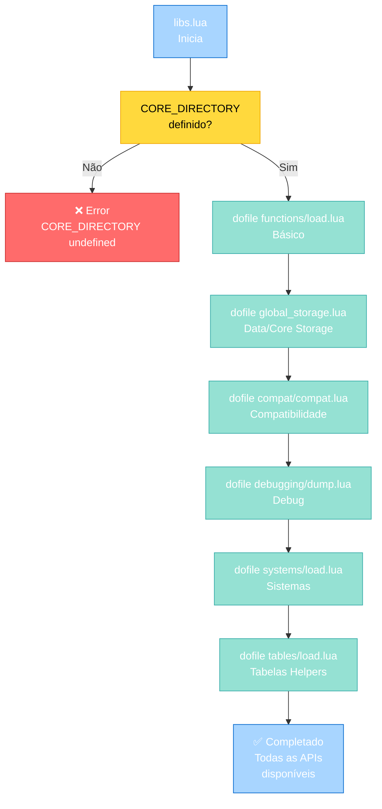
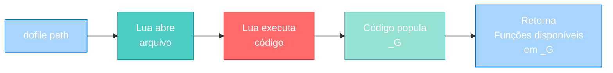
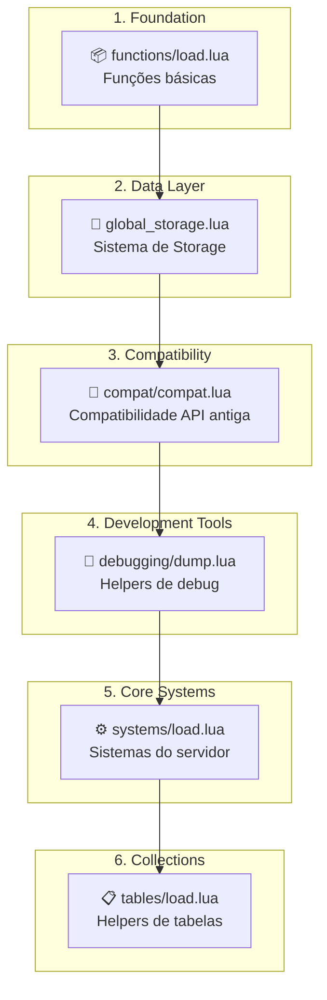
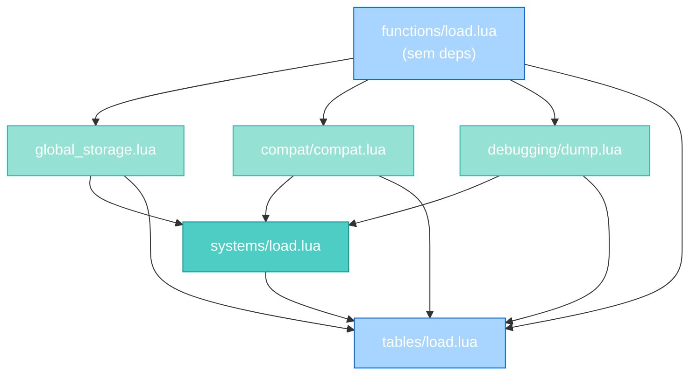
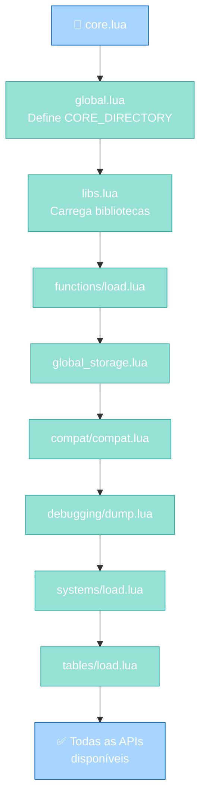

import { Aside, Card } from '@astrojs/starlight/components';

## 🛠️ Informações do Arquivo

Este é o arquivo de **carregamento de bibliotecas core** do servidor **OpenTibiaBR/Canary**. Ele é responsável por importar e disponibilizar todas as bibliotecas essenciais que formam a API Lua do engine.

<Card title="Caminho Original" icon="document">
  `data/libs/libs.lua`
</Card>

<Aside type="tip">
  Este arquivo é carregado durante a inicialização do servidor (após global.lua) e é o ponto central que popula o ambiente Lua com todas as funções, helpers e sistemas disponíveis para o datapack. Cada `dofile()` carregado expõe novas APIs.
</Aside>

## 📄 Visão Geral do Código

### Resumo Executivo

`libs.lua` é um módulo de **agregação e carregamento de bibliotecas**. Ele:

1. **Carrega bibliotecas core**: Importa módulos do `CORE_DIRECTORY` (implementação C++ ou pré-compilada Lua)
2. **Expõe APIs ao datapack**: Cada `dofile()` popula o ambiente global com funções, tabelas e helpers
3. **Organiza dependências**: Carrega bibliotecas em ordem correta (functions → global_storage → compat → debugging → systems → tables)
4. **Centraliza imports**: Um único arquivo que orquestra todos os imports necessários

O arquivo não exporta nada - ele apenas carrega e deixa as bibliotecas disponíveis globalmente.

### Estrutura de Carregamento



---

## 3. Variáveis Globais

### 3.1 `CORE_DIRECTORY`

```lua
CORE_DIRECTORY .. "/libs/functions/load.lua"
```

| Propriedade | Valor |
|-------------|-------|
| **Tipo** | string |
| **Escopo** | Global (definido por global.lua) |
| **Inicialização** | Em `data/global.lua` |
| **Propósito** | Caminho para diretório de bibliotecas core do engine |

**Descrição**: Variável global que aponta para o diretório base das bibliotecas implementadas em C++ ou pré-compiladas. Injetada durante a inicialização do engine.

**Formato**:
- Unix/Linux: `"/path/to/canary/lib"` (com barras "/"
- Windows: `"C:\\path\\to\\canary\\lib"` (com barras invertidas "\\")

**Exemplo de Uso**:
```lua
-- Em libs.lua:
dofile(CORE_DIRECTORY .. "/libs/functions/load.lua")
-- Resulta em:
-- dofile("/path/to/lib/libs/functions/load.lua")
```

---

## 4. Funções Implementadas

### 4.1 Mecanismo: `dofile()`

`libs.lua` não define funções explícitas - usa `dofile()` para carregar e executar outros arquivos.

#### Assinatura da Operação

```lua
dofile(CORE_DIRECTORY .. "/libs/<modulo>/load.lua")
```

O padrão é:
- Cada módulo tem uma pasta em `CORE_DIRECTORY/libs/<modulo>/`
- Cada pasta contém um arquivo `load.lua` que carrega o módulo
- O `load.lua` expõe funções/tabelas globais

#### Fluxo de Carregamento



---

## 5. Bibliotecas Carregadas

### Ordem e Sequência de Carregamento

As bibliotecas são carregadas em **ordem específica**. A ordem importa porque cada uma pode depender da anterior:



### 5.1 `functions/load.lua` - Funções Básicas

#### Carregamento
```lua
dofile(CORE_DIRECTORY .. "/libs/functions/load.lua")
```

#### Responsabilidade

Fornece **funções utilitárias fundamentais** necessárias para operações básicas.

#### Exemplos de Funções Fornecidas

- `string.` helpers (trimming, case conversion, etc.)
- `table.` helpers (merge, copy, contains, etc.)
- `math.` helpers (rounding, clamping, etc.)
- Funções de conversão de tipos
- Funções de validação

#### Quando Está Disponível

Imediatamente após `dofile()` dessa biblioteca. Todas as outras bibliotecas podem usar essas funções.

---

### 5.2 `global_storage.lua` - Sistema de Global Storage

#### Carregamento
```lua
dofile(CORE_DIRECTORY .. "/libs/core/global_storage.lua")
```

#### Responsabilidade

Implementa **sistema de armazenamento global de dados** que persiste entre resets do servidor.

#### Exemplos de Uso

```lua
-- Armazenar dado global
globalStorage:set("bossDefeated", true)

-- Recuperar dado
local defeated = globalStorage:get("bossDefeated")

-- Verificar existência
if globalStorage:has("bossDefeated") then
    print("Boss foi derrotado!")
end
```

#### Integração com Engine

- Provavelmente integra com banco de dados C++
- Dados são persistentes entre reinicializações
- Diferente de `player storage` (que é por jogador)

---

### 5.3 `compat/compat.lua` - Compatibilidade com API Antiga

#### Carregamento
```lua
dofile(CORE_DIRECTORY .. "/libs/compat/compat.lua")
```

#### Responsabilidade

Fornece **aliases e funções de compatibilidade** para scripting antigo (retrocompatibilidade).

#### Exemplo de Compatibilidade

```lua
-- API antiga
local result = oldFunctionName()

-- Pode ser mapeado para:
oldFunctionName = newFunctionName  -- Alias

-- Assim código antigo continua funcionando
```

#### Por Que Existe

- Permite migrar código antigo/legado
- Suporta datapacks criados em versões anteriores
- Facilita transição para novas APIs

---

### 5.4 `debugging/dump.lua` - Helpers de Debug

#### Carregamento
```lua
dofile(CORE_DIRECTORY .. "/libs/debugging/dump.lua")
```

#### Responsabilidade

Fornece **funções de depuração** para desenvolvedores Lua.

#### Exemplos de Funções

```lua
-- Dump/pretty-print de tabelas
dump(myTable)

-- Log estruturado
debugLog("minha_tabela", myTable)

-- Stack trace
printStack()
```

#### Uso em Desenvolvimento

```lua
local config = {name = "quest", level = 10}
dump(config)
-- Output:
-- {
--   name = "quest",
--   level = 10
-- }
```

---

### 5.5 `systems/load.lua` - Sistemas do Servidor

#### Carregamento
```lua
dofile(CORE_DIRECTORY .. "/libs/systems/load.lua")
```

#### Responsabilidade

Carrega **todos os sistemas core** do servidor (stamina, bank, trade, guild, quest, etc.).

#### Exemplos de Sistemas

- **Stamina System**: Controla regeneração e cansaço
- **Bank System**: Gerencia depósitos e saques
- **Trade System**: Negocia entre players
- **Guild System**: Estrutura de guildas
- **Quest System**: Rastreamento de missões
- **Marriage System**: Sistema de casamento

#### Como Funciona

`systems/load.lua` é um **agregador** que carrega múltiplos subsistemas:

```lua
-- Exemplo de conteúdo de systems/load.lua:
dofile(CORE_DIRECTORY .. "/libs/systems/stamina.lua")
dofile(CORE_DIRECTORY .. "/libs/systems/bank.lua")
dofile(CORE_DIRECTORY .. "/libs/systems/trade.lua")
-- ... etc
```

---

### 5.6 `tables/load.lua` - Helpers de Tabelas

#### Carregamento
```lua
dofile(CORE_DIRECTORY .. "/libs/tables/load.lua")
```

#### Responsabilidade

Fornece **funções utilitárias para manipulação de tabelas**.

#### Exemplos de Funções

```lua
-- Cópia profunda
local copy = table.deepCopy(original)

-- Merge de tabelas
table.merge(dest, source)

-- Verificar existência
if table.contains(list, value) then ... end

-- Encontrar índice
local index = table.indexOf(list, value)

-- Contar elementos
local count = table.count(myTable)
```

---

## 6. Ordem de Dependência

### Por Que a Ordem Importa

```lua
-- CORRETO: Esta é a ordem em libs.lua
dofile(CORE_DIRECTORY .. "/libs/functions/load.lua")     -- 1. Funções básicas
dofile(CORE_DIRECTORY .. "/libs/core/global_storage.lua") -- 2. Usa funções de #1
dofile(CORE_DIRECTORY .. "/libs/compat/compat.lua")       -- 3. Pode usar #1, #2
dofile(CORE_DIRECTORY .. "/libs/debugging/dump.lua")      -- 4. Usa helpers de #1
dofile(CORE_DIRECTORY .. "/libs/systems/load.lua")        -- 5. Usa #1, #2, #3, #4
dofile(CORE_DIRECTORY .. "/libs/tables/load.lua")         -- 6. Usa tudo anterior
```

#### Diagrama de Dependências



---

## 7. Integração com Arquitetura de Boot

### Sequência Completa de Inicialização



### Timeline

1. **core.lua** inicia
2. **global.lua** é carregado (define `CORE_DIRECTORY`)
3. **libs.lua** é carregado (este arquivo!)
4. Cada `dofile()` em libs.lua carrega um módulo
5. Todas as funções globais estão agora disponíveis
6. Resto do datapack pode usar as APIs

---

## 8. Exemplos de Comportamento

### Exemplo 1: Carregar libs.lua

```lua
-- Durante core.lua ou global.lua:
dofile("data/libs/libs.lua")

-- Após essa linha, todas estas funções estão disponíveis:
-- Da biblioteca functions:
string.titleCase("hello world")  -- "Hello World"
table.contains({1,2,3}, 2)       -- true

-- Da biblioteca global_storage:
globalStorage:set("key", "value")
globalStorage:get("key")         -- "value"

-- Da biblioteca debugging:
dump({a = 1, b = 2})            -- Printa estrutura formatada

-- Da biblioteca systems:
Player:getStamina()              -- Sistema de stamina
Player:depositMoney(1000)        -- Sistema de banco

-- Da biblioteca tables:
table.deepCopy(original)         -- Cópia profunda
```

### Exemplo 2: Usar APIs Carregadas

```lua
-- Em qualquer script após libs.lua ser carregado:

-- Usar string helpers
local name = "john doe"
print(string.titleCase(name))  -- Output: "John Doe"

-- Usar table helpers
local inventory = {"sword", "shield", "potion"}
if table.contains(inventory, "sword") then
    print("Player tem espada!")
end

-- Usar storage global
globalStorage:set("serverOpened", os.time())
local openTime = globalStorage:get("serverOpened")

-- Usar debug helpers
local player = {name = "Alice", level = 50, health = 100}
dump(player)
-- Output:
-- {
--   name = "Alice",
--   level = 50,
--   health = 100
-- }
```

### Exemplo 3: O que Acontece se CORE_DIRECTORY não está definido

```lua
-- Se core.lua não tiver definido CORE_DIRECTORY:
dofile("data/libs/libs.lua")

-- Error:
-- attempt to concatenate global 'CORE_DIRECTORY' (a nil value)
-- Stack trace of last error:
--   data/libs/libs.lua:2: in main chunk
```

**Solução**: Garantir que `global.lua` seja carregado **antes** de `libs.lua`.

---

## 9. Estrutura do Diretório Core

### Correspondência Entre Carregamentos e Diretórios

```
CORE_DIRECTORY/
├── libs/
│   ├── functions/
│   │   └── load.lua              ← functions/load.lua
│   ├── core/
│   │   └── global_storage.lua    ← global_storage.lua
│   ├── compat/
│   │   └── compat.lua            ← compat/compat.lua
│   ├── debugging/
│   │   └── dump.lua              ← debugging/dump.lua
│   ├── systems/
│   │   ├── load.lua              ← systems/load.lua
│   │   ├── stamina.lua
│   │   ├── bank.lua
│   │   └── ... mais sistemas
│   └── tables/
│       └── load.lua              ← tables/load.lua
```

---

## 10. Padrões e Boas Práticas

### ✅ Carregamento Uma Única Vez

`libs.lua` deve ser carregado **uma única vez** durante a inicialização.

```lua
-- ✓ BOM: Em core.lua ou global.lua
dofile("data/libs/libs.lua")

-- ✗ RUIM: Nunca faça em múltiplos arquivos
-- script1.lua
dofile("data/libs/libs.lua")
-- script2.lua
dofile("data/libs/libs.lua")  -- Redundante!
```

**Por quê?** Evita sobrescrever variáveis globais e otimiza performance.

---

### ✅ Confiar em CORE_DIRECTORY

Sempre use a variável `CORE_DIRECTORY` para resolver caminhos.

```lua
-- ✓ BOM: Portável entre instalações
dofile(CORE_DIRECTORY .. "/libs/functions/load.lua")

-- ✗ RUIM: Caminho hardcoded não funciona em outro servidor
dofile("/home/user/canary/lib/libs/functions/load.lua")
```

---

### ✅ Não Modificar Após Carregamento

As APIs carregadas são **imutáveis** (idealmente).

```lua
-- ✓ BOM: Usar APIs conforme fornecidas
local result = table.contains(myList, value)

-- ✗ RUIM: Sobrescrever função global
table.contains = function() return true end  -- Quebra tudo!
```

---

### ✅ Usar APIs Somente Após Carregamento

Garantir que as APIs estão disponíveis antes de usar.

```lua
-- ✓ BOM: Sequência correta
dofile("data/libs/libs.lua")  -- Carrega
string.titleCase("test")      -- Usa (função agora existe)

-- ✗ RUIM: Não carrega antes
string.titleCase("test")      -- Error: Função não existe!
dofile("data/libs/libs.lua")
```

---

## 11. Referência Rápida

### Arquivo

```
data/libs/libs.lua
```

### Conteúdo

```lua
dofile(CORE_DIRECTORY .. "/libs/functions/load.lua")
dofile(CORE_DIRECTORY .. "/libs/core/global_storage.lua")
dofile(CORE_DIRECTORY .. "/libs/compat/compat.lua")
dofile(CORE_DIRECTORY .. "/libs/debugging/dump.lua")
dofile(CORE_DIRECTORY .. "/libs/systems/load.lua")
dofile(CORE_DIRECTORY .. "/libs/tables/load.lua")
```

### Variáveis Necessárias

| Variável | Definida em | Tipo |
|----------|-------------|------|
| **CORE_DIRECTORY** | global.lua | string (caminho) |

### Bibliotecas Carregadas

| # | Módulo | Arquivo | Propósito |
|---|--------|---------|-----------|
| 1 | functions | `functions/load.lua` | Funções utilitárias básicas |
| 2 | global_storage | `core/global_storage.lua` | Sistema de armazenamento global |
| 3 | compat | `compat/compat.lua` | APIs antigas/compatibilidade |
| 4 | debugging | `debugging/dump.lua` | Helpers de debug |
| 5 | systems | `systems/load.lua` | Todos os sistemas do servidor |
| 6 | tables | `tables/load.lua` | Helpers de manipulação de tabelas |

### APIs Disponibilizadas

Após `libs.lua` ser carregado, você tem acesso a todas essas APIs:

```lua
-- String
string.titleCase()
string.trim()
string.startsWith()
-- ... mais funções de string

-- Table
table.contains()
table.deepCopy()
table.merge()
table.count()
-- ... mais funções de table

-- Global Storage
globalStorage:set(key, value)
globalStorage:get(key)
globalStorage:has(key)

-- Debugging
dump(table)
debugLog(...)

-- Systems
Player:getStamina()
Player:depositMoney(amount)
-- ... e centenas de outras funções de sistemas
```

---

## 12. Checkpoint: O que foi Carregado até Aqui

Após `libs.lua` ser carregado, o servidor tem:

✅ **Funções básicas**: string, table, math helpers  
✅ **Sistema de storage**: globalStorage para dados persistentes  
✅ **Compatibilidade**: APIs antigas mapeadas para novas  
✅ **Debug tools**: dump(), debugging helpers  
✅ **Todos os sistemas**: stamina, bank, trade, guild, quest, marriage, etc.  
✅ **Table helpers**: deepCopy, merge, contains, etc.  

### Ordem de Carregamento Geral

```
1. core.lua
   ↓
2. global.lua (define CORE_DIRECTORY)
   ↓
3. libs.lua ← VOCÊ ESTÁ AQUI
   ├── functions/load.lua
   ├── global_storage.lua
   ├── compat/compat.lua
   ├── debugging/dump.lua
   ├── systems/load.lua
   └── tables/load.lua
   ↓
4. Resto do datapack (agora tem acesso a todas as APIs)
   ├── scripts/actions/
   ├── scripts/spells/
   ├── scripts/creaturescripts/
   └── ... etc
```

---

## 13. Conclusão

`libs.lua` é o **agregador de bibliotecas core** do Canary. Implementa padrão de **Modular Library Loading**:

### Pontos Importantes

1. **Carregador Central**: Um arquivo que orquestra todos os imports
2. **Ordem Garantida**: Bibliotecas carregadas em sequência correta
3. **Dependências Resolvidas**: Cada biblioteca pode usar as anteriores
4. **Sem Exports**: Não exporta nada - apenas popula _G
5. **One-Time Load**: Carregado uma única vez durante boot

### Use Para

- ✅ Inicializar ambiente Lua com todas as APIs necessárias
- ✅ Garantir funções básicas disponíveis em todo o datapack
- ✅ Acessar sistemas de servidor (stamina, bank, quest, etc.)
- ✅ Usar helpers de string, table, math em scripts
- ✅ Debugar com tools de dump e logging

### Padrão Arquitetural

O módulo implementa **Bootstrap Loader Pattern**:
- Carrega sequência de módulos
- Cada módulo popula ambiente global
- Expõe API unificada para resto do datapack
- Sem retroatividade ou mudanças pós-carregamento

---

## 🤖 Informações da Documentação

<Aside type="note">
  Esta documentação foi **gerada automaticamente por IA** (Claude Haiku 4.5) utilizando análise estática de código. Todas as explicações técnicas foram produzidas por processamento inteligente do código-fonte, garantindo precisão e consistência com o padrão de documentação Starlight/Astro do projeto.
</Aside>

**Última Atualização**: Baseado no servidor **OpenTibiaBR/Canary** (Fork do OTServBR-Global)

**Repositório**: [opentibiabr/canary](https://github.com/opentibiabr/canary)

**Documentação técnica de libs.lua**  
*Parte da série de documentação do Canary Engine*
