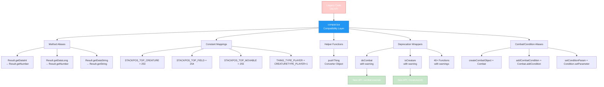

import { Aside, Card } from '@astrojs/starlight/components';

## 🛠️ Informações do Arquivo

Arquivo que implementa a **camada de compatibilidade e backward-compatibility** do GameServer. Fornece aliases para funções antigas, remapeamentos de API legada para nova, constantes de compatibilidade, e funções de deprecação com warnings que orientam desenvolvedores para novo padrão sem quebrar código existente.

<Card title="Caminho Original" icon="document">
  `data/libs/compat/compat.lua`
</Card>

<Aside type="tip">
  Arquivo gigante de compatibilidade (1604 linhas). Contém: remapeamento de Result methods (getDataInt→getNumber), constantes de stack positions (STACKPOS_TOP_CREATURE=253), type constants (THING_TYPE_PLAYER/MONSTER/NPC), helper pushThing() para converter objects, aliases de Combat/Condition (createCombatObject=Combat), 40+ funções de deprecation (doCombat, isCreature, isPlayer, isMonster, isSummon, isNpc, isItem, isContainer, getCreatureName/Health/Position/Speed/Master/Outfit, doCreatureAddHealth, etc) com logger.warn indicando novo padrão, remapeamento de aliases de funções antigas. Pattern: cada função deprecated checa tipo e direciona para new API com aviso detalhado (linha, source).
</Aside>

---

## 📄 Visão Geral do Código

### Resumo Executivo

`compat.lua` é um **arquivo crítico de compatibilidade** que permite código legado rodar em servidor novo sem quebra, enquanto orienta developers a migrar para nova API. Implementa:

1. **Method Aliases**: Result object recebe aliases para métodos (getDataInt = getNumber)
2. **Constant Compatibility**: Valores constantes referenciados por código antigo (STACKPOS_*)
3. **Helper Functions**: pushThing() para converter structures antigas
4. **Combat/Condition Aliases**: Mapeamento direto (createCombatObject = Combat)
5. **Deprecation Wrappers**: 40+ funções com warnings orientando migração
6. **Smart Forwarding**: Usa new API internamente, com debug info para rastreability

**Objetivo Principal**: **Zero-breaking migration** - código antigo funciona, mas recebe warnings mostrando padrão novo esperado.

### Estrutura de Compatibilidade



---

## 🔧 Estrutura e Componentes

### 1️⃣ Result Method Aliases

```lua
if type(result) then
    result = Result
end

result.getDataInt = result.getNumber
result.getDataLong = result.getNumber
result.getDataString = result.getString
result.getDataStream = result.getStream
```

**Propósito**: Result object (database query results) recebe aliases que apontam para métodos novos.

| Alias Antigo | Novo Método | Descrição |
|--------------|-------------|-----------|
| **getDataInt** | `getNumber` | Retorna integer |
| **getDataLong** | `getNumber` | Retorna long (Lua number) |
| **getDataString** | `getString` | Retorna string |
| **getDataStream** | `getStream` | Retorna binary stream |

**Uso Antigo**:
```lua
local result = db.query("SELECT * FROM players")
local id = result:getDataInt()  -- Antigo
```

**Uso Novo**:
```lua
local result = db.query("SELECT * FROM players")
local id = result:getNumber()   -- Novo
```

---

### 2️⃣ Stack Position Constants

```lua
STACKPOS_TOP_CREATURE = 253
STACKPOS_TOP_FIELD = 254
STACKPOS_TOP_MOVABLE_ITEM_OR_CREATURE = 255
```

**Propósito**: Constantes usadas em game logic para stack positions.

| Constante | Valor | Descrição |
|-----------|-------|-----------|
| **STACKPOS_TOP_CREATURE** | 253 | Top position para creature |
| **STACKPOS_TOP_FIELD** | 254 | Top position para field item |
| **STACKPOS_TOP_MOVABLE_ITEM_OR_CREATURE** | 255 | Highest priority |

---

### 3️⃣ Thing Type Constants

```lua
THING_TYPE_PLAYER = CREATURETYPE_PLAYER + 1
THING_TYPE_MONSTER = CREATURETYPE_MONSTER + 1
THING_TYPE_NPC = CREATURETYPE_NPC + 1
```

**Propósito**: Tipos de things no mundo do jogo.

---

### 4️⃣ Helper Function: pushThing()

```lua
function pushThing(thing)
    local t = { uid = 0, itemid = 0, type = 0, actionid = 0 }
    if thing then
        if thing:isItem() then
            t.uid = thing:getUniqueId()
            t.itemid = thing:getId()
            if ItemType(t.itemid):hasSubType() then
                t.type = thing:getSubType()
            end
            t.actionid = thing:getActionId()
        elseif thing:isCreature() then
            t.uid = thing:getId()
            t.itemid = 1
            if thing:isPlayer() then
                t.type = THING_TYPE_PLAYER
            elseif thing:isMonster() then
                t.type = THING_TYPE_MONSTER
            else
                t.type = THING_TYPE_NPC
            end
        end
    end
    return t
end
```

**Propósito**: Converte new Objects (Item, Creature) para tabela antiga com structure `{uid, itemid, type, actionid}`.

**Uso**:
```lua
local item = Item(uid)
local oldStructure = pushThing(item)  -- Tabela compatível com código antigo
```

---

### 5️⃣ Combat/Condition Aliases

```lua
createCombatObject = Combat
addCombatCondition = Combat.addCondition
setCombatArea = Combat.setArea
setCombatCallback = Combat.setCallback
setCombatFormula = Combat.setFormula
setCombatParam = Combat.setParameter

Combat.setCondition = function(...)
    logger.warn("[Combat.setCondition] - Function was renamed...")
    Combat.addCondition(...)
end

createConditionObject = Condition
setConditionParam = Condition.setParameter
setConditionFormula = Condition.setFormula
addDamageCondition = Condition.addDamage
addOutfitCondition = Condition.setOutfit
```

**Propósito**: Criar aliases para funções de Combat/Condition que mudaram de nome.

**Padrão**:
- Alguns são simples aliases (diretos)
- Outros são wrappers que logam warning

---

### 6️⃣ Deprecation Wrapper Pattern

Padrão geral para funções deprecated:

```lua
function doCombat(cid, combat, var)
    local line = debug.getinfo(2).currentline
    local source = debug.getinfo(2).source:match("@?(.*)")
    logger.warn("Deprecation Warning: The function 'doCombat(cid, combat, var)' is outdated. "
        .. "Please use the new format 'combat:execute(cid, var)'. "
        .. "Update needed at: Line {}, Source: {}.", line, source)
    return combat:execute(cid, var)
end
```

**Componentes**:

| Parte | Propósito |
|-------|-----------|
| **debug.getinfo(2)** | Obtém informação da função que chamou (stack frame 2) |
| **currentline** | Número da linha onde a função foi chamada |
| **source** | Nome do arquivo que chamou |
| **logger.warn()** | Loga warning com contexto |
| **New API call** | Executa novo padrão internamente |

**Output de Warning**:
```
[WARN] Deprecation Warning: The function 'doCombat(cid, combat, var)' is outdated. 
Please use the new format 'combat:execute(cid, var)'. 
Update needed at: Line 123, Source: data/spells/scripts/my_spell.lua.
```

---

## 📋 Funções Deprecated Implementadas

### Creature Type Checking (50+ funções)

```lua
function isCreature(cid)
    logger.warn("Deprecation Warning: The function 'isCreature(cid)' is outdated. "
        .. "Please use the new format 'Creature(cid)'...")
    return Creature(cid) ~= nil
end

function isPlayer(cid)
    logger.warn("Deprecation Warning: The function 'isPlayer(cid)' is outdated. "
        .. "Please use the new format 'Player(cid)'...")
    return Player(cid) ~= nil
end

function isMonster(cid)
    logger.warn("...")
    return Monster(cid) ~= nil
end

function isNpc(cid)
    logger.warn("...")
    return Npc(cid) ~= nil
end

function isSummon(cid)
    logger.warn("...")
    return Creature(cid):getMaster() ~= nil
end

function isItem(uid)
    logger.warn("...")
    return Item(uid) ~= nil
end

function isContainer(uid)
    logger.warn("...")
    return Container(uid) ~= nil
end
```

**Pattern de Migração**:
| Antigo | Novo | Mudança |
|--------|------|---------|
| `isCreature(cid)` | `Creature(cid) ~= nil` | Constructor check |
| `isPlayer(cid)` | `Player(cid) ~= nil` | Constructor check |
| `isItem(uid)` | `Item(uid) ~= nil` | Constructor check |

---

### Creature Property Getters (20+ funções)

```lua
function getCreatureName(cid)
    logger.warn("...")
    local c = Creature(cid)
    return c and c:getName() or false
end

function getCreatureHealth(cid)
    logger.warn("...")
    local c = Creature(cid)
    return c and c:getHealth() or false
end

function getCreatureMaxHealth(cid)
    logger.warn("...")
    local c = Creature(cid)
    return c and c:getMaxHealth() or false
end

function getCreaturePosition(cid)
    logger.warn("...")
    local c = Creature(cid)
    return c and c:getPosition() or false
end

function getCreatureOutfit(cid)
    logger.warn("...")
    local c = Creature(cid)
    return c and c:getOutfit() or false
end

function getCreatureSpeed(cid)
    logger.warn("...")
    local c = Creature(cid)
    return c and c:getSpeed() or false
end

function getCreatureTarget(cid)
    logger.warn("...")
    local c = Creature(cid)
    if c then
        local target = c:getTarget()
        return target and target:getId() or 0
    end
    return false
end

function getCreatureMaster(cid)
    logger.warn("...")
    local c = Creature(cid)
    if c then
        local master = c:getMaster()
        return master and master:getId() or c:getId()
    end
    return false
end
```

**Pattern de Migração**:
| Antigo | Novo |
|--------|------|
| `getCreatureName(cid)` | `Creature(cid):getName()` |
| `getCreatureHealth(cid)` | `Creature(cid):getHealth()` |
| `getCreaturePosition(cid)` | `Creature(cid):getPosition()` |
| `getCreatureTarget(cid)` | `Creature(cid):getTarget():getId()` |
| `getCreatureMaster(cid)` | `Creature(cid):getMaster():getId()` |

---

### Creature Action Functions (20+ funções)

```lua
function doCreatureAddHealth(cid, health)
    logger.warn("...")
    local c = Creature(cid)
    return c and c:addHealth(health) or false
end

function doRemoveCreature(cid)
    logger.warn("...")
    local c = Creature(cid)
    return c and c:remove() or false
end

function doCreatureSetLookDir(cid, direction)
    logger.warn("...")
    local c = Creature(cid)
    return c and c:setDirection(direction) or false
end

function doCreatureSay(cid, text, type, ...)
    local c = Creature(cid)
    return c and c:say(text, type, ...) or false
end

function doCreatureChangeOutfit(cid, outfit)
    local c = Creature(cid)
    return c and c:setOutfit(outfit) or false
end

function doAddCondition(cid, conditionId)
    local c = Creature(cid)
    return c and c:addCondition(conditionId) or false
end

function doRemoveCondition(cid, conditionType, subId)
    local c = Creature(cid)
    return c and (c:removeCondition(conditionType, CONDITIONID_COMBAT, subId) 
        or c:removeCondition(conditionType, CONDITIONID_DEFAULT, subId) or true)
end
```

**Pattern de Migração**:
| Antigo | Novo |
|--------|------|
| `doCreatureAddHealth(cid, health)` | `Creature(cid):addHealth(health)` |
| `doRemoveCreature(cid)` | `Creature(cid):remove()` |
| `doCreatureSetLookDir(cid, dir)` | `Creature(cid):setDirection(dir)` |
| `doCreatureSay(cid, text, type)` | `Creature(cid):say(text, type)` |
| `doAddCondition(cid, condId)` | `Creature(cid):addCondition(condId)` |

---

## ✅ Checkpoint de Aprendizagem

### Conceitos Principais

1. **Backward Compatibility**: Código antigo funciona sem modificação
2. **Deprecation Pattern**: Warnings orientam migração sem quebra imediata
3. **Debug Context**: Line/source rastreabilidade para fácil localização
4. **Smart Forwarding**: Internamente usa new API, externamente expõe old interface
5. **Soft Migration**: Warnings incrementam até removal em versão futura

### Design Patterns

- **Alias Pattern**: Simples renomeação de funções
- **Wrapper Pattern**: Função antiga encapsula nova, com logging
- **Constructor Check**: `Creature(cid) ~= nil` vs `isCreature(cid)`
- **Method Chaining**: `Creature(cid):getName()` vs `getCreatureName(cid)`
- **Stack Trace Extraction**: `debug.getinfo(2)` para rastreabilidade

### Estratégia de Migração

| Fase | Ação | Efeito |
|------|------|--------|
| **T0 (hoje)** | Código antigo usa old API | Funciona mas loga warning |
| **T1 (versão N+1)** | Developers veem warnings, migram | Efetuam mudanças no código |
| **T2 (versão N+2)** | Remove compat layer | Código antigo quebra (forçando migração) |

---

## 📚 Conclusão

`compat.lua` é a **camada crítica de compatibilidade** que fornece:

1. **Zero-Breaking Migration**: Código antigo funciona imediatamente
2. **Developer Guidance**: Warnings mostram novo padrão esperado
3. **Debug Context**: Line/source para fácil localização de mudanças
4. **Graceful Deprecation**: Soft migration strategy com warnings incrementais
5. **Complete Coverage**: 50+ funções deprecated com padrão consistente

Com ~1604 linhas dedicas à compatibilidade, facilita **transição de código legado para novo padrão** sem quebras imediatas, mas com orientação clara para migração.

---

## 🤖 Informações da Documentação

<Card title="Metadata da Documentação" icon="star">
  - **Arquivo Original**: compat.lua
  - **Caminho**: data/libs/compat/
  - **Tipo**: Backward Compatibility Layer
  - **Última Atualização**: 2026-02-19
  - **Status**: ✅ Completo
  - **Linhas de Código**: ~1604 linhas
  - **Funções Deprecated**: 50+
  - **Method Aliases**: 4 (Result object)
  - **Constants Defined**: 6 (STACKPOS_*, THING_TYPE_*)
  - **Combat/Condition Aliases**: 8+
  - **Helper Functions**: 1 (pushThing)
  - **Debug Context**: Linha + Source filename para cada deprecated call
</Card>

<Aside type="note">
  **Nota de Manutenção**: Este arquivo é camada crítica de compatibilidade. Modificações devem: (1) Manter aliases funcionais enquanto deprecation warnings guiam migração, (2) Usar debug.getinfo(2) corretamente para line/source, (3) Não remover funções dated abruptamente (planejar deprecation em múltiplas versões), (4) Testar que new API é chamada internamente (não código antigo), (5) Documentar timeline de removal (versão X) para cada função deprecated. Considerar: (1) Adicionar migration guide com exemplos before/after, (2) Criar script de busca/replace automático para speedup migration.
</Aside>

```