import { Aside, Card } from '@astrojs/starlight/components';

## 🛠️ Informações do Arquivo

Arquivo que define o **registry global de chaves de storage de player** do GameServer. Fornece constantes padronizadas e documentadas para alocação de IDs de armazenamento de dados persistentes do player, incluindo ranges reservados do source code (const.hpp) e mapeamentos hierárquicos de armazenamento para eventos, quests e upgrades do sistema Tibia Drome.

<Card title="Caminho Original" icon="document">
  `data/libs/core/global_storage.lua`
</Card>

<Aside type="tip">
  Registry de storage keys de player. Define constante global `Global.Storage` contendo: eventos de familiar (30054-30056), upgrades Tibia Drome (64000-64099) com sub-estruturas para Bestiarity Betterment, Charm Upgrade, Kooldown Aid, Stamina Extension, Strike Enhancement, Wealth Duplex, 7 Resiliências, 7 Amplificações (cada com TimeLeft e LastActivatedAt). Ranges reservados: [10000000 - 20000000], [1000 - 1500], [2001 - 2011], [100-120] para door keys e ações. Documentação integrada de ranges C++ source. Arquivo minimalista: ~160 linhas de dados estruturados.
</Aside>

---

## 📄 Visão Geral do Código

### Resumo Executivo

`global_storage.lua` é um **arquivo de configuração/registry de constantes** que centraliza **todas as chaves de storage de player** utilizadas no servidor. Implementa:

1. **Global Registry**: Table `Global.Storage` que documenta allocation de storage keys
2. **Reserved Ranges**: Ranges de IDs do source (const.hpp) C++ explicitamente documentados
3. **Hierarchical Organization**: Subgrupos temáticos (Familiar, TibiaDrome) para relacionadas features
4. **Tibia Drome Upgrades**: 21 tipos de upgrades (General + 7 Res + 7 Amp) cada com 2 storage keys
5. **Quest/Door Allocation**: Ranges específicos para storages de portas, quests, chaves

**Objetivo Principal**: **Single source of truth** para todas as storage keys, evitando colisões de IDs, facilitando manutenção e documentando intenção de cada range.

### Estrutura Hierárquica

```mermaid
graph TD
    A["Global<br/>Namespace Global"] --> B["Storage<br/>Registro de Chaves"]
    
    B --> C["Familiar Events<br/>30054-30056"]
    B --> D["TibiaDrome System<br/>64000-64099"]
    
    C --> C1["FamiliarSummonEvent10 = 30054"]
    C --> C2["FamiliarSummonEvent60 = 30055"]
    C --> C3["CobraFlask = 30056"]
    
    D --> D1["General Upgrades<br/>64000-64011"]
    D --> D2["Resilience Upgrades<br/>64012-64025"]
    D --> D3["Amplification Upgrades<br/>64026-64039"]
    
    D1 --> D1A["BestiaryBetterment"]
    D1 --> D1B["CharmUpgrade"]
    D1 --> D1C["KooldownAid"]
    D1 --> D1D["StaminaExtension"]
    D1 --> D1E["StrikeEnhancement"]
    D1 --> D1F["WealthDuplex"]
    
    D2 --> D2A["FireResilience"]
    D2 --> D2B["IceResilience"]
    D2 --> D2C["EarthResilience"]
    D2 --> D2D["EnergyResilience"]
    D2 --> D2E["HolyResilience"]
    D2 --> D2F["DeathResilience"]
    D2 --> D2G["PhysicalResilience"]
    
    D3 --> D3A["FireAmplification"]
    D3 --> D3B["IceAmplification"]
    D3 --> D3C["EarthAmplification"]
    D3 --> D3D["EnergyAmplification"]
    D3 --> D3E["HolyAmplification"]
    D3 --> D3F["DeathAmplification"]
    D3 --> D3G["PhysicalAmplification"]
    
    style A fill:#4caf50,stroke:#2e7d32,color:#fff
    style B fill:#2196f3,stroke:#1565c0,color:#fff
    style C fill:#fff3e0,stroke:#f57c00,color:#000
    style D fill:#f3e5f5,stroke:#7b1fa2,color:#fff
    style D1 fill:#e8f5e9,stroke:#388e3c,color:#000
    style D2 fill:#ffcccc,stroke:#d32f2f,color:#fff
    style D3 fill:#cce5ff,stroke:#1565c0,color:#000
```



---

## 🔌 Estrutura Global

### Tabela Global: Global

```lua
Global = {
    Storage = {
        -- Chaves de storage aqui
    },
}
```

**Propósito**: Namespace global que agrupa todas as constantes relacionadas a storage do servidor.

**Acesso**:
```lua
print(Global.Storage.FamiliarSummonEvent10)        -- 30054
print(Global.Storage.TibiaDrome.FireResilience)    -- Table
print(Global.Storage.TibiaDrome.FireResilience.TimeLeft)  -- 64012
```

---

## 📊 Ranges de Storage Reservados (C++ const.hpp)

### Ranges do Source Code

| Range | Descrição | Exemplos |
|-------|-----------|----------|
| **[10000000 - 20000000]** | Range massivo reservado | Storage IDs gigantescos |
| **[1000 - 1500]** | Medium range reservado | Storages de sistema genérico |
| **[2001 - 2011]** | Pequeno range reservado | Storages específicos |

### Ranges para Ações de Player

| ID | Propósito | Descrição |
|----|-----------|-----------|
| **[100]** | Unmovable/Untrade/Unusable Items | Flag para itens sem movimento |
| **[101]** | Use Pick Floor | Ação de usar picareta |
| **[102]** | Well Down Action | Entrar em poço |
| **[103]** | Key 0010 | Chave padrão 0010 |
| **[103-120]** | Other Keys Actions | Outras ações de chave |
| **[303]** | Key 0303 | Chave específica 0303 |
| **[1000]** | Level Door | Porta de nível (exemplo: 1010=level 10, 1100=level 100) |

**Exemplo - Level Door Storage**:
```lua
-- Se quiser bloquear door de nível 50:
-- Storage: 1050
-- Valor: 1 (tem passado)

player:getStorageValue(1050)  -- Retorna 1 se pode passar, -1 se não
```

---

## 🎮 Categoria 1: Familiar Events (30054-30056)

### FamiliarSummonEvent10

**Storage Key**: `Global.Storage.FamiliarSummonEvent10 = 30054`

**Propósito**: Rastrear summon de familiar em evento de 10 minutos.

**Típico Uso**:
```lua
player:setStorageValue(Global.Storage.FamiliarSummonEvent10, 1)  -- Familiar invoked
-- Após 10 min, reset para 0
```

### FamiliarSummonEvent60

**Storage Key**: `Global.Storage.FamiliarSummonEvent60 = 30055`

**Propósito**: Rastrear summon de familiar em evento de 60 minutos (1 hora).

**Típico Uso**:
```lua
player:setStorageValue(Global.Storage.FamiliarSummonEvent60, 1)  -- Familiar invoked
-- Após 60 min, reset para 0
```

### CobraFlask

**Storage Key**: `Global.Storage.CobraFlask = 30056`

**Propósito**: Rastrear itens de cobra flask para familiar.

**Típico Uso**:
```lua
player:setStorageValue(Global.Storage.CobraFlask, quantity)  -- Guardar número de flasks
```

---

## 🏛️ Categoria 2: Tibia Drome System (64000-64099)

O sistema Tibia Drome é um metagame de **upgrades temporários com 2 storages por upgrade**: `TimeLeft` (tempo restante) e `LastActivatedAt` (timestamp da ativação).

**Estrutura Padrão por Upgrade**:
```lua
UpgradeName = {
    TimeLeft = 64XXX,           -- Armazena segundos/minutos restantes
    LastActivatedAt = 64XXX+1,  -- Armazena timestamp (os.time()) da ativação
}
```

### Sub-categoria: General Upgrades (64000-64011)

#### BestiaryBetterment

| Campo | Storage Key | Propósito |
|-------|-------------|-----------|
| **TimeLeft** | 64000 | Segundos/minutos restantes do upgrade |
| **LastActivatedAt** | 64001 | Timestamp (Unix) quando foi ativado |

**Feature**: Melhora bestiário do player (bonus xp para monstros conhecidos).

#### CharmUpgrade

| Campo | Storage Key | Propósito |
|-------|-------------|-----------|
| **TimeLeft** | 64002 | Duração restante |
| **LastActivatedAt** | 64003 | Quando foi ativado |

**Feature**: Upgrade de charm para melhorar efeitos.

#### KooldownAid

| Campo | Storage Key | Propósito |
|-------|-------------|-----------|
| **LastActivatedAt** | 64005 | Quando cooldown foi resetado |

**Nota**: Não tem TimeLeft (aparentemente permanent ou gerenciado diferente).

#### StaminaExtension

| Campo | Storage Key | Propósito |
|-------|-------------|-----------|
| **LastActivatedAt** | 64007 | Quando foi ativado |

**Feature**: Extende stamina pool do player.

#### StrikeEnhancement

| Campo | Storage Key | Propósito |
|-------|-------------|-----------|
| **TimeLeft** | 64008 | Duração restante |
| **LastActivatedAt** | 64009 | Timestamp de ativação |

**Feature**: Enhance de ataque (dano aumentado).

#### WealthDuplex

| Campo | Storage Key | Propósito |
|-------|-------------|-----------|
| **TimeLeft** | 64010 | Duração restante |
| **LastActivatedAt** | 64011 | Timestamp de ativação |

**Feature**: Dobro de loot de ouro (wealth doubled).

**Storage Range Used**: 64000-64011 (12 keys)

---

### Sub-categoria: Resilience Upgrades (64012-64025)

7 tipos de resiliência (redução de dano) contra elementos diferentes. Cada uma com `TimeLeft` e `LastActivatedAt`.

#### FireResilience
- **TimeLeft**: 64012
- **LastActivatedAt**: 64013
- **Feature**: Reduz dano de fogo em X%

#### IceResilience
- **TimeLeft**: 64014
- **LastActivatedAt**: 64015
- **Feature**: Reduz dano de gelo em X%

#### EarthResilience
- **TimeLeft**: 64016
- **LastActivatedAt**: 64017
- **Feature**: Reduz dano de terra em X%

#### EnergyResilience
- **TimeLeft**: 64018
- **LastActivatedAt**: 64019
- **Feature**: Reduz dano de energia em X%

#### HolyResilience
- **TimeLeft**: 64020
- **LastActivatedAt**: 64021
- **Feature**: Reduz dano sagrado em X%

#### DeathResilience
- **TimeLeft**: 64022
- **LastActivatedAt**: 64023
- **Feature**: Reduz dano de morte em X%

#### PhysicalResilience
- **TimeLeft**: 64024
- **LastActivatedAt**: 64025
- **Feature**: Reduz dano físico em X%

**Storage Range Used**: 64012-64025 (14 keys = 7 × 2)

---

### Sub-categoria: Amplification Upgrades (64026-64039)

7 tipos de amplificação (aumento de dano) para diferentes elementos. Cada uma com `TimeLeft` e `LastActivatedAt`.

#### FireAmplification
- **TimeLeft**: 64026
- **LastActivatedAt**: 64027
- **Feature**: Aumenta dano de fogo em X%

#### IceAmplification
- **TimeLeft**: 64028
- **LastActivatedAt**: 64029
- **Feature**: Aumenta dano de gelo em X%

#### EarthAmplification
- **TimeLeft**: 64030
- **LastActivatedAt**: 64031
- **Feature**: Aumenta dano de terra em X%

#### EnergyAmplification
- **TimeLeft**: 64032
- **LastActivatedAt**: 64033
- **Feature**: Aumenta dano de energia em X%

#### HolyAmplification
- **TimeLeft**: 64034
- **LastActivatedAt**: 64035
- **Feature**: Aumenta dano sagrado em X%

#### DeathAmplification
- **TimeLeft**: 64036
- **LastActivatedAt**: 64037
- **Feature**: Aumenta dano de morte em X%

#### PhysicalAmplification
- **TimeLeft**: 64038
- **LastActivatedAt**: 64039
- **Feature**: Aumenta dano físico em X%

**Storage Range Used**: 64026-64039 (14 keys = 7 × 2)

**Total Tibia Drome Range**: 64000-64099 (100 keys reservados, ~40 usados, 60 disponíveis para expansão)

---

## 🔄 Padrão de Uso

### Pattern: Verificar Upgrade Ativo

```lua
function isUpgradeActive(player, upgradeKey)
    local timeLeft = player:getStorageValue(upgradeKey.TimeLeft)
    
    if timeLeft and timeLeft > 0 then
        return true  -- Upgrade ainda válido
    end
    return false     -- Expirou ou nunca ativado
end

-- Uso:
if isUpgradeActive(player, Global.Storage.TibiaDrome.FireResilience) then
    -- Apply fire reduction
end
```

### Pattern: Ativar Upgrade com Duração

```lua
function activateUpgrade(player, upgradeKey, durationSeconds)
    player:setStorageValue(upgradeKey.TimeLeft, durationSeconds)
    player:setStorageValue(upgradeKey.LastActivatedAt, os.time())
    
    -- Schedule reset após duração
    addEvent(function()
        player:setStorageValue(upgradeKey.TimeLeft, 0)
    end, durationSeconds * 1000)
end

-- Uso:
activateUpgrade(player, Global.Storage.TibiaDrome.FireAmplification, 3600)  -- 1 hora
```

### Pattern: Reset de Upgrade

```lua
function resetUpgrade(player, upgradeKey)
    player:setStorageValue(upgradeKey.TimeLeft, 0)
    player:setStorageValue(upgradeKey.LastActivatedAt, 0)
end

-- Uso:
resetUpgrade(player, Global.Storage.TibiaDrome.StrikeEnhancement)
```

---

## ✅ Checkpoint de Aprendizagem

### Conceitos Principais

1. **Global Constant Registry**: Centraliza allocation de storage keys
2. **Ranges Reservados**: C++ source código reserva IDs para diferentes propósitos
3. **Hierarchical Keys**: Upgrades emparelhados (TimeLeft + LastActivatedAt)
4. **Tibia Drome Meta-game**: 21 upgrades com duração temporária
5. **Collision Avoidance**: Ranges documentados evitam duplicação de IDs

### Design Patterns

- **Configuration as Constants**: Global.Storage = registry de constantes
- **Paired Storage Keys**: Cada upgrade = 2 storages (duração + timestamp)
- **Namespace Organization**: TibiaDrome.Resilience, TibiaDrome.Amplification
- **Reserved Ranges**: Ranges documentados do C++ source respeitados
- **Single Source of Truth**: Todos refenciam Global.Storage, nunca hardcode IDs

### Manutenção

| Operação | Como Fazer |
|----------|-----------|
| **Adicionar novo event** | Alocar ID em 30000-30999 range, adicionar a Global.Storage |
| **Adicionar novo upgrade** | Alocar 2 IDs em 64040-64099, adicionar sub-structure a TibiaDrome |
| **Expandir resiliências** | Adicionar elemento novo (ex: Wind) em 64040-64041 |
| **Evitar colisões** | SEMPRE verificar range disponível em documentação |

---

## 📚 Conclusão

`global_storage.lua` é um **arquivo crítico de configuração** que fornece:

1. **Single Source of Truth**: Todas storage keys centralizadas
2. **Documentation**: Ranges C++ reservados explicitamente documentados
3. **Organization**: Hierarquicamente organizado por feature (Familiar, TibiaDrome)
4. **Tibia Drome System**: 21 upgrades com estruturas de duração
5. **Collision Prevention**: Ranges documentados evitam alocação duplicada

Com ~160 linhas de dados estruturados, documenta **todas as chaves de armazenamento persistente do player**, facilitando manutenção, extensão e evitando colisões de IDs.

---

## 🤖 Informações da Documentação

<Card title="Metadata da Documentação" icon="star">
  - **Arquivo Original**: global_storage.lua
  - **Caminho**: data/libs/core/
  - **Tipo**: Configuration / Constants Registry
  - **Última Atualização**: 2026-02-19
  - **Status**: ✅ Completo
  - **Linhas de Código**: ~160 linhas
  - **Tabelas Globais**: 1 (Global.Storage)
  - **Ranges Reservados Documentados**: 5
  - **Tibia Drome Upgrades**: 21 (6 General + 7 Resilience + 7 Amplification + 1 KooldownAid)
  - **Storage Keys Utilizadas**: ~40 (64000-64039 do range 64000-64099)
  - **Evento Familiares**: 3 (30054-30056)
</Card>

<Aside type="note">
  **Nota de Manutenção**: Este arquivo é registry crítico de storage keys. Modificações devem seguir:
  
  - NUNCA reutilizar IDs já alocados
  - Documentar novo range/upgrade no comentário de bloco
  - Respeitar ranges reservados do C++ source (const.hpp)
  - Seguir padrão Upgrade = [TimeLeft, LastActivatedAt] para temporário-upgrades
  - Atualizar todas referências no código quando mover IDs
  - Testar collision avoidance
  - Considerar versioning se ranges forem comprimidos
</Aside>

```