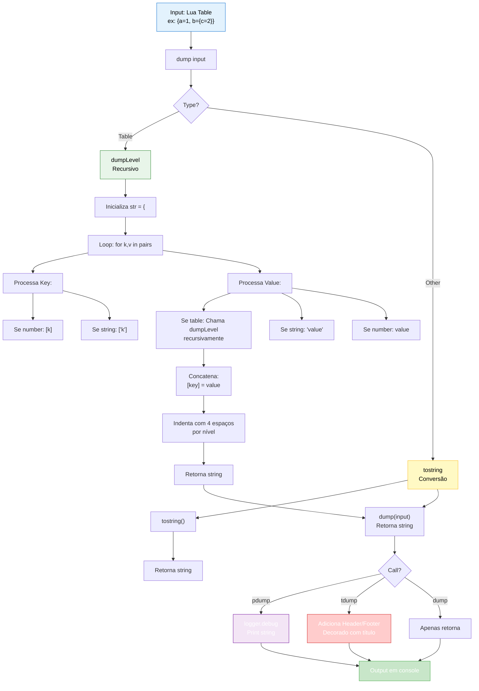

import { Aside, Card } from '@astrojs/starlight/components';

## 🛠️ Informações do Arquivo

Arquivo que implementa o **módulo de debugging para serialização e visualização de dados** do GameServer. Fornece funções recursivas para converter tabelas Lua em representações em string legíveis, com suporte a pretty-printing com títulos decorados e logging estruturado para facilitar debugging e troubleshooting.

<Card title="Caminho Original" icon="document">
  `data/libs/debugging/dump.lua`
</Card>

<Aside type="tip">
  Módulo de debug para serialização de tabelas. Implementa: dumpLevel() função recursiva que converte tabelas em string aninhada (indentação por nível), dump() wrapper que converte estrutura em string, pdump() printa dump via logger.debug(), tdump() adiciona header/footer decorado com título. Suporta strings entre aspas, números diretos, recorrência ilimitada em profundidade. Saída formatada com indentação de 4 espaços por nível. Dependências: logger.debug(). Arquivo minimalista mas poderoso: ~55 linhas.
</Aside>

---

## 📄 Visão Geral do Código

### Resumo Executivo

`dump.lua` é um **módulo de debugging minimalista mas completo** que fornece **serialização recursiva de tabelas Lua** para fins de debugging. Implementa:

1. **Recursive Serialization**: Função `dumpLevel()` que converte estruturas arbitrariamente complexas para strings
2. **String Conversion**: Função `dump()` que serializa uma tabela em uma string formatada
3. **Debug Logging**: Função `pdump()` que serializa e loga via logger.debug()
4. **Titled Output**: Função `tdump()` que serializa com header/footer decorado contendo título
5. **Pretty Printing**: Indentação hierárquica (4 espaços por nível) para legibilidade

**Objetivo Principal**: Facilitar **visualização de estruturas de dados complexas** durante desenvolvimento/debugging, sem necessidade de client IDE/debugger, apenas console logging.

### Fluxo de Operação



---

## 🔧 Funções do Módulo

### Funções Locais (Local Functions)

#### `dumpLevel(input: any, level: number): string`

**Assinatura**:
```lua
local function dumpLevel(input, level)
```

**Propósito**: Serializa recursivamente um valor Lua em string formatada, com indentação baseada em nível de profundidade.

**Parâmetros**:
- `input` (`any`): Qualquer valor Lua (table, string, number, boolean, nil)
- `level` (`number`): Nível de profundidade (0 = root, 1 = first nested, etc)

**Retorno**:
- `string`: Representação em string do input

**Lógica Principal**:

```lua
local indent = ""
for i = 1, level do
    indent = indent .. "    "  -- 4 espaços por nível
end
```

**Geração de Indentação**:
```
level=0: indent = ""
level=1: indent = "    "       (4 espaços)
level=2: indent = "        "   (8 espaços)
level=3: indent = "            " (12 espaços)
```

#### Processamento de Tables

```lua
if type(input) == "table" then
    local str = "{ \n"  -- Abre com chave e newline
    local lines = {}    -- Array de linhas
    
    for k, v in pairs(input) do
        -- Processa keys e valores
        if type(k) ~= "number" then
            k = '"' .. k .. '"'  -- Aspas em keys string
        end
        
        if type(v) == "string" then
            v = '"' .. v .. '"'  -- Aspas em values string
        end
        
        -- Recursão para tabelas nested
        table.insert(lines, indent .. "    [" .. k .. "] = " .. dumpLevel(v, level + 1))
    end
    
    -- Concatena com header/footer
    return str .. table.concat(lines, ",\n") .. "\n" .. indent .. "}"
end
```

**Exemplo de Saída para `{a=1, b="hello", c={d=2}}`**:

```
{ 
    ["a"] = 1,
    ["b"] = "hello",
    ["c"] = { 
        ["d"] = 2
    }
}
```

#### Processamento de Non-Tables

```lua
return tostring(input)  -- Strings, números, booleans, nil
```

**Comportamento**:
- Números: `123` → `"123"`
- Strings: `"hello"` → `"hello"` (no quotes quando chamado recursivo)
- Booleans: `true` → `"true"`, `false` → `"false"`
- Nil: `nil` → `"nil"`

---

### Funções Globais (Global Functions)

#### `dump(input: any): string`

**Assinatura**:
```lua
function dump(input)
```

**Propósito**: Serializa um valor em string formatada, chamando `dumpLevel` com nível 0 (root).

**Parâmetros**:
- `input` (`any`): Qualquer valor Lua

**Retorno**:
- `string`: Representação formatada do input

**Uso**:
```lua
local myTable = {x=10, y=20, nested={z=30}}
local dumped = dump(myTable)
print(dumped)  -- Printa a representação string

-- Output:
-- { 
--     ["x"] = 10,
--     ["y"] = 20,
--     ["nested"] = { 
--         ["z"] = 30
--     }
-- }
```

**Casos de Uso**:
```lua
-- Salvar em variável para processamento
local str = dump(monster:getInfo())

-- Enviar para função que espera string
sendDebugMessage(dump(player:getStatus()))

-- Concatenar em log message
error("Invalid state: " .. dump(invalidTable))
```

---

#### `pdump(input: any): string`

**Assinatura**:
```lua
function pdump(input)
```

**Propósito**: Serializa e **imediatamente printa** via `logger.debug()` para visualização em console.

**Parâmetros**:
- `input` (`any`): Qualquer valor Lua

**Retorno**:
- `string`: A string dumped (para possível reuso)

**Lógica**:
```lua
local dump_str = dump(input)
logger.debug(dump_str)
return dump_str
```

**Uso Típico**:
```lua
-- Debugar variável durante execução
pdump(player:getStorageValues())
-- Imediatamente vê output estruturado em console

-- Inspecionar estrutura de objeto
pdump(monster:getCreatureInfo())

-- Dentro de callback/error handler
function onError(e)
    pdump({error = e, context = getCurrentContext()})
end
```

**Vantagens**:
- Uma linha de código para serializar + logar
- Retorna string se precisar reusar
- Integra automaticamente com logger

---

#### `tdump(title: string, input: any): string`

**Assinatura**:
```lua
function tdump(title, input)
```

**Propósito**: Serializa e loga com **header/footer decorado** contendo título elegante.

**Parâmetros**:
- `title` (`string`): Título a exibir
- `input` (`any`): Valor a serializar

**Retorno**:
- `string`: String dumped (sem decoração, apenas conteúdo)

**Lógica de Decoração**:

```lua
local title_fill = ""
for i = 1, title:len() do
    title_fill = title_fill .. "="  -- "=" repetido tamanho do título
end

local header_str = "\n====" .. title_fill .. "====\n"
                .. "=== " .. title .. " ===\n"
                .. "====" .. title_fill .. "====\n"

local dump_str = dump(input)
local footer_str = "\n====" .. title_fill .. "====\n"

logger.debug(header_str .. dump_str .. footer_str)
return dump_str
```

**Exemplo de Saída**:

Para `tdump("Player Status", {hp=100, mana=200})`

```
============================
=== Player Status ===
============================

{ 
    ["hp"] = 100,
    ["mana"] = 200
}

============================
```

**Uso Típico**:
```lua
-- Logging estruturado com contexto
function onPlayerLogin(player)
    tdump("Login Event", {
        playerID = player:getId(),
        playerName = player:getName(),
        level = player:getLevel(),
        experience = player:getExperience()
    })
end

-- Output:
-- ============================
-- === Login Event ===
-- ============================
-- {
--     ["playerID"] = 123,
--     ["playerName"] = "John",
--     ["level"] = 50,
--     ["experience"] = 500000
-- }
-- ============================
```

**Vantagens**:
- Título destaca seção de debug em logs
- Separação visual clara de múltiplos dumps
- Facilita busca em logs grandes

---

## 📊 Exemplos de Saída

### Exemplo 1: Table Simples

**Input**:
```lua
local data = {
    name = "Monster",
    health = 100,
    active = true
}
dump(data)
```

**Output**:
```
{ 
    ["name"] = "Monster",
    ["health"] = 100,
    ["active"] = true
}
```

### Exemplo 2: Table Aninhada

**Input**:
```lua
local player = {
    name = "John",
    inventory = {
        slots = 20,
        items = 15
    },
    skills = {
        magic = 90,
        melee = 75
    }
}
dump(player)
```

**Output**:
```
{ 
    ["name"] = "John",
    ["inventory"] = { 
        ["slots"] = 20,
        ["items"] = 15
    },
    ["skills"] = { 
        ["magic"] = 90,
        ["melee"] = 75
    }
}
```

### Exemplo 3: Table com Array

**Input**:
```lua
local quest = {
    id = 100,
    objectives = {
        [1] = "Kill 10 rats",
        [2] = "Collect 5 keys",
        [3] = "Talk to NPC"
    }
}
dump(quest)
```

**Output**:
```
{ 
    ["id"] = 100,
    ["objectives"] = { 
        [1] = "Kill 10 rats",
        [2] = "Collect 5 keys",
        [3] = "Talk to NPC"
    }
}
```

### Exemplo 4: tdump com Título

**Input**:
```lua
tdump("Quest Complete", {questID = 100, reward = 1000})
```

**Output**:
```
====================
=== Quest Complete ===
====================

{ 
    ["questID"] = 100,
    ["reward"] = 1000
}

====================
```

---

## 🔄 Padrões de Uso

### Pattern 1: Debugging de Função

```lua
function processPlayer(player)
    local status = player:getStatus()
    pdump(status)  -- Rápida visualização
    
    -- Processar...
end
```

### Pattern 2: Error Reporting

```lua
function riskyOperation()
    if error then
        tdump("Operation Failed", {
            operation = "riskyOperation",
            error = error,
            state = getCurrentState()
        })
        return false
    end
end
```

### Pattern 3: Integration Testing

```lua
local result = executeComplexLogic()
tdump("Test Result", result)  -- Visualizar resultado complexo
```

### Pattern 4: Multiple Dumps

```lua
function debugMultipleObjects()
    pdump(object1)
    pdump(object2)  -- Múltiplos dumps na sequência
    pdump(object3)
    
    -- Em logs, aparecem seqüencialmente
end
```

---

## ✅ Checkpoint de Aprendizagem

### Conceitos Principais

1. **Recursive Serialization**: dumpLevel chama a si mesmo para structures nested
2. **Indentation by Level**: Nível controla quantos espaços de indent
3. **Type-Aware Formatting**: Strings entre aspas, números diretos, keys string entre aspas
4. **Pretty Printing**: Quebras de linha e indentação para legibilidade
5. **Logging Integration**: logger.debug para saída em console

### Design Patterns

- **Recursive Function**: dumpLevel(value, level) clássico padrão recursivo
- **String Accumulation**: table.concat(lines, ",\n") para juntar linhas
- **Type Dispatch**: type() checking para diferentes behaviors
- **Wrapper Functions**: dump, pdump, tdump wrappers ao redor dumpLevel
- **Lazy Formatting**: Indentação gerada conforme é necessária (não pré-computed)

### Casos de Uso Principais

| Caso | Função |
|------|--------|
| **Converter table em string** | `dump()` |
| **Visualizar em console rápido** | `pdump()` |
| **Logging estruturado com contexto** | `tdump()` |
| **Debugging profundo** | Aninhamento recursivo |
| **Error reporting** | tdump + logger.debug |

---

## 📚 Conclusão

`dump.lua` é um **módulo de debugging leve mas poderoso** que fornece:

1. **Serialização Recursiva**: Converte estruturas arbitrárias em strings legíveis
2. **Pretty Printing**: Indentação hierárquica automatizada
3. **Console Integration**: Logging direto via logger.debug
4. **Titled Output**: Header/footer decorado para contexto visual
5. **Simplicidade**: ~55 linhas, sem dependências complexas

Com 3 funções main (dump, pdump, tdump) e 1 helper recursiva, fornece **tudo necessário para debugging visual de dados Lua** durante desenvolvimento e troubleshooting em produção.

---

## 🤖 Informações da Documentação

<Card title="Metadata da Documentação" icon="star">
  - **Arquivo Original**: dump.lua
  - **Caminho**: data/libs/debugging/
  - **Tipo**: Módulo de Debugging / Utility
  - **Última Atualização**: 2026-02-19
  - **Status**: ✅ Completo
  - **Linhas de Código**: ~55 linhas
  - **Funções Globais**: 3 (dump, pdump, tdump)
  - **Funções Locais**: 1 (dumpLevel)
  - **Indentação**: 4 espaços por nível
  - **Dependências**: logger.debug()
  - **Complexidade**: O(n) onde n = total de chave-valores em todas tabelas
  - **Profundidade Suportada**: Ilimitada (recursão até limite de stack)
</Card>

<Aside type="note">
  **Nota de Manutenção**: Este módulo é utilidade de debugging fundamental. Modificações devem preservar: (1) Assinatura de funções (dump, pdump, tdump), (2) Indentação de 4 espaços (padrão Lua), (3) Integração com logger.debug (não mudar), (4) Suporte a recursão ilimitada em profundidade, (5) Formatação de strings entre aspas. Considerar adicionar: (1) Limite de profundidade máxima (evitar loops recursivos infinitos), (2) Control de tamanho máximo da string (para não explodir logs), (3) Customização de separadores (virgula, newline), (4) Modo compact (sem indentação) para logs space-sensitive.
</Aside>

```