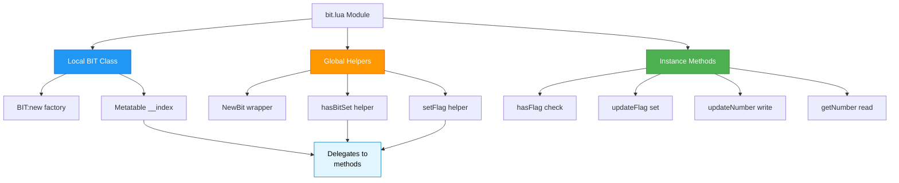

import { Aside, Card } from '@astrojs/starlight/components';

## 🛠️ Informações do Arquivo

Arquivo que implementa um **módulo object-oriented para operações bitwise**. Fornece classe BIT com encapsulamento de estado e métodos para manipular flags, além de funções helper globais.

<Card title="Caminho Original" icon="document">
  data/libs/functions/bit.lua
</Card>

<Aside type="tip">
  Módulo OOP de bitwise (40 linhas). Implementa class BIT `{}` local com metatable __index = self, factory methods BIT:new(number) cria instance com setmetatable `{number = number}`, NewBit(number) wrapper para BIT:new(), global helpers hasBitSet(flag, flags) usa bit.band() para test, setFlag(bt, flag) usa bit.bor() para set, métodos de instância BIT:hasFlag(flag), BIT:updateFlag(flag), BIT:updateNumber(number), BIT:getNumber(). State persistente em self.number, métodos delegate para helpers globais. Requer bit library nativa Lua (5.3+ ou LuaBit para 5.1). Padrão: cada operação modifica ou lê self.number.
</Aside>

---

## 📄 Visão Geral do Código

### Resumo Executivo

`bit.lua` é um **módulo object-oriented para manipulação de flags bitwise**. Implementa:

1. **BIT Class**: Tabela local com metatable para encapsulamento
2. **Factory Methods**: `BIT:new()` e `NewBit()` para instanciação
3. **State Persistence**: Inteiro interno em `self.number`
4. **Helper Functions**: `hasBitSet()` e `setFlag()` como utilidades globais
5. **Instance Methods**: `hasFlag()`, `updateFlag()`, `updateNumber()`, `getNumber()`
6. **Native Bitwise**: Integração com `bit.band()` e `bit.bor()` do Lua

**Objetivo Principal**: Fornecer **interface intuitiva e object-oriented** para manipulação de flags bitwise com estado persistente por instância.

### Estrutura de Funcionalidades



---

## 🔧 Estrutura da Classe

### Local Class: BIT

```lua
-- objeto a ser criado
local BIT = {}
```

**Propósito**: Define a classe local `BIT` como tabela vazia que será populada com métodos.

**Escopo**: `local` - não acessível diretamente fora do módulo, apenas via factory methods.

---

## 🏭 Factory Methods

### BIT:new()

```lua
function BIT:new(number)
	return setmetatable({ number = number }, { __index = self })
end
```

**Propósito**: Cria nova instância de BIT com número inicial.

**Parâmetros**:
- number: Valor inicial das flags

**Retorno**: Instância BIT com metatable configurada

**Mecanismo**:
1. Cria tabela `{ number = number }`
2. Configura metatable com `__index = self` (self-referência para BIT class)
3. Retorna instância que herda todos os métodos de BIT

**Padrão Metatable**:
```lua
instância = { number = 13 }
metatable = { __index = BIT }
setmetatable(instância, metatable)

-- Agora instância:hasFlag() procura em BIT:hasFlag
```

**Uso**:
```lua
local flags = BIT:new(0)          -- Cria com 0 flags
local status = BIT:new(255)       -- Cria com 255 flags
```

---

### NewBit()

```lua
function NewBit(number)
	return BIT:new(number)
end
```

**Propósito**: Alias simplificado para BIT:new() - factory convenience method.

**Parâmetros**:
- number: Valor inicial

**Retorno**: Instância BIT

**Uso Simplificado**:
```lua
local flags = NewBit(0)           -- Mais conciso
local status = NewBit(255)        -- Equivalente a BIT:new(255)
```

---

## 🔌 Global Helper Functions

### hasBitSet()

```lua
function hasBitSet(flag, flags)
	return bit.band(flags, flag) ~= 0
end
```

**Propósito**: Verifica se um bit específico está setado usando operação AND bitwise.

**Parâmetros**:
- flag: Flag individual a testar
- flags: Contém múltiplas flags

**Retorno**: true se flag está setada, false se não

**Explicação Bitwise**:
```
bit.band(flags, flag) realiza AND bitwise:
13 binary:    1101
4 binary:     0100
AND:          0100 = 4 (não zero)
Resultado ~= 0? true ✓ Bit 4 está setado

5 binary:     0101
2 binary:     0010
AND:          0000 = 0 (zero)
Resultado ~= 0? false ✗ Bit 2 não está setado
```

**Exemplos**:
```lua
hasBitSet(4, 13)   -- 1101 & 0100 = 0100 → true
hasBitSet(2, 13)   -- 1101 & 0010 = 0000 → false
hasBitSet(8, 13)   -- 1101 & 1000 = 1000 → true
hasBitSet(1, 13)   -- 1101 & 0001 = 0001 → true
```

---

### setFlag()

```lua
function setFlag(bt, flag)
	return bit.bor(bt, flag)
end
```

**Propósito**: Ativa um bit usando operação OR bitwise.

**Parâmetros**:
- bt: Inteiro contendo flags (bit state)
- flag: Flag a setar

**Retorno**: Novo inteiro com flag setada

**Explicação Bitwise**:
```
bit.bor(bt, flag) realiza OR bitwise (ativa bit):
13 binary:    1101
4 binary:     0100
OR:           1101 = 13 (já estava setada)

5 binary:     0101
2 binary:     0010
OR:           0111 = 7 (flag 2 ativada)

0 binary:     0000
8 binary:     1000
OR:           1000 = 8 (flag 8 ativada)
```

**Exemplos**:
```lua
setFlag(13, 2)    -- 1101 | 0010 = 1111 → 15
setFlag(5, 2)     -- 0101 | 0010 = 0111 → 7
setFlag(0, 8)     -- 0000 | 1000 = 1000 → 8
setFlag(12, 4)    -- 1100 | 0100 = 1100 → 12 (já setada)
```

---

## 📋 Métodos de Instância

### BIT:hasFlag()

```lua
function BIT:hasFlag(flag)
	return hasBitSet(flag, self.number)
end
```

**Propósito**: Verifica se flag está setada **nesta instância**.

**Parâmetros**:
- flag: Flag a verificar

**Retorno**: true se setada, false se não

**Implementação**: Delega para `hasBitSet()` global com `self.number`.

**Uso**:
```lua
local status = NewBit(13)         -- 1101
if status:hasFlag(4) then
    print("Flag 4 ativa")         -- true
end
if status:hasFlag(2) then
    print("Flag 2 ativa")         -- false
end
```

---

### BIT:updateFlag()

```lua
function BIT:updateFlag(flag)
	self.number = setFlag(self.number, flag)
end
```

**Propósito**: Ativa uma flag e **persiste no state interno**.

**Parâmetros**:
- flag: Flag a ativar

**Side Effects**: Modifica self.number

**Implementação**: Chama `setFlag()` e armazena resultado em `self.number`.

**Uso**:
```lua
local status = NewBit(0)      -- Inicializa com 0
status:updateFlag(4)          -- Seta flag 4, agora = 4
status:updateFlag(8)          -- Seta flag 8, agora = 12
print(status:getNumber())     -- Output: 12
```

**Fluxo Detalhado**:
```lua
self.number = setFlag(self.number, flag)
-- Equivalente a:
self.number = bit.bor(self.number, flag)
```

---

### BIT:updateNumber()

```lua
function BIT:updateNumber(number)
	self.number = number
end
```

**Propósito**: Sobrescreve completamente o value da instância.

**Parâmetros**:
- number: Novo valor

**Side Effects**: Substitui self.number completamente (reseta todas as flags)

**Uso**:
```lua
local status = NewBit(13)
status:updateNumber(255)    -- Reset para 255 (todos bits setados)
print(status:getNumber())   -- Output: 255
```

**Diferença vs updateFlag**:
- `updateFlag(n)`: Ativa bit específico (preserva otros)
- `updateNumber(n)`: Substitui completamente (reset)

---

### BIT:getNumber()

```lua
function BIT:getNumber()
	return self.number
end
```

**Propósito**: Retorna o valor atual das flags.

**Retorno**: Valor de self.number

**Uso**:
```lua
local status = NewBit(42)
local value = status:getNumber()
print(value)  -- Output: 42
```

---

## 🔄 Fluxo Típico de Uso

### Padrão 1: Setup e Check Simples

```lua
local perms = NewBit(0)        -- Cria com 0 flags

-- Ativa permissões
perms:updateFlag(1)            -- read = 1
perms:updateFlag(2)            -- write = 2
print(perms:getNumber())       -- 3

-- Verifica permissões
if perms:hasFlag(1) then
    print("Pode ler")          -- true
end

if perms:hasFlag(4) then
    print("Pode deletar")      -- false
end
```

### Padrão 2: Player Status Tracking

```lua
-- Flags: 1=online, 2=pvp, 4=muted, 8=blessed
local playerStatus = NewBit(0)

-- Player entra online
playerStatus:updateFlag(1)     -- online = true
print(playerStatus:getNumber()) -- 1

-- Player ativa PvP
playerStatus:updateFlag(2)     -- pvp = true
print(playerStatus:getNumber()) -- 3 (1 + 2)

-- Verificar status
if playerStatus:hasFlag(2) then
    print("Player em PvP")     -- true
end

-- Reset completo
playerStatus:updateNumber(0)
print(playerStatus:getNumber()) -- 0
```

### Padrão 3: Permission System

```lua
local userPerms = NewBit(0)

-- Dar permissões (read + write)
userPerms:updateFlag(1)        -- read
userPerms:updateFlag(2)        -- write
print(userPerms:getNumber())   -- 3

-- Promover para admin (all perms)
userPerms:updateNumber(15)     -- 1+2+4+8 (todas permissões)

-- Verificar admin
if userPerms:hasFlag(4) then
	print("É admin")           -- true
end
```

---

## 📊 Comparação: Abordagens

### Abordagem 1: Funcional (bitwise_flags.lua)

```lua
-- Não mantém estado
local flags = 0
flags = setFlag(flags, 4)
flags = setFlag(flags, 8)
print(testFlag(flags, 4))  -- true
```

**Pros**: Simplicidade, sem dependencies
**Cons**: Sem estado persistente, pass-by-value

---

### Abordagem 2: OOP (bit.lua)

```lua
-- Mantém estado
local flags = NewBit(0)
flags:updateFlag(4)
flags:updateFlag(8)
print(flags:hasFlag(4))  -- true
```

**Pros**: State persistente, interface intuitiva
**Cons**: Overhead metatable, requer bit library

---

## ✅ Checkpoint de Aprendizagem

### Conceitos Principais

1. **Metatable Pattern**: `__index = self` para method delegation
2. **State Persistence**: `self.number` armazena state
3. **Bitwise Operations**: `bit.band()` test, `bit.bor()` set
4. **Object-Oriented**: Interface type:method() vs funcional
5. **Factory Method**: BIT:new() e NewBit() para criação
6. **Encapsulation**: Número is "private" via self reference

### Design Patterns

- **Metatable Pattern**: `setmetatable(instance, { __index = class })`
- **Factory Method**: `NewBit()` como constructor convenience
- **Delegation Pattern**: Métodos instância delegam para helpers globais
- **State Container**: Objeto encapsula número interno

### Responsabilidades

| Função | Scope | Responsabilidade |
|--------|-------|-----------------|
| **BIT** | local | Class definition |
| **BIT:new()** | method | Factory create |
| **NewBit()** | global | Alias factory |
| **hasBitSet()** | global | Bit test (and) |
| **setFlag()** | global | Bit set (or) |
| **hasFlag()** | method | Instance test |
| **updateFlag()** | method | Instance set |
| **getNumber()** | method | State read |
| **updateNumber()** | method | State write |

---

## 📚 Conclusão

`bit.lua` fornece um **módulo OOP robusto** para bitwise operations com:

1. **Object-Oriented Interface**: Classes e métodos intuitivos
2. **State Persistence**: Número mantém estado entre calls
3. **Bitwise via Library**: Integração com `bit.band/bit.bor` nativo
4. **Metatable Pattern**: Demonstra uso avançado de Lua metatable
5. **Clean Encapsulation**: Estado privado via `self.number`
6. **Factory Methods**: Criação simplificada via NewBit()

Ideal para código que necessita **manipulação stateful de flags** com interface OOP intuitiva e imutável.

---

## 🤖 Informações da Documentação

<Card title="Metadata da Documentação" icon="star">
  - **Arquivo Original**: bit.lua
  - **Caminho**: data/libs/functions/
  - **Tipo**: Object-Oriented Bitwise Operations Module
  - **Última Atualização**: 2026-02-19
  - **Status**: ✅ Completo
  - **Linhas de Código**: ~40 linhas
  - **Classes Locais**: 1 (BIT)
  - **Funções Globais**: 3 (NewBit, hasBitSet, setFlag)
  - **Métodos de Instância**: 4 (hasFlag, updateFlag, updateNumber, getNumber)
  - **Factory Methods**: 2 (BIT:new, NewBit)
  - **Bitwise Operations**: 2 (bit.band via hasBitSet, bit.bor via setFlag)
  - **Dependências**: bit library (Lua 5.3+ nativo ou LuaBit para 5.1)
  - **Complexidade**: O(1) - todas operações bitwise são O(1)
  - **State Management**: Persistente em self.number
</Card>

<Aside type="note">
  Módulo crítico. Preservar: (1) metatable pattern __index = self, (2) state persistence em self.number, (3) compatibilidade bit library.
</Aside>

```