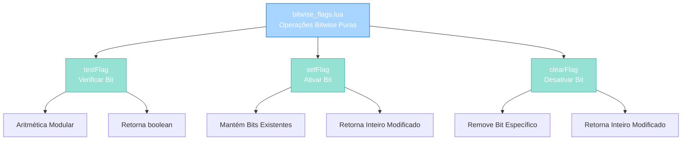

import { Aside, Card } from '@astrojs/starlight/components';

## 🛠️ Informações do Arquivo

Arquivo que implementa um **módulo de operações bitwise puras** usando aritmética modular. Não depende de bibliotecas externas e utiliza operações matemáticas simples para testar, ativar e desativar flags.

<Card title="Caminho Original" icon="document">
  data/libs/functions/bitwise_flags.lua
</Card>

<Aside type="tip">
  Módulo funcional de bitwise puro (16 linhas). Implementa 3 funções globais sem dependencies externas: testFlag(set, flag) verifica bit via modulo, setFlag(set, flag) ativa bit mantendo existentes, clearFlag(set, flag) desativa bit individual. Algoritmo: usa set % (2 * flag) para isolamento de bits. Sem estado persistente, operações matemáticas puras. Compatível com Lua 5.1+.
</Aside>

---

## 📄 Visão Geral do Código

### Resumo Executivo

`bitwise_flags.lua` é um **módulo funcional para manipulação de flags bitwise** implementando:

1. **Operações Puras**: Sem dependencies, sem estado persistente
2. **Aritmética Modular**: Usa matemática simples em vez de bit.band/bit.bor
3. **Três Operações Básicas**: testFlag(), setFlag(), clearFlag()
4. **Compatibilidade Universal**: Funciona em Lua 5.1+ (sem bit library)
5. **Performance**: O(1) para todas operações

**Objetivo Principal**: Fornecer **interface funcional e leve** para manipulação de flags bitwise sem dependencies externas.

### Estrutura de Funcionalidades



---

## 🔧 Funções Globais

### testFlag(set, flag)

```lua
function testFlag(set, flag)
	return set % (2 * flag) >= flag
end
```

**Propósito**: Verifica se um bit específico está ativado em um conjunto de flags.

**Parâmetros**:
- set: Inteiro contendo múltiplos bits
- flag: Valor do bit individual a testar

**Retorno**: boolean - true se bit está setado, false se não

**Algoritmo**:
```
1. Multiplica flag por 2: (2 * flag)
2. Calcula resto da divisão: set % (2 * flag)
3. Compara se resultado >= flag original
4. Se true, bit está ativado
```

**Exemplos Práticos**:
```lua
-- Teste de bit em número 13 (binary: 1101)
testFlag(13, 1)  -- 13 % 2 = 1 >= 1 → true
testFlag(13, 2)  -- 13 % 4 = 1 >= 2 → false
testFlag(13, 4)  -- 13 % 8 = 5 >= 4 → true
testFlag(13, 8)  -- 13 % 16 = 13 >= 8 → true

-- Teste em número 0 (nenhum bit)
testFlag(0, 1)   -- 0 % 2 = 0 >= 1 → false
testFlag(0, 4)   -- 0 % 8 = 0 >= 4 → false
```

**Tabela de Equivalência**:
```
flag=1  (binary: 0001, 2^0)
flag=2  (binary: 0010, 2^1)
flag=4  (binary: 0100, 2^2)
flag=8  (binary: 1000, 2^3)
```

---

### setFlag(set, flag)

```lua
function setFlag(set, flag)
	if set % (2 * flag) >= flag then
		return set
	end
	return set + flag
end
```

**Propósito**: Ativa um bit específico, mantendo todos os outros bits inalterados.

**Parâmetros**:
- set: Inteiro contendo flags atuais
- flag: Valor do bit a ativar

**Retorno**: Inteiro com o bit ativado (ou set se já estava ativo)

**Lógica**:
```
1. Verifica se bit já está ativado via testFlag
2. Se sim, retorna set inalterado
3. Se não, soma flag a set para ativar
```

**Exemplos Práticos**:
```lua
-- Ativar bit em número vazio
setFlag(0, 1)    -- 0 + 1 = 1 (ativa bit 1)
setFlag(0, 4)    -- 0 + 4 = 4 (ativa bit 4)
setFlag(0, 8)    -- 0 + 8 = 8 (ativa bit 8)

-- Ativar bit em número com bits existentes
setFlag(5, 2)    -- 5 + 2 = 7 (01 + 10 = 11 em binary)
setFlag(5, 8)    -- 5 + 8 = 13 (0101 + 1000 = 1101)

-- Ativar bit já existente (idempotente)
setFlag(13, 4)   -- Já 1101, mantém 1101 → 13
setFlag(13, 8)   -- Já 1101, mantém 1101 → 13
```

**Fluxo Executivo**:
```lua
-- Exemplo: setFlag(5, 2)
-- 5 é binary: 0101 (bits 1 e 4 ativos)
-- 2 é bit: 0010 (bit 2 para ativar)
-- 5 % 4 = 1, 1 >= 2? false → ativa
-- return 5 + 2 = 7 (0111)
```

---

### clearFlag(set, flag)

```lua
function clearFlag(set, flag)
	if set % (2 * flag) >= flag then
		return set - flag
	end
	return set
end
```

**Propósito**: Desativa um bit específico, mantendo todos os outros bits.

**Parâmetros**:
- set: Inteiro contendo flags atuais
- flag: Valor do bit a desativar

**Retorno**: Inteiro com o bit desativado (ou set se já estava inativo)

**Lógica**:
```
1. Verifica se bit está ativado via testFlag
2. Se sim, subtrai flag de set para desativar
3. Se não, retorna set inalterado
```

**Exemplos Práticos**:
```lua
-- Desativar bit em número com múltiplos bits
clearFlag(13, 1)  -- 13 - 1 = 12 (1101 - 0001 = 1100)
clearFlag(13, 4)  -- 13 - 4 = 9  (1101 - 0100 = 1001)
clearFlag(13, 8)  -- 13 - 8 = 5  (1101 - 1000 = 0101)

-- Desativar bit já inativo (idempotente)
clearFlag(13, 2)  -- 2 não está em 13, retorna 13
clearFlag(13, 16) -- 16 não está em 13, retorna 13

-- Desativar bit em número vazio
clearFlag(0, 4)   -- 4 não está em 0, retorna 0
```

**Fluxo Executivo**:
```lua
-- Exemplo: clearFlag(13, 4)
-- 13 é binary: 1101
-- 4 é bit: 0100 (bit para desativar)
-- 13 % 8 = 5, 5 >= 4? true → desativa
-- return 13 - 4 = 9 (1001)
```

---

## 📊 Comparação com Outras Implementações

### Abordagem 1: Funcional Puro (bitwise_flags.lua)

```lua
local status = 0
status = setFlag(status, 4)
status = setFlag(status, 8)
if testFlag(status, 4) then
    print("Bit 4 ativo")
end
```

**Vantagens**:
- Sem dependencies externas
- Compatível com Lua 5.1+
- Operações matemáticas puras
- Sem overhead de metatable

**Desvantagens**:
- Sem state persistente entre chamadas
- Pass-by-value (requer reatribuição)
- Menos intuitivo que OOP

---

### Abordagem 2: OOP com Metatable (bit.lua)

```lua
local status = NewBit(0)
status:updateFlag(4)
status:updateFlag(8)
if status:hasFlag(4) then
    print("Bit 4 ativo")
end
```

**Vantagens**:
- State persistente em instância
- Interface intuitiva type:method()
- Encapsulamento natural

**Desvantagens**:
- Requer bit library nativa (5.3+)
- Overhead de metatable
- Mais complexo para operações simples

---

## 🔄 Padrões de Uso

### Padrão 1: Sistema de Permissões

```lua
-- Flags: 1=read, 2=write, 4=delete, 8=admin
local userPerms = 0

-- Conceder permissões
userPerms = setFlag(userPerms, 1)  -- read
userPerms = setFlag(userPerms, 2)  -- write

-- Verificar permissão
if testFlag(userPerms, 2) then
    print("Usuário pode escrever")
end

-- Remover permissão
userPerms = clearFlag(userPerms, 2)  -- remove write
```

---

### Padrão 2: Player Status Flags

```lua
-- Flags: 1=online, 2=pvp, 4=muted, 8=blessed
local playerStatus = 0

-- Player entra online e ativa PvP
playerStatus = setFlag(playerStatus, 1)
playerStatus = setFlag(playerStatus, 2)

-- Verificar status
local isOnline = testFlag(playerStatus, 1)
local isPvP = testFlag(playerStatus, 2)

-- Desmutar
playerStatus = clearFlag(playerStatus, 4)
```

---

### Padrão 3: Item Properties

```lua
-- Flags: 1=magic, 2=cursed, 4=unique, 8=enchanted
local itemProps = 0

-- Item é mágico e encantado
itemProps = setFlag(itemProps, 1)
itemProps = setFlag(itemProps, 8)

-- Aplicar efeito cursado
itemProps = setFlag(itemProps, 2)

-- Verificar propriedade
if testFlag(itemProps, 2) then
    print("Item está amaldiçoado")
end
```

---

## ✅ Checkpoint de Aprendizagem

### Conceitos Matemáticos

1. **Modulo (%)**: `a % b` retorna resto da divisão de a por b
2. **Isolamento de Bits**: `set % (2 * flag)` isola bits até flag
3. **Soma Bitwise**: `set + flag` ativa bit equivalente a OR em bits
4. **Subtração Bitwise**: `set - flag` desativa bit equivalente a AND NOT

### Fórmulas Chave

```
testFlag(set, flag):
    set % (2 * flag) >= flag

setFlag(set, flag):
    if testFlag(set, flag) then set else set + flag

clearFlag(set, flag):
    if testFlag(set, flag) then set - flag else set
```

### Responsabilidades

| Função | Responsabilidade | Complexidade |
|--------|-----------------|--------------|
| testFlag | Verificar bit | O(1) |
| setFlag | Ativar bit | O(1) |
| clearFlag | Desativar bit | O(1) |

---

## 📚 Conclusão

`bitwise_flags.lua` fornece um **módulo funcional leve e portável** para manipulação de flags bitwise:

1. **Zero Dependencies**: Funciona em Lua 5.1+ puro
2. **Performance**: Operações O(1) via aritmética
3. **Portabilidade**: Sem bit library nativa necessária
4. **Simplicidade**: Interface clara e intuitiva
5. **Versatilidade**: Usado para permissões, status, propriedades

Ideal para codebases que precisam compatibilidade com Lua 5.1 ou quando bit library não está disponível.

---

## 🤖 Informações da Documentação

<Card title="Metadata da Documentação" icon="star">
  - **Arquivo Original**: bitwise_flags.lua
  - **Caminho**: data/libs/functions/
  - **Tipo**: Funcional Bitwise Operations Module
  - **Última Atualização**: 2026-02-19
  - **Status**: ✅ Completo
  - **Linhas de Código**: 16 linhas
  - **Funções Globais**: 3 (testFlag, setFlag, clearFlag)
  - **Variáveis Locais**: 0
  - **Dependencies**: Nenhuma
  - **Compatibilidade**: Lua 5.1+
  - **Complexidade**: O(1) - todas operações
  - **Padrão de Design**: Funcional Puro
</Card>

<Aside type="note">
  **Nota de Manutenção**: Módulo de bitwise operations crítico. Operações não incluem validações de range - flags devem ser potências de 2 (1, 2, 4, 8, 16, ...). Modificações devem: (1) Preservar algoritmo aritmético, (2) Manter compatibilidade Lua 5.1, (3) Testar operações idempotentes (set/clear bit já setado/dessetado).
</Aside>
