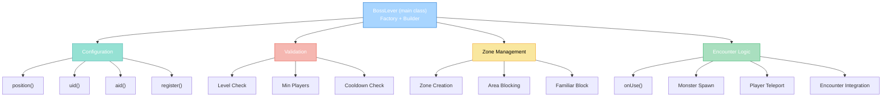

import { Aside, Card } from '@astrojs/starlight/components';

## 🛠️ Informações do Arquivo

Arquivo que implementa um **sistema completo de alavancas de boss encounters** do servidor Canary. Fornece funcionalidade OOP para criar, gerenciar e controlar encontros de boss com validação de grupo, cooldown, zone isolation e integração com eventos.

<Card title="Caminho Original" icon="document">
  data/libs/functions/boss_lever.lua
</Card>

<Aside type="tip">
  Sistema OOP de boss encounters (326 linhas). Implementa class BossLever com metatable factory pattern, builder methods (position, uid, aid), core logic (onUse, register, getZone), e integração com Lever helper, Encounter, Action system. Gerencia validação de nível, cooldown de boss, isolamento de zona, spawn de monstros, teleporte de jogadores. Segue padrão de configuração em Ruby-on-Rails style com suporte a customização via callbacks.
</Aside>

---

## 📄 Visão Geral do Código

### Resumo Executivo

`boss_lever.lua` é um **módulo object-oriented para gerenciar encontros de boss** que implementa:

1. **Factory Pattern com Metatable**: Criação de instâncias via `BossLever(config)`
2. **Builder API Fluent**: Configuração em cadeia com `position()`, `uid()`, `aid()`
3. **Sistema de Validação**: Nível mínimo, quantidade de jogadores, grupo
4. **Cooldown de Boss**: Rastreamento de último encontro por player
5. **Zone Isolation**: Zona exclusiva para each boss encounter
6. **Spawn de Monstros**: Boss principal + monstros secundários
7. **Teleporte e Saída**: Teletransporte automático para arena e saída

**Objetivo Principal**: Fornecer **interface limpa e configurável** para criar boss encounters profissionais com validação, segurança e controle total.

### Estrutura de Funcionalidades



---

## 🔧 Class BossLever

### Metatable Factory Constructor

```lua
BossLever = {}

setmetatable(BossLever, {
	__call = function(self, config)
		-- Cria nova instância com fieldset automático
	end,
})
```

**Propósito**: Permite criar instâncias via `BossLever(config)` syntax.

**Uso**:
```lua
local bossLever = BossLever({
	boss = { name = "Faceless Bane", position = Position(123, 456, 7) },
	requiredLevel = 250,
	minPlayers = 4,
	timeToFightAgain = 10 * 60 * 60,
	-- ... outros campos
})
```

---

## 📋 Variáveis de Instância (Fields)

### Configuração Obrigatória

| Campo | Tipo | Descrição |
|-------|------|-----------|
| **name** | string | Nome do boss (lowercase) |
| **bossPosition** | Position | Localização de spawn do boss |
| **playerPositions** | table | Array de `{pos, teleport}` para cada player |
| **area** (specPos) | `{from, to}` | Zona rectangular do boss |
| **exit** | Position | Posição de saída do encuentro |

### Configuração Opcional

| Campo | Tipo | Padrão | Descrição |
|-------|------|--------|-----------|
| **requiredLevel** | number | 0 | Nível mínimo requerido |
| **minPlayers** | number | 1 | Quantidade mínima de players |
| **timeToFightAgain** | number | config | Cooldown em segundos |
| **timeToDefeat** | number | config | Tempo máximo de encontro |
| **timeAfterKill** | number | 60 | Tempo após derrota |
| **createBoss** | function | nil | Função customizada de spawn |
| **createFunction** | function | nil | Alternative a createBoss |
| **onUseExtra** | function | noop | Callback antes de iniciar |
| **monsters** | table | {} | Array de monstros secundários |
| **encounter** | Encounter | nil | Encontro integrado (Encounter class) |
| **disabled** | boolean | false | Desabilita temporariamente |
| **disableCooldown** | boolean | false | Remove restrição de cooldown |
| **exitTeleporter** | Position | nil | Tele de saída customizada |

---

## 🏗️ Builder Methods

### position()

```lua
function BossLever:position(position)
	self._position = position
	return self
end
```

**Propósito**: Define a posição do objeto alavanca no mapa.

**Parâmetros**:
- position: Position - Coordenadas da alavanca

**Retorno**: self (para chaining)

**Uso**:
```lua
BossLever(config):position(Position(1000, 500, 7))
```

---

### uid()

```lua
function BossLever:uid(uid)
	self._uid = uid
	return self
end
```

**Propósito**: Define o UID (Unique ID) do objeto alavanca.

**Parâmetros**:
- uid: number - ID único do objeto

**Retorno**: self (para chaining)

**Nota**: Alternativa a `position()` para identificar a alavanca.

---

### aid()

```lua
function BossLever:aid(aid)
	self._aid = aid
	return self
end
```

**Propósito**: Define o AID (Action ID) do objeto alavanca.

**Parâmetros**:
- aid: number - ID de ação do objeto

**Retorno**: self (para chaining)

**Nota**: Alternativa a `position()` para identificar a alavanca.

---

## 🔌 Métodos Core

### kvScope()

```lua
function BossLever:kvScope()
	local mType = MonsterType(self.name)
	if not mType then
		error("BossLever: boss name is invalid")
	end
	return "boss.cooldown." .. toKey(tostring(mType:raceId()))
end
```

**Propósito**: Gera chave de key-value storage para cooldown persistente.

**Retorno**: string - Chave formatada

**Uso Interno**: Utilizado para persistência de cooldown no storage.

---

### lastEncounterTime()

```lua
function BossLever:lastEncounterTime(player)
	if not player or self.disableCooldown then
		return 0
	end
	return player:getBossCooldown(self.name)
end
```

**Propósito**: Retorna timestamp do último encontro de um player com este boss.

**Parâmetros**:
- player: Player - Jogador a verificar

**Retorno**: number - Timestamp Unix (0 se sem cooldown ou desabilitado)

**Uso**:
```lua
local lastTime = bossLever:lastEncounterTime(player)
if lastTime > os.time() then
    print("Ainda em cooldown!")
end
```

---

### setLastEncounterTime()

```lua
function BossLever:setLastEncounterTime(time)
	local info = self.lever:getInfoPositions()
	if not info then
		return false
	end
	for _, v in pairs(info) do
		if v.creature then
			local player = v.creature:getPlayer()
			if player then
				player:setBossCooldown(self.name, time)
			end
		end
	end
	return true
end
```

**Propósito**: Define cooldown de boss para todos os players em participação.

**Parâmetros**:
- time: number - Timestamp Unix do novo cooldown

**Retorno**: boolean - true se sucesso, false se error

**Side Effects**: Modifica cooldown em todos os players do grupo

---

### getZone()

```lua
function BossLever:getZone()
	return Zone("boss." .. toKey(self.name))
end
```

**Propósito**: Obtém ou cria a zona exclusiva para este boss.

**Retorno**: Zone - Objeto de zona

**Uso**:
```lua
local zone = bossLever:getZone()
zone:countPlayers()  -- Verifica players ativos
```

---

### onUse()

```lua
function BossLever:onUse(player)
	-- Validação de participação
	-- Verificação de zona
	-- Validação de nível e grupo
	-- Verificação de cooldown
	-- Spawn de boss e monstros
	-- Teleporte de players
	-- Inicialização de encounter
end
```

**Propósito**: Lógica principal executada quando player usa a alavanca.

**Parâmetros**:
- player: Player - Jogador que usou a alavanca

**Retorno**: boolean - true se sucesso

**Fluxo**:
```
1. Valida se player está em posição válida de participante
2. Verifica se boss está desabilitado
3. Verifica se já há encontro ativo na zona
4. Cria Lever helper para gerenciar posições
5. Define condição de validação (nível, grupo, cooldown)
6. Verifica posições e condições
7. Se válido:
   a. Remove monstros antigos da zona
   b. Spawna boss (customizado ou padrão)
   c. Spawna monstros secundários
   d. Teleporta players para arena
   e. Define cooldown
   f. Inicia encounter (se configurado)
   g. Agenda timeout para limpeza
```

**Validações Internas**:
- Nível mínimo (por player)
- Quantidade mínima de players
- Cooldown de boss (com exceção para GMs)
- Callback customizado `onUseExtra()`

---

### register()

```lua
function BossLever:register()
	local missingParams = {}
	-- Validação de parâmetros obrigatórios
	
	local zone = self:getZone()
	zone:addArea(self.area.from, self.area.to)
	zone:blockFamiliars()
	zone:setRemoveDestination(self.exit)
	
	local action = Action()
	action.onUse = function(player)
		self:onUse(player)
	end
	-- Registra posição, uid ou aid
	action:register()
	BossLever[self.name] = self
	
	if self.exitTeleporter then
		SimpleTeleport(self.exitTeleporter, self.exit)
	end
	return true
end
```

**Propósito**: Registra o boss lever no servidor.

**Retorno**: boolean - true se sucesso, false se validation error

**Side Effects**:
- Cria zona exclusiva
- Registra action handler
- Bloqueia familiares
- Cria teletransporte de saída

**Validações**:
```
- boss.name requerido
- playerPositions requerido
- specPos (area) requerido
- exit requerido
- position OU uid OU aid requerido
```

**Exemplo Completo**:
```lua
BossLever({
	boss = {
		name = "Faceless Bane",
		position = Position(33617, 32561, 13)
	},
	requiredLevel = 250,
	minPlayers = 4,
	timeToFightAgain = 10 * 60 * 60,
	playerPositions = {
		{ pos = Position(33638, 32562, 13), teleport = Position(33617, 32567, 13) },
		{ pos = Position(33639, 32562, 13), teleport = Position(33617, 32567, 13) },
		{ pos = Position(33640, 32562, 13), teleport = Position(33617, 32567, 13) },
		{ pos = Position(33641, 32562, 13), teleport = Position(33617, 32567, 13) },
		{ pos = Position(33642, 32562, 13), teleport = Position(33617, 32567, 13) },
	},
	specPos = {
		from = Position(33607, 32553, 13),
		to = Position(33627, 32570, 13)
	},
	monsters = {
		{ name = "rat", pos = Position(33615, 32563, 13) },
		{ name = "rat", pos = Position(33615, 32563, 13), delay = 5000 },
	},
	exit = Position(33618, 32523, 15),
	onUseExtra = function(player, infoPositions)
		-- Lógica customizada
		return true
	end,
})
	:position(Position(33620, 32560, 13))  -- Posição da alavanca
	:register()
```

---

## 🔄 Padrão de Uso Completo

### Passo 1: Definir Configuração

```lua
local config = {
	boss = {
		name = "Faceless Bane",
		position = Position(33617, 32561, 13)  -- Spawn do boss
	},
	requiredLevel = 250,
	minPlayers = 4,
	timeToFightAgain = 10 * 60 * 60,  -- 10 horas em segundos
	
	-- Posições dos players (ordem de entrada)
	playerPositions = {
		{ pos = Position(33638, 32562, 13), teleport = Position(33617, 32567, 13) },
		{ pos = Position(33639, 32562, 13), teleport = Position(33617, 32567, 13) },
		{ pos = Position(33640, 32562, 13), teleport = Position(33617, 32567, 13) },
		{ pos = Position(33641, 32562, 13), teleport = Position(33617, 32567, 13) },
		{ pos = Position(33642, 32562, 13), teleport = Position(33617, 32567, 13) },
	},
	
	-- Área retangular do encuentro
	specPos = {
		from = Position(33607, 32553, 13),
		to = Position(33627, 32570, 13)
	},
	
	-- Monstros secundários
	monsters = {
		{ name = "rat", pos = Position(33615, 32563, 13) },
		{ name = "rat", pos = Position(33615, 32563, 13), delay = 5000 },
	},
	
	-- Posição de saída
	exit = Position(33618, 32523, 15),
	
	-- Callback customizado (executa antes de iniciar)
	onUseExtra = function(player, infoPositions)
		player:teleportTo(Position(33618, 32523, 15))
		player:getPosition():sendMagicEffect(CONST_ME_TELEPORT)
		return true
	end,
}
```

### Passo 2: Criar e Registrar

```lua
BossLever(config)
	:position(Position(33620, 32560, 13))  -- Posição da alavanca
	:register()
```

---

## 📊 Comparação com Implementações

### Abordagem 1: BossLever (Recomendado)

```lua
BossLever(config):position(pos):register()
```

**Vantagens**:
- Validação automática
- Zone isolation
- Cooldown integrado
- Callback customizável
- Logging e debugging

**Desvantagens**:
- Mais complexo de configurar
- Requer definição precisa de campos

---

### Abordagem 2: Manual com Action

```lua
local action = Action()
action.onUse = function(player) ... end
action:position(pos):register()
```

**Vantagens**:
- Simples, total controle

**Desvantagens**:
- Sem validação automática
- Requer reimplementar zone, cooldown, etc

---

## ✅ Checkpoint de Aprendizagem

### Conceitos Principais

1. **Factory Pattern com __call**: Criação via função
2. **Builder Pattern**: Chaining de métodos
3. **Zone Isolation**: Zona exclusiva por boss
4. **Cooldown Persistente**: Armazenado por player
5. **Validação em Cascata**: Nível, grupo, participação
6. **Callback System**: Customização via onUseExtra

### Responsabilidades

| Método | Responsabilidade |
|--------|-----------------|
| **position()** | Define localização física |
| **uid()** | Alterna identificador |
| **aid()** | Alterna identificador |
| **onUse()** | Lógica de encuentro |
| **getZone()** | Obtém zona exclusiva |
| **register()** | Registra no servidor |
| **lastEncounterTime()** | Verifica cooldown |
| **setLastEncounterTime()** | Define cooldown |

### Design Patterns

| Padrão | Implementação |
|--------|--------------|
| **Factory** | setmetatable __call |
| **Builder** | Métodos retornam self |
| **Singleton** | BossLever[name] storage |
| **Zone Management** | Zone class integration |

---

## 📚 Conclusão

`boss_lever.lua` fornece um **sistema professional e robusto** para boss encounters:

1. **Object-Oriented Design**: Factory + Builder patterns
2. **Validação Automática**: Nível, grupo, cooldown
3. **Zone Isolation**: Zona exclusiva por boss
4. **Customização**: Callbacks, spawn customizado, monstros
5. **Gerenciamento de Estado**: Cooldown persistente, encounter tracking
6. **Integração Completa**: Action system, Zone system, Encounter system

Ideal para criar boss encounters profissionais com controle total e validações automáticas.

---

## 🤖 Informações da Documentação

<Card title="Metadata da Documentação" icon="star">
  - **Arquivo Original**: boss_lever.lua
  - **Caminho**: data/libs/functions/
  - **Tipo**: Object-Oriented Boss Encounter System
  - **Última Atualização**: 2026-02-19
  - **Status**: ✅ Completo
  - **Linhas de Código**: 326 linhas
  - **Class Principal**: BossLever
  - **Builder Methods**: 3 (position, uid, aid)
  - **Core Methods**: 6 (getZone, onUse, register, lastEncounterTime, setLastEncounterTime, kvScope)
  - **Variáveis de Instância**: 18
  - **Design Patterns**: Factory, Builder, Singleton, Zone Management
  - **Complexidade**: Média-Alta
  - **Dependencies**: MonsterType, Zone, Lever, Encounter, Action
</Card>

<Aside type="note">
  **Nota de Manutenção**: Sistema crítico para boss encounters. Modificações devem: (1) Preservar factory pattern __call, (2) Manter validação em cascata, (3) Garantir persistência de cooldown, (4) Testar zone isolation, (5) Validar callback system. Considerar adicionar: (1) Logging detalhado, (2) Timeout handling robusto, (3) Suporte a multi-fase boss, (4) Sistema de rewards, (5) Dificuldade escalável.
</Aside>
