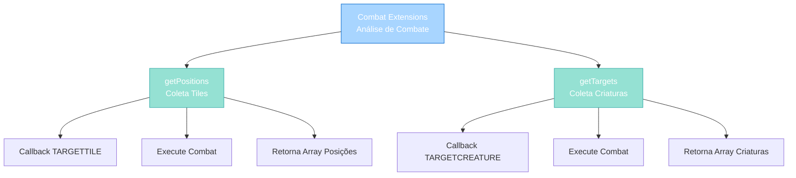

import { Aside, Card } from '@astrojs/starlight/components';

## 🛠️ Informações do Arquivo

Arquivo que implementa **extensões funcionais da classe Combat** para facilitar coleta de posições afetadas e criaturas alvo em operações de combate. Fornece helpers para análise de área de efeito e validação de objetivos.

<Card title="Caminho Original" icon="document">
  data/libs/functions/combat.lua
</Card>

<Aside type="tip">
  Extensões Combat (20 linhas). Expandem classe Combat nativa com 2 métodos globais: getPositions(creature, variant) coleta tiles afetados via callback CALLBACK_PARAM_TARGETTILE, getTargets(creature, variant) coleta criaturas alvo via CALLBACK_PARAM_TARGETCREATURE. Métodos não-destrutivos, apenas análise. Requer bit library para bit.band/bit.bor (importado de combat.lua base).
</Aside>

---

## 📄 Visão Geral do Código

### Resumo Executivo

`combat.lua` é um **módulo funcional de extensões Combat** que fornece:

1. **Coleta de Posições**: Localiza tiles afetados por combate
2. **Coleta de Alvos**: Identifica criaturas atingidas por combate
3. **Operações Não-Destrutivas**: Apenas análise, sem executar dano
4. **Integração com Callback System**: Usa sistema nativo de callbacks
5. **Análise de Area of Effect**: Verifica círculo/retângulo de impact

**Objetivo Principal**: Fornecer **interface funcional para análise de combate** sem executar dano real.

### Estrutura de Funcionalidades



---

## 🔧 Métodos de Extensão

### getPositions()

```lua
function Combat:getPositions(creature, variant)
	local positions = {}
	function onTargetTile(creature, position)
		positions[#positions + 1] = position
	end

	self:setCallback(CALLBACK_PARAM_TARGETTILE, "onTargetTile")
	self:execute(creature, variant)
	return positions
end
```

**Propósito**: Coleta todas as posições (tiles) afetadas por um combate.

**Parâmetros**:
- creature: Criatura que executa o combate (caster)
- variant: Variante do alvo (tipo de alvo: creature, position, etc)

**Retorno**: table - Array de posições Position afetadas

**Mecanismo**:
1. Cria array vazio `positions`
2. Define função callback `onTargetTile` que coleta cada tile atingido
3. Registra callback via `setCallback(CALLBACK_PARAM_TARGETTILE, ...)`
4. Executa combate normalmente via `execute()`
5. Callback é invocado para cada tile afetado
6. Retorna array de todas as posições coletadas

**Exemplos Práticos**:
```lua
-- Analisar área de efeito
local creature = Creature(creatureId)
local combat = Combat()
-- ... configurar combat ...

local positions = combat:getPositions(creature, variant)
for _, pos in ipairs(positions) do
    print("Posição afetada:", pos:tostring())
end

-- Desenhar efeito visual nas posições
for _, pos in ipairs(positions) do
    pos:sendMagicEffect(CONST_ME_BLOCKWALL)
end
```

**Casos de Uso**:
- Visualizar área de efeito antes de executar
- Verificar quantas posições serão afetadas
- Validar cobertura de spell
- Debug de sistemas de combate

---

### getTargets()

```lua
function Combat:getTargets(creature, variant)
	local targets = {}
	function onTargetCreature(creature, target)
		targets[#targets + 1] = target
	end

	self:setCallback(CALLBACK_PARAM_TARGETCREATURE, "onTargetCreature")
	self:execute(creature, variant)
	return targets
end
```

**Propósito**: Coleta todas as criaturas afetadas por um combate.

**Parâmetros**:
- creature: Criatura que executa o combate (caster)
- variant: Variante do alvo

**Retorno**: table - Array de criaturas (Creature objects) afetadas

**Mecanismo**:
1. Cria array vazio `targets`
2. Define função callback `onTargetCreature` que coleta cada criatura atingida
3. Registra callback via `setCallback(CALLBACK_PARAM_TARGETCREATURE, ...)`
4. Executa combate normalmente via `execute()`
5. Callback é invocado para cada criatura afetada
6. Retorna array de todas as criaturas coletadas

**Exemplos Práticos**:
```lua
-- Analisar quantos inimigos serão atingidos
local creature = Creature(creatureId)
local combat = Combat()
-- ... configurar combat ...

local targets = combat:getTargets(creature, variant)
print("Total de alvos:", #targets)

for _, target in ipairs(targets) do
    print("Alvo:", target:getName(), "HP:", target:getHealth())
end

-- Aplicar efeito adicional em cada alvo
for _, target in ipairs(targets) do
    target:addEffect(CONST_ME_FIREAREA)
    target:say("You are burning!")
end
```

**Casos de Uso**:
- Verificar quantidade de inimigos antes de executar
- Validar se há alvos viáveis
- Aplicar efeitos secundários seletivamente
- Debug de seleção de alvo
- Calcular custos dinâmicos baseado em quantidade de alvos

---

## 📊 Comparação com Execução Normal

### Execução Normal (Com Dano)

```lua
-- Combat executa normalmente com dano real
local combat = Combat()
combat:setParameter(COMBAT_PARAM_TYPE, COMBAT_PHYSICALDAMAGE)
combat:setParameter(COMBAT_PARAM_EFFECT, CONST_ME_HITAREA)
combat:addArea(area) -- Área de efeito
combat:execute(creature, variant)
-- ⚠️ Dano real executado immediately
```

**Resulta em**:
- Dano real aos alvos
- Efeitos visuais
- Mensagens de combate
- Alvo responde ao ataque

---

### Com getPositions/getTargets (Análise)

```lua
-- Combat é analisado SEM dano real
local combat = Combat()
-- ... configurar ...

local positions = combat:getPositions(creature, variant)
print("Posições afetadas:", #positions)

local targets = combat:getTargets(creature, variant)
print("Criaturas afetadas:", #targets)

-- Após análise, decidir executar
if #targets > 0 then
    combat:execute(creature, variant)  -- Agora executa
end
```

**Resulta em**:
- Análise pura, sem dano
- Informações coletadas
- Decisão baseada em dados
- Execução controlada

---

## 🔄 Padrões de Uso

### Padrão 1: Análise Antes de Executar

```lua
function validateAndExecuteCombat(creature, combat, variant)
    -- Analisar sans dano
    local positions = combat:getPositions(creature, variant)
    local targets = combat:getTargets(creature, variant)
    
    -- Validar condições
    if #positions == 0 then
        creature:sendTextMessage(MESSAGE_STATUS_SMALL, "Nenhuma posição afetada.")
        return false
    end
    
    if #targets == 0 then
        creature:sendTextMessage(MESSAGE_STATUS_SMALL, "Nenhum alvo viável.")
        return false
    end
    
    -- Executar com confiança
    combat:execute(creature, variant)
    return true
end
```

---

### Padrão 2: Visualizar Área de Efeito

```lua
function previewSpell(creature, spell, variant)
    local positions = spell:getPositions(creature, variant)
    
    -- Mostrar visualmente
    for _, pos in ipairs(positions) do
        pos:sendMagicEffect(CONST_ME_MAGIC_BLUE)
    end
    
    -- Mostrar mensagem
    creature:sendTextMessage(MESSAGE_STATUS_CONSOLE_BLUE, 
        "Spell afetará " .. #positions .. " tiles")
end
```

---

### Padrão 3: Seleção Dinâmica de Alvo

```lua
function selectOptimalTarget(creature, combat, variant, maxTargets)
    local targets = combat:getTargets(creature, variant)
    
    -- Filtrar por critério
    local validTargets = {}
    for _, target in ipairs(targets) do
        if target:isEnemy(creature) and target:getHealth() > 0 then
            table.insert(validTargets, target)
            if #validTargets >= maxTargets then break end
        end
    end
    
    return validTargets
end
```

---

### Padrão 4: Calcular Custo Dinâmico

```lua
function calculateSpellCost(creature, spell, variant)
    local targets = spell:getTargets(creature, variant)
    local baseCost = 50
    
    -- Custo escala com número de alvos
    local totalCost = baseCost + (#targets * 10)
    
    if creature:getMana() < totalCost then
        creature:sendTextMessage(MESSAGE_STATUS_SMALL, 
            "Mana insuficiente. Necessário: " .. totalCost)
        return false
    end
    
    spell:execute(creature, variant)
    creature:addManaSpent(totalCost)
    return true
end
```

---

## ✅ Checkpoint de Aprendizagem

### Conceitos Principais

1. **Callback System**: Callbacks são invocados durante execução sem dano
2. **Non-Destructive Analysis**: getPositions/getTargets não causam dano
3. **Variant Concept**: Diferentes tipos de alvo (creature, position, direction)
4. **Combat Configuration**: Mesmo combat pode ser analisado múltiplas vezes

### Melhores Práticas

| Prática | Descrição |
|---------|-----------|
| **Validar Antes** | Use getPositions/getTargets antes de executar |
| **Feedback Visual** | Mostre efeitos de preview antes de executar |
| **Tratamento de Erro** | Valide #positions e #targets > 0 |
| **Cálculo Dinâmico** | Customize custo/efeito baseado em análise |

---

## 📚 Conclusão

`combat.lua` fornece **extensões funcionais úteis** para análise de combate:

1. **Análise Pura**: Coleta dados sem executar dano
2. **Feedback Inteligente**: Permite validação antes de executar
3. **Integração Limpa**: Usa callback system nativo
4. **Flexibilidade**: Aplicável a qualquer combat
5. **Segurança**: Evita dano inintencional através de análise

Essencial para criar spells e abilidades profissionais com validação inteligente.

---

## 🤖 Informações da Documentação

<Card title="Metadata da Documentação" icon="star">
  - **Arquivo Original**: combat.lua
  - **Caminho**: data/libs/functions/
  - **Tipo**: Combat Extension Module
  - **Última Atualização**: 2026-02-19
  - **Status**: ✅ Completo
  - **Linhas de Código**: 20 linhas
  - **Métodos Globais**: 2 (getPositions, getTargets)
  - **Callbacks Usados**: 2 (CALLBACK_PARAM_TARGETTILE, CALLBACK_PARAM_TARGETCREATURE)
  - **Dependencies**: Combat (classe nativa), bit library
  - **Complexidade**: Baixa-Média
  - **Padrão de Design**: Extensão Funcional
</Card>

<Aside type="note">
  **Nota de Manutenção**: Módulo de extensão crítico. Non-destructive analysis é fundamental. Ao estender: (1) Garantir que novos callbacks não causam dano, (2) Retornar arrays de dados coletados, (3) Testar múltiplas vezes a mesma instância, (4) Documenter callback types usados. Considerações de performance: Arrays podem ficar grandes com muitos alvos.
</Aside>
