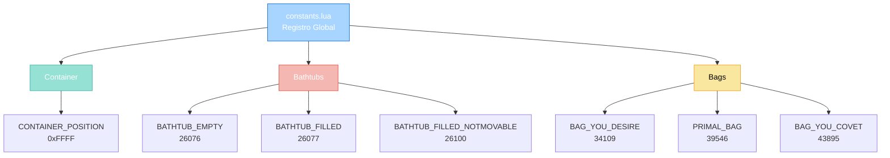

import { Aside, Card } from '@astrojs/starlight/components';

## 🛠️ Informações do Arquivo

Arquivo que implementa um **registro central de constantes globais** do servidor Canary. Define identificadores de itens críticos, posições especiais e valores magic para uso em scripts Lua.

<Card title="Caminho Original" icon="document">
  data/libs/functions/constants.lua
</Card>

<Aside type="tip">
  Módulo de constantes puras (11 linhas). Fornece valores globais bem-conhecidos: CONTAINER_POSITION identificador especial para referência a container, BATHTUB_EMPTY/FILLED para banheiras, BAG_YOU_DESIRE/COVET/PRIMAL_BAG para bags especiais. Elimina hardcoding de IDs em scripts. Valores são immutáveis por convenção Lua.
</Aside>

---

## 📄 Visão Geral do Código

### Resumo Executivo

`constants.lua` é um **registro de constantes globais essenciais** que fornece:

1. **Container Identifier**: Posição especial para referência a containers
2. **Item Identifiers**: IDs de itens comuns e especiais
3. **Eliminação de Magic Numbers**: Valores centralizados e nomeados
4. **Documentação Implícita**: Nomes descritivos servem como documentação
5. **Manutenção Centralizada**: Mudanças de IDs em um só lugar

**Objetivo Principal**: Fornecer **interface de constantes bem-conhecidas** para evitar hardcoding de valores numéricos em scripts.

### Estrutura de Constantes



---

## 📋 Constantes Globais

### Container Position

```lua
CONTAINER_POSITION = 0xFFFF
```

**Propósito**: Identificador especial que representa a posição de um container.

**Tipo**: number (hexadecimal)

**Valor**: 65535 (em decimal)

**Uso**: Referência simbólica para posição de container em operações de item.

**Exemplos**:
```lua
-- Adicionar item ao container do player
player:addItem(itemId, count, CONTAINER_POSITION)

-- Verificar se posição é container
if position == CONTAINER_POSITION then
    print("Posição é container")
end
```

**Nota**: Valor hexadecimal 0xFFFF é convenção universal para "container genérico".

---

## 🛁 Constantes de Banheira

### BATHTUB_EMPTY

```lua
BATHTUB_EMPTY = 26076
```

**Propósito**: ID de banheira vazia (visual).

**Tipo**: number

**Valor**: 26076

**Uso**: Criar ou identificar banheiras vazias no mapa.

**Exemplos**:
```lua
local item = Game.createItem(BATHTUB_EMPTY, 1, position)
if item:getId() == BATHTUB_EMPTY then
    print("É banheira vazia")
end
```

---

### BATHTUB_FILLED

```lua
BATHTUB_FILLED = 26077
```

**Propósito**: ID de banheira cheia (visual).

**Tipo**: number

**Valor**: 26077

**Uso**: Transformar banheira vazia em cheia.

**Exemplos**:
```lua
-- Encher banheira
local bathtub = getTileItemById(position, BATHTUB_EMPTY)
if bathtub then
    bathtub:transform(BATHTUB_FILLED)
end
```

---

### BATHTUB_FILLED_NOTMOVABLE

```lua
BATHTUB_FILLED_NOTMOVABLE = 26100
```

**Propósito**: ID de banheira cheia e imóvel.

**Tipo**: number

**Valor**: 26100

**Uso**: Banheira que não pode ser movida pelo player.

**Exemplos**:
```lua
-- Criar banheira que não pode ser movida
Game.createItem(BATHTUB_FILLED_NOTMOVABLE, 1, position)
```

---

## 👜 Constantes de Bags

### BAG_YOU_DESIRE

```lua
BAG_YOU_DESIRE = 34109
```

**Propósito**: ID de bag especial "You Desire".

**Tipo**: number

**Valor**: 34109

**Uso**: Bag cosmético ou funcional especial.

**Exemplos**:
```lua
local bag = Game.createItem(BAG_YOU_DESIRE, 1, position)
player:addItem(bag:getId(), 1, player:getSlotPosition(CONST_SLOT_BACKPACK))
```

---

### PRIMAL_BAG

```lua
PRIMAL_BAG = 39546
```

**Propósito**: ID de bag especial "Primal".

**Tipo**: number

**Valor**: 39546

**Uso**: Bag cosmético ou funcional primal.

**Exemplos**:
```lua
if item:getId() == PRIMAL_BAG then
    print("Bag primal encontrado")
end
```

---

### BAG_YOU_COVET

```lua
BAG_YOU_COVET = 43895
```

**Propósito**: ID de bag especial "You Covet".

**Tipo**: number

**Valor**: 43895

**Uso**: Bag cosmético ou funcional especial.

**Exemplos**:
```lua
-- Verificar se é bag específica
if item:getId() == BAG_YOU_COVET then
    -- Aplicar lógica especial
end
```

---

## 📊 Tabela de Referência Rápida

### Todos os IDs

| Constante | Valor | Tipo | Descrição |
|-----------|-------|------|-----------|
| **CONTAINER_POSITION** | 0xFFFF (65535) | Posição especial | Referência a container |
| **BATHTUB_EMPTY** | 26076 | Item ID | Banheira vazia |
| **BATHTUB_FILLED** | 26077 | Item ID | Banheira cheia |
| **BATHTUB_FILLED_NOTMOVABLE** | 26100 | Item ID | Banheira cheia imóvel |
| **BAG_YOU_DESIRE** | 34109 | Item ID | Bag cosmético |
| **PRIMAL_BAG** | 39546 | Item ID | Bag primal |
| **BAG_YOU_COVET** | 43895 | Item ID | Bag cosmético |

---

## 🔄 Padrões de Uso

### Padrão 1: Evitar Magic Numbers

```lua
-- ❌ Ruim - magic numbers
local item = Game.createItem(26076, 1, position)
if item:getId() == 26077 then ... end

-- ✅ Bom - constantes
local item = Game.createItem(BATHTUB_EMPTY, 1, position)
if item:getId() == BATHTUB_FILLED then ... end
```

---

### Padrão 2: Verificação de Tipo de Bag

```lua
local specialBags = {
    [BAG_YOU_DESIRE] = "Bag You Desire",
    [PRIMAL_BAG] = "Primal Bag",
    [BAG_YOU_COVET] = "Bag You Covet",
}

function isSpecialBag(itemId)
    return specialBags[itemId] ~= nil
end

function getBagName(itemId)
    return specialBags[itemId] or "Unknown"
end
```

---

### Padrão 3: Sistema de Banheira

```lua
local function fillBathtub(bathtubItem)
    if bathtubItem:getId() == BATHTUB_EMPTY then
        bathtubItem:transform(BATHTUB_FILLED)
        return true
    end
    return false
end

local function emptyBathtub(bathtubItem)
    if bathtubItem:getId() == BATHTUB_FILLED then
        bathtubItem:transform(BATHTUB_EMPTY)
        return true
    end
    return false
end
```

---

## ✅ Checkpoint de Aprendizagem

### Convenções

1. **MAIÚSCULAS**: Constantes sempre em SNAKE_CASE maiúsculo
2. **Valores Imutáveis**: Nunca modificar constantes em runtime
3. **Hex vs Decimal**: Valores de posição em hex, IDs em decimal
4. **Centralização**: Todos valores conhecidos em um arquivo

### Manutenção

| Operação | Local |
|----------|-------|
| Adicionar constante | constants.lua |
| Usar constante | Scripts Lua |
| Atualizar valor | constants.lua (afeta todo projeto) |

---

## 📚 Conclusão

`constants.lua` fornece um **registro simples mas essencial** de valores globais:

1. **Eliminação de Magic Numbers**: Valores com nomes descritivos
2. **Manutenção Centralizada**: Mudanças de IDs em um só lugar
3. **Documentação Implícita**: Nomes servem como documentação
4. **Escalabilidade**: Fácil adicionar novos valores
5. **Consistência**: Interface padrão em toda a codebase

Arquivo crítico para evitar erros e manter código limpo e mantenível.

---

## 🤖 Informações da Documentação

<Card title="Metadata da Documentação" icon="star">
  - **Arquivo Original**: constants.lua
  - **Caminho**: data/libs/functions/
  - **Tipo**: Constants Registry Module
  - **Última Atualização**: 2026-02-19
  - **Status**: ✅ Completo
  - **Linhas de Código**: 11 linhas
  - **Constantes Globais**: 7
  - **Categorias**: Container (1), Bathtubs (3), Bags (3)
  - **Valores Formato**: Decimal + Hexadecimal
  - **Dependencies**: Nenhuma
  - **Complexidade**: Muito Baixa (Data Pura)
</Card>

<Aside type="note">
  **Nota de Manutenção**: Arquivo crítico para consistência. Ao adicionar novos valores: (1) Verificar se ID já existe, (2) Adicionar comentário descritivo, (3) Organizar por categoria, (4) Manter nomes descritivos em SNAKE_CASE, (5) Testar em múltiplos scripts antes de fazer deploy.
</Aside>
