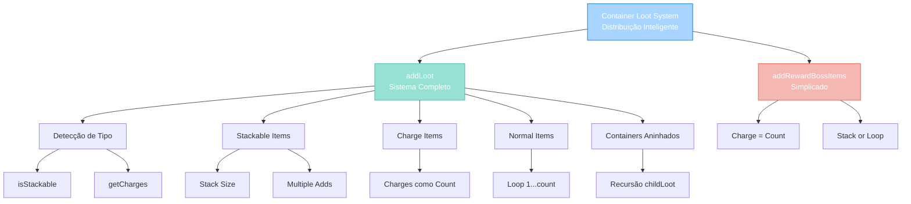

import { Aside, Card } from '@astrojs/starlight/components';

## 🛠️ Informações do Arquivo

Arquivo que implementa **extensões da classe Container** para distribuição inteligente e flexible de loot. Fornece métodos para adicionar itens com suporte a containers aninhados, charge items, transformações de subtipo, action IDs e textos personalizados.

<Card title="Caminho Original" icon="document">
  data/libs/functions/container.lua
</Card>

<Aside type="tip">
  Sistema de loot inteligente (80+ linhas). Implementa 2 métodos: 
  - `addLoot(loot)` com suporte a hierarquia de containers, detecção automática de stackable/charge items, transformação de subtipo e children recursivos
  - `addRewardBossItems(itemList)` versão simplificada para loot de boss
  
  Estrutura de tipo LootItems é tabela aninhada com chaves itemId e valores [count, subType, text, actionId, gut, childLoot].
</Aside>

---

## 📄 Visão Geral do Código

### Resumo Executivo

`container.lua` é um **módulo OOP para distribuição de loot** que fornece:

1. **Adição Inteligente de Itens**: Detecta stackable, charge, normal automaticamente
2. **Suporte a Hierarquia**: Containers aninhados com loot recursivo
3. **Transformação de Subtipo**: Aplica subType customizado após adição
4. **Text Personalizados**: Salva texto em items (livros, cartas)
5. **Action IDs**: Define ação customizada em items
6. **Erro Handling**: Logging detalhado de falhas

**Objetivo Principal**: Fornecer **interface robusta para distribuição de loot** sem necessidade de detalhes de implementação.

### Estrutura de Funcionalidades



---

## 📋 Tipo de Dados: LootItems

### Structure Definition

```lua
---@alias LootItems table<number, {
    count: number,              -- Quantidade de items
    subType?: number,           -- Subtipo (opcional, ex: water type para potion)
    text?: string,              -- Texto customizado (livros, cartas)
    actionId?: number,          -- Action ID customizado
    gut?: boolean,              -- Flag para "gut" (não usado aqui)
    childLoot: LootItems        -- Loot recursivo para containers aninhados
}>
```

### Estrutura

**Key**: number - Item ID (ex: 2160 para gold coin)

**Value**: table - Propriedades do item
| Campo | Tipo | Obrigatório | Descrição |
|-------|------|-------------|-----------|
| **count** | number | Sim | Quantidade de items a adicionar |
| **subType** | number | Não | Subtipo (água, carga, etc). -1 = default |
| **text** | string | Não | Texto personalizado (livros, cartas) |
| **actionId** | number | Não | Action ID customizado. -1 = nenhum |
| **childLoot** | LootItems | Não | Loot recursivo para containers filhos |

### Exemplos de Estrutura

```lua
-- Exemplo 1: Gold simples
local loot = {
    [2160] = { count = 100 }  -- 100 gold coins
}

-- Exemplo 2: Potion com subtipo
local loot = {
    [7618] = { count = 5, subType = 0 }  -- 5 health potions
}

-- Exemplo 3: Item com texto
local loot = {
    [1967] = { count = 1, text = "Secret message here" }
}

-- Exemplo 4: Hierarquia de containers
local loot = {
    [2000] = {  -- Bag
        count = 1,
        childLoot = {
            [2160] = { count = 50 },  -- Gold dentro do bag
            [7618] = { count = 2 }    -- Potion dentro do bag
        }
    }
}

-- Exemplo 5: Complexo com tudo
local loot = {
    [2160] = { count = 100 },
    [7618] = { count = 5, subType = 0 },
    [2000] = {
        count = 1,
        actionId = 1001,
        childLoot = {
            [1967] = { count = 1, text = "You found me!" },
            [2160] = { count = 200 }
        }
    }
}
```

---

## 🏗️ Métodos

### addLoot()

```lua
function Container:addLoot(loot)
	for itemId, item in pairs(loot) do
		local iType = ItemType(itemId)
		if not iType then
			logger.warn("Container:addLoot: invalid item type: {}", itemId)
			goto continue
		end
		
		-- Lógica aqui para:
		-- 1. Stackable items
		-- 2. Charge items
		-- 3. Normal items
		-- 4. Container children recursivamente
		
		::continue::
	end
end
```

**Propósito**: Adiciona loot inteligente a um container com suporte a hierarquia.

**Parâmetros**:
- loot: LootItems - Estrutura de loot a adicionar

**Retorno**: void (modifica container in-place)

**Side Effects**: Adiciona items ao container

**Algoritmo**:

```
1. Para cada itemId na tabela loot:
   a. Validar que item type existe
   b. Verificar se é stackable:
      - Se stackable, calcular quantidade máxima por stack
      - Loop: enquanto remainingCount > 0
        - Adicionar min(remainingCount, stackSize)
        - Decrementar remainingCount
   c. Verificar se tem charges:
      - Se sim, usar charge como count
      - Adicionar como single item
   d. Se normal item:
      - Loop count vezes
      - Adicionar cada item individually
      - Se childLoot, recursivamente addLoot ao item (se container)
      - Transformar subType se != -1
      - Setar actionId se != -1
      - Setar texto se fornecido
```

**Exemplos Práticos**:

```lua
-- Exemplo 1: Gold simples
local corpse = creatr:getCorpse()
corpse:addLoot({
    [2160] = { count = 100 }
})

-- Exemplo 2: Loot complexo com bag aninhada
corpse:addLoot({
    [2160] = { count = 100 },
    [7618] = { count = 5, subType = 0 },
    [2000] = {  -- Bag
        count = 1,
        actionId = 1001,
        childLoot = {
            [2160] = { count = 50 },
            [1967] = { count = 1, text = "Quest item" }
        }
    }
})

-- Exemplo 3: Múltiplos items com transformação
corpse:addLoot({
    [2160] = { count = 50 },
    [7612] = { count = 2, subType = 0 },  -- Minor health potion
    [7613] = { count = 1, subType = 0 },  -- Health potion
    [7614] = { count = 1, subType = 0 }   -- Strong health potion
})
```

**Validações**:
- Item ID válido (ItemType existe)
- Count > 0
- SubType válido ou -1
- ActionId válido ou -1
- ChildLoot é tabela válida

**Tratamento de Erro**:
- Item inválido → log warn e pula
- Falha ao adicionar → log warn detalhado
- Container filho falha → remove item problemático

---

### addRewardBossItems()

```lua
function Container:addRewardBossItems(itemList)
	for itemId, lootInfo in pairs(itemList) do
		local iType = ItemType(itemId)
		if iType then
			local itemCount = lootInfo.count
			local charges = iType:getCharges()
			if charges > 0 then
				itemCount = charges
				logger.debug("Adding item with 'id' to the reward container, item charges {}", iType:getId(), charges)
			end
			if iType:isStackable() or iType:getCharges() ~= 0 then
				self:addItem(itemId, itemCount, INDEX_WHEREEVER, FLAG_NOLIMIT)
			else
				for i = 1, itemCount do
					self:addItem(itemId, 1, INDEX_WHEREEVER, FLAG_NOLIMIT)
				end
			end
		end
	end
end
```

**Propósito**: Versão simplificada de addLoot para loot de boss (sem hierarquia).

**Parâmetros**:
- itemList: table - `{itemId = {count = num}, ...}`

**Retorno**: void

**Diferenças para addLoot**:
- Sem suporte a childLoot (containers aninhados)
- Sem suporte a text, actionId, subType
- Charge items automaticamente usam charge como count
- Mais rápido para casos simples

**Exemplos**:

```lua
-- Loot simples de boss
corpse:addRewardBossItems({
    [2160] = { count = 100 },
    [7618] = { count = 5 },
    [7992] = { count = 2 }
})

-- Com charge items (automaticamente detectado)
corpse:addRewardBossItems({
    [2160] = { count = 50 },           -- Gold
    [2017] = { count = 1 },            -- Wand (charges > 0)
    -- Charge será usado automaticamente
})
```

---

## 📊 Comparação: addLoot vs addRewardBossItems

| Feature | addLoot | addRewardBossItems |
|---------|---------|-------------------|
| **Stackable Detection** | ✅ Sim | ✅ Sim |
| **Charge Items** | ✅ Sim | ✅ Sim (auto) |
| **SubType Transform** | ✅ Sim | ❌ Não |
| **Action IDs** | ✅ Sim | ❌ Não |
| **Custom Text** | ✅ Sim | ❌ Não |
| **Nested Containers** | ✅ Sim | ❌ Não |
| **Logging** | ✅ Completo | ✅ Debug |
| **Velocidade** | Média | Rápida |
| **Caso de Uso** | Dungeon drops | Boss drops |

---

## 🔄 Padrões de Uso

### Padrão 1: Drop de Criatura

```lua
-- Loot com múltiplos tipos
monster:getCorpse():addLoot({
    [2160] = { count = math.random(10, 50) },  -- Variação de gold
    [7618] = { count = 2, subType = 0 },       -- Health potion
    [7620] = { count = 1, subType = 0 },       -- Mana potion
})
```

---

### Padrão 2: Boss Drop com Bag Special

```lua
-- Boss drop com loot variado em bag special
local bossLoot = {
    [2160] = { count = 1000 },
    [7618] = { count = 5, subType = 0 },
    [2000] = {  -- Special bag
        count = 1,
        actionId = 12345,
        childLoot = {
            [2160] = { count = 500 },
            [8845] = { count = 1 },     -- Rare item
            [1967] = { count = 1, text = "Boss defeated!" }
        }
    }
}
boss:getCorpse():addLoot(bossLoot)
```

---

### Padrão 3: Quest Item com Hierarquia

```lua
-- Loot de quest com estrutura organizada
creature:getCorpse():addLoot({
    [2000] = {  -- Main bag
        count = 1,
        actionId = 9999,
        childLoot = {
            [2001] = {  -- Sub-bag
                count = 1,
                childLoot = {
                    [5950] = { count = 1, text = "Quest objective" },
                    [5951] = { count = 1 }
                }
            },
            [2160] = { count = 100 }
        }
    }
})
```

---

### Padrão 4: Sistema Inteligente de Drop

```lua
local function generateMonsterLoot(monster, level)
    local baseLoot = {}
    
    -- Gold proporcional a level
    baseLoot[2160] = { count = level * math.random(5, 15) }
    
    -- Potion aleatória
    local potions = { [7618] = 0, [7620] = 0, [7621] = 0 }
    local randomPotion = next(potions, math.random(1, 3))
    baseLoot[randomPotion] = { count = math.random(1, 3), subType = 0 }
    
    -- Rare item (5% chance)
    if math.random(100) <= 5 then
        baseLoot[8845] = { count = 1 }
    end
    
    return baseLoot
end

-- Usar em death handler
function onMonsterDeath(monster)
    local loot = generateMonsterLoot(monster, monster:getLevel())
    monster:getCorpse():addLoot(loot)
end
```

---

## ✅ Checkpoint de Aprendizagem

### Conceitos Principais

1. **Autodetecção de Tipo**: Sistema detecta stackable/charge automaticamente
2. **Hierarquia de Containers**: Suporte a aninhamento profundo
3. **Transformação on-Add**: SubType, actionId, texto aplicado durante adição
4. **Recursive Loot**: ChildLoot permite estruturas complexas
5. **Error Handling**: Logging previne items perdidos silenciosamente

### Melhores Práticas

| Prática | Exemplo |
|---------|---------|
| **Validar ItemId** | Sempre usar ItemType antes de adicionar |
| **Usar SubType** | Para potions/fluids com diferentes tipos |
| **ActionId para Quests** | Identifique items especiais |
| **Hierarquia Lógica** | Organize loot em containers meaningful |

---

## 📚 Conclusão

`container.lua` fornece um **sistema robusto e flexible de loot distribution**:

1. **Automação Inteligente**: Detecta tipo de item automaticamente
2. **Suporte a Hierarquia**: Containers aninhados ilimitados
3. **Customização Completa**: SubType, text, actionId, custom callbacks
4. **Escalabilidade**: Ideal para dungeon drops até boss rewards
5. **Error Handling**: Logging detalhado previne data loss

Essencial para criar loot systems profissionais e variados.

---

## 🤖 Informações da Documentação

<Card title="Metadata da Documentação" icon="star">
  - **Arquivo Original**: container.lua
  - **Caminho**: data/libs/functions/
  - **Tipo**: Container Loot Distribution System
  - **Última Atualização**: 2026-02-19
  - **Status**: ✅ Completo
  - **Linhas de Código**: 80+ linhas
  - **Métodos Globais**: 2 (addLoot, addRewardBossItems)
  - **Recursão**: Suportada (childLoot indefinidamente aninhada)
  - **Tipos de Item**: Stackable, Charge, Normal, Container
  - **Suporte a Transformação**: SubType, ActionId, Text, Nested
  - **Complexidade**: Média-Alta
  - **Dependencies**: ItemType, Container class
</Card>

<Aside type="note">
  **Nota de Manutenção**: Sistema crítico para loot. Ao modificar: (1) Testar com múltiplos tipos de item, (2) Validar hierarquias profundas, (3) Testar items com charges, (4) Garantir logging de erros, (5) Performance com muitos items. Considerar: (1) Pool de items para reuse, (2) Limite de hierarquia para evitar loops, (3) Batch operations para múltiplos containers, (4) Cache de ItemType.
</Aside>
