import { Aside, Card } from '@astrojs/starlight/components';

## 🛠️ Informações do Arquivo

Arquivo que implementa 60+ funções utilitárias globais essenciais para o servidor. Fornece abstrações reutilizáveis para serialização de tabelas, gerenciamento de tempo e datas, cálculo de moeda e peso, spawning de monstros, gerenciamento de salas de chefes, operações em áreas 3D, validação de dados, callbacks para death events em parties e dunamically players, e controle avançado de forja e influência.

<Aside type="tip">
Este é o **maior arquivo de utilidade do projeto**, contendo 60+ funções globais organizadas em 13 categorias principais. Não contém classes ou estruturas OOP, apenas funções puras com alta reutilização em todo o codebase.
</Aside>

## 📄 Visão Geral do Código

### Resumo Executivo

O arquivo `functions.lua` é um **consolidado de funções auxiliares** que implementam operações comuns necessárias em todo o servidor Canary. Diferentemente de `boss_lever.lua` (padrão factory) ou `container.lua` (padrão OOP), este arquivo segue um **paradigma funcional puro**, com funções independentes que não mantêm estado persistente.

As funções podem ser agrupadas em **dois padrões de design**:

1. **Operações de Transformação**: Convertem dados de um formato para outro (serialização, parsing, conversão)
2. **Operações de Gerenciamento**: Manipulam o estado do servidor (teleporte, remoção, spawning)

### Estrutura Mermaid

```mermaid
graph TB
    A["functions.lua<br/>60+ Funções Globais"] --> B["Serialização & Tabelas"]
    A --> C["Tempo & Data"]
    A --> D["Moeda & Peso"]
    A --> E["Gerenciamento de Chefes"]
    A --> F["Monstros & Áreas"]
    A --> G["Jogadores & Banco de Dados"]
    A --> H["Validação & Conversão"]
    A --> I["Eventos de Morte"]
    A --> J["Sala & Ocupação"]
    A --> K["Forja & Influência"]
    A --> L["Utilidades Avançadas"]
    A --> M["Sistema Boss Entry"]
    
    B --> B1["serializeTable"]
    B --> B2["unserializeTable"]
    B --> B3["table.copy"]
    B --> B4["PrettyString"]
    B --> B5["indexToStr"]
    
    C --> C1["getTibiaTimerDayOrNight"]
    C --> C2["getFormattedWorldTime"]
    C --> C3["getRealDate"]
    C --> C4["getRealTime"]
    C --> C5["GetNextOccurrence"]
    C --> C6["ParseDuration"]
    C --> C7["FormatDuration"]
    
    D --> D1["getMoneyCount"]
    D --> D2["getMoneyWeight"]
    D --> D3["getBankMoney"]
    D --> D4["isValidMoney"]
    D --> D5["FormatNumber"]
    
    E --> E1["checkBoss"]
    E --> E2["clearBossRoom"]
    E --> E3["clearRoom"]
    E --> E4["Player:doCheckBossRoom"]
    E --> E5["kickPlayersAfterTime"]
    
    F --> F1["placeSpawnRandom"]
    F --> F2["getMonstersInArea"]
    F --> F3["isPlayerInArea"]
    F --> F4["cleanAreaQuest"]
    F --> F5["kickerPlayerRoomAfterMin"]
    
    G --> G1["getPlayerSpouse"]
    G --> G2["getPlayerMarriageStatus"]
    G --> G3["getPlayerNameById"]
    G --> G4["setPlayerSpouse"]
    G --> G5["setPlayerMarriageStatus"]
    
    H --> H1["isNumber"]
    H --> H2["isInteger"]
    H --> H3["toKey"]
    H --> H4["toboolean"]
    H --> H5["HasValidTalkActionParams"]
    
    I --> I1["onDeathForParty"]
    I --> I2["onDeathForDamagingPlayers"]
    
    J --> J1["roomIsOccupied"]
    J --> J2["clearForgotten"]
    J --> J3["iterateArea"]
    J --> J4["checkWeightAndBackpackRoom"]
    J --> J5["doCreatureSayWithRadius"]
    
    K --> K1["CheckDustLevel"]
    K --> K2["SetFiendish"]
    K --> K3["SetInfluenced"]
    K --> K4["resetFerumbrasAscendantHabitats"]
    K --> K5["checkWallArito"]
    
    L --> L1["getRateFromTable"]
    L --> L2["unpack2"]
    L --> L3["pack"]
    L --> L4["logCommand"]
    L --> L5["ReloadDataEvent"]
    
    M --> M1["bosssPlayers Table"]
    M --> M2["addPlayers"]
    M --> M3["removePlayer"]
    M --> M4["getPlayersCount"]
    
    style A fill:#ff9999
    style B fill:#ffcc99
    style C fill:#99ccff
    style D fill:#99ff99
    style E fill:#ff99cc
    style F fill:#ff99cc
    style G fill:#ffff99
    style H fill:#cc99ff
    style I fill:#99ffcc
    style J fill:#ff99ff
    style K fill:#ccffff
    style L fill:#99cccc
    style M fill:#ffcccc
```



## 📋 Funções de Serialização e Tabelas

### `PrettyString(tbl, indent)`

Converte uma tabela Lua em uma string formatada para debug, com indentação recursiva.

**Parâmetros**:
- `tbl` (table): Tabela a serializar
- `indent` (string, opcional): String de indentação para recursão

**Retorna**: string

**Exemplo**:
```lua
local player = { name = "Tibia Player", level = 100 }
print(PrettyString(player))
-- Output:
-- {
--   name = "Tibia Player",
--   level = 100
-- }
```

---

### `serializeTable(t, buffer)`

Serializa uma tabela Lua em formato Lua válido para salvar/transmitir.

**Parâmetros**:
- `t` (table): Tabela a serializar
- `buffer` (table, opcional): Buffer para acumular partes da string

**Retorna**: string

**Exemplo**:
```lua
local config = { enabled = true, count = 5 }
local serialized = serializeTable(config)
print(serialized) -- {["enabled"] = true, ["count"] = 5,}
```

---

### `unserializeTable(str, out)`

Desserializa uma string Lua em uma tabela, com suporte a cópia recursiva.

**Parâmetros**:
- `str` (string): String serializada em formato Lua
- `out` (table, opcional): Tabela de saída para preencher

**Retorna**: table ou false se inválido

**Exemplo**:
```lua
local str = '{["name"] = "Player", ["level"] = 100}'
local data = unserializeTable(str)
print(data.name) -- "Player"
```

---

### `table.copy(t, out)`

Cópia profunda (deep copy) de uma tabela com suporte a tabelas aninhadas.

**Parâmetros**:
- `t` (table): Tabela a copiar
- `out` (table, opcional): Tabela para preencher

**Retorna**: table ou false

**Exemplo**:
```lua
local original = { a = 1, nested = { b = 2 } }
local copy = table.copy(original)
copy.nested.b = 3
print(original.nested.b) -- 2 (não foi afetado)
```

---

### `indexToStr(i, v, buffer)` e `insertIndex(i, buffer)`

Funções auxiliares para serialização, formatam índices e valores em formato Lua.

**Parâmetros** (indexToStr):
- `i` (string/number): Índice
- `v` (any): Valor
- `buffer` (table): Buffer acumulador

---

## ⏰ Funções de Tempo e Data

### `getTibiaTimerDayOrNight()`

Determina se é dia ou noite no mundo Tibia baseado na luz global do mundo.

**Parâmetros**: Nenhum

**Retorna**: string ("day" ou "night")

**Exemplo**:
```lua
if getTibiaTimerDayOrNight() == "day" then
    print("É dia no mundo Tibia")
end
```

**Observação**: Usa `getWorldLight()` para determinar o horário

---

### `getFormattedWorldTime()`

Retorna o horário atual do mundo Tibia em formato HH:MM.

**Parâmetros**: Nenhum

**Retorna**: string (formato "HH:MM")

**Exemplo**:
```lua
print("Horário do servidor: " .. getFormattedWorldTime())
-- Output: "Horário do servidor: 12:30"
```

---

### `getRealDate()` e `getRealTime()`

Retornam data e hora do sistema operacional em formato DD/MM e HH:MM.

**Exemplo**:
```lua
print("Data: " .. getRealDate())  -- "15/03"
print("Hora: " .. getRealTime())  -- "14:45"
```

---

### `GetNextOccurrence(timeStr)`

Calcula o timestamp Unix para a próxima ocorrência de um horário específico.

**Parâmetros**:
- `timeStr` (string): Formato "HH:MM:SS"

**Retorna**: number (timestamp Unix) ou nil se inválido

**Exemplo**:
```lua
local nextMidnight = GetNextOccurrence("00:00:00")
print("Próxima meia-noite em: " .. (nextMidnight - os.time()) .. " segundos")
```

---

### `ParseDuration(duration)` e `FormatDuration(duration)`

Convertem entre string de duração (ex: "2d3h5m") e millisegundos.

**Parâmetros**:
- `duration` (string/number): String como "1w2d3h4m5s6ms" ou number de ms

**Unidades Suportadas**: w (semanas), d (dias), h (horas), m (minutos), s (segundos), ms (milissegundos)

**Exemplo**:
```lua
local ms = ParseDuration("2d5h30m")    -- 187800000 ms
local str = FormatDuration(187800000)  -- "2d5h30m"

-- Idempotência: ParseDuration aceita números também
local result = ParseDuration(5000)     -- 5000 (retorna direto)
```

---

## 💰 Funções de Moeda e Peso

### `getMoneyCount(string)`

Extrai um número de moeda de uma string usando regex.

**Parâmetros**:
- `string` (string): String contendo número

**Retorna**: number (quantidade) ou -1 se inválido

**Exemplo**:
```lua
print(getMoneyCount("You have 5000 gold")) -- 5000
```

---

### `getBankMoney(cid, amount)`

Deduz moeda da conta bancária do jogador com mensagem de feedback.

**Parâmetros**:
- `cid` (number/string): ID do jogador
- `amount` (number): Quantidade a retirar

**Retorna**: boolean (true se sucesso)

**Exemplo**:
```lua
if getBankMoney(player:getId(), 100) then
    print("Retirou 100 gold do banco")
else
    print("Saldo insuficiente no banco")
end
```

---

### `getMoneyWeight(money)`

Calcula o peso necessário para carregar uma quantidade de moedas usando crystal, platinum e gold coins.

**Parâmetros**:
- `money` (number): Quantidade de ouro

**Retorna**: number (peso em oz)

**Conversão**:
- 10000 gold = 1 crystal coin
- 100 gold = 1 platinum coin
- 1 gold = 1 gold coin

**Exemplo**:
```lua
local weight = getMoneyWeight(50000)
print("50000 gold pesam: " .. weight .. " oz")
```

---

### `isValidMoney(money)` e `FormatNumber(number)`

Valida se um número é quantidade válida de moeda, e formata números com separadores de milhar.

**Exemplo**:
```lua
if isValidMoney(5000) then
    print("Valid: " .. FormatNumber(5000)) -- "5,000"
end
```

---

## 👑 Funções de Jogadores e Banco de Dados

### Marriage Functions

```lua
getPlayerSpouse(id)          -- Retorna ID do cônjuge ou -1
getPlayerMarriageStatus(id)  -- Retorna status do casamento
setPlayerSpouse(id, val)     -- Define cônjuge
setPlayerMarriageStatus(id, val) -- Define status
```

**Exemplo**:
```lua
local spouse_id = getPlayerSpouse(player:getId())
if spouse_id ~= -1 then
    local spouse_name = getPlayerNameById(spouse_id)
    print("Casado com: " .. spouse_name)
end
```

---

### `getPlayerNameById(id)`

Busca nome do jogador no banco de dados pelo ID.

**Parâmetros**:
- `id` (number): ID do jogador

**Retorna**: string (nome) ou false

---

## 👹 Funções de Monstros e Áreas

### `placeSpawnRandom(fromPos, toPos, monsterName, amount, hasCall, storage, value, removestorage, sharedHP, event, message)`

Spawna monstros aleatoriamente em uma área com suporte a configurações avançadas.

**Parâmetros**:
- `fromPos`, `toPos` (Position): Limites da área
- `monsterName` (string): Nome do monstro
- `amount` (number): Quantidade a spawnar
- `hasCall` (boolean): Se registra storage/eventos
- `storage`, `value` (number): Storage para rastrear monstro
- `removestorage` (boolean): Se remove por storage ao invés de nome
- `sharedHP` (boolean): Se ativa vida compartilhada
- `event` (string): Evento para registrar
- `message` (string): Mensagem ao spawnar

**Exemplo**:
```lua
placeSpawnRandom(
    Position(32000, 32000, 7),
    Position(32010, 32010, 7),
    "Demon",
    5,
    true,
    Storage.BossRoom,
    1,
    false,
    true,
    "bossEvent",
    "Two demons appear!"
)
```

---

### `getMonstersInArea(fromPos, toPos, monsterName, ignoreMonsterId)`

Coleta todos os monstros de um tipo nome específico em uma área.

**Parâmetros**:
- `fromPos`, `toPos` (Position): Limites da área
- `monsterName` (string): Nome do monstro a buscar
- `ignoreMonsterId` (number, opcional): ID de monstro a ignorar

**Retorna**: table (array de Monster objects)

**Exemplo**:
```lua
local demons = getMonstersInArea(fromPos, toPos, "Demon")
print("Encontrados " .. #demons .. " demônios")
```

---

### `isPlayerInArea(fromPos, toPos)`

Verifica se há algum jogador em uma área.

**Parâmetros**:
- `fromPos`, `toPos` (Position): Limites da área

**Retorna**: boolean

---

### `cleanAreaQuest(fromPos, toPos, itemTable, blockMonsters)`

Limpa área removendo cadáveres, itens e monstros específicos.

**Parâmetros**:
- `fromPos`, `toPos` (Position): Área a limpar
- `itemTable` (table): IDs de itens a remover (opcional)
- `blockMonsters` (table): Nomes de monstros a preservar (opcional)

**Exemplo**:
```lua
cleanAreaQuest(
    fromPos, toPos,
    {2006, 2007},           -- Remove esses IDs de item
    {"Boss"}                -- Mas não remove Boss
)
```

---

### `kickerPlayerRoomAfterMin(playerName, fromPos, toPos, teleportPos, message, monsterName, minutes, firstCall, itemTable, blockMonsters)`

Expulsa jogadores de uma sala após um tempo limite com suporte a recursão.

**Parâmetros**:
- `playerName` (string/table): Nome ou array de nomes de jogadores
- `fromPos`, `toPos` (Position): Área a verificar
- `teleportPos` (Position): Local para teleportar
- `message` (string): Mensagem ao teleportar
- `monsterName` (string): Monstro associado (opcional)
- `minutes` (number): Minutos até expulsar
- `firstCall` (boolean): Se é primeira chamada (inicia recursão)

**Observação**: Usa `addEvent` para recursão de 1 minuto

---

## 🏰 Funções de Gerenciamento de Chefes

### `checkBoss(centerPos, rangeX, rangeY, bossName, bossPos)`

Verifica se um chefe existe em uma área, caso contrário spawna.

**Parâmetros**:
- `centerPos` (Position): Posição central para varredura
- `rangeX`, `rangeY` (number): Raios de varredura
- `bossName` (string): Nome do monstro chefe
- `bossPos` (Position): Posição para spawnar se não existir

**Retorna**: boolean (true se já existia, false se teve que spawnar)

---

### `clearBossRoom(playerId, centerPos, onlyPlayers, rangeX, rangeY, exitPos)`

Remove todos os monstros e teleporta jogadores de uma sala de chefe.

**Parâmetros**:
- `playerId` (number, opcional): Se especificado, apenas esse jogador é teleportado
- `centerPos` (Position): Centro da sala
- `onlyPlayers` (boolean): Se filtra apenas jogadores
- `rangeX`, `rangeY` (number): Raios
- `exitPos` (Position): Local de saída

---

### `clearRoom(centerPos, rangeX, rangeY, resetGlobalStorage)`

Remove monstros de uma sala e reseta storage global.

**Parâmetros**:
- `centerPos` (Position): Centro
- `rangeX`, `rangeY` (number): Raios
- `resetGlobalStorage` (number, opcional): Storage global a resetar

---

### `roomIsOccupied(centerPos, onlyPlayers, rangeX, rangeY)`

Verifica se há criaturas em uma sala.

**Parâmetros**:
- `centerPos` (Position): Centro
- `onlyPlayers` (boolean): Se filtra apenas jogadores
- `rangeX`, `rangeY` (number): Raios

**Retorna**: boolean

---

### `Player:doCheckBossRoom(bossName, fromPos, toPos)`

Método de extensão que valida se sala de chefe está livre.

**Parâmetros**:
- `bossName` (string): Nome do chefe
- `fromPos`, `toPos` (Position): Limites da sala

**Retorna**: boolean (true se sala está livre)

**Comportamento**:
1. Verifica se há jogadores na sala
2. Se houver, nega entrada com mensagem
3. Se vazia, limpa monstros restantes

---

### `kickPlayersAfterTime(players, fromPos, toPos, exit)`

Teleporta array de jogadores para saída com mensagem.

**Parâmetros**:
- `players` (table): Array de IDs de jogadores
- `fromPos`, `toPos` (Position): Área a verificar
- `exit` (Position): Local de saída

---

## 🎭 Funções de Sala e Isolamento

### `clearForgotten(fromPos, toPos, exitPos, storage)`

Sistema especial para "The Forgotten Way", expulsa com mensagem personalizada.

**Parâmetros**:
- `fromPos`, `toPos` (Position): Área do evento
- `exitPos` (Position): Saída
- `storage` (number): Storage para resetar

---

### `resetFerumbrasAscendantHabitats()`

Função especializada para reset do evento Ferumbras Ascendant com 8 habitats.

**Funcionalidades**:
- Reseta 9 storage values (8 habitats + AllHabitats)
- Teleporta 25 quadros ao redor de posição central
- Remove todos os tiles do mapa do evento
- Recarrega o arquivo .otbm do mapa

**Retorna**: boolean (true se sucesso)

---

### `checkWallArito(item, toPosition)`

Verificação de parede especial para item de quest Arito com transformações.

**Parâmetros**:
- `item` (Item): Item a verificar
- `toPosition` (Position): Posição de movimento

---

### `doCreatureSayWithRadius(cid, text, type, radiusX, radiusY, position)`

Transmite mensagem para todos os jogadores em um raio.

**Parâmetros**:
- `cid` (number): ID da criatura
- `text` (string): Mensagem
- `type` (number): Tipo de mensagem (TALKTYPE_*)
- `radiusX`, `radiusY` (number): Raios
- `position` (Position, opcional): Centro (padrão: posição da criatura)

---

### `iterateArea(func, from, to)`

Itera todas as posições em uma área 3D, executando função em cada uma.

**Parâmetros**:
- `func` (function): Função a executar em cada Position
- `from`, `to` (Position): Limites da área

**Exemplo**:
```lua
iterateArea(function(pos)
    local tile = Tile(pos)
    if tile then tile:getSurround():addMagicEffect(CONST_ME_TELEPORT) end
end, Position(32000, 32000, 7), Position(32010, 32010, 7))
```

---

### `checkWeightAndBackpackRoom(player, itemWeight, message)`

Valida capacidade e espaço de mochila antes de dar item.

**Parâmetros**:
- `player` (Player): Jogador
- `itemWeight` (number): Peso do item em oz
- `message` (string): Prefixo de mensagem

**Retorna**: boolean

**Exemplo**:
```lua
if checkWeightAndBackpackRoom(player, 10, "Você pegou a chave") then
    player:addItem(1234)
end
```

---

## ✨ Funções de Forja e Influência

### `CheckDustLevel(monsterForge, player)`

Valida nível de dust fiendish ou influenced para monstros forjados.

**Parâmetros**:
- `monsterForge` (string/number): "fiendish" ou nível (1-5)
- `player` (Player): Para enviar mensagens

**Retorna**: boolean, boolean, number (canSetFiendish, canSetInfluenced, influencedLevel)

---

### `SetFiendish(monsterType, position, player, monster)`

Transforma monstro em versão fiendish com validação.

**Parâmetros**:
- `monsterType` (MonsterType): Tipo do monstro
- `position` (Position): Posição
- `player` (Player): Jogador executante
- `monster` (Monster): Monstro a transformar

---

### `SetInfluenced(monsterType, monster, player, influencedLevel)`

Marca monstro com nível de influência e gerencia limite global.

**Parâmetros**:
- `monsterType` (MonsterType): Tipo
- `monster` (Monster): Monstro
- `player` (Player): Jogador
- `influencedLevel` (number): Nível de influência (1-5)

**Comportamento**:
- Se excedeu limite de influenced monstros, remove o mais antigo
- Adiciona novo monstro ao registro global

---

## 💀 Funções de Morte e Dano

### `onDeathForParty(creature, player, func)`

Itera participantes da party e executa função de morte para cada um.

**Parâmetros**:
- `creature` (Creature): Criatura que morreu
- `player` (Player): Jogador primário
- `func` (function): Função(creature, participant)

**Uso Típico**:
```lua
onDeathForParty(creature, player, function(creature, participant)
    participant:addExperience(creature:getExperience())
end)
```

---

### `onDeathForDamagingPlayers(creature, func)`

Itera todos os jogadores que danificaram criatura e executa função.

**Parâmetros**:
- `creature` (Creature): Criatura morta
- `func` (function): Função(creature, player)

**Observação**: Usa `creature:getDamageMap()` para encontrar jogadores

---

## 🔧 Funções de Validação e Conversão

### `isNumber(str)` e `isInteger(n)`

Valida se valor é número ou inteiro.

```lua
if isNumber("123") then print("É número") end    -- true
if isInteger(5.5) then print("É inteiro") end    -- false
```

---

### `toKey(str)` e `toboolean(value)`

Conversões de formatação: string para chave URL-safe, e valores para boolean.

**Exemplo**:
```lua
toKey("My Boss Name")   -- "my-boss-name"
toboolean("true")       -- true
toboolean("false")      -- false
```

---

### `HasValidTalkActionParams(player, param, usage)`

Valida parâmetros de comando split por vírgula.

**Parâmetros**:
- `player` (Player): Para enviar mensagens
- `param` (string): String de parâmetro
- `usage` (string): Mensagem de uso se inválido

**Retorna**: boolean

**Observação**: Valida se tem pelo menos 2 parâmetros separados por vírgula

---

## 🎫 Sistema de Entrada de Chefe (Boss Entry)

### `bosssPlayers` Table

Tabela global para rastrear jogadores em chefes.

**Métodos**:
- `addPlayers(cid)`: Adiciona jogador ao pool
- `removePlayer(cid)`: Remove jogador
- `getPlayersCount()`: Retorna quantidade

**Exemplo**:
```lua
if not bosssPlayers then
    bosssPlayers = { { }, addPlayers = function(...) ... end }
end

bosssPlayers:addPlayers(player:getId())
print("Players no boss: " .. bosssPlayers:getPlayersCount())
```

---

## 🔗 Funções Avançadas de Utilidade

### `getRateFromTable(t, level, default)`

Busca multiplicador de taxa baseado em nível em tabela configurada.

**Parâmetros**:
- `t` (table): Tabela com entries `{minlevel, maxlevel, multiplier}`
- `level` (number): Nível a buscar
- `default` (number): Valor padrão se não encontrar

**Exemplo**:
```lua
local rates = {
    {minlevel = 1, maxlevel = 50, multiplier = 1},
    {minlevel = 51, maxlevel = 100, multiplier = 2},
    {minlevel = 101, multiplier = 3}
}
local rate = getRateFromTable(rates, 75, 1)  -- 2
```

---

### `unpack2(tab, i)` e `pack(t, ...)`

Funções avançadas para lidar com varargs e packing.

- `unpack2`: Itera pares key-value em ordem
- `pack`: Empacota varargs em tabela

---

### `logCommand(player, words, param)`

Registra comandos executados em arquivo de log por jogador.

**Arquivo**: `CORE_DIRECTORY/logs/{playerName} commands.log`

**Formato**: `[DD/MM/YYYY HH:MM] words (params: param)`

---

### `ReloadDataEvent(cid)`

Executa `player:reloadData()` via event com delay.

---

## ✅ Checkpoint de Aprendizagem

### Conceitos Principais

1. **Paradigma Funcional Puro**: Funções sem estado compartilhado, apenas transformação de dados
2. **Padrão de Callbacks**: `onDeathForParty` e `onDeathForDamagingPlayers` usam callbacks para extensibilidade
3. **Iteração de Áreas**: Funções de 3D iteration (`iterateArea`, `getMonstersInArea`) usam nested loops
4. **Serialização Round-trip**: `serialize` ↔ `unserialize` para persistência

### Padrões de Design Identificados

- **Builder Pattern Implícito**: `getRateFromTable` constrói resultado configurável
- **Visitor Pattern**: `iterateArea` aplica função visitor em cada posição
- **Strategy Pattern**: `checkWeightAndBackpackRoom` permite múltiplas estratégias de validação

### Responsabilidades por Categoria

| Categoria | Responsabilidade | Exemplo |
|-----------|------------------|---------|
| Serialização | Persistência e transmissão de dados | `serializeTable`, `unserializeTable` |
| Tempo | Conversão entre formatos temporais | `GetNextOccurrence`, `ParseDuration` |
| Moeda | Validação e cálculo de moeda | `getMoneyWeight`, `isValidMoney` |
| Chefes | Gerenciamento de salas de boss | `checkBoss`, `clearBossRoom` |
| Monstros | Spawning e localização de MOBs | `placeSpawnRandom`, `getMonstersInArea` |
| Jogadores | Dados persistentes de jogadores | `getPlayerSpouse`, `getPlayerNameById` |

---

## 📚 Conclusão

O arquivo `functions.lua` é a **coluna vertebral de utilidades** do servidor Canary, fornecendo abstrações reutilizáveis que eliminam duplicação de código em todo o codebase. Suas 60+ funções podem ser categorizadas em **operações puras** (serialização, validação, conversão) e **operações com efeitos colaterais** (gerenciamento de salas, spawning, teleporte).

A modularização permite que subsistemas como combate (combat.lua), chefes (boss_lever.lua) e itemização (container.lua) dependam dessas primitivas sem precisar reimplementá-las. O suporte a **callbacks** e **eventos** torna as funções extensíveis para lógica customizada.

---

## 🤖 Informações da Documentação

<Card>
**Última Atualização**: 2024  
**Versão do Arquivo**: Estável  
**Linhas Documentadas**: 1085/1085 (100%)  
**Funções Documentadas**: 60+  
**Categorias**: 13  
**Exemplos Práticos**: 25+
</Card>

<Aside type="note">
**Nota de Manutenção**: Este arquivo é crítico e de alta reutilização. Ao adicionar novas funções, mantenha a categorização clara e adicione documentação com exemplos. Funções de serialização devem passar por testes de round-trip (serialize → unserialize → serialize).
</Aside>
