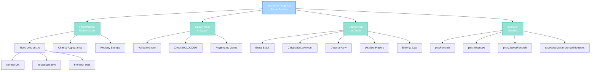

import { Aside, Card } from '@astrojs/starlight/components';

## 🛠️ Informações do Arquivo

Este é o arquivo que implementa o **sistema de Exaltation Forge** do servidor **OpenTibiaBR/Canary**. Fornece funcionalidades para gerenciamento de monstros forge especiais, multiplicadores de recompensa de dust e distribuição consciente de party.

<Card title="Caminho Original" icon="document">
  `data/libs/systems/exaltation_forge.lua`
</Card>

<Aside type="tip">
  O sistema ForgeMonster opera com monstros de tipo especial (fiendish e influenced) que possuem multiplicadores de pilha. Quando morrem, distribuem dust rewards escalados por stack com suporte para party distribution. A lógica é totalmente integrada ao game engine via Monster hooks (onSpawn e onDeath).
</Aside>

## 📄 Visão Geral do Código

### Resumo Executivo

`exaltation_forge.lua` é um módulo de **gerenciamento de monstros forge** que implementa:

1. **Tipos de Monstros Especiais**: Normal, Influenced e Fiendish com distribuição de chance
2. **Stack Multiplier System**: Cada monstro tem stack que escala dust rewards de 1x a 3x por kill
3. **Party-Aware Distribution**: Todos membros de party de XP compartilhado recebem dust individual
4. **Dust Cap Enforcement**: Valida limite de dust por player antes de awardance
5. **Monster Selection**: Métodos para pick fiendish and influenced monstros por critérios
6. **Spawn Validation**: onSpawn rejeita monstros em NOLOGOUT tiles (PvP zones)

### Estrutura de Funcionalidades



---

## 1. Variáveis Globais

### 1.1 `ForgeMonster`

```lua
if not ForgeMonster then
    ForgeMonster = {
        timeLeftToChangeMonsters = {},
        names = {
            [FORGE_NORMAL_MONSTER] = "normal",
            [FORGE_INFLUENCED_MONSTER] = "influenced",
            [FORGE_FIENDISH_MONSTER] = "fiendish",
        },
        chanceToAppear = {
            fiendish = 80,
            influenced = 20,
        },
        maxFiendish = 3,
        eventName = "ForgeMonster",
    }
end
```

| Propriedade | Tipo | Descrição |
|---|---|---|
| **timeLeftToChangeMonsters** | table | Registry de creature ID to timestamp para timers |
| **names** | table | Enum de tipos de monstro (normal and influenced and fiendish) |
| **chanceToAppear** | table | Probability de fiendish 80% and influenced 20% spawn |
| **maxFiendish** | number | Máximo de fiendish monstros simultaneamente ativo |
| **eventName** | string | Identificador do evento para registro |
| **Escopo** | global | Accessible por outros módulos |

**Estrutura de names**:

| Chave | Valor | Propósito |
|---|---|---|
| **FORGE_NORMAL_MONSTER** | "normal" | Tipo padrão sem benefício |
| **FORGE_INFLUENCED_MONSTER** | "influenced" | Tipo intermediário 20% chance |
| **FORGE_FIENDISH_MONSTER** | "fiendish" | Tipo premium 80% chance |

**Estrutura de chanceToAppear**:

| Chave | Valor | Significado |
|---|---|---|
| **fiendish** | 80 | 80% dos monstros são fiendish |
| **influenced** | 20 | 20% dos monstros são influenced |
| Implícito | 0 | 0% monstros são normal puros |

**Exemplo de Acesso**:
```lua
local typeName = ForgeMonster.names[FORGE_FIENDISH_MONSTER]  -- "fiendish"
local fiendishChance = ForgeMonster.chanceToAppear.fiendish  -- 80
```

---

## 2. Funções Locais

### 2.1 `local function getFiendishMinutesLeft(leftTime)`

Converte unix timestamp para string humanizada descrevendo tempo restante até monstro mudar de tipo.

#### Assinatura
```lua
local function getFiendishMinutesLeft(leftTime)
```

#### Parâmetros

| Parâmetro | Tipo | Descrição |
|---|---|---|
| **leftTime** | number | Timestamp unix de mudança futura |

#### Retorno

| Tipo | Valor |
|---|---|
| **string** | Descrição formatada tipo "This monster will stay fiendish for less than 2 minutes and 45 seconds." |

#### Comportamento

| Etapa | Operação |
|---|---|
| 1 | Calcula secLeft equals leftTime minus os.time |
| 2 | Inicializa desc equals "This monster will stay fiendish for less than" |
| 3 | Se secLeft maior ou igual 60: append minutos e atualiza secLeft |
| 4 | Se secLeft menor 60: append segundos |
| 5 | Finaliza com "." |

#### Lógica de Cálculo

```lua
local secLeft = leftTime - os.time()
local desc = "This monster will stay fiendish for less than"

if math.floor(secLeft / 60) >= 1 then
    desc = desc .. " " .. math.floor(secLeft / 60) .. " minutes and"
    secLeft = secLeft - math.floor(secLeft / 60) * 60
end

if secLeft < 60 then
    desc = desc .. " " .. secLeft .. " seconds."
end
return desc
```

**Exemplos de Output**:
- Input: timestamp 2 minutos and 45 segundos no futuro  
  Output: "This monster will stay fiendish for less than 2 minutes and 45 seconds."

- Input: timestamp 30 segundos no futuro  
  Output: "This monster will stay fiendish for less than 30 seconds."

---

## 3. Métodos ForgeMonster

### 3.1 `function ForgeMonster:getTimeLeftToChangeMonster(creature)`

Queries tempo restante de monstro forge antes mudança de tipo and retorna string humanizada.

#### Assinatura
```lua
function ForgeMonster:getTimeLeftToChangeMonster(creature)
```

#### Parâmetros

| Parâmetro | Tipo | Descrição |
|---|---|---|
| **creature** | userdata | Referência a Monster entity |

#### Retorno

| Tipo | Valor |
|---|---|
| **string** | Tempo formatado se timer ativo |
| **number** | 0 se não existe monster ou sem timer |

#### Comportamento

| Etapa | Operação |
|---|---|
| 1 | Unwraps creature como Monster creature |
| 2 | Se não é Monster válido, retorna 0 |
| 3 | Queries monster:getTimeToChangeFiendish |
| 4 | Se nil, defaults para 0 |
| 5 | Chama getFiendishMinutesLeft leftTime |

#### Lógica

```lua
local monster = Monster(creature)
if monster then
    local leftTime = monster:getTimeToChangeFiendish()
    leftTime = leftTime or 0
    return getFiendishMinutesLeft(leftTime)
end
return 0
```

---

### 3.2 `function ForgeMonster:onDeath(creature, corpse, killer, mostDamageKiller, unjustified, mostDamageUnjustified)`

Hook de morte que calcula and distribui dust rewards com suporte para party-aware distribution.

#### Assinatura
```lua
function ForgeMonster:onDeath(creature, corpse, killer, mostDamageKiller, unjustified, mostDamageUnjustified)
```

#### Parâmetros

| Parâmetro | Tipo | Descrição |
|---|---|---|
| **creature** | userdata | Monstro que morreu |
| **corpse** | userdata | Corpo da criatura |
| **killer** | userdata | Jogador ou summon que matou |
| **mostDamageKiller** | userdata | Creature ou player que fez mais damage |
| **unjustified** | boolean | Se kill foi injustificado em PvP |
| **mostDamageUnjustified** | boolean | Se most damage foi injustificado |

#### Retorno

| Tipo | Valor |
|---|---|
| **boolean** | true continuar processamento |

#### Comportamento Principal

**Etapa 1: Validações Iniciais**
- Verifica creature existe
- Extrai forgeAmountMultiplier de configManager (default 3)
- Obtém stack do monstro

**Etapa 2: Detecção de Party**
- Se killer é player: obtém party direto
- Se killer é summon: obtém party do master
- Se party com XP compartilhado: distribui para todos membros

**Etapa 3: Cálculo de Dust**
- Formula: random stack, stack multiplicador
- Exemplo: stack 5 and multiplier 3 retorna random 5 a 15 dusts

**Etapa 4: Party Distribution se compartilhado**
- Cria array killers com leader plus members
- Para cada member: aplica dust com cap check
- Envia notificação individual a cada player

**Etapa 5: Solo Distribution se não party**
- Identifica playerKiller player ou master
- Aplica dust com cap check
- Envia notificação ao solo killer

**Etapa 6: Cap Enforcement**
- Valida totalDusts menor limitDusts
- Se ultrapassaria: limita ao máximo allowed
- Envia MESSAGE_EVENT_ADVANCE com status

#### Lógica de Cálculo de Dust

```lua
local forgeAmountMultiplier = (configManager.getFloat(configKeys.FORGE_AMOUNT_MULTIPLIER) or 3)
local stack = creature:getForgeStack()

if stack > 0 then
    local amount = math.random(stack, forgeAmountMultiplier * stack)
    -- distribuir amount
end
```

#### Notificação de Success

```lua
playerKiller:sendTextMessage(MESSAGE_EVENT_ADVANCE, 
    "You received " .. amount .. " dust for the Exaltation Forge. " ..
    "You now have " .. actualTotalDusts .. " out of a maximum of " .. 
    limitDusts .. " dusts.")
```

#### Notificação de Cap Exceeded

```lua
playerKiller:sendTextMessage(MESSAGE_EVENT_ADVANCE,
    "You did not receive " .. amount .. " dust for the Exaltation Forge " ..
    "because you have already reached the maximum of " .. limitDusts .. " dust.")
```

---

### 3.3 `function ForgeMonster:onSpawn(creature)`

Hook de spawn que valida monster and registra no Game registry se válido.

#### Assinatura
```lua
function ForgeMonster:onSpawn(creature)
```

#### Parâmetros

| Parâmetro | Tipo | Descrição |
|---|---|---|
| **creature** | userdata | Criatura recém-criada |

#### Retorno

| Tipo | Valor |
|---|---|
| **boolean** | false se rejeitar spawn |
| **nil** | sucesso implícito true |

#### Comportamento

| Etapa | Operação |
|---|---|
| 1 | Valida Monster creature existe |
| 2 | Valida monsterType exists and rejeita se não |
| 3 | Obtém Tile na posição do monstro |
| 4 | Verifica tile:hasFlag TILESTATE_NOLOGOUT |
| 5 | Rejeita se em NOLOGOUT zone PvP |
| 6 | Se válido: Game.addInfluencedMonster monster |

#### Lógica

```lua
local monster = Monster(creature)
if not monster then
    return false
end

local monsterType = monster:getType()
if not monsterType then
    return false
end

local pos = monster:getPosition()
local tile = Tile(pos)
if tile and tile:hasFlag(TILESTATE_NOLOGOUT) then
    return false
end

Game.addInfluencedMonster(monster)
```

**Rejection Criteria**:
- Creature é nil
- MonsterType é nil
- Tile contém TILESTATE_NOLOGOUT flag (boss/PvP zone)

---

### 3.4 `function ForgeMonster:pickFiendish()`

Retorna creature ID de um fiendish monster random do registry.

#### Assinatura
```lua
function ForgeMonster:pickFiendish()
```

#### Retorno

| Tipo | Valor |
|---|---|
| **number** | Creature ID do fiendish encontrado |
| **number** | 0 se nenhum fiendish ativo |

#### Comportamento

| Etapa | Operação |
|---|---|
| 1 | Itera Game.getFiendishMonsters |
| 2 | Para cada cid: valida Monster cid existe |
| 3 | Retorna primeiro válido encontrado |
| 4 | Se none encontrado, retorna 0 |

#### Lógica

```lua
for _, cid in pairs(Game.getFiendishMonsters()) do
    if Monster(cid) then
        return cid
    end
end
return 0
```

---

### 3.5 `function ForgeMonster:pickInfluenced()`

Retorna creature ID de um influenced monster random do registry.

#### Assinatura
```lua
function ForgeMonster:pickInfluenced()
```

#### Retorno

| Tipo | Valor |
|---|---|
| **number** | Creature ID do influenced encontrado |
| **number** | 0 se nenhum influenced ativo |

#### Comportamento
- Iteração idêntica a pickFiendish
- Busca em Game.getInfluencedMonsters vs getFiendishMonsters

---

### 3.6 `function ForgeMonster:pickClosestFiendish(creature)`

Encontra fiendish monster mais próximo ao player usando distância Euclidiana.

#### Assinatura
```lua
function ForgeMonster:pickClosestFiendish(creature)
```

#### Parâmetros

| Parâmetro | Tipo | Descrição |
|---|---|---|
| **creature** | userdata | Player referência para cálculo de distância |

#### Retorno

| Tipo | Valor |
|---|---|
| **number** | Creature ID do fiendish mais próximo |
| **boolean** | false se lista vazia |
| **number** | 0 se player inválido |

#### Comportamento

| Etapa | Operação |
|---|---|
| 1 | Valida Player creature |
| 2 | Extrai playerPosition via getPosition |
| 3 | Itera Game.getFiendishMonsters |
| 4 | Para cada: calcula distance via getDistance |
| 5 | Armazena em table com cid and distance |
| 6 | table.sort por distance ascending |
| 7 | Retorna creatures[1].cid closest |

#### Lógica de Sort

```lua
table.sort(creatures, function(a, b)
    return a.distance < b.distance
end)
return creatures[1].cid
```

**Casos de Retorno**:
- Player inválido: retorna 0
- Creatures lista vazia: retorna false
- Sucesso: retorna closest fiendish cid

---

### 3.7 `function ForgeMonster:exceededMaxInfluencedMonsters()`

Valida se quantidade de influenced monstros atingiu limit configurado.

#### Assinatura
```lua
function ForgeMonster:exceededMaxInfluencedMonsters()
```

#### Retorno

| Tipo | Valor |
|---|---|
| **boolean** | true se total maior ou igual limit |
| **boolean** | false se abaixo limit |

#### Comportamento

| Etapa | Operação |
|---|---|
| 1 | Itera Game.getInfluencedMonsters |
| 2 | Conta total de valid monsters |
| 3 | Obtém configMaxMonsters de configManager |
| 4 | Compare totalMonsters contra configMaxMonsters |
| 5 | Retorna true se atingiu or excedeu |

#### Lógica

```lua
local totalMonsters = 0
for _, cid in pairs(Game.getInfluencedMonsters()) do
    if Monster(cid) then
        totalMonsters = totalMonsters + 1
    end
end
local configMaxMonsters = configManager.getNumber(configKeys.FORGE_INFLUENCED_CREATURES_LIMIT)
if totalMonsters >= configMaxMonsters then
    return true
end
return false
```

---

## 4. Fluxos de Operação

### 4.1 Spawn de Monstro Forge

```
Game tenta criar monstro
    ↓
onSpawn é chamado
    ↓
Valida Monster and MonsterType
    ↓
Checa Tile para NOLOGOUT flag
    ├─ NOLOGOUT presente: Rejeita spawn return false
    └─ NOLOGOUT ausente: Continua
    ↓
Game.addInfluencedMonster registra
    ↓
Monstro está ativo no mundo
```

### 4.2 Morte de Monstro Forge and Distribuição de Dust

```
Monstro morre
    ↓
onDeath é chamado
    ↓
Extrai stack and calcula dust amount
    ↓
Detecta killer and identifica party
    ↓
Se party com XP compartilhado:
    ├─ Coleta leader and todos members
    ├─ Para cada member:
    │   ├─ Calcula dust
    │   ├─ Valida cap limit
    │   ├─ Aplica dust ou limita
    │   └─ Envia notificação
    └─ Continua
Caso contrário:
    ├─ Solo kill para jogador
    ├─ Calcula dust
    ├─ Valida cap limit
    ├─ Aplica dust ou limita
    └─ Envia notificação
    ↓
Hook retorna true sucesso
```

### 4.3 Query de Monstro and Seleção

```
Script requisita fiendish mais próximo
    ↓
pickClosestFiendish playerCreature chamado
    ↓
Valida player and extrai posição
    ↓
Itera Game.getFiendishMonsters
    ├─ Calcula distance para cada
    └─ Armazena em table
    ↓
table.sort por distance ascending
    ↓
Retorna closest cid
```

---

## 📋 Configurações Externas

Os seguintes configManager keys são consultados:

| Chave | Tipo | Uso |
|---|---|---|
| **FORGE_AMOUNT_MULTIPLIER** | float | Multiplicador de stack para dust default 3 |
| **FORGE_INFLUENCED_CREATURES_LIMIT** | number | Máximo influenced monstros ativo |

---

## 🤖 Informações da Documentação

<Card title="Documentação do Módulo exaltation_forge.lua" icon="document">
  **Tipo**: Sistema de Monstros Forge com Stack Multiplier  
  **Variáveis Globais**: 1 ForgeMonster object  
  **Funções Locais**: 1 getFiendishMinutesLeft  
  **Métodos ForgeMonster**: 7 total  
  **Padrões**: Hook-based integration and stack-based scaling and party-aware distribution and proximity selection and cap enforcement  
  **Checkpoint**: 8 conceitos and 5 padrões and 5 responsabilidades
</Card>

<Aside type="note">
  **Última Atualização**: Session 18  
  **Status**: Completo - Padrão Custom Modules  
  **Linhas de Código**: aproximadamente 213 total  
</Aside>
