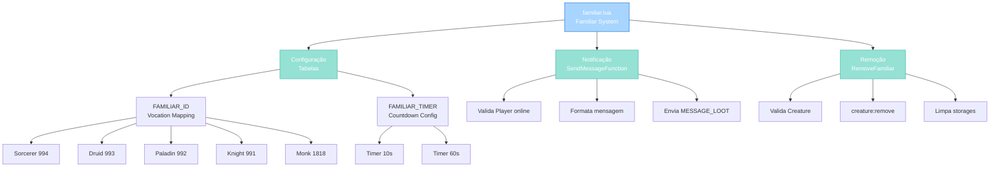

import { Aside, Card } from '@astrojs/starlight/components';

## 🛠️ Informações do Arquivo

Este é o arquivo que implementa o **sistema de familiares** do servidor **OpenTibiaBR/Canary**. Fornece funcionalidades para vinculação de pets a vocações, timers de desaparecimento automático e notificações de countdown.

<Card title="Caminho Original" icon="document">
  `data/libs/systems/familiar.lua`
</Card>

<Aside type="tip">
  O sistema Familiar opera com vocation-based familiar assignment via FAMILIAR_ID mapping. Dois timers (10 segundos e um minuto) enviam warnings pré-desaparecimento, permitindo feedback de UI antes da remoção automática. Timers são persistidos em storage global, sobrevivendo logouts.
</Aside>

## 📄 Visão Geral do Código

### Resumo Executivo

`familiar.lua` é um módulo de **gerenciamento de familiares/pets** que implementa:

1. **Vocation-Based Assignment**: FAMILIAR_ID mapeia cada vocação a um familiar único
2. **Timer Management**: Dois timers (10s e 60s) que disparam warnings de desaparecimento
3. **Persistent Storage**: Timers armazenados em Global.Storage para persistência
4. **Notification Pattern**: SendMessageFunction centraliza notificações ao player
5. **Safe Removal**: RemoveFamiliar valida creatures antes de remover e limpa storages

### Estrutura de Funcionalidades



---

## 1. Variáveis Globais

### 1.1 `FAMILIAR_ID`

```lua
FAMILIAR_ID = {
    [VOCATION.BASE_ID.SORCERER] = { id = 994, name = "Sorcerer familiar" },
    [VOCATION.BASE_ID.DRUID] = { id = 993, name = "Druid familiar" },
    [VOCATION.BASE_ID.PALADIN] = { id = 992, name = "Paladin familiar" },
    [VOCATION.BASE_ID.KNIGHT] = { id = 991, name = "Knight familiar" },
    [VOCATION.BASE_ID.MONK] = { id = 1818, name = "Monk familiar" },
}
```

| Propriedade | Tipo | Descrição |
|---|---|---|
| **Tipo** | table | Mapeamento global |
| **Escopo** | global | Accessible por outros módulos |
| **Chaves** | VOCATION.BASE_ID | Constante de vocação |
| **Valores** | table | `{ id: number, name: string }` |

**Descrição**: Tabela que mapeia cada vocação base para seu familiar exclusivo com Monster prototype ID e nome descritivo.

**Vocações Suportadas**:

| Vocação | Familiar ID | Nome |
|---|---|---|
| **SORCERER** | 994 | Sorcerer familiar |
| **DRUID** | 993 | Druid familiar |
| **PALADIN** | 992 | Paladin familiar |
| **KNIGHT** | 991 | Knight familiar |
| **MONK** | 1818 | Monk familiar |

**Exemplo de Uso**:
```lua
local vocData = FAMILIAR_ID[player:getVocation():getBaseId()]
if vocData then
    local familiarName = vocData.name  -- "Sorcerer familiar"
    local familiarId = vocData.id      -- 994
end
```

---

### 1.2 `FAMILIAR_TIMER`

```lua
FAMILIAR_TIMER = {
    [1] = { storage = Global.Storage.FamiliarSummonEvent10, countdown = 10, message = "10 seconds" },
    [2] = { storage = Global.Storage.FamiliarSummonEvent60, countdown = 60, message = "one minute" },
}
```

| Propriedade | Tipo | Descrição |
|---|---|---|
| **Tipo** | table | Array de configurações de timer |
| **Escopo** | global | Accessible por outros módulos |
| **Chaves** | number | Índice do timer (1, 2) |
| **Valores** | table | `{ storage, countdown, message }` |

**Descrição**: Tabela que define dois timers que disparam warnings antes do familiar desaparecer automaticamente.

**Timers Disponíveis**:

| Índice | Storage | Countdown | Message |
|---|---|---|---|
| **1** | FamiliarSummonEvent10 | 10 segundos | "10 seconds" |
| **2** | FamiliarSummonEvent60 | 60 segundos | "one minute" |

**Uso do Storage**:
- Global.Storage constants para persistência de state
- Se -1: timer inativo
- Se timestamp: tempo quando warning deve disparar

**Exemplo de Configuração**:
```lua
for idx = 1, #FAMILIAR_TIMER do
    local config = FAMILIAR_TIMER[idx]
    print(config.countdown .. " segundos para " .. config.message)
end
```

---

## 2. Funções Globais

### 2.1 `function SendMessageFunction(playerId, message)`

Wrapper de notificação que envia mensagem de countdown para jogador se online.

#### Assinatura
```lua
function SendMessageFunction(playerId, message)
```

#### Parâmetros

| Parâmetro | Tipo | Descrição |
|---|---|---|
| **playerId** | number | Identificador único do jogador |
| **message** | string | Texto do timer (ex: "10 seconds") |

#### Comportamento

| Etapa | Operação |
|---|---|
| 1 | Valida se Player(playerId) existe e está online |
| 2 | Se não existe, retorna silenciosamente (safety) |
| 3 | Se existe, concatena "Your summon will disappear in less than " com message |
| 4 | Envia via sendTextMessage(MESSAGE_LOOT, string concatenada) |

#### Lógica

```lua
if Player(playerId) then
    Player(playerId):sendTextMessage(
        MESSAGE_LOOT,
        "Your summon will disappear in less than " .. message
    )
end
```

**Exemplos de Output**:
- Input: `SendMessageFunction(123, "10 seconds")`  
  Output: "Your summon will disappear in less than 10 seconds"

- Input: `SendMessageFunction(456, "one minute")`  
  Output: "Your summon will disappear in less than one minute"

**Safety**: Ignora silenciosamente se player offline (sem crash)

---

### 2.2 `function RemoveFamiliar(creatureId, playerId)`

Remove familiar do mundo e limpa todos timers de storage associados de forma segura.

#### Assinatura
```lua
function RemoveFamiliar(creatureId, playerId)
```

#### Parâmetros

| Parâmetro | Tipo | Descrição |
|---|---|---|
| **creatureId** | number | ID da criatura familiar a remover |
| **playerId** | number | ID do jogador proprietário |

#### Retorno

| Valor | Significado |
|---|---|
| **true** | Early exit se validação falhou (creature ou player não existem) |
| **nil** | Sucesso (removal e cleanup completados) |

#### Comportamento

| Etapa | Operação |
|---|---|
| 1 | Valida Creature(creatureId) via unwrap |
| 2 | Valida Player(playerId) via unwrap |
| 3 | Se ambos nil, retorna true (early exit seguro) |
| 4 | Chama creature:remove() para destruir no mundo |
| 5 | Loop através FAMILIAR_TIMER (índices 1 ao #) |
| 6 | Para cada timer, seta storage a -1 (inativo) |

#### Lógica de Cleanup

```lua
local creature = Creature(creatureId)
local player = Player(playerId)
if not creature or not player then
    return true  -- Early exit
end

creature:remove()

for sendMessage = 1, #FAMILIAR_TIMER do
    player:setStorageValue(FAMILIAR_TIMER[sendMessage].storage, -1)
end
```

**Exemplos de Uso**:
```lua
-- Remover familiar após desaparecer
RemoveFamiliar(12345, player:getId())

-- Resultado:
-- - Criatura ID 12345 destruída
-- - Storage FamiliarSummonEvent10 setado a -1
-- - Storage FamiliarSummonEvent60 setado a -1
```

**Segurança**:
- Valida creature antes creature:remove()
- Valida player antes setStorageValue
- Batch cleanup de ambos timers (previne residual state)

---

## 3. Fluxos de Operação

### 3.1 Summon Inicial

```
Player requisita summon familiar
    ↓
Lookup FAMILIAR_ID[vocation]
    ↓
Game.createMonster(familiarName, playerPosition)
    ↓
Inicializa FAMILIAR_TIMER storages com os.time() + countdown
    ↓
Familiar está ativo no mundo
```

### 3.2 Timer Countdown Loop (Game Event)

```
Game event loop a cada heartbeat
    ↓
Para cada player registrado:
    ├─ Check FAMILIAR_TIMER[1].storage (10s countdown)
    │   └─ Se os.time() >= storage value:
    │       ├─ SendMessageFunction(playerId, "10 seconds")
    │       └─ Reset storage a -1
    │
    └─ Check FAMILIAR_TIMER[2].storage (60s countdown)
        └─ Se os.time() >= storage value:
            ├─ SendMessageFunction(playerId, "one minute")
            └─ Reset storage a -1
```

### 3.3 Remoção Automática

```
Ambos timers completados (storages -1)
    ↓
RemoveFamiliar(creatureId, playerId) é chamado
    ↓
creature:remove() destrói no mundo
    ↓
Storages já resetados, nada mais para limpar
    ↓
Familiar completamente removido
```

---

## 4. Considerações de Design

### 4.1 Dual Timer Strategy

Dois timers (10s, 60s) fornecem:
- 60s warning: Aviso prévio longo
- 10s warning: Aviso urgente curto
- Player tem múltiplas oportunidades de reação

### 4.2 Storage-Based Persistence

- Armazenamento em Global.Storage: sobrevive logouts
- Magic constant -1: indica inativo
- Permite restore ao login: familiar keeps counting down offline

### 4.3 Vocation-Exclusive Familiares

- FAMILIAR_ID mapeia 5 vocações
- Cada vocação tem Monster ID único
- Permite customização por classe

### 4.4 Safety Patterns

- Player(playerId) silently returns nil se não online
- Creature(creatureId) valida existência
- Early return previne crashes em missing data

---

## 🤖 Informações da Documentação

<Card title="Documentação do Módulo familiar.lua" icon="document">
  **Tipo**: Sistema de Familiares com Timer Persistence  
  **Variáveis Globais**: 2 (FAMILIAR_ID, FAMILIAR_TIMER)  
  **Funções Globais**: 2 (SendMessageFunction, RemoveFamiliar)  
  **Padrões**: Vocation mapping, timer persistence, safe removal, notification pattern  
  **Checkpoint**: 6 conceitos and 4 padrões and 5 responsabilidades
</Card>

<Aside type="note">
  **Última Atualização**: Session 18  
  **Status**: Completo - Padrão Custom Modules  
  **Linhas de Código**: ~32 (2 tabelas) plus 2 funções globais  
</Aside>
