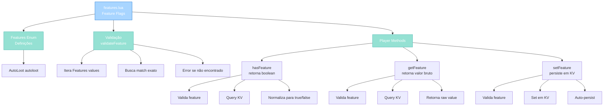

import { Aside, Card } from '@astrojs/starlight/components';

## 🛠️ Informações do Arquivo

Este é o arquivo que implementa o **sistema de feature flags** do servidor **OpenTibiaBR/Canary**. Fornece framework de toggles de funcionalidades com validação obrigatória e armazenamento persistente em KV.

<Card title="Caminho Original" icon="document">
  `data/libs/systems/features.lua`
</Card>

<Aside type="tip">
  O sistema Features é baseado em enum centralizado (Features table) que define todas feature flags. A validação obrigatória via validateFeature previne typos silenciosos. Cada feature é armazenada em KV scoped por jogador, permitindo toggles rápidos e persistência automática sem save explícito.
</Aside>

## 📄 Visão Geral do Código

### Resumo Executivo

`features.lua` é um módulo de **feature flag management** que implementa:

1. **Enum-Driven Design**: Features table centraliza definições de todas features
2. **Validation Layer**: validateFeature checa contra enum antes KV access
3. **KV Backend**: Armazenamento scoped a jogador via self:kv():scoped("features")
4. **Type Flexibility**: getFeature retorna valores brutos, hasFeature normaliza para boolean
5. **Player Methods**: Três métodos Player (hasFeature, getFeature, setFeature) para interface completa

### Estrutura de Funcionalidades



---

## 1. Variáveis Globais

### 1.1 `Features`

```lua
Features = {
    AutoLoot = "autoloot",
}
```

| Propriedade | Tipo | Descrição |
|---|---|---|
| **Tipo** | table | Enum global de features |
| **Escopo** | global | Accessible por outros módulos |
| **Chaves** | string | PascalCase enum names |
| **Valores** | string | lowercase feature identifiers |

**Descrição**: Enum centralizado que define todas feature flags disponíveis do servidor. Previne typos via validação obrigatória.

**Features Disponíveis**:

| Chave | Valor | Propósito |
|---|---|---|
| **AutoLoot** | "autoloot" | Toggle de pickup automático de itens |

**Padrão de Adição de Nova Feature**:
```lua
Features = {
    AutoLoot = "autoloot",
    -- NewFeature = "newfeature",  -- Adicionar aqui
}
```

**Exemplo de Query**:
```lua
local featureId = Features.AutoLoot  -- Retorna "autoloot"
```

---

## 2. Funções Locais

### 2.1 `local function validateFeature(feature)`

Valida que feature string existe no Features enum, prevenindo typos e invalid feature access com error obrigatório.

#### Assinatura
```lua
local function validateFeature(feature)
```

#### Parâmetros

| Parâmetro | Tipo | Descrição |
|---|---|---|
| **feature** | string | Feature identifier a validar (ex: "autoloot") |

#### Comportamento

| Etapa | Operação |
|---|---|
| 1 | Inicializa found = false |
| 2 | Itera pairs(Features) obtendo cada value |
| 3 | Compare value == feature exactamente |
| 4 | Se encontrado, seta found = true e break |
| 5 | Se não encontrado, lança error("Invalid feature: " .. feature) |

#### Lógica

```lua
local found = false
for _, v in pairs(Features) do
    if v == feature then
        found = true
        break
    end
end
if not found then
    error("Invalid feature: " .. feature)
end
```

**Exemplos**:
```lua
validateFeature("autoloot")    -- OK (encontrado em Features.AutoLoot)
validateFeature("autoloot2")   -- Error: Invalid feature: autoloot2
validateFeature("invalid")     -- Error: Invalid feature: invalid
```

---

## 3. Funções Player (Métodos)

### 3.1 `function Player:hasFeature(feature)`

Verifica se jogador tem feature habilitado, retornando sempre boolean normalizado (true ou false).

#### Assinatura
```lua
function Player:hasFeature(feature)
```

#### Parâmetros

| Parâmetro | Tipo | Descrição |
|---|---|---|
| **feature** | string | Feature identifier (ex: "autoloot") |

#### Retorno

| Valor | Significado |
|---|---|
| **true** | Feature está habilitado |
| **false** | Feature desabilitado ou não setado |

#### Comportamento

| Etapa | Operação |
|---|---|
| 1 | Chama validateFeature(feature) (error se inválido) |
| 2 | Obtém KV scoped via self:kv():scoped("features") |
| 3 | Queries kv:get(feature) |
| 4 | Se truthy, retorna true |
| 5 | Se falsy/nil, retorna false |

#### Lógica

```lua
validateFeature(feature)
local kv = self:kv():scoped("features")
if kv:get(feature) then
    return true
end
return false
```

**Exemplos de Uso**:
```lua
if player:hasFeature("autoloot") then
    -- Auto-loot está habilitado
end

-- Sempre retorna boolean, safe para if checks
-- nunca retorna nil
```

---

### 3.2 `function Player:getFeature(feature)`

Retorna valor bruto de feature sem normalização, permitindo valores não-booleanos.

#### Assinatura
```lua
function Player:getFeature(feature)
```

#### Parâmetros

| Parâmetro | Tipo | Descrição |
|---|---|---|
| **feature** | string | Feature identifier (ex: "autoloot") |

#### Retorno

| Valor | Significado |
|---|---|
| **true/false/nil** | Valor exato armazenado em KV |
| **number/string** | Se feature contém valor customizado |

#### Comportamento

| Etapa | Operação |
|---|---|
| 1 | Chama validateFeature(feature) (error se inválido) |
| 2 | Obtém KV scoped via self:kv():scoped("features") |
| 3 | Retorna kv:get(feature) direto (sem normalização) |

#### Diferença de hasFeature

| Método | Retorno | Uso |
|---|---|---|
| **hasFeature** | sempre boolean | Feature simples on/off |
| **getFeature** | valor bruto | Features com valores customizados |

**Exemplos de Uso**:
```lua
-- Feature booleano
local setting = player:getFeature("autoloot")
if setting == true then
    -- Explicitamente habilitado
elseif setting == false then
    -- Explicitamente desabilitado
elseif setting == nil then
    -- Não setado (usar default)
end
```

---

### 3.3 `function Player:setFeature(feature, value)`

Define valor de feature para jogador, persistindo automaticamente em KV storage.

#### Assinatura
```lua
function Player:setFeature(feature, value)
```

#### Parâmetros

| Parâmetro | Tipo | Descrição |
|---|---|---|
| **feature** | string | Feature identifier (ex: "autoloot") |
| **value** | any | Valor a armazenar (boolean, number, string, table) |

#### Retorno

| Valor | Significado |
|---|---|
| **nil** | Sucesso (operação concluída) |

#### Comportamento

| Etapa | Operação |
|---|---|
| 1 | Chama validateFeature(feature) (error se inválido) |
| 2 | Obtém KV scoped via self:kv():scoped("features") |
| 3 | Chama kv:set(feature, value) |
| 4 | Persistência automática (sem save explícito) |

#### Lógica

```lua
validateFeature(feature)
local kv = self:kv():scoped("features")
kv:set(feature, value)
```

**Exemplos de Uso**:
```lua
player:setFeature("autoloot", true)    -- Habilitar
player:setFeature("autoloot", false)   -- Desabilitar
player:setFeature("autoloot", 100)     -- Custom value (number)
```

---

## 4. Padrões de Uso

### 4.1 Toggle Feature

```lua
local function toggleAutoLoot(player)
    local currentState = player:hasFeature("autoloot")
    
    if currentState then
        player:setFeature("autoloot", false)
        player:sendTextMessage(MESSAGE_STATUS, "Auto-loot disabled")
    else
        player:setFeature("autoloot", true)
        player:sendTextMessage(MESSAGE_STATUS, "Auto-loot enabled")
    end
end
```

### 4.2 Batch Reset Features

```lua
local function resetAllPlayerFeatures(player)
    for featureName, featureId in pairs(Features) do
        player:setFeature(featureId, false)
    end
    
    player:sendTextMessage(MESSAGE_STATUS, "All features reset to default")
end
```

### 4.3 Feature Status Report

```lua
local function getPlayerFeatureStatus(player)
    local status = {}
    
    for featureName, featureId in pairs(Features) do
        status[featureName] = player:hasFeature(featureId)
    end
    
    return status
end

-- Uso:
local features = getPlayerFeatureStatus(player)
for name, enabled in pairs(features) do
    print(name .. ": " .. (enabled and "ENABLED" or "DISABLED"))
end
```

---

## 🤖 Informações da Documentação

<Card title="Documentação do Módulo features.lua" icon="document">
  **Tipo**: Sistema de Feature Flags com KV Backend  
  **Variáveis Globais**: 1 (Features enum)  
  **Funções Locais**: 1 (validateFeature)  
  **Funções Player**: 3 (hasFeature, getFeature, setFeature)  
  **Padrões**: Enum-driven validation, KV scope isolation, boolean normalization, batch operations  
  **Checkpoint**: 6 conceitos and 5 padrões and 5 responsabilidades
</Card>

<Aside type="note">
  **Última Atualização**: Session 18  
  **Status**: Completo - Padrão Custom Modules  
  **Linhas de Código**: ~35 (Features enum plus validador plus 3 métodos)  
</Aside>
