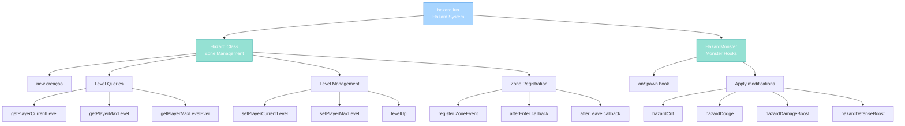

import { Aside, Card } from '@astrojs/starlight/components';

## 🛠️ Informações do Arquivo

Este é o arquivo que implementa o **sistema de Hazard Zones** do servidor **OpenTibiaBR/Canary**. Fornece funcionalidades para criação de zonas de perigo com difficulty escalável, sistema de níveis e aplicação automática de modifiers em monstros.

<Card title="Caminho Original" icon="document">
  `data/libs/systems/hazard.lua`
</Card>

<Aside type="tip">
  O sistema Hazard permite criar zonas de dificuldade progressiva onde monstros recebem modificadores baseados no nível de perigo da zona. Cada jogador tem seu próprio nível de progresso rastreado via KV storage, permitindo difficulty escalável por player.
</Aside>

## 📄 Visão Geral do Código

### Resumo Executivo

`hazard.lua` é um módulo de **sistema de zonas de perigo** que implementa:

1. **Hazard Zones**: Áreas geograficamente definidas com modificadores de difficulty
2. **Player Progression**: Rastreamento de nível atual and máximo por player via KV
3. **Automatic Modifiers**: Aplicação automática de crit and dodge and damageBoost and defenseBoost em monstros
4. **ZoneEvent Integration**: Hook-based detection de entrada and saída de zonas
5. **Level Management**: Sistema de levelUp com caps and fallbacks para storage legacy
6. **Monster Spawning**: onSpawn hook que aplica modifiers hazard ao monstro

### Estrutura de Funcionalidades



---

## 1. Variáveis Globais

### 1.1 `Hazard`

```lua
Hazard = {
    areas = {},
}
```

| Propriedade | Tipo | Descrição |
|---|---|---|
| **areas** | table | Registry de hazard zones por nome |
| **Escopo** | global | Accessible por outros módulos |

**Descrição**: Tabela global que funciona como class para Hazard zones and também como registry de todas hazard zones registradas.

**Sub-tabelas na Instance**:

| Propriedade | Tipo | Descrição |
|---|---|---|
| **name** | string | Identificador único da zona hazard |
| **from** | table | Posição inicial do retângulo da zona |
| **to** | table | Posição final do retângulo da zona |
| **minLevel** | number | Nível mínimo de difficulty padrão 1 |
| **maxLevel** | number | Nível máximo de difficulty permitido |
| **crit** | number | Modificador de chance de crítico dos monstros |
| **dodge** | number | Modificador de dodge dos monstros |
| **damageBoost** | number | Multiplicador de dano dos monstros |
| **defenseBoost** | number | Multiplicador de defesa dos monstros |
| **zone** | Zone | Objeto Zone do engine game |
| **storageCurrent** | number | Deprecated: Storage ID para current level |
| **storageMax** | number | Deprecated: Storage ID para max level |

**Exemplo de Criação**:
```lua
local myHazard = Hazard.new {
    name = "dragon_lair",
    from = { x = 100, y = 100, z = 7 },
    to = { x = 200, y = 200, z = 7 },
    minLevel = 1,
    maxLevel = 10,
    crit = 25,
    dodge = 15,
    damageBoost = 1.5,
    defenseBoost = 0.8,
}

myHazard:register()
```

---

### 1.2 `HazardMonster`

```lua
if not HazardMonster then
    HazardMonster = { eventName = "HazardMonster" }
end
```

| Propriedade | Tipo | Descrição |
|---|---|---|
| **eventName** | string | Identificador do evento |
| **Escopo** | global | Accessible por outros módulos |

**Descrição**: Namespace global para handlers de eventos de monstros em zonas hazard.

---

## 2. Métodos Hazard Class

### 2.1 `function Hazard.new(prototype)`

Construtor factory que cria nova instância de Hazard zone a partir de prototype table.

#### Assinatura
```lua
function Hazard.new(prototype)
```

#### Parâmetros

| Parâmetro | Tipo | Descrição |
|---|---|---|
| **prototype** | table | Tabela com configuração da zona |

#### Retorno

| Tipo | Valor |
|---|---|
| **table** | Instância de Hazard com métodos via metatable |

#### Comportamento

| Etapa | Operação |
|---|---|
| 1 | Cria table instance vazia |
| 2 | Copia nome, from, to, levels, storage keys |
| 3 | Copia modifiers crit and dodge and damageBoost and defenseBoost |
| 4 | Cria Zone object via Zone instance.name |
| 5 | Adiciona area ao zone se from and to definidos |
| 6 | Seta metatable para permitir herança de método Hazard |
| 7 | Retorna instance |

#### Lógica

```lua
local instance = {}
instance.name = prototype.name
instance.from = prototype.from
instance.to = prototype.to
instance.minLevel = prototype.minLevel or 1
instance.maxLevel = prototype.maxLevel
instance.zone = Zone(instance.name)
if instance.from and instance.to then
    instance.zone:addArea(instance.from, instance.to)
end
setmetatable(instance, { __index = Hazard })
return instance
```

**Exemplo de Uso**:
```lua
local hazard = Hazard.new {
    name = "forbidden_temple",
    from = { x = 50, y = 50, z = 5 },
    to = { x = 100, y = 100, z = 5 },
    maxLevel = 20,
    crit = 30,
    dodge = 20,
    damageBoost = 2.0,
    defenseBoost = 0.7,
}
```

---

### 2.2 `function Hazard:getHazardPlayerAndPoints(damageMap)`

Encontra player com menor nível hazard de um damage map and retorna player and points.

#### Assinatura
```lua
function Hazard:getHazardPlayerAndPoints(damageMap)
```

#### Parâmetros

| Parâmetro | Tipo | Descrição |
|---|---|---|
| **damageMap** | table | Mapa com player IDs como chaves |

#### Retorno

| Tipo | Valor |
|---|---|
| **Player, number** | Player com menor level and respectivo points |

#### Comportamento

| Etapa | Operação |
|---|---|
| 1 | Inicializa hazardPlayer equals nil and hazardPoints equals -1 |
| 2 | Itera pairs damageMap |
| 3 | Para cada key: unwrap Player key |
| 4 | Query getPlayerCurrentLevel |
| 5 | Se menor que hazardPoints ou -1: atualiza reference |
| 6 | Se nenhum player encontrado: hazardPoints equals minLevel |
| 7 | Retorna hazardPlayer and hazardPoints |

---

### 2.3 `function Hazard:getCurrentLevel(players)`

Obtém nível hazard mínimo de array de players.

#### Assinatura
```lua
function Hazard:getCurrentLevel(players)
```

#### Parâmetros

| Parâmetro | Tipo | Descrição |
|---|---|---|
| **players** | table | Array de Player objects |

#### Retorno

| Tipo | Valor |
|---|---|
| **number** | Nível hazard mínimo do grupo |

#### Comportamento
- Itera players array
- Encontra o com menor getPlayerCurrentLevel
- Retorna minLevel se nenhum jogador válido

---

### 2.4 `function Hazard:getPlayerCurrentLevel(player)`

Queries nível de difficulty atual do player na zona hazard.

#### Assinatura
```lua
function Hazard:getPlayerCurrentLevel(player)
```

#### Parâmetros

| Parâmetro | Tipo | Descrição |
|---|---|---|
| **player** | Player | Jogador consultado |

#### Retorno

| Tipo | Valor |
|---|---|
| **number** | Nível de difficulty atual ou minLevel |

#### Comportamento

| Etapa | Operação |
|---|---|
| 1 | Se storageCurrent definido: query storage value |
| 2 | Caso contrário: query KV scoped self.name com key current-level |
| 3 | Se valor menor ou igual 0: fallback para minLevel |
| 4 | Retorna o valor válido |

#### Lógica

```lua
if self.storageCurrent then
    local fromStorage = player:getStorageValue(self.storageCurrent)
    return fromStorage <= 0 and self.minLevel or fromStorage
end
local fromKV = player:kv():scoped(self.name):get("current-level") or self.minLevel
return fromKV <= 0 and self.minLevel or fromKV
```

---

### 2.5 `function Hazard:getPlayerMaxLevelEver(player)`

Retorna o máximo nível que o player já alcançou nesta zona.

#### Assinatura
```lua
function Hazard:getPlayerMaxLevelEver(player)
```

#### Retorno

| Tipo | Valor |
|---|---|
| **number** | Máximo nível alcançado ou minLevel |

#### Comportamento
- Query KV scoped com key max-level-set
- Fallback para minLevel se não existe ou menor que 0

---

### 2.6 `function Hazard:setPlayerCurrentLevel(player, level)`

Define nível de difficulty atual do player com validação against max level.

#### Assinatura
```lua
function Hazard:setPlayerCurrentLevel(player, level)
```

#### Parâmetros

| Parâmetro | Tipo | Descrição |
|---|---|---|
| **player** | Player | Jogador alvo |
| **level** | number | Novo nível de difficulty |

#### Retorno

| Tipo | Valor |
|---|---|
| **boolean** | false se level greater than max allowed |
| **boolean** | true se sucesso |

#### Comportamento

| Etapa | Operação |
|---|---|
| 1 | Query max level via getPlayerMaxLevel |
| 2 | Se level maior: retorna false |
| 3 | Se storageCurrent definido: seta storage value |
| 4 | Caso contrário: seta KV current-level |
| 5 | Se KV: atualiza max-level-set se level maior |
| 6 | Chama player:updateHazard para refresh status |
| 7 | Retorna true |

---

### 2.7 `function Hazard:getPlayerMaxLevel(player)`

Queries máximo nível permitido que o player pode alcançar.

#### Assinatura
```lua
function Hazard:getPlayerMaxLevel(player)
```

#### Retorno

| Tipo | Valor |
|---|---|
| **number** | Máximo nível permitido ou minLevel |

#### Comportamento
- Se storageMax: query storage value
- Caso contrário: query KV max-level
- Fallback minLevel se menor ou igual 0

---

### 2.8 `function Hazard:levelUp(player)`

Promove player para próximo nível se current equals max.

#### Assinatura
```lua
function Hazard:levelUp(player)
```

#### Comportamento

| Etapa | Operação |
|---|---|
| 1 | Query current level |
| 2 | Query max level |
| 3 | Se current equals max: incrementa max level |

#### Lógica

```lua
local current = self:getPlayerCurrentLevel(player)
local max = self:getPlayerMaxLevel(player)
if current == max then
    self:setPlayerMaxLevel(player, max + 1)
end
```

---

### 2.9 `function Hazard:setPlayerMaxLevel(player, level)`

Define máximo nível permitido com cap against zone maxLevel.

#### Assinatura
```lua
function Hazard:setPlayerMaxLevel(player, level)
```

#### Parâmetros

| Parâmetro | Tipo | Descrição |
|---|---|---|
| **player** | Player | Jogador alvo |
| **level** | number | Novo máximo nível |

#### Comportamento

| Etapa | Operação |
|---|---|
| 1 | Se level maior que self.maxLevel: limita |
| 2 | Se storageMax: seta storage value |
| 3 | Caso contrário: seta KV max-level |

---

### 2.10 `function Hazard:isInZone(position)`

Verifica se posição está dentro da zona hazard.

#### Assinatura
```lua
function Hazard:isInZone(position)
```

#### Parâmetros

| Parâmetro | Tipo | Descrição |
|---|---|---|
| **position** | table | Posição x and y and z |

#### Retorno

| Tipo | Valor |
|---|---|
| **boolean** | true se position intersecta zona |

#### Comportamento

| Etapa | Operação |
|---|---|
| 1 | Obtém zones na position via getZones |
| 2 | Se nenhuma zone: retorna false |
| 3 | Para cada zone: busca hazard by name |
| 4 | Se hazard encontrado equals self: retorna true |
| 5 | Retorna false se nenhuma match |

---

### 2.11 `function Hazard:register()`

Registra zona hazard no game engine with ZoneEvent callbacks.

#### Assinatura
```lua
function Hazard:register()
```

#### Comportamento

| Etapa | Operação |
|---|---|
| 1 | Verifica configManager.getBoolean TOGGLE_HAZARDSYSTEM |
| 2 | Se disabled: retorna early |
| 3 | Cria ZoneEvent instance com self.zone |
| 4 | Define event.afterEnter callback |
| 5 | Define event.afterLeave callback |
| 6 | Adiciona self ao Hazard.areas registry |
| 7 | Chama event:register para ativar |

#### afterEnter Callback

```lua
function event.afterEnter(zone, creature)
    local player = creature:getPlayer()
    if not player then
        return
    end
    player:setHazardSystemPoints(self:getPlayerCurrentLevel(player))
end
```

Quando player entra: aplica nível hazard ao status do player.

#### afterLeave Callback

```lua
function event.afterLeave(zone, creature)
    local player = creature:getPlayer()
    if not player then
        return
    end
    player:setHazardSystemPoints(0)
end
```

Quando player sai: remove efeitos hazard reseta para 0.

---

### 2.12 `function Hazard.getByName(name)`

Static method para consultar hazard por nome do registry.

#### Assinatura
```lua
function Hazard.getByName(name)
```

#### Parâmetros

| Parâmetro | Tipo | Descrição |
|---|---|---|
| **name** | string | Nome da zona hazard |

#### Retorno

| Tipo | Valor |
|---|---|
| **table** | Instância Hazard se encontrado |
| **nil** | Se nome não existe no registry |

---

## 3. HazardMonster Hook

### 3.1 `function HazardMonster.onSpawn(monster, position)`

Hook de spawn que aplica modificadores hazard a monstros em zonas de perigo.

#### Assinatura
```lua
function HazardMonster.onSpawn(monster, position)
```

#### Parâmetros

| Parâmetro | Tipo | Descrição |
|---|---|---|
| **monster** | Monster | Monstro recém-criado |
| **position** | table | Posição do spawn |

#### Retorno

| Tipo | Valor |
|---|---|
| **boolean** | true continuar processamento |
| **boolean** | false se monsterType inválido |

#### Comportamento

| Etapa | Operação |
|---|---|
| 1 | Valida monsterType via monster:getType |
| 2 | Retorna false se inválido |
| 3 | Obtém zones na position |
| 4 | Se nenhuma zone: retorna true early |
| 5 | Para cada zone: busca hazard by name |
| 6 | Se hazard encontrado: aplica modificadores |
| 7 | Retorna true sucesso |

#### Aplicação de Modificadores

```lua
if hazard then
    monster:hazard(true)
    monster:hazardCrit(hazard.crit)
    monster:hazardDodge(hazard.dodge)
    monster:hazardDamageBoost(hazard.damageBoost)
    monster:hazardDefenseBoost(hazard.defenseBoost)
end
```

**Modificadores Aplicados**:
- hazard(true): Ativa status hazard
- hazardCrit: Crítico chance
- hazardDodge: Chance de dodge
- hazardDamageBoost: Multiplicador de damage
- hazardDefenseBoost: Multiplicador de defesa

---

## 4. Fluxos de Operação

### 4.1 Criação and Registro de Zona

```
Hazard.new(prototype) chamado
    ↓
Cria instance com propriedades
    ↓
Cria Zone object and adiciona área
    ↓
Define metatable para herança
    ↓
myHazard:register chamado
    ↓
Verifica TOGGLE_HAZARDSYSTEM
    ├─ Disabled: retorna early
    └─ Enabled: continua
    ↓
Cria ZoneEvent com zone
    ↓
Define afterEnter e afterLeave callbacks
    ↓
Registra no Hazard.areas
    ↓
event:register ativa no game
    ↓
Zona hazard está ativa
```

### 4.2 Player Entra Zona

```
Player move para zona hazard
    ↓
afterEnter callback triggered
    ↓
Unwrap player from creature
    ↓
Query getPlayerCurrentLevel
    ↓
setHazardSystemPoints aplica level
    ↓
Monstros agora têm modificadores hazard
```

### 4.3 Player Sai Zona

```
Player sai from zona hazard
    ↓
afterLeave callback triggered
    ↓
setHazardSystemPoints equals 0
    ↓
Removes hazard modificadores
    ↓
Monstros voltam ao padrão
```

### 4.4 Monstro Spawn em Hazard

```
Game cria monstro in hazard zone
    ↓
HazardMonster.onSpawn chamado
    ↓
Valida monsterType
    ↓
Obtém zones na position
    ↓
Para cada zone:
    ├─ Busca hazard by name
    └─ Se encontrado: aplica modifiers
    ↓
monster:hazard true
    ↓
Aplica crit and dodge and damageBoost and defenseBoost
    ↓
Monstro tem stats modificados
```

---

## 📋 Configurações Externas

Os seguintes configManager keys são consultados:

| Chave | Tipo | Uso |
|---|---|---|
| **TOGGLE_HAZARDSYSTEM** | boolean | Enable and disable entire hazard system |

---

## 🤖 Informações da Documentação

<Card title="Documentação do Módulo hazard.lua" icon="document">
  **Tipo**: Sistema de Zonas de Perigo com Progression  
  **Variáveis Globais**: 2 Hazard and HazardMonster  
  **Métodos Hazard**: 12 total  
  **Hook HazardMonster**: 1 onSpawn  
  **Padrões**: Factory constructor and KV persistence and ZoneEvent integration and modifier application and level progression  
  **Checkpoint**: 8 conceitos and 6 padrões and 5 responsabilidades
</Card>

<Aside type="note">
  **Última Atualização**: Session 18  
  **Status**: Completo - Padrão Custom Modules  
  **Linhas de Código**: aproximadamente 180 total  
</Aside>
