import { Aside, Card } from '@astrojs/starlight/components';

## 🛠️ Informações do Arquivo

Este é o arquivo que implementa o **sistema de Hireling** do servidor **OpenTibiaBR/Canary**. Fornece funcionalidades para contratação de criados pessoais, gerenciamento de outfit and skills, persistência em banco de dados and integração com house system.

<Card title="Caminho Original" icon="document">
  data/libs/systems/hireling.lua
</Card>

<Aside type="tip">
  O sistema Hireling permite jogadores contratar criados NPC personalizados que vivem em suas houses. Cada hireling tem persistência via database, suporte para múltiplos outfits and skills, and comportamento automático de devolução ao lamp quando jogador perde acesso à casa.
</Aside>

## 📄 Visão Geral do Código

### Resumo Executivo

hireling.lua é um módulo de **gerenciamento de hirelings pessoais** que implementa:

1. **Hireling NPCs**: Criados personalizáveis que vivem na house do jogador
2. **Persistent Storage**: Database storage with outfit and skills per hireling
3. **House Integration**: Verificação automática de acesso and retorno ao lamp se kicked
4. **Outfit Management**: Suporte para múltiplos outfits with gender-specific looks
5. **Skill System**: Skills como banker and cooker and steward and trader via KV
6. **Player Extensions**: Métodos Player para criar and gerenciar hirelings

### Estrutura de Funcionalidades

```mermaid
graph TD
    A["hireling.lua<br/>Hireling System"] --> B["Global Registry<br/>Storage"]
    A --> C["Hireling Class<br/>Object Model"]
    A --> D["House Integration<br/>Access Control"]
    A --> E["Player Extensions<br/>Methods"]
    
    B --> B1["HIRELINGS array"]
    B --> B2["PLAYER_HIRELINGS map"]
    B --> B3["HIRELING_OUTFIT_CHANGING"]
    B --> B4["HIRELING_SKILLS enum"]
    B --> B5["HIRELING_OUTFITS enum"]
    
    C --> C1["new constructor"]
    C --> C2["Outfit methods"]
    C --> C3["Skill methods"]
    C --> C4["Persistence"]
    C --> C5["House access"]
    
    D --> D1["checkHouseAccess"]
    D --> D2["spawnNPCs"]
    D --> D3["returnToLamp"]
    
    E --> E1["addNewHireling"]
    E --> E2["getHirelings"]
    E --> E3["enableHirelingSkill"]
    E --> E4["enableHirelingOutfit"]
    
    style A fill:#a8d5ff,stroke:#0066cc,color:#fff
    style B fill:#95e1d3,stroke:#38ada9,color:#fff
    style C fill:#95e1d3,stroke:#38ada9,color:#fff
    style D fill:#95e1d3,stroke:#38ada9,color:#fff
    style E fill:#95e1d3,stroke:#38ada9,color:#fff
```



---

## 1. Variáveis Globais

### 1.1 HIRELINGS

```lua
HIRELINGS = {}
```

| Propriedade | Tipo | Descrição |
|---|---|---|
| **Tipo** | table | Array de todas instâncias Hireling |
| **Escopo** | global | Master registry |
| **Preenchimento** | HirelingsInit | Carregado do database on startup |

**Descrição**: Array global que armazena todas instâncias de Hireling ativas, usado para iteração and lookup.

---

### 1.2 PLAYER_HIRELINGS

```lua
PLAYER_HIRELINGS = {}
```

| Propriedade | Tipo | Descrição |
|---|---|---|
| **Tipo** | table | Map de player_id to array de hirelings |
| **Escopo** | global | Indexed access por player guid |
| **Estrutura** | `{player_id: {hireling1, hireling2, ...}}` | Organizado por player |

**Descrição**: Mapa que organiza hirelings por player owner para acesso rápido.

---

### 1.3 HIRELING_OUTFIT_CHANGING

```lua
HIRELING_OUTFIT_CHANGING = {}
```

| Propriedade | Tipo | Descrição |
|---|---|---|
| **Tipo** | table | Map de player_id to hireling_id |
| **Escopo** | global | Temporary state storage |
| **Uso** | Outfit change request tracking | Flag durante diálogo de outfit |

**Descrição**: Tabela temporária que rastreia qual hireling um player está mudando outfit.

---

### 1.4 HIRELING_SKILLS

```lua
HIRELING_SKILLS = {
    BANKER = { 1001, "banker" },
    COOKING = { 1002, "cooker" },
    STEWARD = { 1003, "steward" },
    TRADER = { 1004, "trader" },
}
```

| Chave | Primeira | Segunda | Propósito |
|---|---|---|---|
| **BANKER** | 1001 | "banker" | Skill de banco |
| **COOKING** | 1002 | "cooker" | Skill de culinária |
| **STEWARD** | 1003 | "steward" | Skill de mordomia |
| **TRADER** | 1004 | "trader" | Skill de comércio |

**Descrição**: Enum de skills disponíveis com IDs altos para evitar conflito com gamestore.

---

### 1.5 HIRELING_OUTFITS

```lua
HIRELING_OUTFITS = {
    BANKER = { 2001, "banker" },
    COOKING = { 2002, "cooker" },
    STEWARD = { 2003, "steward" },
    TRADER = { 2004, "trader" },
    SERVANT = { 2005, "servant" },
    HYDRA = { 2006, "hydra" },
    FERUMBRAS = { 2007, "ferumbras" },
    BONELORD = { 2008, "bonelord" },
    DRAGON = { 2009, "dragon" },
}
```

**Descrição**: Enum de outfits exclusively with IDs para identificação de outfit no sistema.

---

### 1.6 HIRELING_SEX

```lua
HIRELING_SEX = {
    FEMALE = 2,
    MALE = 1,
}
```

| Chave | Valor | Significado |
|---|---|---|
| **FEMALE** | 2 | Gênero feminino |
| **MALE** | 1 | Gênero masculino |

**Descrição**: Constantes de gênero para diferenciar outfits por sexo.

---

### 1.7 HIRELING_OUTFIT_DEFAULT

```lua
HIRELING_OUTFIT_DEFAULT = { name = "Citizen", female = 1107, male = 1108 }
```

| Campo | Tipo | Valor |
|---|---|---|
| **name** | string | "Citizen" |
| **female** | number | 1107 look type |
| **male** | number | 1108 look type |

**Descrição**: Outfit padrão aplicado a novos hirelings antes de skills and outfits desbloqueados.

---

### 1.8 HIRELING_OUTFITS_TABLE

Tabela com detalhes de cada outfit including name and gender-specific look types.

```lua
HIRELING_OUTFITS_TABLE = {
    BANKER = { name = "Banker Dress", female = 1109, male = 1110 },
    BONELORD = { name = "Bonelord Dress", female = 1123, male = 1124 },
    -- ... etc
}
```

**Estrutura**: `{name: string, female: number, male: number}`

---

### 1.9 HIRELING_FOODS_BOOST

```lua
HIRELING_FOODS_BOOST = {
    MAGIC = 29410,
    MELEE = 29411,
    SHIELDING = 29408,
    DISTANCE = 35173,
}
```

| Chave | Item ID | Tipo |
|---|---|---|
| **MAGIC** | 29410 | Magic boost |
| **MELEE** | 29411 | Melee boost |
| **SHIELDING** | 29408 | Shielding boost |
| **DISTANCE** | 35173 | Distance boost |

**Descrição**: Items especiais que boostart hirelings.

---

### 1.10 HIRELING_FOODS_IDS

```lua
HIRELING_FOODS_IDS = {
    29412, 29413, 29414, 29415, 29416,
}
```

**Descrição**: Array de IDs de foods genéricos para hirelings.

---

## 2. Funções Locais

### 2.1 local function printTable(t)

Debug helper que imprime table no formato legível.

#### Assinatura
```lua
local function printTable(t)
```

#### Comportamento
- Itera pairs da table
- Concatena each key and value
- Logs resultado via logger.debug

---

### 2.2 local function checkHouseAccess(hireling)

Valida se owner ainda tem acesso to house e retorna hireling to lamp se não.

#### Assinatura
```lua
local function checkHouseAccess(hireling)
```

#### Retorno

| Tipo | Valor |
|---|---|
| **boolean** | true se acesso válido |
| **boolean** | false caso contrário |

#### Comportamento

| Etapa | Operação |
|---|---|
| 1 | Se hireling inactive: retorna false |
| 2 | Obtém tile and house na posição |
| 3 | Se não tem house: retorna false |
| 4 | Obtém player owner online ou offline |
| 5 | Compara house:getOwnerGuid with hireling owner |
| 6 | Se match: retorna true |
| 7 | Se não match: retorna to lamp and despawns |

---

### 2.3 local function spawnNPCs()

Iterates all HIRELINGS and spawns those com acesso válido à house.

#### Assinatura
```lua
local function spawnNPCs()
```

#### Comportamento

| Etapa | Operação |
|---|---|
| 1 | Log "Spawning Hirelings" |
| 2 | Itera HIRELINGS array |
| 3 | Para cada: chama checkHouseAccess |
| 4 | Se true: chama hireling:spawn |

---

## 3. Hireling Class

### 3.1 function Hireling:new(o)

Construtor factory que cria nova instância Hireling com default values.

#### Assinatura
```lua
function Hireling:new(o)
```

#### Parâmetros

| Parâmetro | Tipo | Descrição |
|---|---|---|
| **o** | table | Table initial values ou nil |

#### Retorno

| Tipo | Valor |
|---|---|
| **table** | Instância Hireling com metatable |

#### Default Values

| Campo | Valor |
|---|---|
| **id** | -1 |
| **player_id** | -1 |
| **name** | "hireling" |
| **active** | 0 |
| **sex** | 0 |
| **posx, posy, posz** | 0 and 0 and 0 |
| **looktype** | 0 |
| **lookhead** | 97 |
| **lookbody** | 34 |
| **looklegs** | 3 |
| **lookfeet** | 116 |
| **cid** | -1 |

---

### 3.2 function Hireling:getOwnerId()

Retorna player_id do owner.

#### Assinatura
```lua
function Hireling:getOwnerId()
```

#### Retorno: **number** player_id

---

### 3.3 function Hireling:getId()

Retorna ID único do hireling.

#### Assinatura
```lua
function Hireling:getId()
```

#### Retorno: **number** hireling id

---

### 3.4 function Hireling:getName()

Retorna nome customizado do hireling.

#### Assinatura
```lua
function Hireling:getName()
```

#### Retorno: **string** hireling name

---

### 3.5 function Hireling:canTalkTo(player)

Valida se player está em mesma house que hireling.

#### Assinatura
```lua
function Hireling:canTalkTo(player)
```

#### Retorno: **boolean** true se casa match

#### Comportamento
- Obtém tile na posição do player
- Obtém tile na posição do hireling
- Compara house IDs

---

### 3.6 function Hireling:getPosition()

Retorna Position table do hireling.

#### Assinatura
```lua
function Hireling:getPosition()
```

#### Retorno: **table** `{x, y, z}` Position

---

### 3.7 function Hireling:setPosition(pos)

Define nova posição do hireling.

#### Assinatura
```lua
function Hireling:setPosition(pos)
```

#### Comportamento
- Extrai pos.x and pos.y and pos.z
- Armazena em self.posx and self.posy and self.posz

---

### 3.8 function Hireling:getOutfit()

Retorna outfit table com look type and addons.

#### Retorno

| Campo | Tipo |
|---|---|
| **lookType** | number |
| **lookHead** | number |
| **lookAddons** | number |
| **lookMount** | number |
| **lookLegs** | number |
| **lookBody** | number |
| **lookFeet** | number |

---

### 3.9 function Hireling:getAvailableOutfits()

Retorna array de outfits que player desbloqueou.

#### Comportamento

| Etapa | Operação |
|---|---|
| 1 | Query player owner |
| 2 | Adiciona outfit default sempre |
| 3 | Itera HIRELING_OUTFITS |
| 4 | Checa KV scoped hireling-outfits |
| 5 | Se tem: adiciona ao array |
| 6 | Retorna array |

---

### 3.10 function Hireling:requestOutfitChange()

Inicia diálogo de mudança de outfit para player.

#### Comportamento

| Etapa | Operação |
|---|---|
| 1 | Seta HIRELING_OUTFIT_CHANGING flag |
| 2 | Chama player:sendHirelingOutfitWindow self |

---

### 3.11 function Hireling:hasOutfit(lookType)

Valida se outfit está disponível.

#### Parâmetro: **number** lookType

#### Retorno: **boolean** true se tem

---

### 3.12 function Hireling:setOutfit(outfit)

Define outfit atual do hireling.

#### Parâmetro: **table** outfit com looktype and addon values

#### Comportamento
- Copia valores para self.looktype and self.lookhead and self.lookbody and self.looklegs and self.lookfeet

---

### 3.13 function Hireling:changeOutfit(outfit)

Muda outfit do NPC and salva na instância.

#### Comportamento

| Etapa | Operação |
|---|---|
| 1 | Limpa HIRELING_OUTFIT_CHANGING flag |
| 2 | Valida via hasOutfit |
| 3 | Obtém NPC creature |
| 4 | Chama creature:setOutfit |
| 5 | Chama self:setOutfit para persistência |

---

### 3.14 function Hireling:hasSkill(skillName)

Verifica se player desbloqueou skill.

#### Parâmetro: **string** skillName

#### Comportamento
- Query player online ou offline
- Checa KV scoped hireling-skills
- Retorna boolean

---

### 3.15 function Hireling:setCreature(cid)

Define creature ID do NPC.

#### Parâmetro: **number** cid creature id

---

### 3.16 function Hireling:save()

Persiste hireling ao banco de dados.

#### Comportamento

| Etapa | Operação |
|---|---|
| 1 | Constrói SQL UPDATE |
| 2 | Seta todos campos name and active and sex and positions and looks |
| 3 | WHERE id equals hireling id |
| 4 | Executa db.query |

---

### 3.17 function Hireling:spawn()

Cria NPC no mundo e aplica outfit.

#### Comportamento

| Etapa | Operação |
|---|---|
| 1 | Seta active equals 1 |
| 2 | Cria tipo de NPC via createHirelingType |
| 3 | Instancia NPC com Game.generateNpc |
| 4 | Aplica outfit from self:getOutfit |
| 5 | Seta speech bubble |
| 6 | Place na posição armazenada |
| 7 | Envia teleport effect |

---

### 3.18 function Hireling:returnToLamp(player_id)

Retorna hireling ao lamp no inventário do player.

#### Parâmetro: **number** player_id owner

#### Comportamento

| Etapa | Operação |
|---|---|
| 1 | Valida se ativo e owner correto |
| 2 | Seta active equals 0 |
| 3 | Schedule event de remoção 1000ms depois |
| 4 | Valida capacity and inbox space |
| 5 | Remove NPC do mundo |
| 6 | Cria lamp item com custom attribute |
| 7 | Adiciona lamp ao inbox |

---

## 4. Funções Globais

### 4.1 function SaveHirelings()

Salva todos HIRELINGS ao banco de dados.

#### Comportamento
- Itera HIRELINGS array
- Chama hireling:save para cada
- Logs sucesso and falhas

---

### 4.2 function getHirelingById(id)

Lookup hireling no registry por ID.

#### Parâmetro: **number** id

#### Retorno: **table** hireling ou nil

---

### 4.3 function getHirelingByPosition(position)

Lookup hireling na posição exata.

#### Parâmetro: **table** position `{x, y, z}`

#### Retorno: **table** hireling ou nil

---

### 4.4 function GetHirelingSkillNameById(id)

Lookup skill name no enum por ID.

#### Parâmetro: **number** skill id

#### Retorno: **string** skill name ou nil

---

### 4.5 function GetHirelingOutfitNameById(id)

Lookup outfit name no enum por ID.

#### Parâmetro: **number** outfit id

#### Retorno: **string** outfit name ou nil

---

### 4.6 function HirelingsInit()

Load todos hirelings from database on server startup.

#### Comportamento

| Etapa | Operação |
|---|---|
| 1 | Query SELECT from player_hirelings |
| 2 | Para cada resultado: cria Hireling:new |
| 3 | Popula campos de Result |
| 4 | Adiciona a HIRELINGS and PLAYER_HIRELINGS |
| 5 | Chama spawnNPCs |

---

### 4.7 function PersistHireling(hireling)

Insert novo hireling ao database.

#### Parâmetro: **table** hireling

#### Retorno: **boolean** sucesso

#### Comportamento
- INSERT na table player_hirelings
- Query para obter generated ID
- Seta hireling.id

---

## 5. Player Extensions

### 5.1 function Player:getHirelings()

Retorna array de hirelings do player.

#### Retorno: **table** array de hireling instances

---

### 5.2 function Player:getHirelingsCount()

Retorna número de hirelings.

#### Retorno: **number** count

---

### 5.3 function Player:addNewHireling(name, sex)

Cria novo hireling e o adiciona ao inventory como lamp.

#### Parâmetros

| Parâmetro | Tipo | Descrição |
|---|---|---|
| **name** | string | Nome do hireling |
| **sex** | number | HIRELING_SEX.MALE ou FEMALE |

#### Retorno

| Tipo | Valor |
|---|---|
| **table** | Instância hireling se sucesso |
| **boolean** | false se falha capacity ou inbox |

#### Comportamento
- Valida capacity and inbox space
- Cria Hireling:new
- Persiste via PersistHireling
- Cria lamp item com custom attribute

---

### 5.4 function Player:isChangingHirelingOutfit()

Verifica se player está em diálogo de outfit change.

#### Retorno: **boolean**

---

### 5.5 function Player:getHirelingChangingOutfit()

Obtém hireling sendo mudado de outfit.

#### Retorno: **table** hireling ou nil

---

### 5.6 function Player:sendHirelingOutfitWindow(hireling)

Envia outfit selection window ao player.

#### Parâmetro: **table** hireling

#### Comportamento
- Constrói NetworkMessage com protocol opcode 0xC8
- Adiciona outfit atual and outfits disponíveis
- Sends ao player

---

### 5.7 function Player:hasHirelings()

Verifica se player tem hirelings.

#### Retorno: **boolean**

---

### 5.8 function Player:findHirelingLamp(hirelingId)

Localiza lamp item no inbox.

#### Parâmetro: **number** hirelingId

#### Retorno: **table** item ou nil

#### Comportamento
- Itera inbox items
- Busca HIRELING_LAMP com custom attribute matching

---

### 5.9 function Player:sendHirelingSelectionModal(title, message, callback, data)

Abre modal de seleção de hireling.

#### Parâmetros

| Parâmetro | Tipo | Descrição |
|---|---|---|
| **title** | string | Modal title |
| **message** | string | Modal message |
| **callback** | function | Função de resultado |
| **data** | any | Dados customizados |

#### Callback Signature

```lua
callback(playerId, data, hireling)
```

---

### 5.10 function Player:hasHirelingSkill(skillName)

Valida se player desbloqueou skill.

#### Parâmetro: **string** skillName

#### Retorno: **boolean**

---

### 5.11 function Player:enableHirelingSkill(skillName)

Desbloqueia skill para player.

#### Parâmetro: **string** skillName

#### Comportamento
- Seta KV scoped hireling-skills

---

### 5.12 function Player:hasHirelingOutfit(outfitName)

Valida se player desbloqueou outfit.

#### Parâmetro: **string** outfitName

#### Retorno: **boolean**

---

### 5.13 function Player:enableHirelingOutfit(outfitName)

Desbloqueia outfit para player.

#### Parâmetro: **string** outfitName

#### Comportamento
- Seta KV scoped hireling-outfits

---

### 5.14 function Player:clearAllHirelingStats()

Remove todas skills and outfits do player.

#### Comportamento
- Itera HIRELING_SKILLS
- Seta cada para false na KV
- Itera HIRELING_OUTFITS
- Seta cada para false na KV

---

## 🤖 Informações da Documentação

<Card title="Documentação do Módulo hireling.lua" icon="document">
  **Tipo**: Sistema de Hirelings com Database Persistence  
  **Variáveis Globais**: 10 tabelas de configuração  
  **Funções Locais**: 3 helpers  
  **Classe Hireling**: 18 métodos  
  **Funções Globais**: 7 functions  
  **Player Extensions**: 14 methods  
  **Padrões**: Factory pattern and KV persistence and database storage and house integration and outfit management  
  **Checkpoint**: 10 conceitos and 7 padrões and 6 responsabilidades
</Card>

<Aside type="note">
  **Última Atualização**: Session 18  
  **Status**: Completo - Padrão Custom Modules  
  **Linhas de Código**: aproximadamente 740 total  
</Aside>
