import { Aside, Card } from '@astrojs/starlight/components';

## 🛠️ Informações do Arquivo

Este é o arquivo **bootstrap principal do sistema de sistemas** do servidor **OpenTibiaBR/Canary**. Responsável pela inicialização ordenada de todos os módulos de sistemas mediante diretivas dofile.

<Card title="Caminho Original" icon="document">
  data/libs/systems/load.lua
</Card>

<Aside type="tip">
  Este arquivo é carregado automaticamente durante boot do servidor (provavelmente via data/libs/load.lua ou estrutura de inicialização principal). Garante que todos os sistemas estejam carregados na ordem correta before game initialization.
</Aside>

## 📄 Visão Geral do Código

### Resumo Executivo

load.lua é um **arquivo bootstrap de inicialização** que implementa:

1. **Carregamento Sequencial**: Carrega 13 módulos de sistemas via dofile
2. **Dependência Ordering**: Garante ordem de inicialização correta
3. **Path Abstraction**: Usa CORE_DIRECTORY para paths portáveis
4. **Modular Architecture**: Cada sistema é independente e auto-contido
5. **Game Initialization**: Gateway para toda funcionalidade de sistema

### Arquitetura de Carregamento

```mermaid
graph TD
    A["load.lua<br/>Bootstrap"] --> B["blessing.lua<br/>Death Protection"]
    A --> C["concoctions.lua<br/>Skill Buffs"]
    A --> D["daily_reward.lua<br/>Daily Login"]
    A --> E["encounters.lua<br/>Boss Encounters"]
    A --> F["exaltation_forge.lua<br/>Forge System"]
    A --> G["familiar.lua<br/>Companions"]
    A --> H["features.lua<br/>Feature Flags"]
    A --> I["hazard.lua<br/>Difficulty Zones"]
    A --> J["hireling.lua<br/>NPC Servants"]
    A --> K["raids.lua<br/>Raid Events"]
    A --> L["reward_boss.lua<br/>Boss Rewards"]
    A --> M["vip.lua<br/>VIP System"]
    A --> N["zones.lua<br/>Zone System"]
    
    style A fill:#a8d5ff,stroke:#0066cc,color:#fff
    style B fill:#95e1d3,stroke:#38ada9,color:#fff
    style C fill:#95e1d3,stroke:#38ada9,color:#fff
    style D fill:#95e1d3,stroke:#38ada9,color:#fff
    style E fill:#95e1d3,stroke:#38ada9,color:#fff
    style F fill:#95e1d3,stroke:#38ada9,color:#fff
    style G fill:#95e1d3,stroke:#38ada9,color:#fff
    style H fill:#95e1d3,stroke:#38ada9,color:#fff
    style I fill:#95e1d3,stroke:#38ada9,color:#fff
    style J fill:#95e1d3,stroke:#38ada9,color:#fff
    style K fill:#95e1d3,stroke:#38ada9,color:#fff
    style L fill:#95e1d3,stroke:#38ada9,color:#fff
    style M fill:#95e1d3,stroke:#38ada9,color:#fff
    style N fill:#95e1d3,stroke:#38ada9,color:#fff
```



---

## 1. Operação de Carregamento

### 1.1 Estrutura Geral

O arquivo contém exatamente 13 diretivas dofile que carregam módulos no seguinte ordem:

| # | Módulo | Arquivo |
|---|--------|---------|
| 1 | Blessing | blessing.lua |
| 2 | Concoctions | concoctions.lua |
| 3 | Daily Reward | daily_reward.lua |
| 4 | Encounters | encounters.lua |
| 5 | Exaltation Forge | exaltation_forge.lua |
| 6 | Familiar | familiar.lua |
| 7 | Features | features.lua |
| 8 | Hazard | hazard.lua |
| 9 | Hireling | hireling.lua |
| 10 | Raids | raids.lua |
| 11 | Reward Boss | reward_boss.lua |
| 12 | VIP | vip.lua |
| 13 | Zones | zones.lua |

---

### 1.2 Padrão de Dofile

Cada linha segue o padrão padronizado:

```lua
dofile(CORE_DIRECTORY .. "/libs/systems/[module_name].lua")
```

| Componente | Descrição |
|---|---|
| **dofile()** | Função global que carrega and executa arquivo Lua |
| **CORE_DIRECTORY** | Variável global com path base do servidor |
| **/libs/systems/** | Subdiretório onde todos os módulos residem |
| **[module_name].lua** | Nome do módulo a carregar |

---

## 2. Módulos Carregados

### 2.1 blessing.lua

Death protection system com resurrection mechanics and XP restoration.

```lua
dofile(CORE_DIRECTORY .. "/libs/systems/blessing.lua")
```

**Responsabilidades**:
- Player death handling
- Blessing management
- XP loss mitigation
- Equipment damage prevention

---

### 2.2 concoctions.lua

Skill buffs and temporary enhancements via consumable items.

```lua
dofile(CORE_DIRECTORY .. "/libs/systems/concoctions.lua")
```

**Responsabilidades**:
- Buff application
- Duration tracking
- Skill modifications
- Event callbacks

---

### 2.3 daily_reward.lua

Daily login rewards with VIP scaling and cooldown enforcement.

```lua
dofile(CORE_DIRECTORY .. "/libs/systems/daily_reward.lua")
```

**Responsabilidades**:
- Reward distribution
- Cooldown validation
- VIP scaling
- Storage tracking

---

### 2.4 encounters.lua

Complex multi-stage boss encounters with zone integration.

```lua
dofile(CORE_DIRECTORY .. "/libs/systems/encounters.lua")
```

**Responsabilidades**:
- Boss spawn management
- Encounter stages
- Party coordination
- Zone control

---

### 2.5 exaltation_forge.lua

Forge system with monster multiplication and party distribution.

```lua
dofile(CORE_DIRECTORY .. "/libs/systems/exaltation_forge.lua")
```

**Responsabilidades**:
- Fiendish monster management
- Stack multipliers
- Party-wide distribution
- Influenced spawn tracking

---

### 2.6 familiar.lua

Player companion system with persistent storage and outfits.

```lua
dofile(CORE_DIRECTORY .. "/libs/systems/familiar.lua")
```

**Responsabilidades**:
- Familiar spawning
- Bond system
- Outfit management
- KV persistence

---

### 2.7 features.lua

Feature flag system for testing and gradual rollouts.

```lua
dofile(CORE_DIRECTORY .. "/libs/systems/features.lua")
```

**Responsabilidades**:
- Feature availability
- Boolean flags
- Player-scoped checks
- Configuration validation

---

### 2.8 hazard.lua

Difficulty zone system with level progression and modifiers.

```lua
dofile(CORE_DIRECTORY .. "/libs/systems/hazard.lua")
```

**Responsabilidades**:
- Zone registration
- Difficulty levels
- Monster modifiers
- XP/drop scaling

---

### 2.9 hireling.lua

Player-owned NPC servants with skills and outfit customization.

```lua
dofile(CORE_DIRECTORY .. "/libs/systems/hireling.lua")
```

**Responsabilidades**:
- Hireling creation and management
- House persistence
- Outfit changes
- Skill unlocking

---

### 2.10 raids.lua

Scheduled raid events with spawns and boss encounters.

```lua
dofile(CORE_DIRECTORY .. "/libs/systems/raids.lua")
```

**Responsabilidades**:
- Raid scheduling
- Monster spawning
- Event triggers
- Loot distribution

---

### 2.11 reward_boss.lua

Boss defeat rewards with scaling and special items.

```lua
dofile(CORE_DIRECTORY .. "/libs/systems/reward_boss.lua")
```

**Responsabilidades**:
- Boss loot tables
- Reward scaling
- Item distribution
- Rare item management

---

### 2.12 vip.lua

VIP membership system with benefits and cosmetics.

```lua
dofile(CORE_DIRECTORY .. "/libs/systems/vip.lua")
```

**Responsabilidades**:
- VIP status management
- Outfit unlocking
- Benefits application
- Duration tracking

---

### 2.13 zones.lua

Zone system for area-based mechanics and restrictions.

```lua
dofile(CORE_DIRECTORY .. "/libs/systems/zones.lua")
```

**Responsabilidades**:
- Zone registration
- Area boundaries
- Access control
- Mechanics application

---

## 3. Fluxo de Operação

### 3.1 Inicialização do Servidor

```
Server Boot
    |
    +-- Load data/libs/load.lua
            |
            +-- Load blessing.lua
            |       |__ Global tables and functions registered
            |       |__ Event hooks installed
            |
            +-- Load concoctions.lua
            |       |__ Buff system initialized
            |       |__ Callbacks registered
            |
            +-- Load daily_reward.lua
            |       |__ Reward tables loaded
            |       |__ Event hooks for login
            |
            +-- Load encounters.lua
            |       |__ Boss definitions stored
            |       |__ Zone integration
            |
            +-- Load exaltation_forge.lua
            |       |__ Forge instance created
            |       |__ Monster configs loaded
            |
            +-- Load familiar.lua
            |       |__ Familiar registry initialized
            |       |__ Database synced
            |
            +-- Load features.lua
            |       |__ Feature flags loaded
            |       |__ Validation rules applied
            |
            +-- Load hazard.lua
            |       |__ Zones registered
            |       |__ Modifiers configured
            |
            +-- Load hireling.lua
            |       |__ Hireling registry loaded
            |       |__ NPCs spawned
            |
            +-- Load raids.lua
            |       |__ Raid schedules loaded
            |       |__ Timers initialized
            |
            +-- Load reward_boss.lua
            |       |__ Loot tables loaded
            |       |__ Scaling configured
            |
            +-- Load vip.lua
            |       |__ VIP tables initialized
            |       |__ Player extensions registered
            |
            +-- Load zones.lua
                    |__ Zone definitions loaded
                    |__ Access rules applied
    |
    +-- Game Ready (all systems live)
```

---

### 3.2 Sequência de Dependências

Alguns módulos podem ter dependências implícitas:

| Módulo | Depende De | Razão |
|--------|-----------|-------|
| **concoctions** | blessing | Event ordering |
| **daily_reward** | vip | VIP scaling |
| **encounters** | zones | Area mechanics |
| **exaltation_forge** | encounters | Boss integration |
| **hireling** | features | Feature checks |
| **raids** | encounters and zones | Spawning locations |
| **reward_boss** | raids | Loot tables |

**Nota**: A ordem no arquivo pode não refletir todas dependências. Verifique require statements dentro de cada module.

---

## 4. Padrões e Observações

### 4.1 Path Abstraction

Usando CORE_DIRECTORY torna paths portáveis:

```lua
-- Portável entre diferentes instalações
dofile(CORE_DIRECTORY .. "/libs/systems/blessing.lua")

-- Em vez de hardcoded
dofile("/home/tibiaar/server/data/libs/systems/blessing.lua")
```

**Benefícios**:
- Funciona em Windows and Linux with diferentes paths
- Docker containers podem definir CORE_DIRECTORY customiozado
- Instalações podem estar em qualquer diretório

---

### 4.2 Modularização

Cada sistema é independente:

```lua
-- blessing.lua não conhece concoctions.lua
-- concoctions.lua é opcional (pode ser comentado)
-- Removendo uma linha desabilita sistema completamente
```

**Implicações**:
- Descomente linhas para desabilitar sistemas
- Adicione novas linhas para novos sistemas
- Ordem pode ser reorganizada se sem dependências

---

### 4.3 Inicialização Declarativa

O arquivo é puramente declarativo (sem lógica):

```lua
-- Apenas declarações, sem condicionais
-- Sem error handling
-- Sem logging
```

**Abordagem**:
- Simples and direto
- Error handling em cada módulo individual
- Logging dentro de cada sistema

---

## 5. Checkpoint de Aprendizagem

### Conceitos-Chave

| Conceito | Descrição |
|----------|-----------|
| **Dofile** | Função que carrega and executa Lua files |
| **Bootstrap** | Arquivo que inicia toda aplicação |
| **Path Abstraction** | Usar variáveis para paths portáveis |
| **Modular Init** | Carregar módulos de forma independente |
| **Initialization Order** | Sequência importa para algumas dependências |

### Padrões Observados

1. **Single Responsibility**: Cada arquivo faz uma coisa
2. **Loose Coupling**: Sistemas não dependem uns dos outros (geralmente)
3. **Scalability**: Adicionar novos sistemas é trivial
4. **Configurability**: Comentar linhas para desativar sistemas

### Responsabilidades

1. **Arquivo carrega todos os sistemas**
2. **Garante ordem correta de inicialização**
3. **Fornece point para configuração de sistemas**
4. **Abstrai paths via CORE_DIRECTORY**

---

## 🤖 Informações da Documentação

<Card title="Documentação do Módulo load.lua" icon="document">
  **Tipo**: Bootstrap Loader and System Initializer  
  **Linhas de Código**: 14 total (1 comentário and 13 dofile directives)  
  **Módulos Carregados**: 13 sistemas  
  **Padrão**: Modular architecture with independent systems  
  **Path Strategy**: CORE_DIRECTORY variable for portability  
  **Checkpoint**: 5 conceitos and 3 padrões and 1 responsabilidade primária
</Card>

<Aside type="note">
  **Última Atualização**: Session 18  
  **Status**: Completo - Bootstrap Documentation  
  **Propósito**: Inicializar todos sistemas do servidor in correct order  
</Aside>
