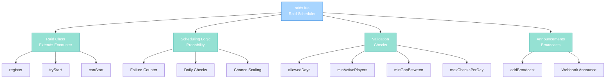

import { Aside, Card } from '@astrojs/starlight/components';

## 🛠️ Informações do Arquivo

Este é o arquivo que implementa o **sistema de Raids agendados** do servidor **OpenTibiaBR/Canary**. Fornece funcionalidades para criar raids com check periódico, chance probabilística, requirements de jogadores e restrições de dias.

<Card title="Caminho Original" icon="document">
  data/libs/systems/raids.lua
</Card>

<Aside type="tip">
  O sistema de Raids estende a classe Encounter com capacidades de agendamento probabilístico. Cada raid tem check a cada 1 minuto com chance que aumenta com tentativas falhadas, suporte para restrições de dias da semana, player count mínimo, and broadcasts globais via webhook.
</Aside>

## 📄 Visão Geral do Código

### Resumo Executivo

raids.lua é um módulo de **agendamento de eventos raid** que implementa:

1. **Raid Class**: Extends Encounter com período checks probabilísticos
2. **Probabilistic Scheduling**: Chance aumenta com tentativas falhadas (pity system)
3. **Day Restrictions**: Raids só ocorrem em dias específicos configurados
4. **Player Requirements**: Mínimo de jogadores ativos necessário
5. **Cooldown Management**: Gap mínimo entre raid occurrences
6. **Global Announcements**: Broadcasts com webhook para Discord

### Estrutura de Funcionalidades



---

## 1. Variáveis Globais

### 1.1 RAID Class Global

```lua
Raid = {
    registry = {},
    checkInterval = "1m",
    idleTime = "5m",
}
```

| Propriedade | Tipo | Descrição |
|---|---|---|
| **registry** | table | Map de raids registradas por name |
| **checkInterval** | string | Intervalo entre checks probabilísticos |
| **idleTime** | string | Tempo máximo idle para contar como active player |

**Descrição**: Tabela global que define Raid class com metatable herdando de Encounter.

---

## 2. Estrutura da Classe Raid

### 2.1 Propriedades de Configuração

| Campo | Tipo | Descrição |
|---|---|---|
| **name** | string | Identificador único do raid |
| **allowedDays** | Weekday or table | Dia ou array de dias permitidos |
| **minActivePlayers** | number | Jogadores ativos mínimos para spawn |
| **initialChance** | number | Chance inicial na primeira tentativa |
| **targetChancePerDay** | number | Chance alvo por dia (100 equals 100 pct) |
| **maxChancePerCheck** | number | Chance máxima por single check |
| **minGapBetween** | number | Segundos mínimos entre occurrences |
| **maxChecksPerDay** | number | Número máximo de checks per calendar day |
| **kv** | KV | Key-value storage scoped to raid |

---

### 2.2 Herança de Encounter

```lua
setmetatable(Raid, {
    __index = Encounter,
    __call = function(self, name, config)
        -- ... initialization
    end,
})
```

| Herdado | Tipo | Descrição |
|---------|------|-----------|
| **name** | string | Do Encounter |
| **stages** | table | Array de stages para executar |
| **currentStage** | number | Índice do stage atual |
| **start()** | method | Inicia primeira stage |
| **addStage()** | method | Adiciona nova stage |

---

## 3. Métodos da Classe Raid

### 3.1 function Raid:register()

Registra raid no registry global para acesso posterior.

#### Assinatura
```lua
function Raid:register()
```

#### Retorno

| Tipo | Valor |
|---|---|
| **boolean** | true se registrado com sucesso |

#### Comportamento

| Etapa | Operação |
|---|---|
| 1 | Chama Encounter.register() para registração base |
| 2 | Adiciona self a Raid.registry com name como key |
| 3 | Seta flag registered to true |
| 4 | Retorna true |

---

### 3.2 function Raid:tryStart(force)

Tenta começar raid se condições permitirem.

#### Assinatura
```lua
function Raid:tryStart(force)
```

#### Parâmetros

| Parâmetro | Tipo | Descrição |
|---|---|---|
| **force** | boolean | Se true, ignora canStart() checks |

#### Retorno

| Tipo | Valor |
|---|---|
| **boolean** | true se raid iniciado |
| **boolean** | false caso contrário |

#### Comportamento

| Etapa | Operação |
|---|---|
| 1 | Se force false: chama canStart() |
| 2 | Se canStart() retorna false: retorna false |
| 3 | Logs info que raid gostou a iniciar |
| 4 | Seta last-occurrence no KV para now |
| 5 | Chama self:start() para iniciar primeira stage |
| 6 | Retorna true |

---

### 3.3 function Raid:canStart()

Valida se raid pode ser iniciado agora.

#### Assinatura
```lua
function Raid:canStart()
```

#### Retorno

| Tipo | Valor |
|---|---|
| **boolean** | true se pode iniciar |
| **boolean** | false caso contrário |

#### Checks Executados

| Check | Falha Se | Log |
|-------|----------|-----|
| **Already Running** | currentStage != unstarted | raid_already_running |
| **Cooldown Active** | currentTime - lastOccurrence < minGapBetween | occurred_too_recently |
| **No Config** | targetChancePerDay or maxChancePerCheck nil | not_configured |
| **Daily Limit** | checksToday >= maxChecksPerDay | max_checks_exceeded |
| **Day Mismatch** | not isAllowedDay() and not trigger-when-possible | not_allowed_today |
| **Low Players** | getActivePlayerCount < minActivePlayers and not trigger-when-possible | insufficient_players |

#### Lógica de Probabilidade

```
checksPerDay = 23h / checkInterval
initialChance = configured or (targetChancePerDay / checksPerDay)
chanceIncrease = max((targetChancePerDay - initialChance) / checksPerDay, 0)
chance = initialChance + (chanceIncrease * failedAttempts)
chance = min(chance, maxChancePerCheck)

roll = random(100000)
success = roll <= (chance * 1000)
```

**Escalamento**: Chance aumenta com cada tentativa falhada até maxChancePerCheck.

---

### 3.4 function Raid:isAllowedDay()

Valida se raid pode ocorrer no dia atual.

#### Assinatura
```lua
function Raid:isAllowedDay()
```

#### Retorno

| Tipo | Valor |
|---|---|
| **boolean** | true se hoje é um dia permitido |

#### Comportamento

| Etapa | Operação |
|---|---|
| 1 | Obtém dia atual via os.date(%A) |
| 2 | Se allowedDays string: compara com day |
| 3 | Se allowedDays table: itera procurando match |
| 4 | Retorna true se algum match |
| 5 | Retorna false se nenhum match |

#### Exemplo de Configuração

```lua
-- Um dia
allowedDays = "Friday"

-- Múltiplos dias
allowedDays = { "Friday", "Saturday", "Sunday" }
```

---

### 3.5 function Raid:getActivePlayerCount()

Conta jogadores ativamente playing (não idle).

#### Assinatura
```lua
function Raid:getActivePlayerCount()
```

#### Retorno

| Tipo | Valor |
|---|---|
| **number** | Número de players ativos |

#### Comportamento

| Etapa | Operação |
|---|---|
| 1 | count = 0 |
| 2 | Itera Game.getPlayers() |
| 3 | Para cada player: checa getIdleTime() |
| 4 | Se idleTime < Raid.idleTime (5m): count++ |
| 5 | Retorna count total |

**Nota**: Usa Raid.idleTime global (5m default) para threshold.

---

### 3.6 function Raid:addBroadcast(message, type)

Override Encounter:addStage que adiciona broadcast stage.

#### Assinatura
```lua
function Raid:addBroadcast(message, type)
```

#### Parâmetros

| Parâmetro | Tipo | Descrição |
|---|---|---|
| **message** | string | Mensagem a broadcast |
| **type** | number | Message event type (default: MESSAGE_EVENT_ADVANCE) |

#### Retorno

| Tipo | Valor |
|---|---|
| **boolean** | true se stage adicionada |

#### Comportamento

| Etapa | Operação |
|---|---|
| 1 | Define stage com função start |
| 2 | Na execução: chama self:broadcast(type, message) |
| 3 | Envia message a announcementChannels[raids] via Webhook |
| 4 | Retorna resultado de addStage() |

#### Exemplo de Uso

```lua
myRaid:addBroadcast("Dragon Spawn incoming in 5 minutes!")
myRaid:addBroadcast("Boss is now alive!", MESSAGE_EVENT_ADVANCE)
```

---

## 4. KV Storage Scopes

Raid usa key-value storage para persistência state across reboots.

### 4.1 Storage Keys

| Key | Tipo | Propósito |
|---|---|---|
| **last-occurrence** | timestamp | Última vez que raid iniciou |
| **checks-today** | number | Contador de checks no dia atual |
| **last-check-date** | string | Data (YYYYMMDD) do último reset |
| **failed-attempts** | number | Tentativas falhadas consecutivas |
| **trigger-when-possible** | boolean | Flag para forçar quando conditions met |

### 4.2 Scope Format

```lua
raid.kv = kv.scoped("raids"):scoped(name)
```

**Exemplo**: Para raid "dragon_spawn"
- Escopo completo: raids:dragon_spawn
- Acesso: raid.kv:get("last-occurrence")

---

## 5. Fluxos de Operação

### 5.1 Lifecycle de um Raid

```
Creation:
    Raid("boss_name", { config })
        |__ __call metamethod
        |__ Cria Encounter base
        |__ Seta propriedades de raid
        |__ Retorna instância

Registration:
    raid:register()
        |__ Encounter.register() <- vincula ao sistema
        |__ Raid.registry[name] = self
        |__ Seta registered = true

Scheduling Loop (Every 1 minute):
    raid:tryStart()
        |__ checks do canStart()
        |__ Se falha: incrementa failed-attempts
        |__ Se success: executa stages
        |__ Ao terminar: reset failed-attempts e trigger-when-possible

```

### 5.2 Fluxo de Check Probabilístico

```
Check Condições Fixas:
    + currentStage != unstarted?     NO -> exit false
    + minGapBetween respeitado?      NO -> set trigger-when-possible, exit false
    + targetChancePerDay > 0?        NO -> exit false

Se trigger-when-possible:
    -> ignore probabilidade
    -> skip direto para checks de dia e players
    
Senão:
    -> Calculate probability
    -> Incrementa checks-today
    -> Se checks-today >= maxChecksPerDay -> exit false
    -> Roll dice contra cumulative chance
    -> Se roll falha -> increment failed-attempts, exit false

Check Dia da Semana:
    + isAllowedDay()?                NO -> set trigger-when-possible, exit false

Check Minimum Players:
    + getActivePlayerCount() >= min? NO -> set trigger-when-possible, exit false

Success:
    -> Limpa trigger-when-possible e failed-attempts
    -> Retorna true

```

---

## 6. Configuração Típica

### 6.1 Exemplo de Raid "Boss Simples"

```lua
Raid("dragon_spawn", {
    allowedDays = { "Friday", "Saturday", "Sunday" },
    minActivePlayers = 10,
    targetChancePerDay = 50,
    maxChancePerCheck = 12,
    minGapBetween = "6h",
    initialChance = nil,  -- Use computed value
    maxChecksPerDay = 16,
})
    :addStage({
        start = function()
            -- spawn dragon
        end,
    })
    :addBroadcast("Dragon is now alive!")
    :register()
```

### 6.2 Cálculo de Chance

**Setup**:
- targetChancePerDay = 50 (50 pct chance por dia)
- checkInterval = 1min
- checksPerDay = 1440 checks em 23h
- initialChance = 50 / 1440 ≈ 0.035 pct per check

**Com Pity**:
- Cada tentativa falhada, chance aumenta
- Escalado até maxChancePerCheck (12 pct)
- Se falha 100x: chance atinge cap

---

## 7. Checkpoint de Aprendizagem

### Conceitos-Chave

| Conceito | Explicação |
|----------|-----------|
| **Encounter Inheritance** | Raid estende Encounter para reuse de stage logic |
| **Probabilistic Scheduling** | Chance cumulative com pity counter |
| **Day Restrictions** | Raids podem ser limited a dias específicos |
| **Player Count Gating** | Raids precisam minimum ativo players |
| **KV Persistence** | State persiste across server reboots |
| **Deferred Triggering** | flag trigger-when-possible para retry quando conditions mudam |

### Padrões Observados

1. **Inheritance Pattern**: Metatable __index para polymorphism
2. **Class Factory**: __call metamethod para constructor
3. **Cumulative Probability**: Failure counter escala chance até cap
4. **Daily Resets**: Date-based counter reset automatic
5. **Flag-Based Gating**: trigger-when-possible defer checks

### Responsabilidades

1. **Registrar raids no sistema global**
2. **Check periodicidade a cada 1 minuto (external loop)**
3. **Executar stages quando conditions met**
4. **Persistir state via KV storage**
5. **Anunciar globalmente via webhook and broadcast**

---

## 🤖 Informações da Documentação

<Card title="Documentação do Módulo raids.lua" icon="document">
  **Tipo**: Raid Scheduler com Probabilistic Triggering  
  **Variáveis Globais**: 1 class (Raid) com 3 propriedades  
  **Métodos**: 6 functions (register, tryStart, canStart, isAllowedDay, getActivePlayerCount, addBroadcast)  
  **Classe Base**: Extends Encounter  
  **Storage**: KV scoped por raid name  
  **Features**: Day restrict, player gating, cooldown, pity system  
  **Checkpoint**: 6 conceitos and 5 padrões and 5 responsabilidades
</Card>

<Aside type="note">
  **Última Atualização**: Session 18  
  **Status**: Completo - Padrão Custom Modules  
  **Linhas de Código**: aproximadamente 178 total  
  **Dependências**: Encounter class, KV storage, Game.getPlayers(), ParseDuration, Webhook
</Aside>
