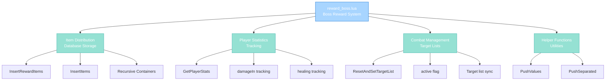

import { Aside, Card } from '@astrojs/starlight/components';

## 🛠️ Informações do Arquivo

Este é o arquivo que implementa o **sistema de recompensas para derrotas de boss** do servidor **OpenTibiaBR/Canary**. Fornece funcionalidades para distribuição de itens aos players, rastreamento de dano e cura, and persistência em banco de dados.

<Card title="Caminho Original" icon="document">
  data/libs/systems/reward_boss.lua
</Card>

<Aside type="tip">
  O sistema de Boss Rewards rastreia participação de jogadores em combate (dano taken, cura feita) and distribui itens customizados em reward bags com timestamp. Integra-se com GlobalBosses registry para estatísticas per-player por boss.
</Aside>

## 📄 Visão Geral do Código

### Resumo Executivo

reward_boss.lua é um módulo de **gerenciamento de recompensas de boss** que implementa:

1. **Item Distribution**: Cria reward bags com itens persistidos em banco de dados
2. **Player Statistics**: Rastreia dano and cura per player per boss
3. **Recursive Item Insertion**: Suporta containers dentro de containers
4. **Database Persistence**: Stores itens em tabela player_rewards
5. **Combat Tracking**: Gerencia active players durante combate
6. **Reward Customization**: Atributos customizados e timestamps em bags

### Estrutura de Funcionalidades



---

## 1. Variáveis Globais Referenciadas

### 1.1 GlobalBosses Registry

```lua
_G.GlobalBosses[bossId][playerGuid] = {
    bossId = ...,
    damageIn = ...,
    healing = ...,
    active = ...,
    playerId = ...
}
```

| Propriedade | Tipo | Descrição |
|---|---|---|
| **GlobalBosses** | table | Global registry (global namespace) |
| **[bossId]** | number | Boss creature ID como chave primária |
| **[playerGuid]** | number | Player GUID como chave secundária |

**Descrição**: Tabela global aninhada que armazena estatísticas per-player per-boss.

---

### 1.2 Constantes Utilizadas

| Constante | Que | Propósito |
|---|---|---|
| **ITEM_REWARD_CONTAINER** | Item ID | Tipo de container para reward bags |
| **ITEM_ATTRIBUTE_DATE** | Attribute Key | Armazena timestamp do reward |

---

## 2. Funções Locais Auxiliares

### 2.1 function PushValues(buffer, sep, ...)

Helper utility para adicionar valores a buffer com separador.

#### Assinatura
```lua
function PushValues(buffer, sep, ...)
```

#### Parâmetros

| Parâmetro | Tipo | Descrição |
|---|---|---|
| **buffer** | table | Array que recebe valores |
| **sep** | string | Separador entre valores (pode ser nil) |
| **...** | any | Argumentos variádicos a inserir |

#### Comportamento

| Etapa | Operação |
|---|---|
| 1 | Coleta todos ... argumentos em argv |
| 2 | Calcula argc total |
| 3 | Itera sobre cada valor |
| 4 | Insere valor em buffer |
| 5 | Se not último: insere separador |

#### Exemplo

```lua
local buf = {}
PushValues(buf, ",", "a", "b", "c")
-- buf = {"a", ",", "b", ",", "c"}
```

---

### 2.2 function PushSeparated(buffer, sep, ...)

Alias de PushValues (implementação idêntica).

#### Assinatura
```lua
function PushSeparated(buffer, sep, ...)
```

**Nota**: Função aparentemente redundante com PushValues. Pode ser legacy code.

---

## 3. Funções Globais

### 3.1 function InsertItems(buffer, info, parent, items)

Recursivamente insere itens em buffer para SQL query.

#### Assinatura
```lua
function InsertItems(buffer, info, parent, items)
```

#### Parâmetros

| Parâmetro | Tipo | Descrição |
|---|---|---|
| **buffer** | table | Array de string para SQL |
| **info** | table | Contexto com playerGuid and running counter |
| **parent** | number | Parent item sid (ou bagSid) |
| **items** | table | Array de items a processar |

#### Retorno

| Tipo | Valor |
|---|---|
| **number** | Número de items inseridos no nível |

#### Estrutura Info

| Campo | Tipo | Propósito |
|---|---|---|
| **playerGuid** | number | Player ID para INSERT |
| **running** | number | Counter para próximo sid |

#### Lógica de Inserção

| Caso | Comportamento |
|---|---|
| **Container** | Insere com sid específico, sem parent |
| **Regular Item** | Inserta com parent e sid sequencial |
| **Sub-items** | Recursão se isContainer() |

#### SQL Gerado

```sql
INSERT INTO player_rewards
(player_id, pid, sid, itemtype, count, attributes)
VALUES
(playerGuid, parent, sid, itemId, subType, attributes),
(playerGuid, parent, sid, itemId, subType, attributes),
...
```

---

### 3.2 function InsertRewardItems(playerGuid, timestamp, itemList)

Main entry point para inserir reward items ao banco de dados.

#### Assinatura
```lua
function InsertRewardItems(playerGuid, timestamp, itemList)
```

#### Parâmetros

| Parâmetro | Tipo | Descrição |
|---|---|---|
| **playerGuid** | number | GUID do player recipient |
| **timestamp** | number | Unix timestamp do reward |
| **itemList** | table or nil | Array de items ou nil |

#### Comportamento

| Etapa | Operação |
|---|---|
| 1 | Query max sid atual para player_rewards |
| 2 | Calcula bagSid (max+1) e nextSid (bagSid+1) |
| 3 | Cria reward container item |
| 4 | Seta ITEM_ATTRIBUTE_DATE = timestamp |
| 5 | Se itemList: chama bag:addRewardBossItems |
| 6 | Chama InsertItems recursivamente |
| 7 | Executa INSERT query se total > 0 |

#### Fluxo SQL

```
SELECT max(sid) FROM player_rewards WHERE player_id = playerGuid
CREATE Item(ITEM_REWARD_CONTAINER)
INSERT INTO player_rewards ... (recursive items)
```

#### Exemplo

```lua
local items = { Game.createItem(2160), Game.createItem(2497) }
InsertRewardItems(player:getGuid(), os.time(), items)
-- Cria reward bag com timestamp and items
```

---

### 3.3 function GetPlayerStats(bossId, playerGuid, autocreate)

Obtém ou cria estatísticas de player para boss específico.

#### Assinatura
```lua
function GetPlayerStats(bossId, playerGuid, autocreate)
```

#### Parâmetros

| Parâmetro | Tipo | Descrição |
|---|---|---|
| **bossId** | number | Boss creature ID |
| **playerGuid** | number | Player GUID |
| **autocreate** | boolean | Se true, cria se não existe |

#### Retorno

| Tipo | Valor |
|---|---|
| **table** | Stats table ou nil |

#### Retornado Table

| Campo | Tipo | Descrição |
|---|---|---|
| **bossId** | number | Boss ID copy |
| **damageIn** | number | Dano sofrido do boss |
| **healing** | number | Cura feita em outros |
| **active** | boolean | Está ativo no combate |
| **playerId** | number | Player ID (set later) |

#### Comportamento

| Etapa | Operação |
|---|---|
| 1 | Checa _G.GlobalBosses[bossId][playerGuid] |
| 2 | Se existe: retorna |
| 3 | Se não e autocreate: cria new table |
| 4 | Armazena em GlobalBosses and retorna |
| 5 | Se não exists e not autocreate: retorna nil |

---

### 3.4 function ResetAndSetTargetList(creature)

Sincroniza target list de boss com active players.

#### Assinatura
```lua
function ResetAndSetTargetList(creature)
```

#### Parâmetro

| Parâmetro | Tipo | Descrição |
|---|---|---|
| **creature** | creature | Boss creature object |

#### Retorno

| Tipo | Valor |
|---|---|
| **nil** | Sem retorno |

#### Comportamento

| Etapa | Operação |
|---|---|
| 1 | Valida creature not nil |
| 2 | Obtém bossId = creature:getId() |
| 3 | Obtém info = _G.GlobalBosses[bossId] |
| 4 | Se not exists: retorna early |
| 5 | Itera todas players em info |
| 6 | Seta active = false em todas |
| 7 | Obtém creature:getTargetList() |
| 8 | Para cada target na lista |
| 9 | Se target:isPlayer(): GetPlayerStats com autocreate |
| 10 | Atualiza playerId and seta active = true |

#### Propósito

Sincroniza tracking com creature's atual target list.

---

## 4. Integração com Database

### 4.1 Schema Esperado

```sql
CREATE TABLE player_rewards (
    player_id INT,
    pid INT,           -- Parent item sid
    sid INT,           -- Item sid (sequence)
    itemtype INT,      -- Item ID
    count INT,         -- Quantity/subtype
    attributes TEXT    -- Serialized attributes
)
```

| Campo | Uso |
|---|---|
| **player_id** | GUID do player |
| **pid** | Parent item (bagSid para itens diretos) |
| **sid** | Sequence ID do item |
| **itemtype** | Item ID from items.xml |
| **count** | Quantidade ou subType |
| **attributes** | item:serializeAttributes() |

---

## 5. Fluxo de Operação

### 5.1 Ciclo de Combate vs. Reward

```
Boss Spawn:
    ResetAndSetTargetList(boss)
        |__ Nota todos players no target list
        |__ Seta active = true para cada
        |__ Inicializa stats se novo

Durante Combat:
    Boss toma dano:
        |__ damageIn incrementado
    
    Player cura outro:
        |__ healing incrementado

Boss Derrotado:
    Para cada player active:
        |__ InsertRewardItems(playerGuid, timestamp, rewardItems)
        |__ CreateItem(ITEM_REWARD_CONTAINER)
        |__ Recursive INSERT para bag and sub-items
        |__ Player recebe bag no inbox

```

### 5.2 SQL Query Construção

```
Initial Query:
    SELECT max(sid) FROM player_rewards WHERE player_id = X

Buffer Building:
    INSERT INTO player_rewards ... VALUES
    (playerGuid, bagSid, bagSid, ITEM_REWARD_CONTAINER, 0, attrs),
    (playerGuid, bagSid, sid+1, ITEM_A, count, attrs),
    (playerGuid, bagSid, sid+2, ITEM_B, count, attrs),
    ...

Execution:
    db.query(buffer:concat())
```

---

## 6. Padrões e Observações

### 6.1 Recursive Item Handling

```lua
if item:isContainer() then
    local size = item:getSize()
    if size > 0 then
        local subItems = {}
        for i = 1, size do
            table.insert(subItems, item:getItem(i - 1))
        end
        InsertItems(buffer, info, info.running, subItems)
    end
end
```

Suporta items dentro de items indefinidamente.

### 6.2 SQL Injection Prevention

```lua
db.escapeString(item:serializeAttributes())
```

Usa escaping para attributes (importante para segurança).

### 6.3 ID Generation Strategy

```
Max SID + 1 = bagSid (container)
bagSid + 1 = nextSid (first item)
...continuing sequencially
```

Garante unique IDs within player_rewards.

---

## 7. Checkpoint de Aprendizagem

### Conceitos-Chave

| Conceito | Explicação |
|----------|-----------|
| **Reward Container** | Special item type que armazena items no DB |
| **SID Sequencing** | Unique sequence ID per item in rewards |
| **Recursive Containers** | Suporte para bags dentro de bags |
| **Combat Tracking** | Active player flag durante boss fight |
| **Attribute Persistence** | Serialized attributes em database |
| **Timestamp Binding** | Reward bag linked com derrota timestamp |

### Padrões Observados

1. **Buffer-Driven SQL**: Acumula todas inserts em array, joins ao final
2. **Recursive Processing**: DFS traversal de item tree
3. **Atomic Insertion**: Insere bag + all items em single query
4. **Active Player Tracking**: Resync com creature target list
5. **Statistics Per-Boss**: Separate tracking for each boss fight

### Responsabilidades

1. **Distribuir itens aos players após boss defeat**
2. **Persistir rewards em database com recursão**
3. **Rastrear statistícas de dano e cura**
4. **Sincronizar players ativos com target list**
5. **Gerar unique timestamp para cada reward**

---

## 🤖 Informações da Documentação

<Card title="Documentação do Módulo reward_boss.lua" icon="document">
  **Tipo**: Boss Reward Distribution and Statistics System  
  **Variáveis Globais**: 1 registry (GlobalBosses)  
  **Funções Locais**: 2 helpers (PushValues, PushSeparated)  
  **Funções Globais**: 4 (InsertItems, InsertRewardItems, GetPlayerStats, ResetAndSetTargetList)  
  **Database**: player_rewards table com recursive item storage  
  **Features**: Timestamp tracking, attribute persistence, container nesting  
  **Checkpoint**: 6 conceitos and 5 padrões and 5 responsabilidades
</Card>

<Aside type="note">
  **Última Atualização**: Session 18  
  **Status**: Completo - Padrão Custom Modules  
  **Linhas de Código**: 115 total  
  **Dependências**: Database con player_rewards, GlobalBosses registry, Item system
</Aside>
