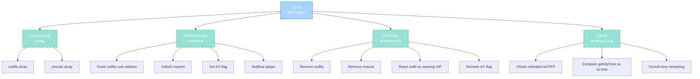

import { Aside, Card } from '@astrojs/starlight/components';

## 🛠️ Informações do Arquivo

Este é o arquivo que implementa o **sistema de VIP membership** do servidor **OpenTibiaBR/Canary**. Fornece funcionalidades avançadas para aplicação automática de benefícios VIP, gerenciamento de outfits e mounts exclusivos.

<Card title="Caminho Original" icon="document">
  `data/libs/systems/vip.lua`
</Card>

<Aside type="tip">
  O sistema VIP é baseado em dias de VIP com suporte para unlimited (0xFFFF magic constant). Quando VIP é adicionado, o jogador recebe todos os outfits e mounts da config como addons. Na expiração, todos os benefícios são removidos automaticamente e o outfit é resetado para padrão (female 136, male 128).
</Aside>

## 📄 Visão Geral do Código

### Resumo Executivo

`vip.lua` é um módulo de **gerenciamento de VIP membership** que implementa:

1. **Aplicação de Benefícios**: Outfits e mounts concedidos automaticamente via onAddVip
2. **Remoção de Benefícios**: Limpeza completa na expiração com outfit reset
3. **Notificações de Status**: Relato de tempo remaining com tratamento de unlimited
4. **Persistência KV**: Flag "vip-system" para rastreamento de membership
5. **Configuração Flexível**: Arrays config.outfits e config.mounts para customização

### Estrutura de Funcionalidades



---

## 1. Variáveis Locais

### 1.1 `config`

```lua
local config = {
    outfits = {},    -- Lista de outfit IDs para VIP-exclusive
    mounts = {},     -- Lista de mount IDs para VIP-exclusive
}
```

| Propriedade | Tipo | Descrição |
|---|---|---|
| **outfits** | table | Array de outfit IDs concedidos no VIP |
| **mounts** | table | Array de mount IDs concedidos no VIP |
| **Escopo** | local | Privado para este módulo |

**Descrição**: Tabela de configuração que define os benefícios VIP exclusivos. Arrays são iterados em onAddVip para aplicar e em onRemoveVip para remover.

**Exemplo de População**:
```lua
local config = {
    outfits = { 1, 2, 3, 4, 5 },
    mounts = { 10, 11, 12 },
}
```

---

## 2. Funções Globais

### 2.1 `function Player.onRemoveVip(self)`

Handler invocado quando VIP expira ou é removido, revertendo todos benefícios automaticamente.

#### Assinatura
```lua
function Player.onRemoveVip(self)
```

#### Parâmetros

| Parâmetro | Tipo | Descrição |
|---|---|---|
| **self** | Player | Jogador cujo VIP foi removido |

#### Comportamento

| Etapa | Operação |
|---|---|
| 1 | Envia MESSAGE_ADMINISTRATOR notificando expiration |
| 2 | Itera config.outfits e remove cada outfit via removeOutfit |
| 3 | Itera config.mounts e remove cada mount via removeMount |
| 4 | Verifica se jogador veste outfit VIP: table.contains(config.outfits, playerOutfit.lookType) |
| 5 | Se vestindo VIP outfit, reset para padrão: female 136, male 128 |
| 6 | Zera lookAddons para remover add-ons do outfit |
| 7 | Aplica novo outfit via setOutfit |
| 8 | Remove account KV flag "vip-system" |

#### Lógica de Reset de Outfit

```lua
local playerOutfit = self:getOutfit()
if table.contains(config.outfits, playerOutfit.lookType) then
    if self:getSex() == PLAYERSEX_FEMALE then
        playerOutfit.lookType = 136    -- Female padrão
    else
        playerOutfit.lookType = 128    -- Male padrão
    end
    playerOutfit.lookAddons = 0        -- Remove add-ons
    self:setOutfit(playerOutfit)
end
```

**Exemplos de Uso**:
```lua
-- Automático na expiração do VIP
-- Player.onRemoveVip é chamado pelo game engine quando:
-- - getVipTime() menos que os.time()
-- - Admin comando remove VIP manualmente

-- Resultado:
-- - Todos outfits VIP são removidos
-- - Todos mounts VIP são removidos
-- - Se wearing VIP outfit: reset para 128/136
-- - Player recebe MESSAGE_ADMINISTRATOR notificando
```

---

### 2.2 `function Player.onAddVip(self, days, silent)`

Handler invocado quando VIP é concedido (comando, compra, etc), aplicando benefícios automaticamente.

#### Assinatura
```lua
function Player.onAddVip(self, days, silent)
```

#### Parâmetros

| Parâmetro | Tipo | Descrição |
|---|---|---|
| **self** | Player | Jogador recebendo VIP |
| **days** | number | Número de dias de VIP concedidos |
| **silent** | boolean | Se true, suprime notificação MESSAGE_EVENT_ADVANCE |

#### Comportamento

| Etapa | Operação |
|---|---|
| 1 | Se not silent, envia MESSAGE_EVENT_ADVANCE com dias formatado |
| 2 | Itera config.outfits e aplica cada via addOutfitAddon(outfit, 3) |
| 3 | Itera config.mounts e aplica cada via addMount(mount) |
| 4 | Seta account KV "vip-system" para true (persistência) |

#### Lógica de Notificação

```lua
if not silent then
    self:sendTextMessage(MESSAGE_EVENT_ADVANCE, 
        string.format("You have been granted %s days of VIP status.", days))
end
```

**Exemplos de Uso**:
```lua
-- Concessão com notificação (default)
player:onAddVip(30, false)
-- Output: "You have been granted 30 days of VIP status."

-- Concessão silenciosa (bulk operations)
player:onAddVip(7, true)
-- Sem notificação ao player
```

---

### 2.3 `function Player.sendVipStatus(self)`

Envia mensagem diferenciada baseada em VIP status atual (unlimited, active, ou expired).

#### Assinatura
```lua
function Player.sendVipStatus(self)
```

#### Parâmetros

| Parâmetro | Tipo | Descrição |
|---|---|---|
| **self** | Player | Jogador consultado |

#### Retorno

| Valor | Significado |
|---|---|
| **true** | Status enviado com sucesso |

#### Comportamento por Estado

| Estado | Condição | Mensagem |
|---|---|---|
| **Unlimited** | getVipDays() equals 0xFFFF | "You have unlimited VIP status." |
| **Expired** | getVipTime() menor que os.time() | "Your VIP status is currently inactive." |
| **Active** | getVipTime() maior que os.time() | "You have X days Y hours of VIP time remaining." |

#### Lógica de Verificação

```lua
if self:getVipDays() == 0xFFFF then
    -- VIP unlimited
    return true
elseif playerVipTime < os.time() then
    -- VIP expirou
    return true
else
    -- VIP ativo com tempo remaining
    getFormattedTimeRemaining(playerVipTime)  -- Converte para string legível
end
```

**Exemplos de Uso**:
```lua
-- Em comando de status
player:sendVipStatus()

-- Output exemplos:
-- "You have unlimited VIP status."
-- "Your VIP status is currently inactive."
-- "You have 15 days 13 hours of VIP time remaining."
```

---

## 3. Fluxos de Operação

### 3.1 Concessão de VIP

```
Player recebe VIP via comando/compra
    ↓
onAddVip(days, silent) é chamado
    ↓
Se not silent: notifica com dias
    ↓
Loop config.outfits: addOutfitAddon(outfit, 3)
    ↓
Loop config.mounts: addMount(mount)
    ↓
Set KV "vip-system" = true
    ↓
Player agora tem todos benefícios
```

### 3.2 Remoção de VIP (Expiração)

```
Game engine detecta: getVipTime() < os.time()
    ↓
onRemoveVip() é chamado automaticamente
    ↓
Notifica player com MESSAGE_ADMINISTRATOR
    ↓
Loop config.outfits: removeOutfit(outfit)
    ↓
Loop config.mounts: removeMount(mount)
    ↓
Check if wearing VIP outfit:
    ├─ Sim: Reset para female 136 ou male 128
    └─ Não: Manter outfit actual
    ↓
Remove KV "vip-system" flag
    ↓
Todos benefícios revertidos
```

### 3.3 Consulta de Status

```
Player pede status via comando
    ↓
sendVipStatus() é chamado
    ↓
Check getVipDays() == 0xFFFF?
    ├─ Sim: "You have unlimited VIP status."
    └─ Não: Verificar getVipTime()
        ├─ Expirado: "Your VIP status is currently inactive."
        └─ Ativo: "You have X of VIP time remaining."
    ↓
Mensagem enviada com MESSAGE_LOGIN ou MESSAGE_STATUS
```

---

## 4. Considerações de Design

### 4.1 Segurança de Outfit Reset

A lógica de outfit reset é defensiva:
- Valida se jogador está vestindo outfit VIP via table.contains
- Previne reset acidental se não vestindo VIP outfit
- Reset baseado em sex (PLAYERSEX_FEMALE vs default)
- Zera lookAddons para limpeza completa

### 4.2 Persistência via KV

- Flag "vip-system" é scoped a account (não character)
- Permite rastreamento entre logins
- Removido automaticamente na expiração
- Usado para queries de feature-locked content

### 4.3 Tratamento de Unlimited

O magic constant 0xFFFF:
- Indica VIP permanente (nunca expira)
- getFormattedTimeRemaining skip para unlimited
- Permite staff accounts com VIP eterno
- Alternativa elegante vs null/special values

---

## 🤖 Informações da Documentação

<Card title="Documentação do Módulo vip.lua" icon="document">
  **Tipo**: Sistema de Benefícios VIP  
  **Variáveis Locais**: 1 (config table)  
  **Funções Globais**: 3 (onAddVip, onRemoveVip, sendVipStatus)  
  **Padrões**: Hook-based benefits, config-driven arrays, outfit reset logic, KV persistence  
  **Checkpoint**: 6 conceitos and 5 padrões and 5 responsabilidades
</Card>

<Aside type="note">
  **Última Atualização**: Session 18  
  **Status**: Completo - Padrão Custom Modules  
  **Linhas de Código**: ~60 (config) plus 3 métodos Player  
</Aside>
