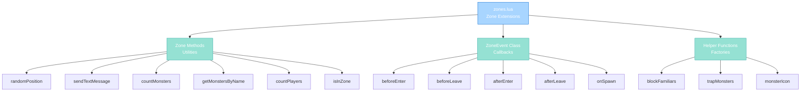

import { Aside, Card } from '@astrojs/starlight/components';

## 🛠️ Informações do Arquivo

Este é o arquivo que implementa **extensões e utilities para sistema de Zonas** do servidor **OpenTibiaBR/Canary**. Fornece funcionalidades para manipulação de áreas, event callbacks, queries de creatures e helpers especializados.

<Card title="Caminho Original" icon="document">
  data/libs/systems/zones.lua
</Card>

<Aside type="tip">
  O sistema de Zones estende a classe Zone base com métodos utilities e event system. Permite criar callbacks personalizados para entrada/saída de creatures, spawn de monsters, and aplicar comportamentos customizados em áreas específicas.
</Aside>

## 📄 Visão Geral do Código

### Resumo Executivo

zones.lua é um módulo de **extensões de zonas** que implementa:

1. **Zone Extensions**: 8 métodos adicionados à classe Zone
2. **ZoneEvent System**: Callbacks para creature enter/leave/spawn
3. **Query Helpers**: countMonsters, getMonstersByName, countPlayers
4. **Position Validation**: Random valid walkable position selection
5. **Zone Properties**: Position checks, monster/player counting
6. **Event Factories**: blockFamiliars, trapMonsters, monsterIcon

### Estrutura de Funcionalidades



---

## 1. Extensões da Classe Zone

### 1.1 function Zone:randomPosition()

Retorna uma posição aleatória walkable dentro da zona.

#### Assinatura
```lua
function Zone:randomPosition()
```

#### Retorno

| Tipo | Valor |
|---|---|
| **table** | Position válida or nil |

#### Comportamento

| Etapa | Operação |
|---|---|
| 1 | Obtém self:getPositions() |
| 2 | Se zero positions: logs error and retorna nil |
| 3 | Itera todas positions |
| 4 | Valida tile:isWalkable com blocos customizados |
| 5 | Se walkable: adiciona a validPositions |
| 6 | Se zero valid: logs error and retorna nil |
| 7 | Seleciona random de validPositions |
| 8 | Logs debug and retorna |

#### Validações

```lua
tile:isWalkable(false, false, false, false, true)
```

Parâmetros: blockingItems, protectionZone, crossingLine, diagonal, ignoreDoors.

---

### 1.2 function Zone:sendTextMessage(...)

Envia mensagem a todos players na zona.

#### Assinatura
```lua
function Zone:sendTextMessage(...)
```

#### Parâmetros

| Parâmetro | Tipo | Descrição |
|---|---|---|
| **...** | any | Argumentos para player:sendTextMessage |

#### Comportamento

| Etapa | Operação |
|---|---|
| 1 | Obtém self:getPlayers() |
| 2 | Para cada player: chama sendTextMessage(...) |

#### Exemplo

```lua
zone:sendTextMessage(MESSAGE_EVENT_ADVANCE, "Alert!")
```

---

### 1.3 function Zone:countMonsters(name)

Conta monsters na zona, opcionalmente por nome.

#### Assinatura
```lua
function Zone:countMonsters(name)
```

#### Parâmetros

| Parâmetro | Tipo | Descrição |
|---|---|---|
| **name** | string or nil | Nome para filtrar (case-insensitive) |

#### Retorno

| Tipo | Valor |
|---|---|
| **number** | Número de monsters |

#### Comportamento

| Etapa | Operação |
|---|---|
| 1 | count = 0 |
| 2 | Itera self:getMonsters() |
| 3 | Se name nil: count++ para cada |
| 4 | Se name: só count se match case-insensitive |
| 5 | Retorna count |

#### Exemplo

```lua
local dragonCount = zone:countMonsters("Dragon")
local totalCount = zone:countMonsters()
```

---

### 1.4 function Zone:getMonstersByName(name)

Retorna array de monsters com nome específico.

#### Assinatura
```lua
function Zone:getMonstersByName(name)
```

#### Parâmetros

| Parâmetro | Tipo | Descrição |
|---|---|---|
| **name** | string | Nome a procurar (case-insensitive) |

#### Retorno

| Tipo | Valor |
|---|---|
| **table** | Array de monster creatures |

#### Comportamento

| Etapa | Operação |
|---|---|
| 1 | monsters = {} |
| 2 | Itera self:getMonsters() |
| 3 | Se match name: adiciona array |
| 4 | Retorna array |

---

### 1.5 function Zone:countPlayers(notFlag)

Conta players na zona, opcionalmente excluding por flag.

#### Assinatura
```lua
function Zone:countPlayers(notFlag)
```

#### Parâmetros

| Parâmetro | Tipo | Descrição |
|---|---|---|
| **notFlag** | number or nil | Group flag a excluir |

#### Retorno

| Tipo | Valor |
|---|---|
| **number** | Número de players |

#### Comportamento

| Etapa | Operação |
|---|---|
| 1 | Obtém self:getPlayers() |
| 2 | count = 0 |
| 3 | Para cada player |
| 4 | Se notFlag: só count se não tem flag |
| 5 | Senão: count++ |
| 6 | Retorna count |

#### Exemplo

```lua
local all = zone:countPlayers()
local noGMs = zone:countPlayers(PLAYER_FLAG_GAMEMASTER)
```

---

### 1.6 function Zone:isInZone(position)

Valida se position está dentro desta zona.

#### Assinatura
```lua
function Zone:isInZone(position)
```

#### Parâmetro

| Parâmetro | Tipo | Descrição |
|---|---|---|
| **position** | table | Position object |

#### Retorno

| Tipo | Valor |
|---|---|
| **boolean** | true se position in zone |

#### Comportamento

| Etapa | Operação |
|---|---|
| 1 | zones = position:getZones() |
| 2 | Se zones nil: retorna false |
| 3 | Itera zones array |
| 4 | Se self == zone: retorna true |
| 5 | Retorna false se nenhum match |

---

## 2. Classe ZoneEvent

Sistema de callbacks para eventos de zona.

### 2.1 ZoneEvent Structure

```lua
ZoneEvent = {
    zone = Zone,
    beforeEnter = function(zone, creature) ... end,
    beforeLeave = function(zone, creature) ... end,
    afterEnter = function(zone, creature) ... end,
    afterLeave = function(zone, creature) ... end,
    onSpawn = function(monster, position) ... end,
}
```

| Campo | Tipo | Propósito |
|---|---|---|
| **zone** | Zone | Zone associada |
| **beforeEnter** | function | Chamado antes de creature enter |
| **beforeLeave** | function | Chamado antes de creature leave |
| **afterEnter** | function | Chamado após creature enter |
| **afterLeave** | function | Chamado após creature leave |
| **onSpawn** | function | Chamado on monster spawn |

---

### 2.2 function ZoneEvent(zone)

Constructor (via metatable __call).

#### Assinatura
```lua
local event = ZoneEvent(zone)
```

#### Retorno

| Tipo | Valor |
|---|---|
| **table** | Nova instância ZoneEvent |

---

### 2.3 function ZoneEvent:register()

Registra todos callbacks habilitados como EventCallbacks.

#### Assinatura
```lua
function ZoneEvent:register()
```

#### Comportamento

| Etapa | Operação |
|---|---|
| 1 | Se beforeEnter: cria EventCallback com zoneBeforeCreatureEnter |
| 2 | Se beforeLeave: cria EventCallback com zoneBeforeCreatureLeave |
| 3 | Se afterEnter: cria EventCallback com zoneAfterCreatureEnter |
| 4 | Se afterLeave: cria EventCallback com zoneAfterCreatureLeave |
| 5 | Se onSpawn: cria EventCallback com zoneAfterCreatureEnter (para spawns) |

**Nota**: Cada callback valida se zone == self.zone antes de executar.

#### Assinatura de Callbacks

| Callback | Parâmetros | Retorno |
|----------|-----------|---------|
| **beforeEnter** | (zone, creature) | boolean (true to allow) |
| **beforeLeave** | (zone, creature) | boolean (true to allow) |
| **afterEnter** | (zone, creature) | nil |
| **afterLeave** | (zone, creature) | nil |
| **onSpawn** | (monster, position) | nil |

---

## 3. Helper Factories

### 3.1 function Zone:blockFamiliars()

Factory que cria callback bloqueando familiares de entrar.

#### Assinatura
```lua
function Zone:blockFamiliars()
```

#### Comportamento

Cria ZoneEvent com beforeEnter que retorna false se creature é familiar.

```lua
function event.beforeEnter(_zone, creature)
    local monster = creature:getMonster()
    return not (monster and monster:getMaster() and monster:getMaster():isPlayer())
end
```

#### Uso

```lua
myZone:blockFamiliars()
```

---

### 3.2 function Zone:trapMonsters()

Factory que cria callback prendendo monsters na zona.

#### Assinatura
```lua
function Zone:trapMonsters()
```

#### Comportamento

Cria ZoneEvent com beforeLeave que retorna false se creature é monster.

```lua
function event.beforeLeave(_zone, creature)
    local monster = creature:getMonster()
    return not monster
end
```

**Efeito**: Monsters não conseguem leave zona (bloqueados).

---

### 3.3 function Zone:monsterIcon(category, icon, count)

Factory que adiciona icon customizado a monsters na zona.

#### Assinatura
```lua
function Zone:monsterIcon(category, icon, count)
```

#### Parâmetros

| Parâmetro | Tipo | Descrição |
|---|---|---|
| **category** | number | Icon category |
| **icon** | number | Icon ID |
| **count** | number | Icon count |

#### Comportamento

Cria ZoneEvent com afterEnter que seta icon no monster.

```lua
function event.afterEnter(_zone, creature)
    if not creature:isMonster() then
        return
    end
    creature:setIcon(category, icon, count)
end
```

#### Uso

```lua
myZone:monsterIcon(ICON_POISON, 1, 1)
```

---

## 4. Fluxos de Operação

### 4.1 Entrada em Zona

```
Creature approaches zone boundary
    |
    +-- ZoneEvent:register() listeners
    |       |__ beforeEnter callback fires
    |       |__ Se return false: bloqueado
    |       |__ Se return true: permitido
    |
    +-- Creature entra zona
    |
    +-- afterEnter callback fires
            |__ Si onSpawn e é monster: onSpawn executa
```

### 4.2 Saída de Zona

```
Creature approaches boundary para deixar
    |
    +-- beforeLeave callback fires
    |       |__ Se return false: bloqueado (trap)
    |       |__ Se return true: permitido
    |
    +-- Creature sai zona
    |
    +-- afterLeave callback fires
```

---

## 5. Padrões e Observações

### 5.1 EventCallback Registration

Cada callback type cria separate EventCallback:

```lua
EventCallback("ZoneEventBeforeEnter", true)
EventCallback("ZoneEventBeforeLeave", true)
EventCallback("ZoneEventAfterEnter", true)
EventCallback("ZoneEventAfterLeave", true)
EventCallback("ZoneEventAfterEnterOnSpawn", true)
```

Global registration permite múltiplos ZoneEvent instances.

### 5.2 Zone Filtering

Cada EventCallback valida zone match:

```lua
function beforeEnter.zoneBeforeCreatureEnter(zone, creature)
    if zone ~= self.zone then
        return true
    end
    return self.beforeEnter(zone, creature)
end
```

Early return true se zone não match (permite action).

### 5.3 Monster Detection

onSpawn só executa se creature é monster:

```lua
local monster = creature:getMonster()
if not monster then
    return true
end
self.onSpawn(monster, monster:getPosition())
```

---

## 6. Checkpoint de Aprendizagem

### Conceitos-Chave

| Conceito | Explicação |
|----------|-----------|
| **Zone Extensions** | Métodos adicionados via open class pattern |
| **EventCallback System** | Global event listeners per callback type |
| **Zone Filtering** | Skips callbacks se zone não match |
| **Factory Pattern** | blockFamiliars, trapMonsters, monsterIcon |
| **Walkable Validation** | Custom parameters para isWalkable check |
| **Before/After Semantics** | Before permite bloqueio, after notificação |

### Padrões Observados

1. **Open Class Extension**: Adiciona métodos a classes existentes
2. **Factory Methods**: Retorna configured ZoneEvent
3. **Callback Chaining**: Multiple ZoneEvents podem register
4. **Event Delegation**: Filtra zone antes de executar callback
5. **Return Value Semantics**: false blocks, true allows

### Responsabilidades

1. **Fornecer utilities para manipulação de zonas**
2. **Implementar sistema de callbacks para enter/leave/spawn**
3. **Suportar querys de monsters e players**
4. **Prover factories para comportamentos comuns**
5. **Filtrar eventos por zone específica**

---

## 🤖 Informações da Documentação

<Card title="Documentação do Módulo zones.lua" icon="document">
  **Tipo**: Zone Extensions and Event System  
  **Métodos Zone**: 6 extensions (randomPosition, sendTextMessage, countMonsters, getMonstersByName, countPlayers, isInZone)  
  **Classe ZoneEvent**: 1 class com 1 register method and 5 callback types  
  **Helpers**: 3 factory methods (blockFamiliars, trapMonsters, monsterIcon)  
  **Callbacks**: 5 event types (beforeEnter, beforeLeave, afterEnter, afterLeave, onSpawn)  
  **Checkpoint**: 6 conceitos and 5 padrões and 5 responsabilidades
</Card>

<Aside type="note">
  **Última Atualização**: Session 18  
  **Status**: Completo - Padrão Custom Modules  
  **Linhas de Código**: 210 total  
  **Dependências**: Zone base class, EventCallback system, Position/Tile methods
</Aside>
