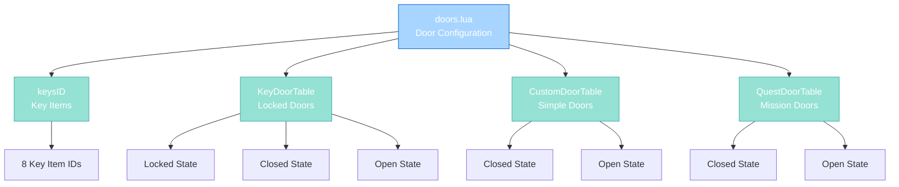

import { Aside, Card } from '@astrojs/starlight/components';

## 🛠️ Informações do Arquivo

Este é o arquivo de **configuração de portas do servidor** **OpenTibiaBR/Canary**. Define mapeamentos de item IDs para todas as portas do jogo, incluindo portas com chave, portas customizadas e portas de missão.

<Card title="Caminho Original" icon="document">
  data/libs/tables/doors.lua
</Card>

<Aside type="tip">
  Este arquivo é uma lookup table pura sem funções. Define 4 importantes tabelas de portas: keysID (IDs de chaves), KeyDoorTable (portas locked com chave), CustomDoorTable (portas simples open/close), and QuestDoorTable (portas de missão com storage check).
</Aside>

## 📄 Visão Geral do Código

### Resumo Executivo

doors.lua é um módulo de **configuração de portas** que implementa:

1. **Key IDs**: Array com 8 item IDs de chaves do jogo
2. **Keyed Doors**: Portas que requerem chave (3 states: locked, closed, open)
3. **Custom Doors**: Portas simples que abrem/fecham (2 states: closed, open)
4. **Quest Doors**: Portas que verificam storage de missão (2 states: closed, open)

### Estrutura de Dados



---

## 1. Variáveis Globais

### 1.1 keysID

Array com IDs de itens que funcionam como chaves para portas.

```lua
keysID = { 2967, 2968, 2969, 2970, 2971, 2972, 2973, 21392 }
```

| Index | Item ID | Propósito |
|-------|---------|----------|
| 1 | 2967 | Chave genérica 1 |
| 2 | 2968 | Chave genérica 2 |
| 3 | 2969 | Chave genérica 3 |
| 4 | 2970 | Chave genérica 4 |
| 5 | 2971 | Chave genérica 5 |
| 6 | 2972 | Chave genérica 6 |
| 7 | 2973 | Chave genérica 7 |
| 8 | 21392 | Chave especial (Dawnport quest) |

**Propósito**: Identificação de chaves para validação em scripts de interação com portas.

---

### 1.2 KeyDoorTable

Tabela com portas que requerem chave para abrir (3 estados).

#### Estrutura

```lua
KeyDoorTable = {
    { lockedDoor = 1628, closedDoor = 1629, openDoor = 1630 },
    { lockedDoor = 1631, closedDoor = 1632, openDoor = 1633 },
    -- ... ~65 entradas
}
```

#### Campos

| Campo | Tipo | Descrição |
|-------|------|-----------|
| **lockedDoor** | number | Item ID quando porta está locked (permanentemente) |
| **closedDoor** | number | Item ID quando porta está fechada mas desbloqueada |
| **openDoor** | number | Item ID quando porta está aberta |

#### Estados Explicados

| Estado | Campo | Descrição |
|--------|-------|-----------|
| **Locked** | lockedDoor | Permanentemente locked, não abre sem chave |
| **Closed** | closedDoor | Fechada mas desbloqueada, abre com ação |
| **Open** | openDoor | Aberta, pode fechar com ação |

#### Exemplo de Uso

```
Player com chave tenta abrir door 1628 (locked):
  1. Click vê lockedDoor = 1628 (locked visual)
  2. Script valida chave em keysID
  3. Chave deve ser actionId específica da porta
  4. Transiciona para closedDoor = 1629
  5. Próximo click abre para openDoor = 1630
```

**Total**: aproximadamente 65 portas diferentes configuradas.

---

### 1.3 CustomDoorTable

Tabela com portas simples que abrem/fecham (sem chave).

#### Estrutura

```lua
CustomDoorTable = {
    { closedDoor = 1638, openDoor = 1639 },
    { closedDoor = 1640, openDoor = 1641 },
    -- ... ~85 entradas
}
```

#### Campos

| Campo | Tipo | Descrição |
|-------|------|-----------|
| **closedDoor** | number | Item ID quando porta está fechada |
| **openDoor** | number | Item ID quando porta está aberta |

#### Estados Explicados

| Estado | Campo | Descrição |
|--------|-------|-----------|
| **Closed** | closedDoor | Porta fechada, pronta para abrir |
| **Open** | openDoor | Porta aberta, pronta para fechar |

#### Comportamento

```
Player clica porta CustomDoor:
  1. Vê closedDoor = 1638
  2. Sem validações (sem chave required)
  3. Transiciona para openDoor = 1639
  4. Clica novamente para fechar
```

**Observação**: Estas portas abrem automaticamente sem requirements.

**Total**: aproximadamente 85 portas diferentes configuradas.

---

### 1.4 QuestDoorTable

Tabela com portas que require storage value (missão).

#### Estrutura

```lua
QuestDoorTable = {
    { closedDoor = 1642, openDoor = 1643 },
    { closedDoor = 1644, openDoor = 1645 },
    -- ... ~80 entradas
}
```

#### Campos

| Campo | Tipo | Descrição |
|-------|------|-----------|
| **closedDoor** | number | Item ID quando fechada |
| **openDoor** | number | Item ID quando aberta |

#### Uso com Storage

```lua
-- Configuração no quest handler:
door:setActionId(STORAGE_QUEST_ID)

-- Player tenta abrir:
  1. Vê closedDoor = 1642
  2. Script valida player:getStorageValue(actionId)
  3. Se storage >= 1: abre para openDoor = 1643
  4. Senão: mensagem "A porta está trancada"
```

**Propósito**: Gating de áreas por quest completion via storage value.

**Total**: aproximadamente 80 portas diferentes configuradas.

---

## 2. Observações importantes

### 2.1 Key Storage IDs

```lua
-- Nota no arquivo:
-- ID of the keys. (Id 21392 is used only for dawnport quest)
```

O item ID 21392 é específico para a quest Dawnport.

### 2.2 Segurança de Locked Doors

```lua
-- Nota no arquivo:
-- The lockedDoor is the doors with the description "It is locked". 
-- Use this (with no action) to keep a door permanently isolated.
```

Portas locked devem ter action ID vazio para ser permanentemente locked.

### 2.3 Exclusão de Quest Doors

```lua
-- Nota no arquivo:
-- Be careful, do not add quest door inside the level door table, 
-- this will lock the doors.
```

Quest doors não devem ser adicionadas em KeyDoorTable.

---

## 3. Padrões de Configuração

### 3.1 ID Sequencing

As portas seguem padrão de IDs sequenciais:

```
KeyDoor: 1628 (locked), 1629 (closed), 1630 (open)
         1631 (locked), 1632 (closed), 1633 (open)
         ...
```

Sequência de +1 ou +2 em trios.

### 3.2 Reutilização de IDs

Alguns pares openDoor/closedDoor são revertidos:

```lua
{ closedDoor = 6437, openDoor = 6435 },
{ closedDoor = 6435, openDoor = 6437 },
```

Isto permite bidirecionalidade (cada um pode ser door visually).

---

## 4. Checkpoint de Aprendizagem

### Conceitos-Chave

| Conceito | Explicação |
|----------|-----------|
| **Door States** | Locked, Closed, Open (3 or 2) |
| **Item Lookup** | Scripts usam IDs para identificar estado door |
| **Key Validation** | keysID para verificar se item é chave |
| **Storage Gating** | Quest doors usam storage para permission |
| **Action ID** | Usado em quest doors para ar mapear storage |

### Padrões Observados

1. **Lookup Tables**: Mapeamento direto de estado para item ID
2. **Sequential IDs**: 3 IDs por porta locked, 2 por porta simples
3. **Bidirectional**: Open/closed podem ser reversíveis
4. **No Logic**: Pura configuração sem operação lógica

### Responsabilidades

1. **Definir mapeamento de portas**
2. **Especificar 3 estados locked doors**
3. **Especificar 2 estados simples doors**
4. **Fornecer key IDs para validação**
5. **Manter configuração sincronizada com items.xml**

---

## 🤖 Informações da Documentação

<Card title="Documentação do Arquivo doors.lua" icon="document">
  **Tipo**: Configuration Table - Door Mappings  
  **Variáveis Globais**: 4 tabelas (keysID, KeyDoorTable, CustomDoorTable, QuestDoorTable)  
  **Total de Portas**: ~230 portas configuradas  
  **KeyDoor Entries**: ~65 portas com lock  
  **CustomDoor Entries**: ~85 portas simples  
  **QuestDoor Entries**: ~80 portas de missão  
  **Key IDs**: 8 item IDs com especial nota para Dawnport  
  **Checkpoint**: 5 conceitos and 3 padrões and 5 responsabilidades
</Card>

<Aside type="note">
  **Última Atualização**: Session 18  
  **Status**: Completo - Configuration Reference  
  **Notas**: Cuidado ao adicionar novas portas, manter sincronização com items.xml IDs  
</Aside>
