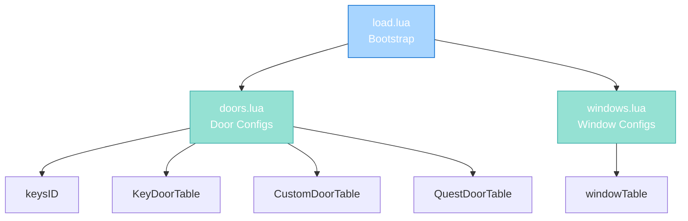

import { Aside, Card } from '@astrojs/starlight/components';

## 🛠️ Informações do Arquivo

Este é o arquivo **bootstrap principal do sistema de tabelas** do servidor **OpenTibiaBR/Canary**. Responsável pela inicialização ordenada de todos os módulos de tabelas mediante diretivas dofile.

<Card title="Caminho Original" icon="document">
  data/libs/tables/load.lua
</Card>

<Aside type="tip">
  Este arquivo é carregado automaticamente durante boot do servidor (provavelmente via data/libs/load.lua ou estrutura de inicialização principal). Garante que todas as tabelas de configuração estejam carregadas before game initialization.
</Aside>

## 📄 Visão Geral do Código

### Resumo Executivo

load.lua é um **arquivo bootstrap de inicialização** que implementa:

1. **Carregamento Sequencial**: Carrega 2 módulos de tabelas via dofile
2. **Path Abstraction**: Usa CORE_DIRECTORY para paths portáveis
3. **Modular Architecture**: Cada tabela é independente and auto-contida
4. **Game Initialization**: Gateway para toda configuração de tabelas

### Arquitetura de Carregamento



---

## 1. Operação de Carregamento

### 1.1 Estrutura Geral

O arquivo contém exatamente 2 diretivas dofile que carregam módulos na seguinte ordem:

| # | Módulo | Arquivo |
|---|--------|---------|
| 1 | Doors | doors.lua |
| 2 | Windows | windows.lua |

---

### 1.2 Padrão de Dofile

Cada linha segue o padrão padronizado:

```lua
dofile(CORE_DIRECTORY .. "/libs/tables/[module_name].lua")
```

| Componente | Descrição |
|---|---|
| **dofile()** | Função global que carrega and executa arquivo Lua |
| **CORE_DIRECTORY** | Variável global com path base do servidor |
| **/libs/tables/** | Subdiretório onde todas as tabelas residem |
| **[module_name].lua** | Nome do módulo a carregar |

---

## 2. Módulos Carregados

### 2.1 doors.lua

Door configuration tables com locks, custom doors e quest doors.

```lua
dofile(CORE_DIRECTORY .. "/libs/tables/doors.lua")
```

**Global Tables Created**:
- keysID - Array de 8 key item IDs
- KeyDoorTable - ~65 portas com lock (3-state)
- CustomDoorTable - ~85 portas simples (2-state)
- QuestDoorTable - ~80 portas de missão (2-state)

**Total**: ~230 door configurations

---

### 2.2 windows.lua

Window configuration table para janelas open/close.

```lua
dofile(CORE_DIRECTORY .. "/libs/tables/windows.lua")
```

**Global Tables Created**:
- windowTable - ~90 janelas (2-state: closed, open)

**Total**: ~90 window configurations

---

## 3. Fluxo de Operação

### 3.1 Inicialização do Servidor

```
Server Boot
    |
    +-- Load data/libs/tables/load.lua
            |
            +-- Load doors.lua
            |       |__ keysID registered
            |       |__ KeyDoorTable in memory
            |       |__ CustomDoorTable in memory
            |       |__ QuestDoorTable in memory
            |
            +-- Load windows.lua
                    |__ windowTable in memory
    |
    +-- Game Ready (all tables available)
```

---

### 3.2 Disponibilidade de Tabelas

Após carregamento, todas tabelas estão globalmente disponíveis:

```lua
-- Acesso direto após load
for _, doorConfig in ipairs(KeyDoorTable) do
    -- usar doorConfig.lockedDoor, closedDoor, openDoor
end

for _, windowConfig in ipairs(windowTable) do
    -- usar windowConfig.closedWindow, openWindow
end

if table.contains(keysID, itemId) then
    -- item é uma chave
end
```

---

## 4. Padrões e Observações

### 4.1 Path Abstraction

Usando CORE_DIRECTORY torna paths portáveis:

```lua
-- Portável entre diferentes instalações
dofile(CORE_DIRECTORY .. "/libs/tables/doors.lua")

-- Em vez de hardcoded
dofile("/home/tibiaar/server/data/libs/tables/doors.lua")
```

**Benefícios**:
- Funciona em Windows and Linux with diferentes paths
- Docker containers podem definir CORE_DIRECTORY customizado
- Instalações podem estar em qualquer diretório

---

### 4.2 Modularização

Cada tabela é independente:

```lua
-- doors.lua não conhece windows.lua
-- windows.lua é opcional (pode ser comentado)
-- Removendo uma linha desabilita tabela completamente
```

**Implicações**:
- Descomente linhas para desabilitar módulos de tabela
- Adicione novas linhas para novos módulos de tabela
- Ordem pode ser reorganizada se sem dependências

---

### 4.3 Inicialização Declarativa

O arquivo é puramente declarativo (sem lógica):

```lua
-- Apenas declarações, sem condicionais
-- Sem error handling
-- Sem logging
```

**Abordagem**:
- Simples and direto
- Error handling em cada módulo individual
- Cada tabela é responsável pela própria validação

---

## 5. Checkpoint de Aprendizagem

### Conceitos-Chave

| Conceito | Descrição |
|----------|-----------|
| **Dofile** | Função que carrega and executa Lua files |
| **Bootstrap** | Arquivo que inicia toda aplicação |
| **Path Abstraction** | Usar variáveis para paths portáveis |
| **Modular Init** | Carregar módulos de forma independente |
| **Table Loading** | Carregamento de configuration tables |

### Padrões Observados

1. **Single Responsibility**: Cada arquivo faz uma coisa
2. **Loose Coupling**: Tabelas não dependem umas das outras
3. **Scalability**: Adicionar novas tabelas é trivial
4. **Configurability**: Comentar linhas para desativar tabelas
5. **Consistency**: Mesmo padrão para todos os loads

### Responsabilidades

1. **Arquivo carrega todas as tabelas de configuração**
2. **Garante ordem correta de inicialização**
3. **Fornece point para configuração de tabelas**
4. **Abstrai paths via CORE_DIRECTORY**

---

## 6. Integração com Sistema Maior

### 6.1 Relação com data/libs/load.lua

Este arquivo `data/libs/tables/load.lua` é provavelmente chamado por `data/libs/load.lua` que carrega todos os libs:

```
data/libs/load.lua
  |
  +-- data/libs/functions/load.lua (33 funções)
  +-- data/libs/gamestore/load.lua (7 módulos)
  +-- data/libs/systems/load.lua (13 sistemas)
  +-- data/libs/tables/load.lua (2 tabelas) <- ESTE ARQUIVO
```

---

### 6.2 Relação com Door/Window Scripts

Scripts de interação (creaturescripts, actions) consultam essas tabelas:

```lua
-- Em script de door open:
for _, doorConfig in ipairs(KeyDoorTable) do
    if doorConfig.closedDoor == itemId then
        -- lógica de abrir porta
        creature:sendTextMessage(...)
    end
end

-- Em script de item key:
if table.contains(keysID, item:getId()) then
    -- item é uma chave válida
end
```

---

## 🤖 Informações da Documentação

<Card title="Documentação do Arquivo load.lua" icon="document">
  **Tipo**: Bootstrap Loader and Table Initializer  
  **Linhas de Código**: 3 total (1 comentário and 2 dofile directives)  
  **Módulos Carregados**: 2 tabelas  
  **Padrão**: Modular architecture with independent tables  
  **Path Strategy**: CORE_DIRECTORY variable for portability  
  **Total Configurations**: ~320 door/window configurations  
  **Checkpoint**: 5 conceitos and 5 padrões and 1 responsabilidade primária
</Card>

<Aside type="note">
  **Última Atualização**: Session 18  
  **Status**: Completo - Bootstrap Documentation  
  **Propósito**: Inicializar todas tabelas do servidor in correct order  
  **Comparação**: Similar a data/libs/systems/load.lua but para tabelas
</Aside>
