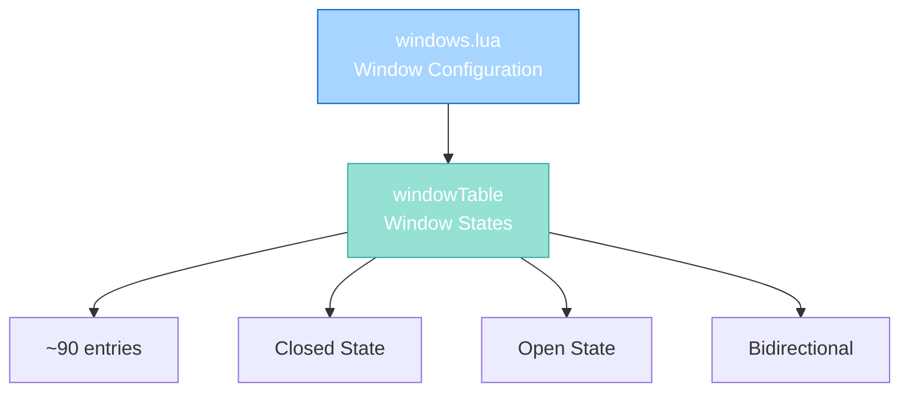

import { Aside, Card } from '@astrojs/starlight/components';

## 🛠️ Informações do Arquivo

Este é o arquivo de **configuração de janelas do servidor** **OpenTibiaBR/Canary**. Define mapeamentos de item IDs para todas as janelas do jogo com suporte a dois estados: fechada e aberta.

<Card title="Caminho Original" icon="document">
  data/libs/tables/windows.lua
</Card>

<Aside type="tip">
  Este arquivo é uma lookup table pura sem funções. Define windowTable com mapeamentos bidirecionais de janelas closedWindow and openWindow. Muitos pares são reversíveis, permitindo que cada ID possa funcionar em ambos os sentidos.
</Aside>

## 📄 Visão Geral do Código

### Resumo Executivo

windows.lua é um módulo de **configuração de janelas** que implementa:

1. **Window States**: Mapeamento de janelas entre closed and open
2. **Bidirectional Lookup**: Muitas entradas são mutuamente reversíveis
3. **Item ID Mapping**: Lookup direto de transições de estado
4. **No Logic**: Pura configuração sem operação lógica

### Estrutura de Dados



---

## 1. Variáveis Globais

### 1.1 windowTable

Tabela com janelas que podem abrir e fechar (2 estados).

#### Estrutura

```lua
windowTable = {
    { closedWindow = 5302, openWindow = 6447 },
    { closedWindow = 5303, openWindow = 6448 },
    -- ... ~90 entradas
}
```

#### Campos

| Campo | Tipo | Descrição |
|-------|------|-----------|
| **closedWindow** | number | Item ID quando janela está fechada |
| **openWindow** | number | Item ID quando janela está aberta |

#### Estados Explicados

| Estado | Campo | Descrição |
|--------|-------|-----------|
| **Closed** | closedWindow | Janela fechada, pronta para abrir |
| **Open** | openWindow | Janela aberta, pronta para fechar |

#### Exemplo de Uso

```
Player clica janela 5302 (closedWindow):
  1. Script vê closedWindow = 5302
  2. Transiciona para openWindow = 6447
  3. Próximo click fecha de novo para 5302
```

---

## 2. Características Especiais

### 2.1 Bidirectional Windows

Muitos pares windowTable são mutuamente reversíveis:

```lua
{ closedWindow = 6437, openWindow = 6435 },
{ closedWindow = 6435, openWindow = 6437 },
```

**Significado**: Item 6437 abre para 6435, and item 6435 abre para 6437.

**Benefício**: Ambas as "faces" da janela (de diferentes perspectivas) funcionam corretamente.

---

### 2.2 Reutilização de IDs

Algumas janelas reutilizam mesmos IDs (padrão reverso):

```lua
{ closedWindow = 5302, openWindow = 6447 },
-- ... outras entradas
{ closedWindow = 6447, openWindow = 5302 },
```

**Padrão**: Se closedWindow A = openWindow B, então openWindow A = closedWindow B.

**Razão**: Janelas podem ser observadas de ambos os lados.

---

### 2.3 Isolamento Total

Algumas janelas não têm pares:

```lua
{ closedWindow = 12033, openWindow = 12034 },
```

Apenas um par (12033 ↔ 12034) sem outras referências.

---

## 3. Padrões de Configuração

### 3.1 ID Sequencing

As janelas frequentemente seguem padrão sequencial:

```
Closed: 5302, Open: 6447
Closed: 5303, Open: 6448
```

IDs abertos são subsequência com offset consistente.

### 3.2 Grouped by Region

Janelas agrupadas por regiões thematically:

```lua
-- Região com IDs 5xxx and 6xxx
{ closedWindow = 5302, openWindow = 6447 },
{ closedWindow = 5303, openWindow = 6448 },

-- Região com IDs 7xxx
{ closedWindow = 7025, openWindow = 7027 },
{ closedWindow = 7026, openWindow = 7028 },

-- Região com IDs 17xxx
{ closedWindow = 17147, openWindow = 17167 },
```

---

### 3.3 Cross-Linked Sets

Alguns grupos de janelas inter-referenciam:

```lua
{ closedWindow = 6437, openWindow = 6435 },
{ closedWindow = 6435, openWindow = 6437 },
{ closedWindow = 6438, openWindow = 6436 },
{ closedWindow = 6436, openWindow = 6438 },
```

Cada item é mapeado bidirecionalmente.

---

## 4. Lookup Strategy

### 4.1 Lookup por Closed ID

```lua
function getOpenWindow(closedId)
    for _, window in ipairs(windowTable) do
        if window.closedWindow == closedId then
            return window.openWindow
        end
    end
    return nil
end
```

### 4.2 Lookup Reverso por Open ID

```lua
function getClosedWindow(openId)
    for _, window in ipairs(windowTable) do
        if window.openWindow == openId then
            return window.closedWindow
        end
    end
    return nil
end
```

### 4.3 Otimização com Hash Map

Para performance melhor, converter em hash map:

```lua
local closedToOpen = {}
local openToClosed = {}

for _, window in ipairs(windowTable) do
    closedToOpen[window.closedWindow] = window.openWindow
    openToClosed[window.openWindow] = window.closedWindow
end

-- Lookup O(1) em vez de O(n)
local openId = closedToOpen[5302]
local closedId = openToClosed[6447]
```

---

## 5. Checkpoint de Aprendizagem

### Conceitos-Chave

| Conceito | Explicação |
|----------|-----------|
| **Window States** | Closed and Open (2 states) |
| **Item Lookup** | Scripts usam IDs para identificar estado window |
| **Bidirectional** | Muitas janelas são mutuamente reversíveis |
| **2-State System** | Simples toggle sem estados intermediários |
| **Configuration Table** | Pura data sem lógica |

### Padrões Observados

1. **Lookup Tables**: Mapeamento direto de estado para item ID
2. **Sequential IDs**: IDs abertos geralmente offset de fechados
3. **Bidirectional**: Open/closed são mutuamente reversíveis
4. **No Logic**: Pura configuração sem operação lógica
5. **Grouped Organization**: Janelas agrupadas por thema/região

### Responsabilidades

1. **Definir mapeamento de janelas**
2. **Especificar 2 estados janela (closed, open)**
3. **Suportar bidirectional lookups**
4. **Manter configuração sincronizada com items.xml**

---

## 6. Integração com Sistema

### 6.1 Uso em Scripts de Ação

```lua
-- Em action script para janelas:
if getOpenWindow(item:getId()) ~= nil then
    -- É uma janela válida
    local newId = getOpenWindow(item:getId())
    item:transform(newId)
end
```

### 6.2 Uso em Creaturescripts

```lua
-- Na entrada de room com janelas:
for _, window in ipairs(windowTable) do
    if window.closedWindow == itemOnTile:getId() then
        -- Janela detectada nesta área
    end
end
```

---

## 7. Comparação com Doors

| Aspecto | Doors | Windows |
|--------|-------|---------|
| **Estados** | 2 ou 3 (closed/open + locked) | 2 (closed/open) |
| **Requer Chave** | Sim (keyed doors) | Não |
| **Requer Storage** | Sim (quest doors) | Não |
| **Tabelas** | 4 (key, keyed, custom, quest) | 1 (window) |
| **Complexidade** | Alta | Simples |
| **Reversibility** | Alguns | Muitos |

---

## 🤖 Informações da Documentação

<Card title="Documentação do Arquivo windows.lua" icon="document">
  **Tipo**: Configuration Table - Window Mappings  
  **Variáveis Globais**: 1 tabela (windowTable)  
  **Total de Janelas**: ~90 janelas configuradas  
  **Estados por Janela**: 2 (closed, open)  
  **Bidirectional**: ~80 percent das entradas  
  **ID Range**: 5302-33645 (distribuído em ranges)  
  **Patterns**: Sequential offset, grouped by region, cross-linked sets  
  **Checkpoint**: 5 conceitos and 5 padrões and 1 responsabilidade primária
</Card>

<Aside type="note">
  **Última Atualização**: Session 18  
  **Status**: Completo - Configuration Reference  
  **Notas**: Muitas entradas são mutuamente reversíveis, permitindo flexibilidade visual  
  **Comparação**: Versão simplificada de KeyDoorTable (sem lock, sem quest storage)
</Aside>
