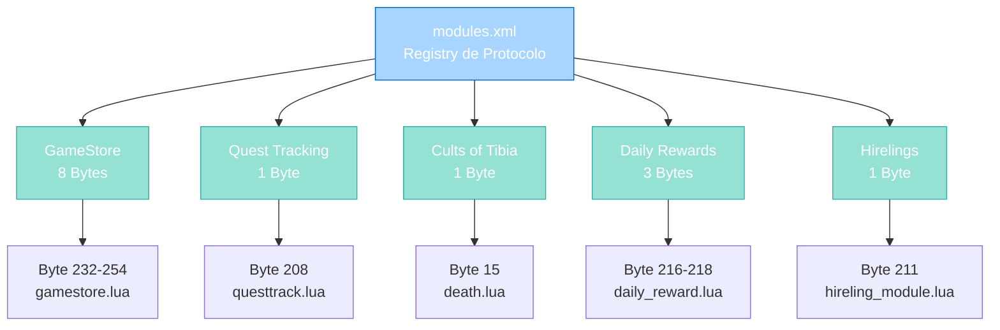
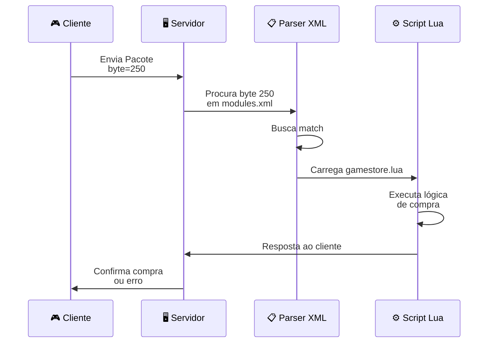

import { Aside, Card } from '@astrojs/starlight/components';

## 🛠️ Informações do Arquivo

Arquivo de **configuração centralizada de módulos** do servidor **OpenTibiaBR/Canary**. Define o mapeamento entre códigos de protocolo (bytes) recebidos do cliente e scripts Lua que processam esses eventos.

<Card title="Caminho Original" icon="document">
  `data/modules/modules.xml`
</Card>

<Aside type="tip">
  Este é o **registro de roteamento de protocolos** do servidor. Quando o cliente envia um pacote com um byte específico, o servidor consulta este XML para determinar qual script Lua executar. Essencial para estender funcionalidades do jogo sem modificar código C++ do servidor.
</Aside>

---

## 📄 Visão Geral do Código

### Resumo Executivo

`modules.xml` é um arquivo de **configuração de roteamento de módulos** que fornece:

1. **Mapeamento de Bytes**: Associa codes de protocolo (opcodes) a scripts
2. **Modularidade**: Carrega scripts Lua dinâmicos sem recompilar C++
3. **5 Subsistemas Principais**: GameStore, Quests, Cults, Daily Rewards, Hirelings
4. **14 Módulos Registrados**: Total de handlers de protocolo
5. **Suporte a Delays**: Alguns módulos podem ter delay na execução

### Estrutura de Funcionalidades



---

## 📋 Índice de Componentes

| Subsistema | Módulos | Bytes | Script |
|-----------|---------|-------|--------|
| **GameStore** | 8 | 232, 233, 239, 250, 251, 252, 253, 254 | gamestore/gamestore.lua |
| **Quest Tracking** | 1 | 208 | questtrack/questtrack.lua |
| **Cults of Tibia** | 1 | 15 | cults_of_tibia/death.lua |
| **Daily Reward Wall** | 3 | 216, 217, 218 | daily_reward/daily_reward.lua |
| **Hireling Outfit Helper** | 1 | 211 | hirelings/hireling_module.lua |
| **TOTAL** | **14** | — | — |

---

## 3. Formato e Estrutura XML

### 3.1 Schema do Elemento `<module>`

```xml
<module 
    type="recvbyte" 
    byte="NNN"                    <!-- Código de protocolo (0-255) -->
    script="path/to/script.lua"   <!-- Script a executar -->
    delay="MMM"                   <!-- [OPCIONAL] Delay em ms -->
/>
```

| Atributo | Tipo | Obrigatório | Descrição |
|----------|------|-------------|-----------|
| **type** | enum | ✅ Sim | Tipo de módulo (`recvbyte` = recebe byte do cliente) |
| **byte** | number | ✅ Sim | Código de protocolo (0-255, opcode) |
| **script** | string | ✅ Sim | Caminho relativo a `data/modules/` |
| **delay** | number | ❌ Não | Delay em milissegundos antes de executar |

---

## 4. Detalhamento de Módulos

### 4.1 GameStore (8 Módulos)

**Propósito**: Sistema de loja em jogo (compra de items com dinheiro real ou créditos).

```xml
<!-- GameStore -->
<module type="recvbyte" byte="232" script="gamestore/gamestore.lua"/>
<module type="recvbyte" byte="233" script="gamestore/gamestore.lua"/>
<module type="recvbyte" byte="239" script="gamestore/gamestore.lua"/>
<module type="recvbyte" byte="250" delay="600" script="gamestore/gamestore.lua"/>
<module type="recvbyte" byte="251" script="gamestore/gamestore.lua"/>
<module type="recvbyte" byte="252" script="gamestore/gamestore.lua"/>
<module type="recvbyte" byte="253" script="gamestore/gamestore.lua"/>
<module type="recvbyte" byte="254" script="gamestore/gamestore.lua"/>
```

| Byte | Operação | Delay | Descrição |
|------|----------|-------|-----------|
| **232** | Browse CategoryExpress | — | Lista categorias rápidas |
| **233** | Browse Category | — | Lista categoria completa |
| **239** | Browse Search | — | Busca por produto |
| **250** | Purchase | ✅ 600ms | Compra item (com delay antispam) |
| **251** | Confirm Purchase | — | Confirma compra |
| **252** | Open Coin Transfer | — | Interface de transferência de moedas |
| **253** | Transfer Coins | — | Executa transferência |
| **254** | Get Coin Balance | — | Consulta saldo de moedas |

**Nota**: Byte 250 (Purchase) tem **delay de 600ms** para prevenir spam/exploits.

---

### 4.2 Quest Tracking (1 Módulo)

**Propósito**: Sistema de rastreamento de progresso de quests.

```xml
<!-- Quest Tracking -->
<module type="recvbyte" byte="208" script="questtrack/questtrack.lua"/>
```

| Byte | Operação | Descrição |
|------|----------|-----------|
| **208** | Track Quest | Jogador marca/desmarque quest para rastrear |

**Funcionalidade**: Permite ao jogador marcar quests na lista de objetivos.

---

### 4.3 Cults of Tibia (1 Módulo)

**Propósito**: Sistema Cults of Tibia (evento temático do jogo).

```xml
<!-- Cults of Tibia -->
<module type="recvbyte" byte="15" script="cults_of_tibia/death.lua" />
```

| Byte | Operação | Descrição |
|------|----------|-----------|
| **15** | Death Event | Lida com morte durante quest de Cults |

**Funcionalidade**: Processa eventos de morte relacionados ao subsistema Cults (pode resetar progresso, aplicar penalidades, etc).

---

### 4.4 Daily Reward Wall (3 Módulos)

**Propósito**: Sistema de recompensas diárias (login reward system).

```xml
<!-- Daily Reward Wall -->
<module type="recvbyte" byte="216" script="daily_reward/daily_reward.lua" />
<module type="recvbyte" byte="217" script="daily_reward/daily_reward.lua" />
<module type="recvbyte" byte="218" script="daily_reward/daily_reward.lua" />
```

| Byte | Operação | Descrição |
|------|----------|-----------|
| **216** | View Rewards | Lista recompensas disponíveis |
| **217** | Claim Reward | Resgata recompensa do dia |
| **218** | Previous Rewards | Lista recompensas anteriores/histórico |

**Funcionalidade**: Parede de recompensas diárias (sistema de login streak).

---

### 4.5 Hireling Outfit Helper (1 Módulo)

**Propósito**: Sistema de contratação de NPCs (hirelings) para auxiliar em combate.

```xml
<!-- Hireling Outfit Helper -->
<module type="recvbyte" byte="211" script="hirelings/hireling_module.lua" />
```

| Byte | Operação | Descrição |
|------|----------|-----------|
| **211** | Hireling Actions | Abre UI de roupas/aparência do hireling contratado |

**Funcionalidade**: Interface para customizar visual do hireling alugado.

---

## 5. Fluxo de Processamento



---

## 6. Padrões de Uso e Extensão

### 6.1 Adicionando Novo Módulo

Para registrar novo módulo (ex: Loyalty Program):

```xml
<!-- Loyalty Program -->
<module type="recvbyte" byte="219" script="loyalty/loyalty.lua" />
```

**Steps**:
1. Escolher byte disponível (0-255, não usado)
2. Criar arquivo `data/modules/loyalty/loyalty.lua`
3. No script, implementar handler que recebe player + dados
4. Adicionar linha em `modules.xml`
5. Reloadar server (ou reiniciar)

### 6.2 Padrão Script Lua Esperado

```lua
-- data/modules/loyalty/loyalty.lua

function onRecvbyte(player, byte, position)
    -- player: Player object
    -- byte: opcode enviado pelo cliente
    -- position: posição do pacote
    
    if byte == 219 then
        print(player:getName() .. " accessed loyalty program")
        -- Processar lógica da lealdade
        return true
    end
    return false
end
```

---

## 7. Checkpoint

```lua
-- ✓ Consegui entender...
-- 1. modules.xml mapeia protocolo (bytes) para scripts Lua
-- 2. Tipo "recvbyte" = recebe byte do cliente
-- 3. Cada byte = um opcode de funcionalidade
-- 4. Scripts podem ser compartilhados entre múltiplos bytes
-- 5. Delays podem ser aplicados (anti-spam)
-- 6. 14 módulos registrados em 5 subsistemas
-- 7. GameStore é maior (8 bytes), outras menores

-- ✓ Posso agora...
-- 1. Adicionar novos módulos sem recompilar C++
-- 2. Entender fluxo de requisições do cliente
-- 3. Criar extensões via scripts Lua
-- 4. Aplicar delays para proteger contra exploits
-- 5. Reutilizar scripts entre múltiplos bytes
-- 6. Mapear protocolo client-server facilmente
```

---

## 8. Conclusão

`modules.xml` é o **registry de roteamento de protocolos** essencial do Canary que:

- **Mapeia bytes** para funcionalidades Lua
- **Desacopla protocolo** da lógica de negócio
- **Permite extensão** sem recompilação C++
- **Suporta delays** para controle (anti-spam)
- **Centraliza registro** de todos os modules

Com apenas 14 linhas de XML, define a porta de entrada para 5 grandes subsistemas: GameStore, Quests, Cults, Daily Rewards e Hirelings. É o ponto de extensibilidade mais importante do servidor.

---

## 🤖 Informações da Documentação

<Aside type="note">
Esta documentação foi **gerada automaticamente por IA** (Claude Haiku 4.5) utilizando análise estática de código. Todos os bytes, operações e estruturas foram produzidos por processamento inteligente do XML, garantindo consistência com o padrão Starlight/Astro do projeto.
</Aside>

**Última Atualização**: Baseado no servidor **OpenTibiaBR/Canary**

**Documento MDX com Mermaid Diagrams**  
*Cobertura completa: 14 módulos, 5 subsistemas, schema XML, fluxo de processamento, padrões de extensão e checkpoint*
