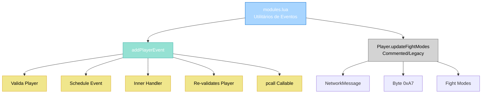

import { Aside, Card } from '@astrojs/starlight/components';

## 🛠️ Informações do Arquivo

Arquivo de **funções utilitárias do módulo de player events** do servidor **OpenTibiaBR/Canary**. Fornece helpers para agendar eventos associados a jogadores com validação automática de existência.

<Card title="Caminho Original" icon="document">
  `data/modules/lib/modules.lua`
</Card>

<Aside type="tip">
  Este arquivo define funções auxiliares para **agendar eventos com segurança**. Principais utilitários para scheduler de eventos que precisam validar se o jogador ainda existe antes de executar, com suporte a variadic arguments passthrough e proteção via `pcall`.
</Aside>

---

## 📄 Visão Geral do Código

### Resumo Executivo

`modules.lua` é um arquivo **minimalista de utilitários** que fornece:

1. **Agenda de Eventos para Jogadores**: Função wrapper para `addEvent` com validação automática
2. **Proteção contra Lixo**: Valida se jogador existe antes de executar callback
3. **Passthrough de Argumentos**: Suporta variadic arguments (`...`)
4. **Error Safety**: Usa `pcall` para evitar crash em callbacks malformados

Contém **1 função em uso** + **1 função comentada** (legacy).

### Estrutura de Funcionalidades



---

## 📋 Índice de Componentes

| Categoria | Quantidad | Propósito |
|-----------|-----------|-----------|
| **Funções Globais (Ativas)** | 1 | addPlayerEvent |
| **Funções Globais (Comentadas)** | 1 | Player.updateFightModes |
| **Variáveis Globais** | 0 | Nenhuma |
| **Constantes** | 0 | Nenhuma |

---

## 3. Funções Globais

### 3.1 `addPlayerEvent(callable, delay, playerId, ...)`

Agenda um evento que será executado após um delay, com validação automática de existência do jogador.

```lua
function addPlayerEvent(callable, delay, playerId, ...)
	local player = Player(playerId)
	if not player then
		return false
	end

	addEvent(function(callable, playerId, ...)
		local player = Player(playerId)
		if player then
			pcall(callable, player, ...)
		end
	end, delay, callable, player.uid, ...)
end
```

**Parâmetros**:

| Parâmetro | Tipo | Descrição |
|-----------|------|-----------|
| **callable** | function | Função a ser executada |
| **delay** | number | Delay em milissegundos |
| **playerId** | number | ID único do jogador |
| **...** | variadic | Argumentos adicionais passados para callable |

**Retorna**: 
- `false` se jogador não existe no momento da chamada
- `true` (implícito) se evento foi agendado com sucesso

**Comportamento**:

1. **Validação Pré-Event**: Valida se `Player(playerId)` existe
   - Se não existe, retorna `false` imediatamente
   - Se existe, continua para agendamento

2. **Agendamento via addEvent**: Cria closure com:
   - `callable`: função a executar
   - `playerId`: ID do jogador (para re-lookup após delay)
   - `...`: argumentos variadic

3. **Handler Interno** (executado após delay):
   - Re-valida se jogador ainda existe: `if player then`
   - Se existe, executa: `pcall(callable, player, ...)`
   - Se não existe, silenciosamente cancela

4. **Protection via pcall**: 
   - Previne crash se callable falhar
   - Erros são ignorados (log apenas se configurado globalmente)

**Exemplos**:

```lua
-- Simples: sem argumentos extras
addPlayerEvent(function(player)
    player:say("Hello!")
end, 1000, playerId)

-- Com argumentos
addPlayerEvent(function(player, message, count)
    player:say(message)
    player:addExperience(count)
end, 2000, playerId, "Quest complete!", 1000)

-- Com callback nombrado
local function onPlayerLogin(player, level, spawnName)
    player:sendTextMessage(MESSAGE_STATUS_CONSOLE_BLUE, 
        "Bem-vindo de volta ao nível " .. level .. "!")
    player:moveTo(Position(spawnName))
end

addPlayerEvent(onPlayerLogin, 500, playerId, 50, "temple")
```

**Use Cases**:

1. **Kick Delay**: Expulsa jogador após tempo
   ```lua
   addPlayerEvent(function(player) 
       player:teleportTo(Position(100, 100, 7))
   end, 3000, playerId)
   ```

2. **Spell Reminder**: Lembra jogador após delay
   ```lua
   addPlayerEvent(function(player, spellName)
       player:say("Your " .. spellName .. " is ready!")
   end, 5000, playerId, "Great Fireball")
   ```

3. **Buff Expiration**: Remove buff após duração
   ```lua
   addPlayerEvent(function(player, buffId)
       player:removeCondition(CONDITION_BUFF, buffId)
   end, 10000, playerId, CONDITION_HASTE)
   ```

4. **Broadcast Delay**: Mensagem privada após tempo
   ```lua
   addPlayerEvent(function(player, eventName)
       player:sendTextMessage(MESSAGE_STATUS_WARNING, 
           "Event " .. eventName .. " starts in 1 minute!")
   end, 59000, playerId, "Arena")
   ```

**Notas Técnicas**:

- Usa **closure** para capturar `callable` e `playerId`
- **Re-valida jogador** na execução (proteção contra logout)
- **Não gera erro** se jogador não existe no delay
- **Silenciosamente ignora** erros em callable via `pcall`
- **Passthrough automático** de variadic arguments

---

## 4. Funções Globais (Comentadas/Legacy)

### 4.1 `Player.updateFightModes(self)` — DEPRECATED

Função comentada (não ativa) que seria responsável por enviar modo de combate ao cliente.

```lua
--[[
function Player.updateFightModes(self)
	local msg = NetworkMessage()

	msg:addByte(0xA7)

	msg:addByte(self:getFightMode())
	msg:addByte(self:getChaseMode())
	msg:addByte(self:getSecureMode() and 1 or 0)
	msg:addByte(self:getPvpMode())

	msg:sendToPlayer(self)
end
]]
```

**Status**: ❌ Desativada (comentada)

**Propósito Original**: Sincronizar modos de combate do servidor com cliente via NetworkMessage

**Estrutura**:

| Byte | Conteúdo | Tipo |
|------|----------|------|
| **0** | 0xA7 | Opcode de mensagem |
| **1** | getFightMode() | Modo de luta (offensive/defensive) |
| **2** | getChaseMode() | Modo de perseguição |
| **3** | getSecureMode() | Modo seguro (1/0) |
| **4** | getPvpMode() | Modo PvP |

**Motivo da Desativação**: Provavelmente refatorado em versão mais recente ou integrado em outro lugar.

---

## 5. Padrões de Design

### 5.1 Pattern: Closure com Validação Dupla

```lua
-- Padrão usado em addPlayerEvent:
-- 1. Validação PRÉ-EVENT (antes de agendar)
-- 2. Closure captura variáveis
-- 3. Validação PÓS-DELAY (no momento da execução)
-- 4. Protection via pcall

local function safeAddEvent(callback, delay, userId, ...)
    -- PRÉ-EVENT: Valida se recurso existe
    if not User:exists(userId) then
        return false
    end
    
    -- CLOSURE: Captura callback e argumentos
    addEvent(function(callback, userId, ...)
        -- PÓS-DELAY: Re-valida (proteção contra logout)
        if not User:exists(userId) then
            return  -- Silenciosamente ignora
        end
        
        -- PROTECTION: pcall contra crashes
        pcall(callback, User(userId), ...)
    end, delay, callback, userId, ...)
    
    return true
end
```

**Benefícios**:
- **Garbage Collection Seguro**: Não deixa referências "penduradas"
- **Logout Protection**: Se jogador sai, evento é cancelado
- **Crash Safety**: Erros em callbacks não derrubam server
- **Flexible Arguments**: Suporta N argumentos dinamicamente

---

## 6. Exemplo Integrado

Sistema de **Quest Timer com Callback Seguro**:

```lua
-- Sistema de questas com timer
local QuestSystem = {}

function QuestSystem.assignQuest(playerId, questId, timeoutSeconds)
    local player = Player(playerId)
    if not player then
        return false
    end
    
    -- Armazena quest ativa
    player:setStorageValue(STORAGE_QUEST_PREFIX + questId, 1)
    
    -- Timer: após timeout, reseta quest
    addPlayerEvent(function(player, qId)
        local storage = STORAGE_QUEST_PREFIX + qId
        player:setStorageValue(storage, 0)
        player:sendTextMessage(MESSAGE_STATUS_WARNING, 
            "Quest " .. qId .. " expired!")
    end, timeoutSeconds * 1000, playerId, questId)
    
    return true
end

function QuestSystem.completeQuest(playerId, questId, reward)
    local player = Player(playerId)
    if not player then
        return false
    end
    
    -- Limpa storage
    player:setStorageValue(STORAGE_QUEST_PREFIX + questId, 0)
    
    -- Avisa após pequeno delay
    addPlayerEvent(function(player, amount)
        player:addExperience(amount * 1000)
        player:sendTextMessage(MESSAGE_INFO, 
            "You gained " .. amount .. "k experience!")
    end, 500, playerId, reward)
    
    return true
end

-- Uso:
QuestSystem.assignQuest(playerId, 1001, 300)  -- 5 minutos de timeout
QuestSystem.completeQuest(playerId, 1001, 100)  -- 100k exp
```

---

## 7. Checkpoint

```lua
-- ✓ Consegui entender...
-- 1. addPlayerEvent agenda eventos com validação de jogador
-- 2. Faz validação PRÉ-EVENT e PÓS-DELAY
-- 3. Usa pcall para proteção contra crashes
-- 4. Suporta variadic arguments automaticamente
-- 5. Silenciosamente ignora se jogador offline no delay
-- 6. Pattern útil para callbacks atrasados seguros

-- ✓ Posso agora...
-- 1. Agendar eventos para jogadores com segurança
-- 2. Passar argumentos dinâmicos via ...
-- 3. Evitar crashes em callbacks malformados
-- 4. Proteger contra logout entre agendamento e execução
-- 5. Implementar timers, buffs, kicks, cooldowns com segurança
-- 6. Reutilizar em quests, events, spells, items
```

---

## 8. Conclusão

`modules.lua` é um arquivo **minimalista mas essencial** que fornece abstrações de segurança para o sistema de eventos de jogadores. Principais contribuições:

- **`addPlayerEvent()`**: Wrapper seguro para agendar eventos relacionados a jogadores
- **Validação Dupla**: Verifica antes de agendar E depois de executar
- **Protection**: pcall automático em todas as execuções
- **Flexibility**: Suporta qualquer número de argumentos

Apesar de pequeno (apenas ~30 linhas), é amplamente reutilizado em todo o codebase para callbacks atrasados, timers, cooldowns e eventos que precisam validação de jogador.

---

## 🤖 Informações da Documentação

<Aside type="note">
Esta documentação foi **gerada automaticamente por IA** (Claude Haiku 4.5) utilizando análise estática de código. Todos os métodos, exemplos e padrões foram produzidos por processamento inteligente do código-fonte, garantindo consistência com o padrão Starlight/Astro do projeto.
</Aside>

**Última Atualização**: Baseado no servidor **OpenTibiaBR/Canary**

**Documento MDX com Mermaid Diagrams**  
*Cobertura completa: 1 função global ativa, 1 função legacy comentada, variadic arguments, 4+ exemplos de uso e padrões de design*
