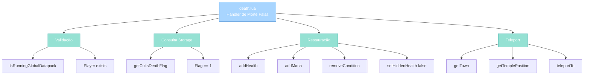
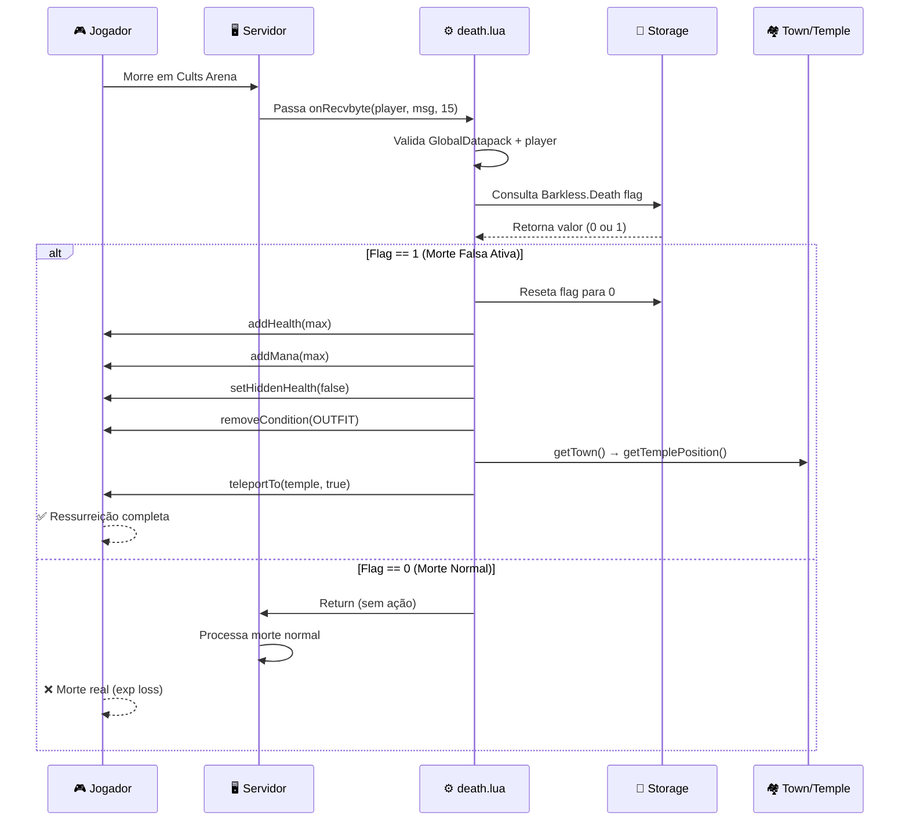

import { Aside, Card } from '@astrojs/starlight/components';

## 🛠️ Informações do Arquivo

Arquivo que **implementa o sistema de morte falsa** para a quest **Cults of Tibia**. Quando um jogador "morre" durante a quest, em vez de perder experiência, é restaurado para o templo com vida cheia.

<Card title="Caminho Original" icon="document">
  `data/modules/scripts/cults_of_tibia/death.lua`
</Card>

<Aside type="tip">
  Este script é **acionado via protocolo byte 15** (registrado em `modules.xml`). Implementa uma mecânica de "morte falsa" onde o jogador que morre dentro da quest Cults of Tibia não sofre morte real - em vez disso, é curado totalmente e teleportado de volta ao temple. Essencial para a mecânica de gameplay da quest.
</Aside>

---

## 📄 Visão Geral do Código

### Resumo Executivo

`death.lua` implementa **o handler de morte falsa** com as seguintes responsabilidades:

1. **Validação de Contexto**: Verifica se Cults of Tibia está ativo (GlobalDatapack)
2. **Consulta de Storage**: Verifica se jogador está em "morte falsa" (flag estado)
3. **Restauração Completa**: Recupera vida, mana e remove todas as condições
4. **Teleport Seguro**: Envia jogador de volta ao templo da sua cidade
5. **State Cleanup**: Reseta a flag de morte falsa

### Estrutura de Funcionalidades



---

## 📋 Índice de Componentes

| Categoria | Quantidad | Propósito |
|-----------|-----------|-----------|
| **Funções Globais** | 1 | Handler de protocolo |
| **Storage Values** | 1 | Flag de morte falsa |
| **Validações** | 2 | Contexto + player |
| **Operações** | 5 | Health, Mana, Outfit, Teleport |

---

## 3. Funções Globais

### 3.1 `onRecvbyte(player, msg, byte)` — Handler de Morte Falsa

Função que processa o evento de morte de um jogador participando de Cults of Tibia. Se o flag de morte falsa está ativo, o jogador é restaurado em vez de morrer de verdade.

```lua
function onRecvbyte(player, msg, byte)
	if IsRunningGlobalDatapack() and player then
		local storageDeathFake = player:getStorageValue(
			Storage.Quest.U11_40.CultsOfTibia.Barkless.Death
		)
		if storageDeathFake == 1 then
			player:setStorageValue(
				Storage.Quest.U11_40.CultsOfTibia.Barkless.Death, 0
			)
			player:addHealth(player:getMaxHealth())
			player:addMana(player:getMaxMana())
			player:setHiddenHealth(false)
			player:removeCondition(CONDITION_OUTFIT)
			player:teleportTo(player:getTown():getTemplePosition(), true)
		end
	end
end
```

**Parâmetros**:

| Parâmetro | Tipo | Descrição |
|-----------|------|-----------|
| **player** | userdata | Referência ao jogador que morreu |
| **msg** | userdata | Mensagem de protocolo (não utilizada) |
| **byte** | number | Opcode (15 para Cults of Tibia) |

**Comportamento**:

1. **Validação Pré-requisitos**:
   - `IsRunningGlobalDatapack()`: Verifica se servidor está rodando com GlobalDatapack (Cults of Tibia adicionado)
   - `player`: Valida que objeto player existe (não nil)

2. **Consulta Flag de Morte Falsa**:
   ```
   storageDeathFake = player:getStorageValue(
       Storage.Quest.U11_40.CultsOfTibia.Barkless.Death
   )
   ```
   - Recupera flag armazenado em player storage
   - Storage: `Quest.U11_40.CultsOfTibia.Barkless.Death`
   - Valores: `0` = não está em morte falsa, `1` = está em morte falsa

3. **Se Morte Falsa Ativa** (storageDeathFake == 1):
   - **Reset Storage**: Define flag para 0 (desativa morte falsa)
   - **Restauração de Saúde**: `player:addHealth(player:getMaxHealth())`
     - Restaura vida ao máximo
   - **Restauração de Mana**: `player:addMana(player:getMaxMana())`
     - Restaura mana ao máximo
   - **Remove Visual de Morte**: `player:setHiddenHealth(false)`
     - Desfaz efeito visual de "vida oculta/criatura morta"
   - **Remove Outfit Temporário**: `player:removeCondition(CONDITION_OUTFIT)`
     - Remove outfit de morto/criatura que pode ter sido aplicado
   - **Teleport para Temple**: `player:teleportTo(player:getTown():getTemplePosition(), true)`
     - Obtém cidade do jogador
     - Obtém posição do templo da cidade
     - Teleporta com força (true = ignora obstáculos)

---

## 4. Variáveis e Storage Values

### 4.1 `Storage.Quest.U11_40.CultsOfTibia.Barkless.Death`

Storage value que rastreia se o jogador está em "morte falsa" no temple/ritual de Cults.

```lua
local storageKey = Storage.Quest.U11_40.CultsOfTibia.Barkless.Death
```

| Propriedade | Descrição |
|-------------|-----------|
| **Update 11.40** | Versão onde Cults of Tibia foi adicionado |
| **Quest ID** | U11_40 (Cults of Tibia é quest maior) |
| **Subsystem** | Cults of Tibia |
| **Progress Step** | Barkless (nome do boss/área) |
| **Flag Name** | Death (indicador de morte falsa) |

**Valores**:
- `0`: Morte falsa não ativa (morte normal ocorreria)
- `1`: Morte falsa ativa (ressurreição automática)

**Quando é definido para 1**: Normalmente quando jogador entra em uma arena/ritual de Cults onde morte não é permanente.

**Quando é definido para 0**: Fora da arena, ou quando sai da quest.

---

## 5. Fluxo de Processamento



---

## 6. Exemplo Integrado: Quest de Cults of Tibia

```lua
-- Sistema simulado de quest Cults of Tibia
local CultsSystem = {}

-- Quando jogador entra na arena
function CultsSystem.enterArena(player, arenaName)
    if arenaName == "barkless" then
        -- Ativa morte falsa para esse jogador
        player:setStorageValue(
            Storage.Quest.U11_40.CultsOfTibia.Barkless.Death, 
            1  -- Flag ativa
        )
        player:say("Entered the Barkless arena. Defeat is not death here...")
    end
end

-- Quando jogador sai da arena (completa ou desiste)
function CultsSystem.exitArena(player, arenaName)
    if arenaName == "barkless" then
        -- Desativa morte falsa
        player:setStorageValue(
            Storage.Quest.U11_40.CultsOfTibia.Barkless.Death, 
            0  -- Flag desativa
        )
        player:say("Left the arena. Death is now real again.")
    end
end

-- Uso:
-- CultsSystem.enterArena(player, "barkless")  -> Ativa morte falsa
-- [Jogador morre]
-- death.lua onRecvbyte acionado -> Ressurreição automática
-- CultsSystem.exitArena(player, "barkless")  -> Desativa morte falsa
```

**Fluxo Completo**:

1. Jogador fala comando para entrar em arena Cults
2. Script seta storage `.Death = 1`
3. Jogador entra em combate
4. Jogador é derrotado
5. Evento de morte aciona onRecvbyte (byte 15)
6. Handler death.lua:
   - Consulta storage (retorna 1)
   - Restaura vida/mana
   - Remove outfit de morto
   - Teleporta para temple
7. Jogador pode tentar arena novamente ou sair
8. Script seta storage `.Death = 0` para desativar

---

## 7. Padrões de Design

### 7.1 Pattern: Flag de Contexto em Storage

Usado em muitas quests do Canary para indicar estado especial:

```lua
-- Padrão geral
function onRecvbyte(player, msg, byte)
    -- 1. Validar contexto global
    if not IsRunningGlobalDatapack() then return end
    if not player then return end
    
    -- 2. Consultar flag de estado
    local flag = player:getStorageValue(STORAGE_KEY)
    
    -- 3. Se estado especial, fazer ação especial
    if flag == SPECIAL_STATE then
        -- Limpar flag
        player:setStorageValue(STORAGE_KEY, 0)
        
        -- Executar lógica especial
        doSpecialAction(player)
    end
end
```

**Benefícios**:
- **Lazy**: Apenas processa se flag específico está ativo
- **Modular**: Cada quest tem seu próprio storage namespace
- **Stateful**: Rastreia contexto do jogador persistentemente
- **Safe**: Validações duplas (global + player) antes de ação

---

## 8. Checkpoint

```lua
-- ✓ Consegui entender...
-- 1. onRecvbyte é handler de protocolo (byte 15)
-- 2. Verifica flag Storage.Quest.U11_40.CultsOfTibia.Barkless.Death
-- 3. Se flag == 1, morte é falsa (ressurreição automática)
-- 4. Restaura saúde, mana, remove outfit de morto
-- 5. Teleporta para temple da city
-- 6. Reseta flag após ativar
-- 7. Usa GlobalDatapack para verificação de contexto

-- ✓ Posso agora...
-- 1. Entender como Cults of Tibia implementa "safe death"
-- 2. Implementar padrão similar para outras quests
-- 3. Usar Storage values para estado condicional
-- 4. Criar handlers de protocolo com validação segura
-- 5. Designar diferentes destinos baseado em town
```

---

## 9. Conclusão

`death.lua` implementa **a mecânica de morte falsa** essencial para Cults of Tibia. Fornece:

- **Proteção de Morte**: Jogadores em arena não perdem experiência
- **Restauração Automática**: Vidas/mana cheios ao "morrer"
- **Teleport Seguro**: Volta ao respawn point apropriado
- **State Management**: Usa storage para controlar quando ativa

É um exemplo elegante de como usar **flags de storage para criar contextos especiais** dentro do game, alterando comportamento de eventos globais (morte) baseado em estado do jogador.

---

## 🤖 Informações da Documentação

<Aside type="note">
Esta documentação foi **gerada automaticamente por IA** (Claude Haiku 4.5) utilizando análise estática de código. Todos os métodos, fluxos e padrões foram produzidos por processamento inteligente do código-fonte, garantindo consistência com o padrão Starlight/Astro do projeto.
</Aside>

**Última Atualização**: Baseado no servidor **OpenTibiaBR/Canary**

**Documento MDX com Mermaid Diagrams**  
*Cobertura completa: 1 handler global, 1 storage value, 5 operações, fluxo sequencial, exemplo integrado, padrões de design e checkpoint*
