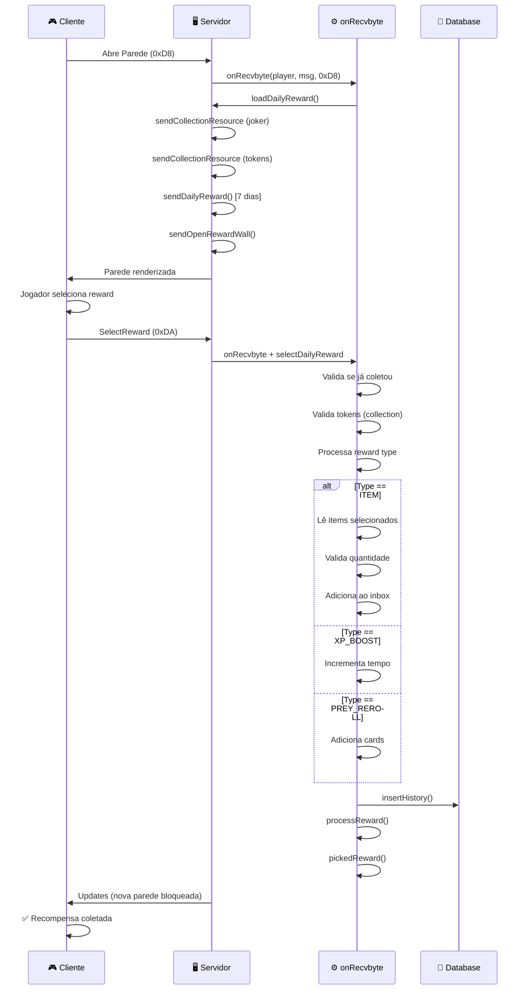

import { Aside, Card } from '@astrojs/starlight/components';

## 🛠️ Informações do Arquivo

Arquivo que implementa o **sistema de recompensas diárias** do servidor **OpenTibiaBR/Canary**. Sistema completo com rastreamento de streak, tokens booster, múltiplos tipos de recompensa e histórico persistente.

<Card title="Caminho Original" icon="document">
  `data/modules/scripts/daily_reward/daily_reward.lua`
</Card>

<Aside type="tip">
  Este sistema é **integrado ao protocolo do cliente** (bytes 216-218 em modules.xml). Implementa uma parede de recompensas com **7 dias de streak**, **joker tokens** para proteger streaks contra logging out, **collection tokens** para premium, e **4 tipos de recompensas** (items, XP boost, prey reroll, storage). Inclui histórico persistente em banco de dados e suporte a vocalções específicas para items.
</Aside>

---

## 📄 Visão Geral do Código

### Resumo Executivo

`daily_reward.lua` é um sistema completo de **recompensas diárias** com:

1. **Streak Tracking**: 7 dias de recompensas sequenciais (reseta ao 7º dia)
2. **Joker Tokens**: Previne perda de streak quando jogador loga depois de 24h
3. **Collection Tokens**: Moeda premium que permite pular um dia
4. **4 Tipos de Recompensa**: Items (vocação-específicos), XP Boost, Prey Reroll, Storage
5. **Histórico em BD**: Persiste todas as recompensas coletadas
6. **Premium vs Free**: Diferentes quantidades por tipo de conta
7. **Protocolo Client-Server**: NetworkMessages com sincronização de estado

### Estrutura de Funcionalidades

```mermaid
graph TD
    A["DailyRewardSystem<br/>622 linhas"] --> B["Protocolo"]
    A --> C["Stor age + Config"]
    A --> D["Core Functions"]
    A --> E["Player Methods"]
    
    B --> B1["ServerPackets<br/>5 opcodes"]
    B --> B2["ClientPackets<br/>5 opcodes"]
    B --> B3["onRecvbyte<br/>Main handler"]
    
    C --> C1["7 Storages"]
    C --> C2["Bonuses/Day"]
    C --> C3["7 Rewards"]
    C --> C4["Vocação Items"]
    
    D --> D1["insertHistory"]
    D --> D2["retrieveHistory"]
    D --> D3["loadDailyReward"]
    D --> D4["pickedReward"]
    D --> D5["isRewardTaken"]
    D --> D6["init"]
    D --> D7["processReward"]
    
    E --> E1["sendOpenRewardWall"]
    E --> E2["selectDailyReward"]
    E --> E3["sendDailyReward"]
    E --> E4["sendRewardHistory"]
    E --> E5["readDailyReward"]
    E --> E6["5+ métodos"]
    
    style A fill:#a8d5ff,stroke:#0066cc,color:#fff
    style B fill:#95e1d3,stroke:#38ada9,color:#fff
    style C fill:#95e1d3,stroke:#38ada9,color:#fff
    style D fill:#95e1d3,stroke:#38ada9,color:#fff
    style E fill:#95e1d3,stroke:#38ada9,color:#fff
```



---

## 📋 Índice de Componentes

| Categoria | Quantidad | Propósito |
|-----------|-----------|-----------|
| **Constantes (Pacotes)** | 10 | Server/Client opcodes |
| **Constantes (Config)** | 20+ | Tipos, bônus, status |
| **Tabelas Principais** | 2 | DailyRewardSystem, DailyReward |
| **Funções Globais** | 1 | onRecvbyte |
| **Funções DailyReward** | 7 | Core logic |
| **Métodos Player** | 8+ | NetworkMessage + logic |
| **Storages Rastreados** | 7 | Estado persistente |
| **Linhas Totais** | 622 | — |

---

## 3. Constantes e Configuração

### 3.1 Pacotes de Protocolo

```lua
local ServerPackets = {
	ShowDialog = 0xED,               -- Diálogo para client
	DailyRewardCollectionState = 0xDE,
	OpenRewardWall = 0xE2,           -- Abre parede de recompensas
	CloseRewardWall = 0xE3,
	DailyRewardBasic = 0xE4,         -- Info básica dos 7 dias
	DailyRewardHistory = 0xE5,       -- Histórico de recompensas
}

local ClientPackets = {
	OpenRewardWall = 0xD8,           -- Cliente: abre parede
	OpenRewardHistory = 0xD9,        -- Cliente: abre histórico
	SelectReward = 0xDA,             -- Cliente: seleciona recompensa
	CollectionResource = 0x14,       -- Collection tokens
	JokerResource = 0x15,            -- Joker tokens
}
```

---

### 3.2 Tipos de Recompensa

```lua
-- Reward types (servidor)
local DAILY_REWARD_TYPE_ITEM = 1              -- Item reward
local DAILY_REWARD_TYPE_STORAGE = 2           -- Storage value reward
local DAILY_REWARD_TYPE_PREY_REROLL = 3       -- Prey card reroll
local DAILY_REWARD_TYPE_XP_BOOST = 4          -- XP boost minutes

-- System types (cliente - tipo de UI)
local DAILY_REWARD_SYSTEM_TYPE_ONE = 1        -- Seleção de items
local DAILY_REWARD_SYSTEM_TYPE_TWO = 2        -- Botão único (other rewards)
```

---

### 3.3 Bônus por Dia

```lua
DailyReward.strikeBonuses = {
	[1] = { text = "No bonus for first day" },
	[2] = { text = "Allow Hit Point Regeneration" },       -- Regen HP
	[3] = { text = "Allow Mana Regeneration" },            -- Regen Mana
	[4] = { text = "Stamina Regeneration" },               -- Regen Stamina
	[5] = { text = "Double Hit Point Regeneration" },      -- 2x Regen HP
	[6] = { text = "Double Mana Regeneration" },           -- 2x Regen Mana
	[7] = { text = "Soul Points Regeneration" },           -- Regen Soul
}
```

| Dia | Bônus | Descrição |
|-----|-------|-----------|
| **1** | Nenhum | Primeiro dia (introducão) |
| **2** | HP Regen | Regeneração de vida pequena |
| **3** | Mana Regen | Regeneração de mana |
| **4** | Stamina Regen | Regeneração de stamina |
| **5** | 2x HP Regen | Dobro de HP regen |
| **6** | 2x Mana Regen | Dobro de mana regen |
| **7** | Soul Regen | Regeneração de soul points |

---

### 3.4 Configuração de Recompensas

```lua
DailyReward.rewards = {
	[1] = {
		type = DAILY_REWARD_TYPE_ITEM,
		systemType = DAILY_REWARD_SYSTEM_TYPE_ONE,
		freeAccount = 5,
		premiumAccount = 10,
	},
	[3] = {
		type = DAILY_REWARD_TYPE_PREY_REROLL,
		systemType = DAILY_REWARD_SYSTEM_TYPE_TWO,
		freeAccount = 1,
		premiumAccount = 2,
	},
	[7] = {
		type = DAILY_REWARD_TYPE_XP_BOOST,
		systemType = DAILY_REWARD_SYSTEM_TYPE_TWO,
		freeAccount = 10,           -- 10 minutos
		premiumAccount = 30,        -- 30 minutos
	},
}
```

| Dia | Tipo | Free | Premium |
|-----|------|------|---------|
| **1** | Item | 5 | 10 |
| **2** | Item | 5 | 10 |
| **3** | Prey Reroll | 1 | 2 |
| **4** | Item | 10 | 20 |
| **5** | Prey Reroll | 1 | 2 |
| **6** | Item (charges) | 1 | 2 |
| **7** | XP Boost | 10 min | 30 min |

---

### 3.5 Items por Vocação

```lua
local DailyRewardItems = {
	[0] = { 266, 268 },                    -- Sem vocação / God
	[VOCATION.BASE_ID.PALADIN] = {         -- 28 items
		266, 236, 268, 237, 7642, 23374, 3203, ...
	},
	[VOCATION.BASE_ID.DRUID] = { ... },    -- 28 items
	[VOCATION.BASE_ID.SORCERER] = { ... }, -- 28 items
	[VOCATION.BASE_ID.KNIGHT] = { ... },   -- 28 items
	[VOCATION.BASE_ID.MONK] = { ... },     -- 28 items
}
```

**Propósito**: Cada vocação tem seus items específicos para recompensas. Items são selecionados por vocação base.

---

### 3.6 Storages Rastreados

```lua
DailyReward.storages = {
	-- Player-specific
	currentDayStreak = 14897,        -- Dia atual (0-6)
	nextRewardTime = 14899,          -- Timestamp da próxima recompensa
	collectionTokens = 14901,        -- Moedas de coleção (premium)
	staminaBonus = 14902,            -- Informação desconhecida
	jokerTokens = 14903,             -- Tokens que previnem perda de streak
	-- Global
	lastServerSave = 14110,          -- Marcar reset diário
	avoidDouble = 13412,             -- Previne coleta dupla
	notifyReset = 13413,             -- Notifica apenas uma vez
	avoidDoubleJoker = 13414,        -- Reseta joker monthly
}
```

| Storage | Tipo | Descrição |
|---------|------|-----------|
| **currentDayStreak** | Player | Qual dia (0-6) jogador está |
| **nextRewardTime** | Player | Timestamp Unix quando pode coletar novamente |
| **collectionTokens** | Player | Tokens (premium) que permitem pular dias |
| **jokerTokens** | Player | Tokens que protegem streak contra logout |
| **lastServerSave** | Global | Último server save (para calcular 24h) |
| **avoidDouble** | Player | Marcar que já coletou hoje |
| **notifyReset** | Player | Se já notificou sobre reset de streak |
| **avoidDoubleJoker** | Player | Reseta joker monthly |

---

## 4. Funções Globais

### 4.1 `onRecvbyte(player, msg, byte)` — Handler Principal

Dispatcher de eventos do dia de recompensas. Processa 3 tipos de requisição do cliente.

```lua
function onRecvbyte(player, msg, byte)
	if byte == ClientPackets.OpenRewardWall then
		DailyReward.loadDailyReward(player:getId(), REWARD_FROM_PANEL)
	elseif byte == ClientPackets.OpenRewardHistory then
		player:sendRewardHistory()
	elseif byte == ClientPackets.SelectReward then
		player:selectDailyReward(msg)
	end
end
```

**Parâmetros**:
- `player` (userdata): Jogador requisitando
- `msg` (userdata): NetworkMessage com dados
- `byte` (number): Opcode do cliente (0xD8, 0xD9, 0xDA)

**Casos**:

1. **ClientPackets.OpenRewardWall (0xD8)**: Abre parede de recompensas
   - Carrega estado completo para cliente
   - Se vem do panel (1) vs shrine (0)

2. **ClientPackets.OpenRewardHistory (0xD9)**: Lista histórico
   - Consulta e envia últimas 15 recompensas

3. **ClientPackets.SelectReward (0xDA)**: Seleciona recompensa
   - Processa seleção e distribui reward

---

## 5. Funções DailyReward

### 5.1 `DailyReward.loadDailyReward(playerId, target)`

Carrega estado completo de recompensas do dia e envia para cliente.

```lua
function DailyReward.loadDailyReward(playerId, target)
	local player = Player(playerId)
	if not player then
		return false
	end

	if target == REWARD_FROM_SHRINE then
		target = 1  -- Inverte para protocolo
	else
		target = 0
	end

	player:sendCollectionResource(ClientPackets.JokerResource, player:getJokerTokens())
	player:sendCollectionResource(ClientPackets.CollectionResource, player:getCollectionTokens())
	player:sendDailyReward()
	player:sendOpenRewardWall(target)
	player:sendDailyRewardCollectionState(DailyReward.isRewardTaken(player:getId()) and DAILY_REWARD_COLLECTED or DAILY_REWARD_NOTCOLLECTED)
	return true
end
```

**Envios** (em sequência):
1. Joker tokens (quantidade)
2. Collection tokens (quantidade)
3. Info dos 7 dias (free + premium)
4. Estado da parede (shrine vs panel)
5. Se reward já foi coletado hoje

---

### 5.2 `DailyReward.isRewardTaken(playerId)`

Verifica se jogador já coletou recompensa do dia.

```lua
function DailyReward.isRewardTaken(playerId)
	local player = Player(playerId)
	if not player then
		return false
	end
	local playerStorage = player:getStorageValue(DailyReward.storages.avoidDouble)
	if playerStorage == GetDailyRewardLastServerSave() then
		return true
	end
	return false
end
```

**Lógica**: Compara storage `avoidDouble` com `lastServerSave`. Se iguais, já coletou hoje.

---

### 5.3 `DailyReward.pickedReward(playerId)`

Incrementa streak, reseta ao 7º dia e prepara para próxima coleta.

```lua
function DailyReward.pickedReward(playerId)
	local player = Player(playerId)
	if not player then
		return false
	end

	-- Reset day streak to 0 when reaches last reward
	if player:getDayStreak() ~= 6 then
		player:setDayStreak(player:getDayStreak() + 1)
	else
		player:setDayStreak(0)  -- Reseta ao 7º dia
	end

	player:setStreakLevel(player:getStreakLevel() + 1)
	player:setStorageValue(DailyReward.storages.avoidDouble, GetDailyRewardLastServerSave())
	player:setDailyReward(DAILY_REWARD_COLLECTED)
	player:setNextRewardTime(GetDailyRewardLastServerSave() + DailyReward.serverTimeThreshold)
	player:getPosition():sendMagicEffect(CONST_ME_FIREWORK_YELLOW)
	return true
end
```

**Efeitos**:
- Incrementa stream (0→1→2→...→6→0)
- Marca como coletado hoje
- Define próxima hora de coleta (24h + threshold)
- Visual feedback (magicEffect amarelo)

---

### 5.4 `DailyReward.init(playerId)` — Login Initialization

Lógica executada ao login para resync de recompensas.

```lua
function DailyReward.init(playerId)
	local player = Player(playerId)
	if not player then
		return false
	end

	-- Joker tokens: máx 3, reseta mensalmente
	if player:getJokerTokens() < 3 and tonumber(os.date("%m")) ~= player:getStorageValue(DailyReward.storages.avoidDoubleJoker) then
		player:setStorageValue(DailyReward.storages.avoidDoubleJoker, tonumber(os.date("%m")))
		player:setJokerTokens(player:getJokerTokens() + 1)
	end

	-- Verificar se passou 24h desde último reward
	local timeMath = GetDailyRewardLastServerSave() - player:getNextRewardTime()
	if player:getNextRewardTime() < GetDailyRewardLastServerSave() then
		if player:getStorageValue(DailyReward.storages.notifyReset) ~= GetDailyRewardLastServerSave() then
			-- Notificar sobre loss de streak
			if player:getJokerTokens() >= timeMath then
				-- Tem joker tokens: usa deles para prevenir loss
				player:setJokerTokens(player:getJokerTokens() - timeMath)
				player:sendTextMessage(...)
			else
				-- Sem joker: perde streak
				player:setStreakLevel(0)
				player:sendTextMessage(...)
			end
		end
	end

	-- Atualizar ícone de recompensa (golden icon)
	if DailyReward.isRewardTaken(player:getId()) then
		player:sendDailyRewardCollectionState(DAILY_REWARD_COLLECTED)
	else
		player:sendDailyRewardCollectionState(DAILY_REWARD_NOTCOLLECTED)
	end
	player:loadDailyRewardBonuses()
end
```

**Responsabilidades**:
1. Reset joker tokens mensalmente (máx 3)
2. Verificar se passou 24h
3. Se passou e tem joker: usar joker
4. Se passou e sem joker: perde streak (notificar)
5. Update visual icon state
6. Load bonuses

---

### 5.5 `DailyReward.insertHistory(playerId, dayStreak, description)`

Insere registro em banco de dados.

```lua
function DailyReward.insertHistory(playerId, dayStreak, description)
	return db.query(string.format(
		"INSERT INTO `daily_reward_history`(`player_id`, `daystreak`, `timestamp`, `description`) VALUES (%s, %s, %s, %s)",
		playerId, dayStreak, os.time(), db.escapeString(description)
	))
end
```

---

### 5.6 `DailyReward.retrieveHistoryEntries(playerId)`

Recupera últimas 15 recompensas do jogador.

```lua
function DailyReward.retrieveHistoryEntries(playerId)
	local player = Player(playerId)
	if not player then
		return false
	end

	local entries = {}
	local resultId = db.storeQuery("SELECT * FROM `daily_reward_history` WHERE `player_id` = " .. player:getGuid() .. " ORDER BY `timestamp` DESC LIMIT 15;")
	if resultId then
		repeat
			local entry = {
				description = Result.getString(resultId, "description"),
				timestamp = Result.getNumber(resultId, "timestamp"),
				daystreak = Result.getNumber(resultId, "daystreak"),
			}
			table.insert(entries, entry)
		until not Result.next(resultId)
		Result.free(resultId)
	end
	return entries
end
```

---

## 6. Métodos Player

### 6.1 `Player:selectDailyReward(msg)` — Processamento de Recompensa

Processa seleção de recompensa (validação, consumo de tokens, distribuição).

```lua
function Player.selectDailyReward(self, msg)
	local playerId = self:getId()

	-- Verificar se já coletou
	if DailyReward.isRewardTaken(playerId) and not DailyReward.testMode then
		self:sendError("You have already collected your daily reward.")
		return false
	end

	local target = msg:getByte() -- 0 = shrine, 1 = panel
	if not DailyReward.isShrine(target) then
		-- Se for panel, consome collection token
		if self:getCollectionTokens() < 1 then
			self:sendError("You do not have enough collection tokens to proceed.")
			return false
		end
		self:setCollectionTokens(self:getCollectionTokens() - 1)
	end

	-- Obter config da recompensa do dia
	local dailyTable = DailyReward.rewards[self:getDayStreak() + 1]
	if not dailyTable then
		self:sendError("Something went wrong and we cannot process this request.")
		return false
	end

	-- Determinar quantidade (free vs premium)
	local rewardCount = dailyTable.freeAccount
	if (configManager.getBoolean(configKeys.VIP_SYSTEM_ENABLED) and self:isVip()) or self:isPremium() then
		rewardCount = dailyTable.premiumAccount
	end

	-- Processar recompensa baseado no tipo
	if dailyTable.type == DAILY_REWARD_TYPE_ITEM then
		-- Ler items selecionados do msg
		-- Validar quantidade
		-- Adicionar ao store inbox
		-- Gerar mensagem
	elseif dailyTable.type == DAILY_REWARD_TYPE_XP_BOOST then
		-- Incrementar XP boost time
		-- Setar boost percent em 50%
	elseif dailyTable.type == DAILY_REWARD_TYPE_PREY_REROLL then
		-- Adicionar cards de prey
	end

	-- Registrar histórico e processar
	DailyReward.insertHistory(self:getGuid(), self:getDayStreak(), "Claimed reward no. " .. self:getDayStreak() + 1 .. ". " .. dailyRewardMessage)
	DailyReward.processReward(playerId, target)

	return true
end
```

**Validações**:
1. Já coletou recompensa hoje?
2. Se panel (não shrine): tem collection tokens?
3. Recompensa existe para esse dia?
4. Tem espaço no store inbox? (items)
5. Quantidade de items válida?

**Tipos de Recompensa Processados**:
- **Items**: Ler seleção, validar count, add ao inbox com timestamp
- **XP Boost**: Incrementar tempo, setar 50% boost
- **Prey Reroll**: Add cards de prey ao inventário

---

### 6.2 `Player:sendOpenRewardWall(shrine)`

Envia estado completo da parede de recompensas.

```lua
function Player.sendOpenRewardWall(self, shrine)
	local msg = NetworkMessage()
	msg:addByte(ServerPackets.OpenRewardWall)
	msg:addByte(shrine) -- 0=panel, 1=shrine
	
	-- Próximo reset
	if DailyReward.testMode or not (DailyReward.isRewardTaken(self:getId())) then
		msg:addU32(0)
	else
		msg:addU32(GetDailyRewardLastServerSave() + DailyReward.serverTimeThreshold)
	end
	
	msg:addByte(self:getDayStreak()) -- Dia atual
	
	if DailyReward.isRewardTaken(self:getId()) then
		msg:addByte(1) -- Já coletou
		msg:addString("Sorry, you have already taken your daily reward...", ...)
		msg:addByte(self:getJokerTokens() > 0 and 1 or 0) -- Mostrar joker?
		if self:getJokerTokens() > 0 then
			msg:addU16(self:getJokerTokens())
		end
	else
		msg:addByte(0) -- Não coletou ainda
		msg:addByte(2)
		msg:addU32(GetDailyRewardLastServerSave() + DailyReward.serverTimeThreshold)
		msg:addU16(self:getJokerTokens())
	end
	
	msg:addU16(self:getStreakLevel()) -- Total streak
	msg:sendToPlayer(self)
end
```

---

### 6.3 `Player:sendDailyReward()`

Envia informações de todos os 7 dias + bônus.

```lua
function Player.sendDailyReward(self)
	local msg = NetworkMessage()
	msg:addByte(ServerPackets.DailyRewardBasic)
	msg:addByte(DAILY_REWARD_COUNT) -- 7 dias
	
	for currentDay = 1, DAILY_REWARD_COUNT do
		self:readDailyReward(msg, currentDay, DAILY_REWARD_STATUS_FREE)      -- Free
		self:readDailyReward(msg, currentDay, DAILY_REWARD_STATUS_PREMIUM)   -- Premium
	end
	
	-- Bonuses (dias 2-7)
	msg:addByte(6)  -- maxBonus - 1
	for i = 2, 7 do
		msg:addString(DailyReward.strikeBonuses[i].text, ...)
		msg:addByte(i)
	end
	
	msg:addByte(1) -- Unknown
	msg:sendToPlayer(self)
end
```

---

### 6.4 `Player:sendRewardHistory()`

Envia histórico de recompensas coletadas.

```lua
function Player.sendRewardHistory(self)
	local msg = NetworkMessage()
	msg:addByte(ServerPackets.DailyRewardHistory)
	
	local entries = DailyReward.retrieveHistoryEntries(self:getId())
	if #entries == 0 then
		self:sendError("You don't have any entries yet.")
		return false
	end
	
	msg:addByte(#entries)
	for k, entry in ipairs(entries) do
		msg:addU32(entry.timestamp)
		msg:addByte(0)
		msg:addString(entry.description, ...)
		msg:addU16(entry.daystreak + 1)
	end
	
	msg:sendToPlayer(self)
end
```

---

## 7. Fluxo Completo de Coleta



---

## 8. Exemplo Integrado: Login + Coleta

```lua
-- LOGIN: Jogador faz login
function onLogin(player)
    -- Chamado pelo servidor
    DailyReward.init(player:getId())
    
    -- init() faz:
    -- 1. Reset joker tokens (mensal)
    -- 2. Verifica se passou 24h
    -- 3. Se passou mas tem joker: consome joker
    -- 4. Se passou sem joker: notifica perda de streak
    -- 5. Update golden icon state
end

-- COLETA: Jogador clica em recompensa
-- onRecvbyte(player, msg, ClientPackets.SelectReward)
--   ↓
-- selectDailyReward(msg)
--   ↓
-- Valida: token consistency, tipo, quantidade
--   ↓
-- Processa reward (items, xp, prey)
--   ↓
-- insertHistory() em DB
--   ↓
-- pickedReward() incrementa streak
--   ↓
-- processReward() resync client

-- Exemplo com items:
-- Dia 1: Jogador escolhe 5 items diferentes
-- → Validação: 5 <= rewardCount (free=5, premium=10)
-- → Cada item add ao inbox com timestamp
-- → Descrição: "Picked items: 5x item1, 5x item2, ..."
-- → Histórico insertado em DB
-- → Streak incrementado (0→1)
-- → Ícone dourado desaparece

-- Exemplo com XP Boost:
-- Dia 7: Premium player pega boost
-- → validação: premium (30 minutos)
-- → setXpBoostTime(current + 30 * 60)
-- → setXpBoostPercent(50%)
-- → Descrição: "Picked reward: XP Bonus for 30 minutes."
```

---

## 9. Padrões de Design

### 9.1 Padrão: Dupla Validação (Pre + Post)

```lua
-- PRE: Antes de processar
if byte == ClientPackets.OpenRewardWall then
    -- Se chegou até aqui, byte é válido
    
-- POST: Dentro de processing
if not dailyTable then
    -- Validar que config existe
    self:sendError(...)
    return false
end

if totalCounter > rewardCount then
    -- Validar quantidade
    logger.info(...)
end
```

---

### 9.2 Padrão: Storage para State Management

```lua
-- Usar storages para persistência
player:setStorageValue(DailyReward.storages.avoidDouble, 
    GetDailyRewardLastServerSave())  -- Mark today

-- Depois consultar
if playerStorage == GetDailyRewardLastServerSave() then
    -- Já coletou hoje
end
```

---

## 10. Checkpoint

```lua
-- ✓ Consegui entender...
-- 1. 7 dias de recompensas com streak tracking
-- 2. Joker tokens protegem streak (máx 3, reseta mensalmente)
-- 3. Collection tokens permitem pular dias (premium)
-- 4. 4 tipos de rewards: items, XP boost, prey reroll, storage
-- 5. Items são vocação-específicos via DailyRewardItems
-- 6. Free vs Premium accounts têm diferentes quantidades
-- 7. Histórico persistido em BD com timestamps
-- 8. NetworkMessages sincronizam estado client-server
-- 9. Double-check: avoidDouble previne coleta múltipla no mesmo dia
-- 10. init() em login resync tudo (joker, streak loss, etc)

-- ✓ Posso agora...
-- 1. Implementar sistemas similares de daily rewards
-- 2. Entender padrão de dupla validação
-- 3. Usar storage para state management
-- 4. Processar múltiplos tipos de recompensa
-- 5. Integrar protocolo client-server
-- 6. Persistir dados em BD com segurança
```

---

## 11. Conclusão

`daily_reward.lua` é um **sistema sofisticado de recompensas diárias** que fornece:

- **Streak System**: 7 dias em loop, reseta ao 7º
- **Joker Tokens**: Proteção contra logout (máx 3, reseta mensal)
- **Collection Tokens**: Premium feature para pular dias
- **4 Reward Types**: Items vocação-específicos, XP boost, prey reroll, storage
- **Histórico**: Persistência em BD com timestamps
- **Free vs Premium**: Diferentes quantities por tipo de conta
- **Protocolo**: Full client-server sync via NetworkMessages
- **Validação**: Double-check contra exploits e duplicação

É um exemplo completo de sistema de engajamento de jogadores com proteção contra logout, monetização (premium benefits) e persistência de dados.

---

## 🤖 Informações da Documentação

<Aside type="note">
Esta documentação foi **gerada automaticamente por IA** (Claude Haiku 4.5) utilizando análise estática de código. Todos os métodos, fluxos, configurações e exemplos foram produzidos por processamento inteligente do código-fonte, garantindo consistência com o padrão Starlight/Astro do projeto.
</Aside>

**Última Atualização**: Baseado no servidor **OpenTibiaBR/Canary**

**Documento MDX com Mermaid Diagrams**  
*Cobertura completa: 10 constantes de pacote, 20+ constantes de config, 2 tabelas principais, 1 handler global, 7 funções DailyReward, 8+ métodos Player, 7 storages rastreados, fluxo sequencial, exemplo integrado, padrões de design e checkpoint*
