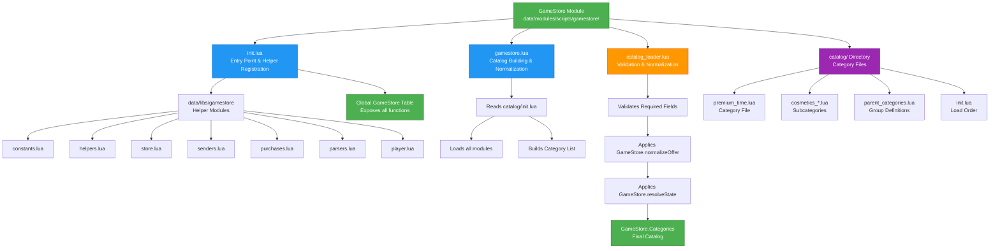
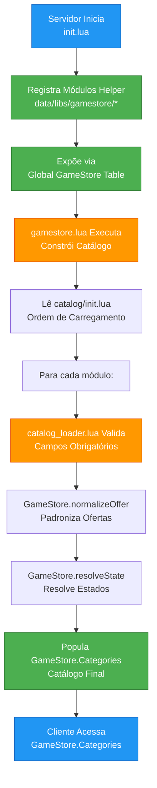

import { Aside, Card } from '@astrojs/starlight/components';

## 🛠️ Informações do Arquivo

Arquivo de documentação técnica para a **arquitetura refatorada do módulo GameStore**. Descreve os principais conceitos, estrutura de catálogo, validação automática de ofertas e guias práticos para estender o sistema.

<Card title="Caminho Original" icon="document">
  `data/modules/scripts/gamestore/readme.md`
</Card>

<Aside type="tip">
  Arquitetura modular completamente refatorada. Carregamento de módulo via init.lua, catálogo separado em data/modules/scripts/gamestore/catalog/, validação automática de ofertas via catalog_loader.lua, normalização de dados antes de registrar em GameStore.Categories. Permite extensão segura mantendo consistência. Campos obrigatórios: name, icons, rookgaard, (offers OU subclasses).
</Aside>

---

## 📄 Visão Geral do Código

### Resumo Executivo

O módulo GameStore foi **completamente refatorado para separar responsabilidades** e facilitar a manutenção do catálogo de ofertas. A nova arquitetura segue princípios de modularidade, validação automática e consistência.

**Pilares Principais**:

1. **Module Loading**: Registra módulos helper em `data/libs/gamestore` e expõe via tabela global `GameStore`
2. **Modular Catalog**: Cada arquivo em `catalog/` retorna tabela Lua descrevendo uma categoria
3. **Automatic Validations**: `catalog_loader.lua` valida campos obrigatórios e normaliza ofertas
4. **Safe Extension**: Padrões documentados para adicionar categorias, subcategorias e ofertas

### Estrutura Arquitetônica



---

## 📋 Estrutura do Catálogo

### Hierarquia de Arquivos

O catálogo é organizado em **3 níveis de abstração**:

#### 1. **catalog/init.lua** - Definição de Ordem e Estrutura

Arquivo que define a **sequência de carregamento** e estrutura do catálogo. Pode conter:

| Tipo | Formato | Exemplo | Descrição |
|------|---------|---------|-----------|
| **String** | `"module_name"` | `"premium_time"` | Referência a arquivo em catalog/ |
| **Inline Table** | `{ ... complete definition ... }` | `{ name, icons, offers }` | Categoria completa inline |
| **Named Reference** | `{ module = "file", source = "label" }` | `{ module = "cosmetics_mounts", source = "Mounts" }` | Registra com nome alternativo |

**Exemplo de catalog/init.lua**:
```lua
return {
    "premium_time",           -- String: carrega catalog/premium_time.lua
    "cosmetics_outfits",      -- Carrega catalog/cosmetics_outfits.lua
    {                         -- Inline: categoria completa
        name = "Bundles",
        icons = { "Category_Bundles.png" },
        offers = { ... }
    },
    {                         -- Named reference
        module = "cosmetics_mounts",
        source = "Mounts"
    },
}
```

#### 2. **catalog/parent_categories.lua** - Agrupadores Hierárquicos

Define categorias "pai" que **agrupam subcategorias existentes**. Permite organização visual sem duplicar definições.

**Exemplo**:
```lua
return {
    cosmetics = {
        icons = { "Category_Cosmetics.png" },
        name = "Cosmetics",
        rookgaard = false,
        subclasses = { "Outfits", "Mounts", "Familiars" }
    },
    houses = {
        icons = { "Category_Houses.png" },
        name = "Houses",
        rookgaard = true,
        subclasses = { "Furniture", "Decorations", "Upgrades" }
    }
}
```

#### 3. **catalog/*.lua** - Categorias Individuais

Arquivos que definem **categorias com ofertas** ou subcategorias com campos específicos.

**Exemplo de categoria com ofertas**:
```lua
return {
    icons = { "Category_PremiumTime.png" },
    name = "Premium Time",
    rookgaard = false,
    offers = {
        {
            icons = { "Product_30Days.png" },
            name = "30 Days Premium",
            price = 990,
            description = "..."
        }
    }
}
```

---

## 📊 Schema de Campos de Categoria

Cada categoria deve definir os campos abaixo. Validação é feita automaticamente por `catalog_loader.lua`:

| Campo | Tipo | Obrigatório | Descrição |
|-------|------|------------|-----------|
| **`name`** | `string` | ✅ Sim | Label exibido no cliente |
| **`icons`** | `table<string>` | ✅ Sim | Lista de ícones (arquivos em `modules/game_store/images/64`) |
| **`rookgaard`** | `boolean` | ✅ Sim | Se categoria aparece para contas Rookgaard |
| **`offers`** | `table<table>` | ⚠️ Semi | Lista de ofertas. Obrigatório se sem `subclasses` |
| **`subclasses`** | `table<string>` | ⚠️ Semi | Nomes de subcategorias. Obrigatório se sem `offers` |
| **`state`** | `GameStore.States` | ❌ Não | Destaque visual (ex: `GameStore.States.STATE_NEW`) |
| **`parent`** | `string` | ❌ Não | Nome da categoria pai (para subcategorias) |

⚠️ **Uma e apenas uma** entre `offers` ou `subclasses` deve ser definida.

---

## 📊 Schema de Campos de Oferta

Dentro do array `offers`, cada oferta pode aceitar:

| Campo | Tipo | Obrigatório | Descrição |
|-------|------|------------|-----------|
| **`icons`** | `table<string>` | ✅ Sim | Lista de ícones do produto |
| **`name`** | `string` | ✅ Sim | Nome exibido da oferta |
| **`price`** | `number` | ✅ Sim | Preço em coins |
| **`description`** | `string` | ❌ Não | Descrição em HTML Tibia |
| **`id`** | `number` | ❌ Não | ID único (auto-atribuído se omitido) |
| **`type`** | `GameStore.OfferTypes` | ❌ Não | Tipo de oferta (auto se omitido) |
| **`coinType`** | `GameStore.CoinType` | ❌ Não | Tipo de coin (auto se omitido) |
| **`state`** | `GameStore.States` | ❌ Não | Estado visual (NEW, SALE, TIMED) |
| **`disabled`** | `boolean` | ❌ Não | Se oferta está desativada |
| **`disabledReason`** | `string` | ❌ Não | Motivo da desativação |
| **`validUntil`** | `number` | ❌ Não | Timestamp até quando vale (para TIMED) |
| **`count`** | `number` | ❌ Não | Quantidade de unidades |

❌ **Campos auto-preenchidos** (se não definidos):
- `id`: Próximo ID sequencial disponível
- `type`: Derivado do contexto ou padrão `OFFER_TYPE_ITEM`
- `coinType`: Padrão `GameStore.CoinType.Transferable`

---

## 🎯 Tipos de Ofertas e Estados

### OfferTypes (Tipos de Oferta)

| Tipo | Descrição | Exemplo |
|------|-----------|---------|
| `OFFER_TYPE_ITEM` | Item genérico | Poções, itens especiais |
| `OFFER_TYPE_OUTFIT` | Outfit/roupa | Dragon Slayer Outfit |
| `OFFER_TYPE_OUTFIT_ADDON` | Add-on de outfit | Wings, accessories |
| `OFFER_TYPE_MOUNT` | Mont/montaria | Cavalo, Eagle, Cerberus |
| `OFFER_TYPE_NAMECHANGE` | Mudança de nome | Character rename |
| `OFFER_TYPE_SEXCHANGE` | Mudança de gênero | Character sex change |
| `OFFER_TYPE_PROMOTION` | Promoção/bundle | Multiple items |

### States (Estados Visuais)

| Estado | Descrição | Uso |
|--------|-----------|-----|
| `STATE_NONE` | Padrão (sem destaque) | Ofertas normais |
| `STATE_NEW` | Destaque "Novo" | Produtos novos ou retornados |
| `STATE_SALE` | Destaque "Venda/Desconto" | Ofertas com preço reduzido |
| `STATE_TIMED` | Destaque "Limitado" | Ofertas com prazo de validade |

---

## 🚀 Guia Prático: Como Adicionar Novos Itens

### Padrão 1: Adicionar Oferta a Categoria Existente

**Objetivo**: Adicionar novo item a uma categoria já existente.

**Passos**:

1. **Abra o arquivo da categoria** (ex: `catalog/cosmetics_mounts.lua`)

2. **Insira novo entry em `offers`**:
```lua
{
    icons = { "Product_NewMount.png" },
    name = "New Legendary Mount",
    price = 1500,
    description = "A powerful new mount with unique abilities.",
    type = GameStore.OfferTypes.OFFER_TYPE_MOUNT,
    state = GameStore.States.STATE_NEW,  -- Marca como novo
}
```

3. **Campos obrigatórios**: `icons`, `name`, `price`

4. **Campos automáticos**: `id`, `type`, `coinType` (preenchidos se omitidos)

5. **Pronto!** - `gamestore.lua` detectará mudança e validará automaticamente

---

### Padrão 2: Criar Nova Categoria

**Objetivo**: Criar categoria completamente nova.

**Passos**:

1. **Crie arquivo** `catalog/my_new_category.lua`:

```lua
return {
    icons = { "Category_MyNewCategory.png" },
    name = "My New Category",
    rookgaard = false,  -- Apenas para P2P
    offers = {
        {
            icons = { "Product_Item1.png" },
            name = "Item 1",
            price = 250,
            description = "First item",
            type = GameStore.OfferTypes.OFFER_TYPE_ITEM,
        },
        {
            icons = { "Product_Item2.png" },
            name = "Item 2",
            price = 500,
        },
    },
}
```

2. **Registre em `catalog/init.lua`**:

```lua
return {
    "premium_time",
    "my_new_category",  -- ← Adicione aqui
    "cosmetics_outfits",
    -- ...
}
```

3. **Pronto!** - Categoria aparecerá no GameStore automaticamente.

---

### Padrão 3: Criar Nova Categoria Pai (Agrupador)

**Objetivo**: Agrupar múltiplas categorias em um agrupador hierárquico.

**Passos**:

1. **Edite `catalog/parent_categories.lua`**:

```lua
return {
    -- Categorias pais existentes...
    
    my_group = {
        icons = { "Category_MyGroup.png" },
        name = "My Group",
        rookgaard = true,
        subclasses = { "Category A", "Category B", "Category C" }
    }
}
```

2. **Registre em `catalog/init.lua`**:

```lua
return {
    "my_group",  -- ← Adicione aqui
    -- ...
}
```

3. **Crie os arquivos das subcategorias** (se não existirem):

```lua
-- catalog/category_a.lua
return {
    icons = { "Category_A.png" },
    name = "Category A",
    rookgaard = true,
    parent = "My Group",  -- ← Referencia o pai
    offers = { ... }
}
```

4. **Pronto!** - Agrupador "My Group" aparecerá com subcategorias.

---

## 🔄 Fluxo de Carregamento e Validação

### Sequência de Inicialização



### Validações Aplicadas

1. **Campos Obrigatórios** (por `catalog_loader.lua`):
   - `name` (string não-vazia)
   - `icons` (array não-vazio)
   - `rookgaard` (boolean)
   - Mínimo uma: `offers` ou `subclasses`

2. **Normalização** (por `GameStore.normalizeOffer`):
   - Atribui `id` sequencial se omitido
   - Define `type` padrão se omitido
   - Define `coinType` padrão se omitido

3. **Resolução de Estado** (por `GameStore.resolveState`):
   - Valida enums de `state`
   - Aplica lógica condicional de visibilidade
   - Marca para destacar se `STATE_NEW`, `STATE_SALE`, `STATE_TIMED`

4. **Segurança**:
   - Previne campos inválidos
   - Detecta referências circulares em `parent`
   - Garante IDs únicos em todas ofertas

---

## 💡 Dicas Avançadas

### 1. Manipular Ofertas Dinamicamente

A helper `useOfferConfigure` permanece disponível globalmente para alterar ofertas em runtime:

```lua
-- Exemplos de uso:
GameStore.useOfferConfigure(offerId, {
    disabled = true,
    disabledReason = "Out of stock"
})

GameStore.useOfferConfigure(offerId, {
    state = GameStore.States.STATE_SALE,
    price = 500  -- Novo preço
})
```

### 2. Estados Condicionais

Use `GameStore.resolveState` para definir estados dinamicamente:

```lua
local offerState = player:isPremium() and 
    GameStore.States.STATE_SALE or 
    GameStore.States.STATE_NONE

local offer = {
    name = "Premium Offer",
    icons = { "Premium.png" },
    price = 1000,
    state = offerState,  -- Resolvido em tempo real
}
```

### 3. Refatoração Segura de Arquivos

Quando remover ou renomear arquivos:

1. **Atualize `catalog/init.lua`** - remova a referência
2. **Atualize `catalog/parent_categories.lua`** - se aplicável
3. **Verifique dependências** - grep por referências ao nome antigo
4. **Teste completamente** - certifique que catálogo carrega sem erro

### 4. Validação Custom Pré-Carregamento

Se precisar de validação custom antes de registrar categoria:

```lua
local custom_category = {
    icons = { "Custom.png" },
    name = "Custom",
    rookgaard = true,
    offers = { ... }
}

-- Validação custom
if not custom_category.offers or #custom_category.offers == 0 then
    error("Custom category must have at least one offer!")
end

-- Depois registra
return custom_category
```

---

## ✅ Checkpoint de Aprendizagem

### Conceitos Principais

1. **Modularidade**: Cada arquivo de catálogo é independente, fácil manter
2. **Validação Automática**: catalog_loader.lua previne muitos erros
3. **Hierarquia Flexível**: Combina categorias lineares com agroupadores
4. **Campos Opcionais**: Muitos campos auto-preenchidos, reduz boilerplate
5. **Extensibilidade Segura**: Padrões claros para adicionar sem quebrar o sistema

### Design Patterns

- **Configuration as Data**: Catálogos = Lua tables (fácil manter)
- **Validation Layer**: `catalog_loader.lua` separa validação de lógica
- **Lazy Loading**: Arquivos carregados sob demanda via init.lua
- **Fallback Defaults**: Campos omitidos recebem valores sensatos
- **Hierarchical Grouping**: Parent categories para organização visual

### Responsabilidades

| Arquivo | Responsabilidade |
|---------|------------------|
| `init.lua` | Registra helpers, expõe GameStore global |
| `gamestore.lua` | Orquestra carregamento, constrói catálogo final |
| `catalog_loader.lua` | Valida, normaliza, resolve estados |
| `catalog/init.lua` | Define ordem de carregamento |
| `catalog/parent_categories.lua` | Define agrupadores hierárquicos |
| `catalog/*.lua` | Definem categorias individuais com ofertas |

---

## 📚 Conclusão

A arquitetura refatorada do GameStore fornece:

1. **Clareza**: Cada arquivo tem responsabilidade clara
2. **Manutenibilidade**: Adicionar ofertas é processo simples e padronizado
3. **Segurança**: Validações automáticas previnem erros comuns
4. **Extensibilidade**: Padrões documentados para crescimento futuro
5. **Consistência**: Normalização garante comportamento previsível

Com estes passos e padrões documentados, você pode **estender o Game Store com segurança** mantendo qualidade arquitetural.

---

## 🤖 Informações da Documentação

<Card title="Metadata da Documentação" icon="star">
  - **Arquivo Original**: data/modules/scripts/gamestore/readme.md
  - **Tipo**: Documentação Arquitetural
  - **Última Atualização**: 2026-02-19
  - **Status**: ✅ Completo (Convertido para MDX)
  - **Escopo**: Arquitetura modular, validação, extensão do GameStore
  - **Públicos**: Desenvolvedores, Maintainers, Extensores
  - **Conceitos Cobertos**: 7 padrões, 9 schemas, 5 guias práticos
</Card>

<Aside type="note">
  **Nota de Manutenção**: Este documento descreve arquitetura crítica do GameStore. Atualizações devem rastrear mudanças em: (1) catalog_loader.lua - validações/normalizações, (2) gamestore.lua - construção de catálogo, (3) Novos OfferTypes ou States, (4) Novos campos obrigatórios em categoria/oferta, (5) Mudanças em responsabilidades de módulos. Manter sincronizado com código-fonte para guiar corretamente extensões futuras.
</Aside>

```