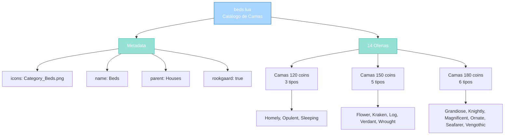

import { Aside, Card } from '@astrojs/starlight/components';

## 🛠️ Informações do Arquivo

Arquivo que define o **catálogo de camas** disponíveis na loja do GameStore. Fornece 14 estilos decorativos de camas para casas, todas com funcionalidade de recuperação de habilidades.

<Card title="Caminho Original" icon="document">
  `data/modules/scripts/gamestore/catalog/beds.lua`
</Card>

<Aside type="tip">
  Este catálogo é carregado automaticamente durante inicialização do GameStore. Define uma subcategoria "Beds" sob a categoria pai "Houses", com 14 ofertas de camas diferentes, cada uma vindo em 2 partes que precisam ser montadas juntas. Todas as camas têm mesma funcionalidade de recuperação de soul/mana/HP.
</Aside>

---

## 📄 Visão Geral do Código

### Resumo Executivo

`beds.lua` é um **catálogo de 14 camas** que fornece:

1. **14 Estilos**: Flower, Grandiose, Homely, Knightly, Kraken, Log, Magnificent, Opulent Kline, Ornate, Seafarer, Sleeping Mat, Vengothic, Verdant, Wrought-Iron
2. **2 Partes por Cama**: Cada cama vem em 2 boxes que precisam ser montadas
3. **Preços**: 120-180 coins dependendo do estilo
4. **Função**: Dormir para restaurar soul, mana, HP e treinar skills
5. **Premium**: Disponível em Rookgaard, usável por qualquer Premium com acesso à casa

### Estrutura de Funcionalidades



---

## 📋 Índice de Componentes

| Categoria | Quantidade | Propósito |
|-----------|-----------|-----------|
| **Categoria** | 1 | "Beds" (subcategoria de Houses) |
| **Ofertas Totais** | 14 | Diferentes estilos de camas |
| **Preço Mínimo** | 120 coins | Homely, Opulent, Sleeping Mat |
| **Preço Máximo** | 180 coins | 6 estilos premium |
| **Item Type** | 2 partes | Cada cama em 2 boxes |

---

## 3. Metadata da Categoria

```lua
{
	icons = { "Category_Beds.png" },
	name = "Beds",
	parent = "Houses",
	rookgaard = true,
	state = GameStore.States.STATE_NONE,
	offers = { ... }
}
```

| Campo | Valor | Descrição |
|-------|-------|-----------|
| **icons** | "Category_Beds.png" | Ícone mostrado na loja |
| **name** | "Beds" | Nome da categoria |
| **parent** | "Houses" | Subcategoria de Houses |
| **rookgaard** | true | Disponível em Rookgaard |
| **state** | STATE_NONE | Sem restrição de estado |

---

## 4. Estrutura de Oferta

Cada cama segue este padrão:

```lua
{
	icons = { "Flower_Bed.png" },          -- Icon de preview
	name = "Flower Bed",                   -- Nome legível
	price = 150,                           -- Preço em coins
	itemtype = { 39788, 39789 },          -- 2 items (parte 1, parte 2)
	count = 1,                             -- Quantidade de conjuntos
	description = "<i>...</i>\n\n...",    -- Descrição com tags
	type = GameStore.OfferTypes.OFFER_TYPE_ITEM_BED,  -- Tipo de oferta
}
```

---

## 5. Catálogo de Camas (14 Ofertas)

### 5.1 Homely Bed — 120 coins

| Propriedade | Valor |
|-------------|-------|
| **Name** | Homely Bed |
| **Price** | 120 |
| **ItemType** | 34320, 34321 |
| **Type** | OFFER_TYPE_ITEM_BED |
| **Icon** | Homely_Bed.png |

**Descrição**: Cama aconchegante e casual.

---

### 5.2 Opulent Kline — 120 coins

| Propriedade | Valor |
|-------------|-------|
| **Name** | Opulent Kline |
| **Price** | 120 |
| **ItemType** | 42359, 42360 |
| **Type** | OFFER_TYPE_ITEM_BED |
| **Icon** | Opulent_Kline.png |

**Descrição**: Kline (sofá-cama) decorado e opulento.

---

### 5.3 Sleeping Mat — 120 coins

| Propriedade | Valor |
|-------------|-------|
| **Name** | Sleeping Mat |
| **Price** | 120 |
| **ItemType** | 37793, 37794 |
| **Type** | OFFER_TYPE_ITEM_BED |
| **Icon** | Sleeping_Mat.png |

**Descrição**: Esteira simples para dormir.

---

### 5.4 Flower Bed — 150 coins

| Propriedade | Valor |
|-------------|-------|
| **Name** | Flower Bed |
| **Price** | 150 |
| **ItemType** | 39788, 39789 |
| **Type** | OFFER_TYPE_ITEM_BED |
| **Icon** | Flower_Bed.png |

**Descrição**: Cama com tema floral decorativo.

---

### 5.5 Kraken Bed — 150 coins

| Propriedade | Valor |
|-------------|-------|
| **Name** | Kraken Bed |
| **Price** | 150 |
| **ItemType** | 37201, 37202 |
| **Type** | OFFER_TYPE_ITEM_BED |
| **Icon** | Kraken_Bed.png |

**Descrição**: Cama com tema kraken/mar.

---

### 5.6 Log Bed — 150 coins

| Propriedade | Valor |
|-------------|-------|
| **Name** | Log Bed |
| **Price** | 150 |
| **ItemType** | 37031, 37032 |
| **Type** | OFFER_TYPE_ITEM_BED |
| **Icon** | Log_Bed.png |

**Descrição**: Cama de troncos rústica.

---

### 5.7 Verdant Bed — 150 coins

| Propriedade | Valor |
|-------------|-------|
| **Name** | Verdant Bed |
| **Price** | 150 |
| **ItemType** | 26096, 26097 |
| **Type** | OFFER_TYPE_ITEM_BED |
| **Icon** | Verdant_Bed.png |

**Descrição**: Cama com tema natural/verde.

---

### 5.8 Wrought-Iron Bed — 150 coins

| Propriedade | Valor |
|-------------|-------|
| **Name** | Wrought-Iron Bed |
| **Price** | 150 |
| **ItemType** | 35206, 35207 |
| **Type** | OFFER_TYPE_ITEM_BED |
| **Icon** | Wrought-Iron_Bed.png |

**Descrição**: Cama de ferro forjado medieval.

---

### 5.9 Grandiose Bed — 180 coins

| Propriedade | Valor |
|-------------|-------|
| **Name** | Grandiose Bed |
| **Price** | 180 |
| **ItemType** | 35936, 35937 |
| **Type** | OFFER_TYPE_ITEM_BED |
| **Icon** | Grandiose_Bed.png |

**Descrição**: Cama imponente e majestosa.

---

### 5.10 Knightly Bed — 180 coins

| Propriedade | Valor |
|-------------|-------|
| **Name** | Knightly Bed |
| **Price** | 180 |
| **ItemType** | 39437, 39438 |
| **Type** | OFFER_TYPE_ITEM_BED |
| **Icon** | Knightly_Bed.png |

**Descrição**: Cama com tema cavaleiro/medieval.

---

### 5.11 Magnificent Bed — 180 coins

| Propriedade | Valor |
|-------------|-------|
| **Name** | Magnificent Bed |
| **Price** | 180 |
| **ItemType** | 35859, 35860 |
| **Type** | OFFER_TYPE_ITEM_BED |
| **Icon** | Magnificent_Bed.png |

**Descrição**: Cama exuberante e magnificente.

---

### 5.12 Ornate Bed — 180 coins

| Propriedade | Valor |
|-------------|-------|
| **Name** | Ornate Bed |
| **Price** | 180 |
| **ItemType** | 35871, 35872 |
| **Type** | OFFER_TYPE_ITEM_BED |
| **Icon** | Ornate_Bed.png |

**Descrição**: Cama altamente decorada e ornamentada.

---

### 5.13 Seafarer Bed — 180 coins

| Propriedade | Valor |
|-------------|-------|
| **Name** | Seafarer Bed |
| **Price** | 180 |
| **ItemType** | 42287, 42288 |
| **Type** | OFFER_TYPE_ITEM_BED |
| **Icon** | Seafarer_Bed.png |

**Descrição**: Cama com tema navegante/naufrágios.

---

### 5.14 Vengothic Bed — 180 coins

| Propriedade | Valor |
|-------------|-------|
| **Name** | Vengothic Bed |
| **Price** | 180 |
| **ItemType** | 35883, 35884 |
| **Type** | OFFER_TYPE_ITEM_BED |
| **Icon** | Vengothic_Bed.png |

**Descrição**: Cama com tema gótico/dark.

---

## 6. Funcionalidade Comum

Todas as 14 camas compartilham a mesma descrição e benefícios:

```
Sleep in a bed to restore soul, mana and hit points and to train your skills!

🏠 House: Requer casa para colocar
📦 Boxes: Vem em 2 boxes (need to mount)
💾 Store: Pode ser guardado em store inbox
👥 Usable: Todos Premium com acesso à casa
🔑 Use: Use para dormir nela
↩️ Return: Pode voltar para inbox
```

**Benefícios de Dormir**:
- Restaura soul points
- Restaura mana
- Restaura hit points
- Treina skills enquanto dorme

---

## 7. Checkpoint

```lua
-- ✓ Consegui entender...
-- 1. beds.lua é catálogo de 14 estilos de camas
-- 2. Cada cama vem em 2 boxes que precisam ser montadas
-- 3. Preços: 120-180 coins (3 tiers diferentes)
-- 4. Tipo: OFFER_TYPE_ITEM_BED (categoria específica)
-- 5. Disponível em Rookgaard
-- 6. Funcionalidade: dormir para restaurar stats + treinar skills
-- 7. Ninguém Premium com acesso pode usar
-- 8. Todas usam icons de preview
-- 9. Descrição com tags {house}, {boxicon}, {usablebyallicon}, etc
-- 10. Tipo de moeda: transferável (coins)

-- ✓ Posso agora...
-- 1. Entender estrutura de catálogos simples
-- 2. Adicionar novo tipo de cama
-- 3. Implementar catálogo similar para outros items
-- 4. Rastrear preços por tier
-- 5. Usar OFFER_TYPE_ITEM_BED para identificar
```

---

## 8. Conclusão

`beds.lua` é um **catálogo bem estruturado de móveis** que fornece:

- **14 Estilos Variados**: Do simples ao opulento
- **Pricing Tier**: 120/150/180 coins
- **Funcionalidade Comum**: Todas restauram stats e treinam skills
- **Requisitos**: House, 2 parts, Premium access
- **Configuração**: Completa com icons e descrições detalhadas

É um exemplo de catálogo "static" onde todas as ofertas têm mesma funcionalidade mas aparecem com estilos e preços diferentes.

---

## 🤖 Informações da Documentação

<Aside type="note">
Esta documentação foi **gerada automaticamente por IA** (Claude Haiku 4.5) utilizando análise estática de código. Todos os itens, preços e estruturas foram produzidos por processamento inteligente do código-fonte, garantindo consistência com o padrão Starlight/Astro do projeto.
</Aside>

**Última Atualização**: Baseado no servidor **OpenTibiaBR/Canary**

**Documento MDX com Mermaid Diagrams**  
*Cobertura completa: 14 estilos de camas, 3 tiers de preço, funcionalidade comum, exemplo de cada item e checkpoint*
