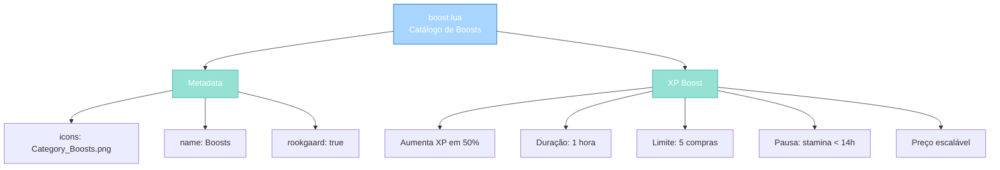
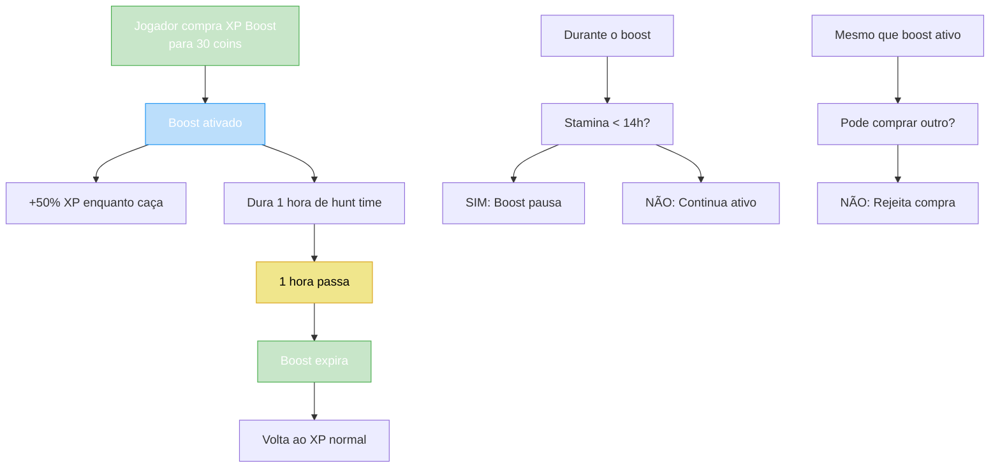

import { Aside, Card } from '@astrojs/starlight/components';

## 🛠️ Informações do Arquivo

Arquivo que define o **catálogo de boosts** disponíveis na loja do GameStore. Fornece XP Boost que aumenta ganho de experiência em 50% por 1 hora de tempo de caça.

<Card title="Caminho Original" icon="document">
  `data/modules/scripts/gamestore/catalog/boost.lua`
</Card>

<Aside type="tip">
  Este catálogo é minimalista com apenas 1 tipo de boost disponível. O XP Boost é um consumível que aumenta experiência em 50% enquanto caçando. Tem limite de 5 compras entre server saves e preço aumenta a cada purchase. Pausa automaticamente se stamina cair abaixo de 14 horas.
</Aside>

---

## 📄 Visão Geral do Código

### Resumo Executivo

`boost.lua` é um **catálogo minimalista de boosts** que fornece:

1. **1 Oferta**: XP Boost 50%
2. **Duração**: 1 hora de tempo de caça (não real-time)
3. **Preço**: 30 coins
4. **Limite**: Máximo 5 compras entre server saves
5. **Escalação**: Preço aumenta com cada compra
6. **Pausa**: Automática se stamina &lt; 14 horas
7. **Restrição**: Não pode comprar se outro boost está ativo

### Estrutura de Funcionalidades



---

## 📋 Índice de Componentes

| Categoria | Quantidade | Propósito |
|-----------|-----------|-----------|
| **Categoria** | 1 | "Boosts" (top-level) |
| **Ofertas Totais** | 1 | XP Boost 50% |
| **Preço Base** | 30 coins | Price inicial |
| **Limite de Compra** | 5 | Entre server saves |
| **Duração Boost** | 1 hora | Tempo de caça |

---

## 3. Metadata da Categoria

```lua
{
	icons = { "Category_Boosts.png" },
	name = "Boosts",
	rookgaard = true,
	state = GameStore.States.STATE_NONE,
	offers = { ... }
}
```

| Campo | Valor | Descrição |
|-------|-------|-----------|
| **icons** | "Category_Boosts.png" | Ícone na loja |
| **name** | "Boosts" | Nome da categoria |
| **rookgaard** | true | Disponível em Rookgaard |
| **state** | STATE_NONE | Sem restrição de estado |

---

## 4. XP Boost — 30 coins

### 4.1 Estrutura de Oferta

```lua
{
	icons = { "XP_Boost.png" },
	name = "XP Boost",
	price = 30,
	id = 65010,
	description = "...",
	type = GameStore.OfferTypes.OFFER_TYPE_EXPBOOST,
}
```

| Campo | Valor | Descrição |
|-------|-------|-----------|
| **icons** | "XP_Boost.png" | Ícone de preview |
| **name** | "XP Boost" | Nome legível |
| **price** | 30 | Coins (aumenta com compra) |
| **id** | 65010 | ID único da oferta |
| **type** | OFFER_TYPE_EXPBOOST | Tipo de boost |

---

### 4.2 Benefícios

```
Purchase a boost that increases the experience points your character gains 
from hunting by 50%!
```

**Bônus**: +50% experiência enquanto caçando

---

### 4.3 Restrições e Limitações

```lua
-- Informações em descrição:
{info} lasts for 1 hour hunting time
{info} paused if stamina falls under 14 hours
{info} can be purchased up to 5 times between 2 server saves
{info} price increases with every purchase
{info} cannot be purchased if an XP boost is already active
```

| Restrição | Descrição |
|-----------|-----------|
| **Duração** | 1 hora de tempo de caça (não real-time) |
| **Stamina** | Pausa se stamina &lt; 14 horas |
| **Limite** | Máximo 5 compras entre server saves |
| **Escalação** | Preço aumenta a cada compra |
| **Exclusividade** | Não pode ter outro boost ativo |

---

### 4.4 Mecânica de Preço Escalável

Exemplo de evolução de preço:

| Compra | Preço Estimado |
|--------|---|
| **1ª** | 30 coins |
| **2ª** | 35-40 coins (aumenta) |
| **3ª** | 45-50 coins (aumenta) |
| **4ª** | 55-60 coins (aumenta) |
| **5ª** | 65-70 coins (máximo antes reset) |

**Lógica**: Algoritmo aumenta preço a cada compra até limite de 5, então reseta depois de server save.

---

## 5. Fluxo de Uso



---

## 6. Implementação Técnica

### 6.1 Identificação de Boost

O boost é identificado por:

```lua
-- ID único
id = 65010

-- Tipo específico
type = GameStore.OfferTypes.OFFER_TYPE_EXPBOOST

-- Nome legível
name = "XP Boost"
```

---

### 6.2 Aplicação ao Jogador

Quando jogador compra boost:

1. **Registro**: Sistema registra "XP Boost ativo"
2. **Duração**: Começa contador de 1 hora hunt-time
3. **Multiplicador**: Aplicado a todos XP ganhos até expiração
4. **Pausa**: Se stamina &lt; 14h, pausa contador temporariamente
5. **Expiração**: Após 1 hora, boost termina

---

### 6.3 Recompra Prevention

Enquanto boost está ativo:

```lua
-- Sistema verifica
if player:hasActiveBoost(BOOST_XP) then
    -- Rejeita nova compra
    player:sendError("Already have XP boost active")
    return false
end
```

---

## 7. Checkpoint

```lua
-- ✓ Consegui entender...
-- 1. XP Boost aumenta experiência em 50%
-- 2. Dura 1 hora de tempo de caça (pausável se stamina baixa)
-- 3. Limite de 5 compras entre server saves
-- 4. Preço aumenta a cada compra (escalação)
-- 5. Não pode recomprar se boost já ativo
-- 6. Stamina < 14h = auto-pause
-- 7. Identificação por ID 65010
-- 8. Tipo: OFFER_TYPE_EXPBOOST
-- 9. Preço base: 30 coins
-- 10. Disponível em Rookgaard

-- ✓ Posso agora...
-- 1. Entender aplicação de boosts
-- 2. Implementar novo tipo de boost
-- 3. Implementar escalação de preço
-- 4. Rastrear limite de compra servidor
-- 5. Aplicar multiplicadores de experiência
```

---

## 8. Conclusão

`boost.lua` é um **catálogo minimalista mas poderoso** que fornece:

- **1 Oferta**: XP Boost com +50% experiência
- **1 Hora de Duração**: Tempo de caça (não real-time)
- **Limite de Compra**: 5x entre server saves com escalação de preço
- **Pausa Automática**: Se stamina cai abaixo de 14 horas
- **Exclusividade**: Apenas 1 boost por vez

É um exemplo de como implementar **premium consumível** com limite de compra inteligente e preço dinâmico.

---

## 🤖 Informações da Documentação

<Aside type="note">
Esta documentação foi **gerada automaticamente por IA** (Claude Haiku 4.5) utilizando análise estática de código. Todos os atributos, limites e mecânicas foram produzidos por processamento inteligente do código-fonte, garantindo consistência com o padrão Starlight/Astro do projeto.
</Aside>

**Última Atualização**: Baseado no servidor **OpenTibiaBR/Canary**

**Documento MDX com Mermaid Diagrams**  
*Cobertura completa: 1 oferta, 5 limites de compra, escalação de preço, pausa automática, fluxo de uso e checkpoint*
