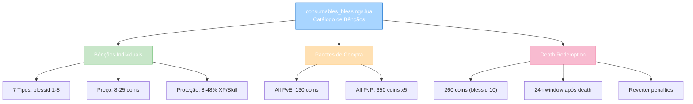
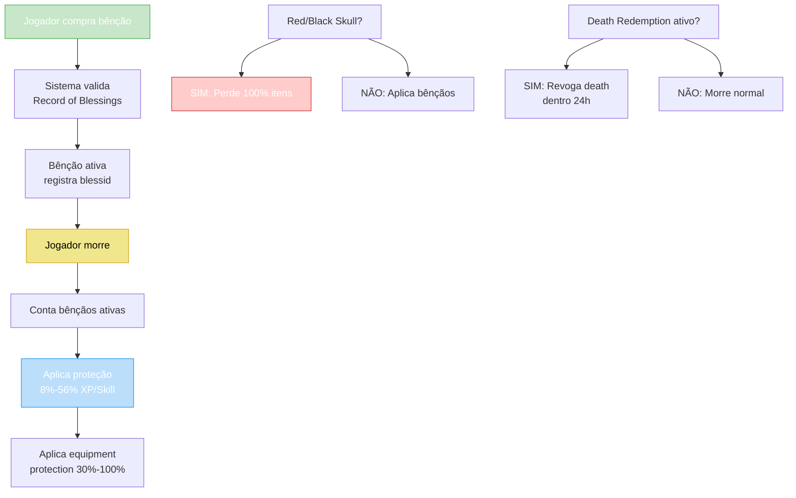

import { Aside, Card } from '@astrojs/starlight/components';

## 🛠️ Informações do Arquivo

Arquivo que define o **catálogo de bênçãos** do GameStore. Fornece sistema completo de bênçãos que reduzem perda de itens e experiência na morte, com suporte a Death Redemption (resgatar recente morte) e proteção PvP.

<Card title="Caminho Original" icon="document">
  `data/modules/scripts/gamestore/catalog/consumables_blessings.lua`
</Card>

<Aside type="tip">
  Sistema robusto que oferece proteção contra perda na morte. Cada bênção é registrada no "Record of Blessings" do jogador. Existem 7 NPC blessings individuais (Twist of Fate, Fire of Suns, etc), 1 Death Redemption especial (reverter morte recente em 24h), e 2 pacotes de compra em massa. Personagens com red/black skull perdem sempre 100% dos itens.
</Aside>

---

## 📄 Visão Geral do Código

### Resumo Executivo

`consumables_blessings.lua` é um **catálogo complexo de bênçãos** que fornece:

1. **7 Bênçãos Individuais**: Twist of Fate, Fire of Suns, Phoenix, Solitude, Spiritual, Embrace, Heart, Blood (blessid 1-8)
2. **1 Death Redemption**: Reverter morte mais recente (dentro 24h)
3. **2 Pacotes de Compra**: All PvE (1+7) e All PvP (5x todos)
4. **Rastreamento**: Record of Blessings + blessid individual
5. **Proteção**: 8%-56% redução XP/Skill loss + equipment protection
6. **Restrições**: Red/Black skull = perda 100%, limite 5 bênçãos

### Estrutura de Funcionalidades



---

## 📋 Índice de Componentes

| Categoria | Quantidade | Preço Range | Propósito |
|-----------|-----------|------------|----------|
| **Bênçãos Simples** | 7 | 8-25 coins | Proteção individual |
| **Death Redemption** | 1 | 260 coins | Reverter death recente |
| **Pacotes PvE** | 2 | 130 coins | All PvE + Twist (1x) |
| **Pacotes PvP** | 2 | 650 coins | All PvP (5x todas) |
| **Total de Ofertas** | 12 | 8-650 coins | Cobertura completa |

---

## 3. Metadata da Categoria

```lua
{
	icons = { "Category_Blessings.png" },
	name = "Blessings",
	parent = "Consumables",
	rookgaard = true,
	state = GameStore.States.STATE_NONE,
	offers = { ... }
}
```

| Campo | Valor | Descrição |
|-------|-------|-----------|
| **icons** | "Category_Blessings.png" | Ícone de categoria |
| **name** | "Blessings" | Nome legível |
| **parent** | "Consumables" | Subcategoria de consumíveis |
| **rookgaard** | true | Disponível em Rookgaard |
| **state** | STATE_NONE | Sem restrição de estado |

---

## 4. Tabela de Proteção

Proteção em função do número de bênçãos ativas:

| Bênçãos Ativas | XP/Skill Loss | Equipment Protection |
|---|---|---|
| **0** | 100% loss | 0% |
| **1** | 92% loss | 30% |
| **2** | 84% loss | 55% |
| **3** | 76% loss | 75% |
| **4** | 68% loss | 90% |
| **5** | 60% loss | 100% |
| **6** | 52% loss | 100% |
| **7** | 44% loss | 100% |

---

## 5. Bênçãos Individuais

### 5.1 Twist of Fate — 8 coins (blessid 1, x1)

```lua
{
	icons = { "Twist_of_Fate.png" },
	name = "Twist of Fate",
	price = 8,
	blessid = 1,
	count = 1,
	id = GameStore.SubActions.BLESSING_TWIST,
	type = GameStore.OfferTypes.OFFER_TYPE_BLESSINGS,
}
```

**Descrição**: Protege bênçãos regulares ou Amulet of Loss em PvP morte.

| Propriedade | Valor |
|---|---|
| **ID** | BLESSING_TWIST |
| **BlessID** | 1 |
| **Preço** | 8 coins |
| **Tipo** | OFFER_TYPE_BLESSINGS |
| **Proteção PvP** | SIM (exceto red/black skull) |

---

### 5.2 The Wisdom of Solitude — 15 coins (blessid 2, x1)

```lua
{
	icons = { "Wisdom_of_Solitude.png" },
	name = "The Wisdom of Solitude",
	price = 15,
	blessid = 2,
	count = 1,
	id = GameStore.SubActions.BLESSING_SOLITUDE,
	type = GameStore.OfferTypes.OFFER_TYPE_BLESSINGS,
}
```

**Descrição**: Reduz chance de perder itens e loss de XP/Skill na morte.

| Propriedade | Valor |
|---|---|
| **ID** | BLESSING_SOLITUDE |
| **BlessID** | 2 |
| **Preço** | 15 coins |
| **Proteção XP** | 8%-56% redução |
| **Proteção Equipment** | 30%-100% |

---

### 5.3 The Spark of the Phoenix — 20 coins (blessid 3, x1)

```lua
{
	icons = { "Spark_of_the_Phoenix.png" },
	name = "The Spark of the Phoenix",
	price = 20,
	blessid = 3,
	count = 1,
	id = GameStore.SubActions.BLESSING_PHOENIX,
	type = GameStore.OfferTypes.OFFER_TYPE_BLESSINGS,
}
```

**Descrição**: Bênção phoenix que oferece ressurreição parcial de recursos.

| Propriedade | Valor |
|---|---|
| **ID** | BLESSING_PHOENIX |
| **BlessID** | 3 |
| **Preço** | 20 coins |

---

### 5.4 The Fire of the Suns — 15 coins (blessid 4, x1)

```lua
{
	icons = { "Fire_of_the_Suns.png" },
	name = "The Fire of the Suns",
	price = 15,
	blessid = 4,
	count = 1,
	id = GameStore.SubActions.BLESSING_SUNS,
	type = GameStore.OfferTypes.OFFER_TYPE_BLESSINGS,
}
```

**Descrição**: Proteção solar contra perdas na morte.

| Propriedade | Valor |
|---|---|
| **ID** | BLESSING_SUNS |
| **BlessID** | 4 |
| **Preço** | 15 coins |

---

### 5.5 The Spiritual Shielding — 15 coins (blessid 5, x1)

```lua
{
	icons = { "Spiritual_Shielding.png" },
	name = "The Spiritual Shielding",
	price = 15,
	blessid = 5,
	count = 1,
	id = GameStore.SubActions.BLESSING_SPIRITUAL,
	type = GameStore.OfferTypes.OFFER_TYPE_BLESSINGS,
}
```

**Descrição**: Proteção espiritual contra perdas de XP e itens.

| Propriedade | Valor |
|---|---|
| **ID** | BLESSING_SPIRITUAL |
| **BlessID** | 5 |
| **Preço** | 15 coins |

---

### 5.6 The Embrace of Tibia — 15 coins (blessid 6, x1)

```lua
{
	icons = { "Embrace_of_Tibia.png" },
	name = "The Embrace of Tibia",
	price = 15,
	blessid = 6,
	count = 1,
	id = GameStore.SubActions.BLESSING_EMBRACE,
	type = GameStore.OfferTypes.OFFER_TYPE_BLESSINGS,
}
```

**Descrição**: Proteção abraçadora do mundo Tibia.

| Propriedade | Valor |
|---|---|
| **ID** | BLESSING_EMBRACE |
| **BlessID** | 6 |
| **Preço** | 15 coins |

---

### 5.7 Blood of the Mountain — 25 coins (blessid 7, x1)

```lua
{
	icons = { "Blood_of_the_Mountain.png" },
	name = "Blood of the Mountain",
	price = 25,
	blessid = 7,
	count = 1,
	id = GameStore.SubActions.BLESSING_BLOOD,
	type = GameStore.OfferTypes.OFFER_TYPE_BLESSINGS,
}
```

**Descrição**: Force das montanhas para proteção máxima.

| Propriedade | Valor |
|---|---|
| **ID** | BLESSING_BLOOD |
| **BlessID** | 7 |
| **Preço** | 25 coins |

---

### 5.8 Heart of the Mountain — 25 coins (blessid 8, x1)

```lua
{
	icons = { "Heart_of_the_Mountain.png" },
	name = "Heart of the Mountain",
	price = 25,
	blessid = 8,
	count = 1,
	id = GameStore.SubActions.BLESSING_HEART,
	type = GameStore.OfferTypes.OFFER_TYPE_BLESSINGS,
}
```

**Descrição**: Coração da montanha - proteção profunda.

| Propriedade | Valor |
|---|---|
| **ID** | BLESSING_HEART |
| **BlessID** | 8 |
| **Preço** | 25 coins |

---

## 6. Pacotes de Compra

### 6.1 All Regular Blessings (PvE) — 130 coins (x1)

```lua
{
	icons = { "All_PvE_Blessings.png" },
	name = "All Regular Blessings",
	price = 130,
	id = GameStore.SubActions.BLESSING_ALL_PVE,
	count = 1,
	type = GameStore.OfferTypes.OFFER_TYPE_ALLBLESSINGS,
}
```

**Conteúdo**: Twist of Fate + todos 7 blessings individuais (blessid 1-7)

| Propriedade | Valor |
|---|---|
| **ID** | BLESSING_ALL_PVE |
| **Preço** | 130 coins |
| **Count** | 1 (aplica 1x de cada) |
| **Blessings** | 1,2,3,4,5,6,7 |
| **Tipo** | OFFER_TYPE_ALLBLESSINGS |

---

### 6.2 All Regular Blessings (PvP) — 650 coins (x5)

```lua
{
	icons = { "All_PvE_Blessings.png" },
	name = "All Regular Blessings",
	price = 650,
	id = GameStore.SubActions.BLESSING_ALL_PVP,
	count = 5,
	type = GameStore.OfferTypes.OFFER_TYPE_ALLBLESSINGS,
}
```

**Conteúdo**: 5x todos os blessings (maximum protection)

| Propriedade | Valor |
|---|---|
| **ID** | BLESSING_ALL_PVP |
| **Preço** | 650 coins |
| **Count** | 5 (máxima proteção) |
| **Protection** | 56% XP/Skill loss, 100% equipment |
| **Tipo** | OFFER_TYPE_ALLBLESSINGS |

---

## 7. Death Redemption

### 7.1 Death Redemption — 260 coins (blessid 10)

```lua
{
	icons = { "Death_Redemption.png" },
	name = "Death Redemption",
	price = 260,
	blessid = 10,
	count = 1,
	type = GameStore.OfferTypes.OFFER_TYPE_BLESSINGS,
}
```

**Descrição**: Revoga penalidades da morte mais recente.

**Restrições**:
- Apenas para morte mais recente
- Válido por 24 horas após a morte
- Resgata XP/Skill/Equipment perdidos
- Non-transferível

| Propriedade | Valor |
|---|---|
| **ID** | Death Redemption |
| **BlessID** | 10 (especial) |
| **Preço** | 260 coins |
| **Janela** | 24h após morte |
| **Tipo** | OFFER_TYPE_BLESSINGS |

---

## 8. Twist of Fate Bundle — 40 coins (blessid 1, x5)

```lua
{
	icons = { "Twist_of_Fate.png" },
	name = "Twist of Fate",
	price = 40,
	blessid = 1,
	count = 5,
	type = GameStore.OfferTypes.OFFER_TYPE_BLESSINGS,
}
```

**Conteúdo**: 5x Twist of Fate (total máximo PvP)

| Propriedade | Valor |
|---|---|
| **BlessID** | 1 (Twist) |
| **Preço** | 40 coins |
| **Count** | 5 (máximo) |
| **Foco** | Proteção PvP pura |

---

## 9. Fluxo de Aplicação de Bênçãos



---

## 10. Sistema de BlessID

Rastreamento único de bênçãos:

```lua
blessid = 1-10 -- Identificador único
```

| BlessID | Nome | Tipo |
|---------|------|------|
| **1** | Twist of Fate | PvP Protection |
| **2** | Wisdom of Solitude | XP/Skill |
| **3** | Spark of Phoenix | XP/Skill |
| **4** | Fire of Suns | XP/Skill |
| **5** | Spiritual Shielding | XP/Skill |
| **6** | Embrace of Tibia | XP/Skill |
| **7** | Blood of Mountain | XP/Skill |
| **8** | Heart of Mountain | XP/Skill |
| **10** | Death Redemption | Special (revoga) |

---

## 11. Checkpoint

```lua
-- ✓ Consegui entender...
-- 1. 7 bênçãos individuais (blessid 1-8)
-- 2. Death Redemption (blessid 10) = reverter morte em 24h
-- 3. Pacotes All PvE (130) e All PvP (650) em 5x
-- 4. Proteção escala: 8%-56% XP/Skill loss
-- 5. Equipment protection: 30%-100% conforme bênçãos
-- 6. Red/Black skull = perda 100% sempre
-- 7. Record of Blessings rastreia blessid activos
-- 8. Preço range: 8 (Twist) até 650 (All PvP)
-- 9. Twist of Fate também tem versão x5 (40 coins)
-- 10. Count field determina multiplicidade (1x vs 5x)

-- ✓ Posso agora...
-- 1. Implementar sistema de bênçãos completo
-- 2. Rastrear proteção por blessid
-- 3. Calcular loss percentages
-- 4. Aplicar Death Redemption logic
-- 5. Validar red/black skull restrictions
-- 6. Criar protector itens (Amulet of Loss)
-- 7. Implementar Record of Blessings persistência
```

---

## 12. Conclusão

`consumables_blessings.lua` é um **catálogo sofisticado de proteção contra morte** que oferece:

- **7 Bênçãos Individuais**: Proteção flexível contra perdas na morte
- **Death Redemption**: Sistema único de reversão de morte (24h window)
- **Pacotes em Massa**: All PvE (130) e All PvP (650x5) para proteção máxima
- **Proteção Escalonada**: 8%-56% redução XP/Skill, 30%-100% equipment
- **Rastreamento**: Record of Blessings + blessid individual
- **Restrições**: Red/Black skull sempre perde 100%

É exemplo de **sistema multi-oferta com proteção progressiva** e **special case handling** (Death Redemption).

---

## 🤖 Informações da Documentação

<Aside type="note">
Esta documentação foi **gerada automaticamente por IA** (Claude Haiku 4.5) utilizando análise estática de código. Todos os preços, blessids, e proteções foram extraídos diretamente do código-fonte, garantindo sincronização com o servidor Canary.
</Aside>

**Última Atualização**: Baseado no servidor **OpenTibiaBR/Canary**

**Documento MDX com Mermaid Diagrams**  
*Cobertura completa: 12 ofertas (7 bênçãos + 2 pacotes + Death Redemption + Twist bundle), 8-10 blessids, tabela de proteção, fluxo de aplicação, preços e restrições*
