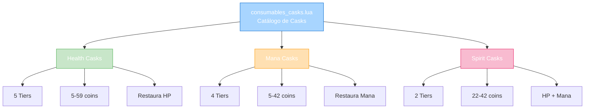
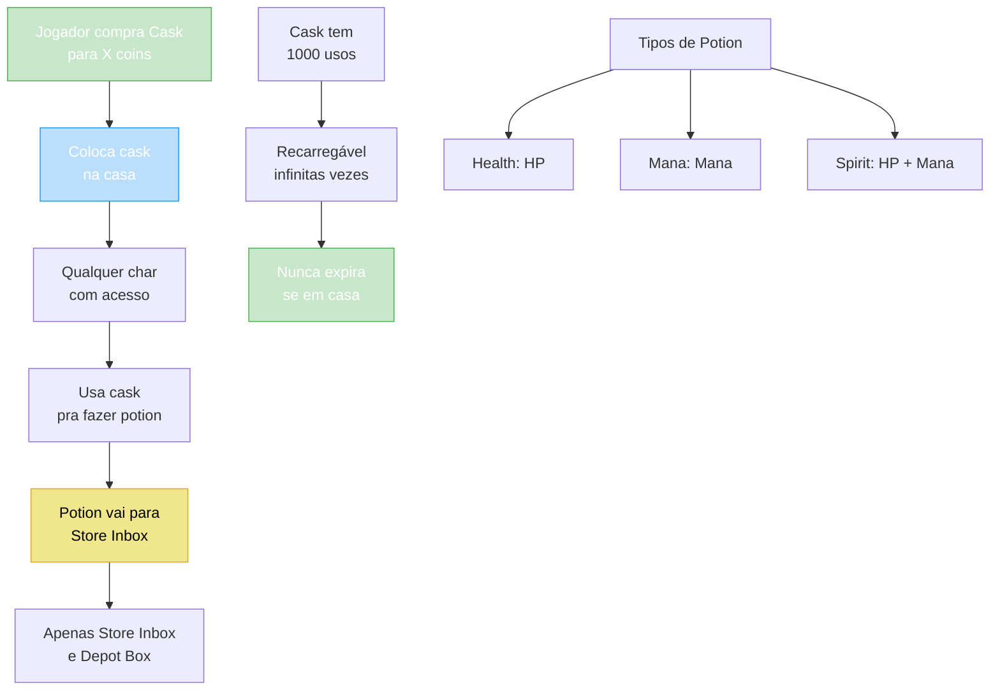

import { Aside, Card } from '@astrojs/starlight/components';

## 🛠️ Informações do Arquivo

Arquivo que define o **catálogo de casks** do GameStore. Fornece casks de poção para colocar em casa, permitindo fabricar potências variadas de poções (Health, Mana, Spirit) com 1000 usos cada.

<Card title="Caminho Original" icon="document">
  `data/modules/scripts/gamestore/catalog/consumables_casks.lua`
</Card>

<Aside type="tip">
  Sistema de produção doméstica de poções. Cada cask é colocado na casa e permite qualquer personagem com acesso fabricar poções. Potências variam de basic (5 coins) até supreme (59 coins). Poções criadas vão direto para Store Inbox. Cada cask tem 1000 usos infinitos (recarregável). 3 tipos: Health (restaura HP), Mana (restaura mana), Spirit (restaura ambos).
</Aside>

---

## 📄 Visão Geral do Código

### Resumo Executivo

`consumables_casks.lua` é um **catálogo de casks para produção de poções** que fornece:

1. **3 Tipos de Poção**: Health, Mana, Spirit
2. **4-5 Tiers por Tipo**: Basic, Strong, Great, Ultimate, Supreme (varia por tipo)
3. **11 Ofertas Totais**: 5 health + 4 mana + 2 spirit
4. **Preço Range**: 5-59 coins
5. **Duração**: 1000 usos cada (recarregável)
6. **Armazenamento**: Store Inbox + Depot Box
7. **Compartilhado**: Qualquer personagem pode usar se tiver acesso à casa

### Estrutura de Funcionalidades



---

## 📋 Índice de Componentes

| Tipo | Quantidade | Preço Range | Tiers | Propósito |
|------|-----------|------------|--------|-----------|
| **Health Casks** | 5 | 5-59 coins | Basic, Strong, Ultimate, Supreme, Great | Produzir potions HP |
| **Mana Casks** | 4 | 5-42 coins | Basic, Strong, Great, Ultimate | Produzir potions Mana |
| **Spirit Casks** | 2 | 22-42 coins | Great, Ultimate | Produzir potions HP+Mana |
| **Total de Ofertas** | 11 | 5-59 coins | 11 variação | Cobertura completa |

---

## 3. Metadata da Categoria

```lua
{
	icons = { "Category_Casks.png" },
	name = "Casks",
	parent = "Consumables",
	rookgaard = true,
	state = GameStore.States.STATE_NONE,
	offers = { ... }
}
```

| Campo | Valor | Descrição |
|-------|-------|-----------|
| **icons** | "Category_Casks.png" | Ícone de categoria |
| **name** | "Casks" | Nome legível |
| **parent** | "Consumables" | Subcategoria de consumíveis |
| **rookgaard** | true | Disponível em Rookgaard |
| **state** | STATE_NONE | Sem restrição de estado |

---

## 4. Health Casks

### 4.0 Tabela de Health Casks

| Tier | Nome | Preço | ItemType | HP Restaurado |
|------|------|--------|---------|---------------|
| **Basic** | Health Cask | 5 | 25879 | Baixo |
| **Strong** | Strong Health Cask | 11 | 25880 | Médio |
| **Great** | Great Health Cask | 22 | 25881 | Alto |
| **Ultimate** | Ultimate Health Cask | 36 | 25882 | Muito Alto |
| **Supreme** | Supreme Health Cask | 59 | 25883 | Máximo |

---

### 4.1 Health Cask — 5 coins (Basic)

```lua
{
	icons = { "Health_Cask.png" },
	name = "Health Cask",
	price = 5,
	itemtype = 25879,
	count = 1000,
	type = GameStore.OfferTypes.OFFER_TYPE_HOUSE,
}
```

**Descrição**: Coloque na casa para fabricar potions de HP básicas.

| Propriedade | Valor |
|---|---|
| **ItemType ID** | 25879 |
| **Preço** | 5 coins |
| **Usos** | 1000 |
| **Força** | Basic |
| **Restaura** | HP |

---

### 4.2 Strong Health Cask — 11 coins (Strong)

```lua
{
	icons = { "Strong_Health_Cask.png" },
	name = "Strong Health Cask",
	price = 11,
	itemtype = 25880,
	count = 1000,
	type = GameStore.OfferTypes.OFFER_TYPE_HOUSE,
}
```

**Descrição**: Coloque na casa para fabricar potions de HP fortes.

| Propriedade | Valor |
|---|---|
| **ItemType ID** | 25880 |
| **Preço** | 11 coins |
| **Usos** | 1000 |
| **Força** | Strong |
| **Restaura** | HP |

---

### 4.3 Great Health Cask — 22 coins (Great)

```lua
{
	icons = { "Great_Health_Cask.png" },
	name = "Great Health Cask",
	price = 22,
	itemtype = 25881,
	count = 1000,
	type = GameStore.OfferTypes.OFFER_TYPE_HOUSE,
}
```

**Descrição**: Coloque na casa para fabricar potions de HP ótimas.

| Propriedade | Valor |
|---|---|
| **ItemType ID** | 25881 |
| **Preço** | 22 coins |
| **Usos** | 1000 |
| **Força** | Great |
| **Restaura** | HP |

---

### 4.4 Ultimate Health Cask — 36 coins (Ultimate)

```lua
{
	icons = { "Ultimate_Health_Cask.png" },
	name = "Ultimate Health Cask",
	price = 36,
	itemtype = 25882,
	count = 1000,
	type = GameStore.OfferTypes.OFFER_TYPE_HOUSE,
}
```

**Descrição**: Coloque na casa para fabricar potions de HP supremas.

| Propriedade | Valor |
|---|---|
| **ItemType ID** | 25882 |
| **Preço** | 36 coins |
| **Usos** | 1000 |
| **Força** | Ultimate |
| **Restaura** | HP |

---

### 4.5 Supreme Health Cask — 59 coins (Supreme)

```lua
{
	icons = { "Supreme_Health_Cask.png" },
	name = "Supreme Health Cask",
	price = 59,
	itemtype = 25883,
	count = 1000,
	type = GameStore.OfferTypes.OFFER_TYPE_HOUSE,
}
```

**Descrição**: Coloque na casa para fabricar potions de HP máximas.

| Propriedade | Valor |
|---|---|
| **ItemType ID** | 25883 |
| **Preço** | 59 coins |
| **Usos** | 1000 |
| **Força** | Supreme (máximo) |
| **Restaura** | HP |

---

## 5. Mana Casks

### 5.0 Tabela de Mana Casks

| Tier | Nome | Preço | ItemType | Mana Restaurado |
|------|------|--------|---------|-----------------|
| **Basic** | Mana Cask | 5 | 25889 | Baixo |
| **Strong** | Strong Mana Cask | 9 | 25890 | Médio |
| **Great** | Great Mana Cask | 14 | 25891 | Alto |
| **Ultimate** | Ultimate Mana Cask | 42 | 25892 | Máximo |

---

### 5.1 Mana Cask — 5 coins (Basic)

```lua
{
	icons = { "Mana_Cask.png" },
	name = "Mana Cask",
	price = 5,
	itemtype = 25889,
	count = 1000,
	type = GameStore.OfferTypes.OFFER_TYPE_HOUSE,
}
```

**Descrição**: Coloque na casa para fabricar potions de Mana básicas.

| Propriedade | Valor |
|---|---|
| **ItemType ID** | 25889 |
| **Preço** | 5 coins |
| **Usos** | 1000 |
| **Força** | Basic |
| **Restaura** | Mana |

---

### 5.2 Strong Mana Cask — 9 coins (Strong)

```lua
{
	icons = { "Strong_Mana_Cask.png" },
	name = "Strong Mana Cask",
	price = 9,
	itemtype = 25890,
	count = 1000,
	type = GameStore.OfferTypes.OFFER_TYPE_HOUSE,
}
```

**Descrição**: Coloque na casa para fabricar potions de Mana fortes.

| Propriedade | Valor |
|---|---|
| **ItemType ID** | 25890 |
| **Preço** | 9 coins |
| **Usos** | 1000 |
| **Força** | Strong |
| **Restaura** | Mana |

---

### 5.3 Great Mana Cask — 14 coins (Great)

```lua
{
	icons = { "Great_Mana_Cask.png" },
	name = "Great Mana Cask",
	price = 14,
	itemtype = 25891,
	count = 1000,
	type = GameStore.OfferTypes.OFFER_TYPE_HOUSE,
}
```

**Descrição**: Coloque na casa para fabricar potions de Mana ótimas.

| Propriedade | Valor |
|---|---|
| **ItemType ID** | 25891 |
| **Preço** | 14 coins |
| **Usos** | 1000 |
| **Força** | Great |
| **Restaura** | Mana |

---

### 5.4 Ultimate Mana Cask — 42 coins (Ultimate)

```lua
{
	icons = { "Ultimate_Mana_Cask.png" },
	name = "Ultimate Mana Cask",
	price = 42,
	itemtype = 25892,
	count = 1000,
	type = GameStore.OfferTypes.OFFER_TYPE_HOUSE,
}
```

**Descrição**: Coloque na casa para fabricar potions de Mana máximas.

| Propriedade | Valor |
|---|---|
| **ItemType ID** | 25892 |
| **Preço** | 42 coins |
| **Usos** | 1000 |
| **Força** | Ultimate (máximo) |
| **Restaura** | Mana |

---

## 6. Spirit Casks

### 6.0 Tabela de Spirit Casks

| Tier | Nome | Preço | ItemType | HP + Mana |
|------|------|--------|---------|-----------|
| **Great** | Great Spirit Cask | 22 | 25899 | Alto em ambos |
| **Ultimate** | Ultimate Spirit Cask | 42 | 25900 | Máximo em ambos |

---

### 6.1 Great Spirit Cask — 22 coins (Great)

```lua
{
	icons = { "Great_Spirit_Cask.png" },
	name = "Great Spirit Cask",
	price = 22,
	itemtype = 25899,
	count = 1000,
	type = GameStore.OfferTypes.OFFER_TYPE_HOUSE,
}
```

**Descrição**: Coloque na casa para fabricar potions Spirit ótimas (HP + Mana).

| Propriedade | Valor |
|---|---|
| **ItemType ID** | 25899 |
| **Preço** | 22 coins |
| **Usos** | 1000 |
| **Força** | Great |
| **Restaura** | HP + Mana |

---

### 6.2 Ultimate Spirit Cask — 42 coins (Ultimate)

```lua
{
	icons = { "Ultimate_Spirit_Cask.png" },
	name = "Ultimate Spirit Cask",
	price = 42,
	itemtype = 25900,
	count = 1000,
	type = GameStore.OfferTypes.OFFER_TYPE_HOUSE,
}
```

**Descrição**: Coloque na casa para fabricar potions Spirit supremas (HP + Mana máximos).

| Propriedade | Valor |
|---|---|
| **ItemType ID** | 25900 |
| **Preço** | 42 coins |
| **Usos** | 1000 |
| **Força** | Ultimate (máximo) |
| **Restaura** | HP + Mana |

---

## 7. Fluxo de Uso de Casks



---

## 8. Comparação de Preços

### Health x Mana x Spirit

```
Tier Basic:        Health 5c = Mana 5c        (igual)
Tier Strong:       Health 11c > Mana 9c       (+2c Health)
Tier Great:        Health 22c = Spirit 22c    (igual)
Tier Ultimate:     Health 36c < Mana 42c      (+6c Mana)
                   Mana 42c = Spirit 42c      (igual)
Tier Supreme:      Health 59c (exclusivo Health)

Insight: Spirit é premium (HP+Mana), logo custa igual ou mais que Mana
```

---

## 9. ItemType Map

Mapeamento de ItemType ID para Cask:

```lua
-- Health ItemTypes
25879 = Health Cask (basic)
25880 = Strong Health Cask (strong)
25881 = Great Health Cask (great)
25882 = Ultimate Health Cask (ultimate)
25883 = Supreme Health Cask (supreme)

-- Mana ItemTypes
25889 = Mana Cask (basic)
25890 = Strong Mana Cask (strong)
25891 = Great Mana Cask (great)
25892 = Ultimate Mana Cask (ultimate)

-- Spirit ItemTypes
25899 = Great Spirit Cask (great)
25900 = Ultimate Spirit Cask (ultimate)
```

---

## 10. Propriedades Compartilhadas

Todas as ofertas compartilham:

```lua
type = GameStore.OfferTypes.OFFER_TYPE_HOUSE,
count = 1000,  -- Usos padrão
-- Descrição padronizada com templates:
-- {house} = requer house
-- {box} = coloca em house
-- {storeinbox} = potions vão para store inbox
-- {usablebyallicon} = qualquer char acessa
-- {backtoinbox} = potions volta se espaço insuficiente
-- {info} 1000 uses cada
-- {transferableprice} = pode ser transferido
```

---

## 11. Checkpoint

```lua
-- ✓ Consegui entender...
-- 1. 11 casks totais (5 health + 4 mana + 2 spirit)
-- 2. 3 tipos de poção: Health, Mana, Spirit
-- 3. 4-5 tiers de força conforme tipo
-- 4. Preço varia: 5 (basic) até 59 (supreme health)
-- 5. 1000 usos cada, recarregável infinitely
-- 6. Colocado na house, qualquer char acessa
-- 7. Potions vão para Store Inbox + Depot
-- 8. ItemType ID range: 25879-25900
-- 9. Type: OFFER_TYPE_HOUSE (exclusivo casa)
-- 10. Spirit é premium (HP+Mana combo)

-- ✓ Posso agora...
-- 1. Implementar cask placement em casas
-- 2. Criar potion generation logic
-- 3. Mapear ItemType para strength
-- 4. Implementar shared house access
-- 5. Implementar use counter (1000 uses)
-- 6. Criar potion formulas por tier
-- 7. Implementar store inbox storage
```

---

## 12. Conclusão

`consumables_casks.lua` é um **catálogo sofisticado de produção caseira de poções** que oferece:

- **11 Casks Diferentes**: 5 health, 4 mana, 2 spirit
- **4-5 Tiers de Força**: Basic, Strong, Great, Ultimate, Supreme
- **1000 Usos Recarregáveis**: Nunca expira se em casa
- **Acesso Compartilhado**: Qualquer personagem com acesso à casa
- **Poções para Storage**: Vão direto para Store Inbox + Depot
- **Preço Range**: 5-59 coins (básico até supremo)

É exemplo de **sistema de casa permanente com recurso compartilhado** e **poção geração variável por força**.

---

## 🤖 Informações da Documentação

<Aside type="note">
Esta documentação foi **gerada automaticamente por IA** (Claude Haiku 4.5) utilizando análise estática de código. Todos os preços, ItemTypes, e tipos foram extraídos diretamente do código-fonte, garantindo sincronização com o servidor Canary.
</Aside>

**Última Atualização**: Baseado no servidor **OpenTibiaBR/Canary**

**Documento MDX com Mermaid Diagrams**  
*Cobertura completa: 11 casks (5 health + 4 mana + 2 spirit), 4-5 tiers de força, tabelas de preço/itemtype, fluxo de uso, comparação de preço, e checkpoint de aprendizado*
